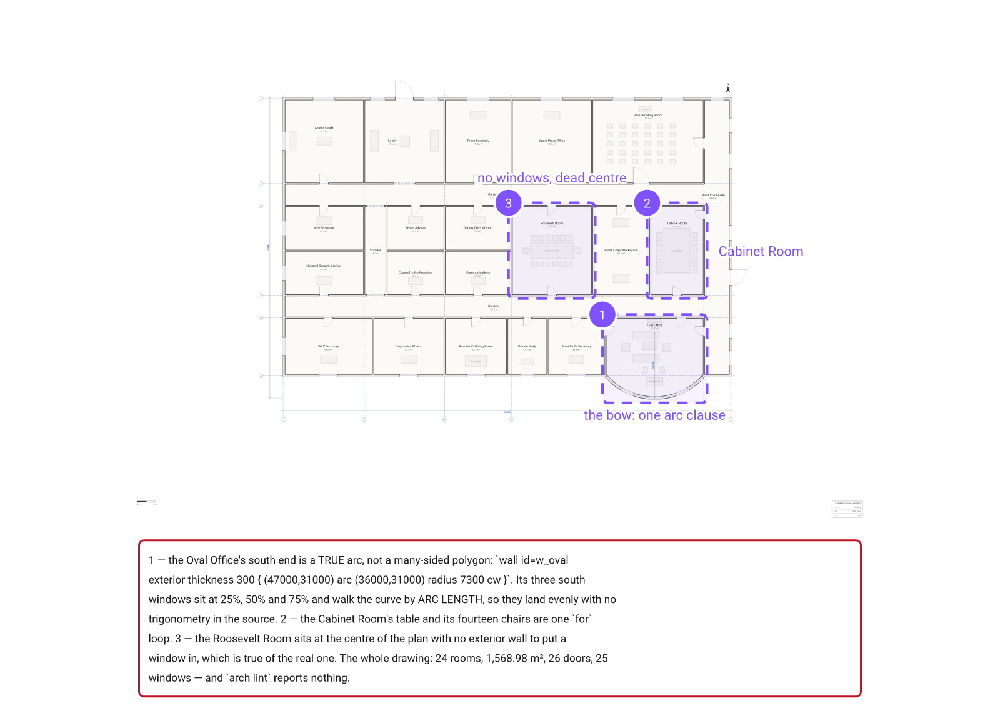
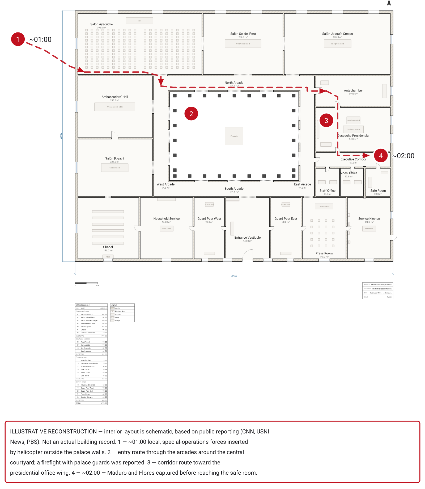
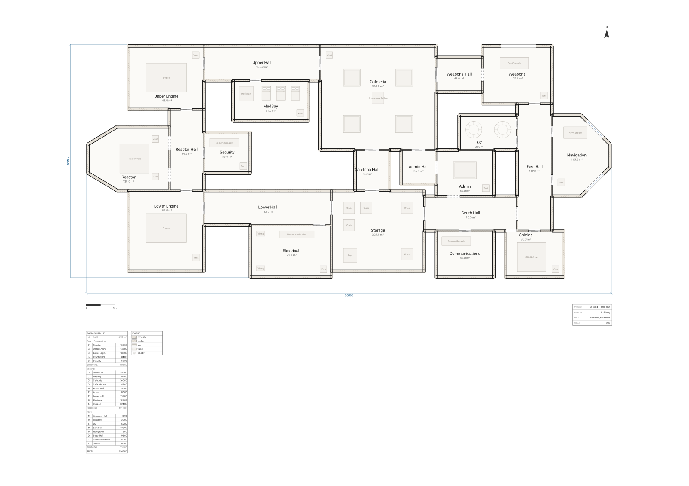
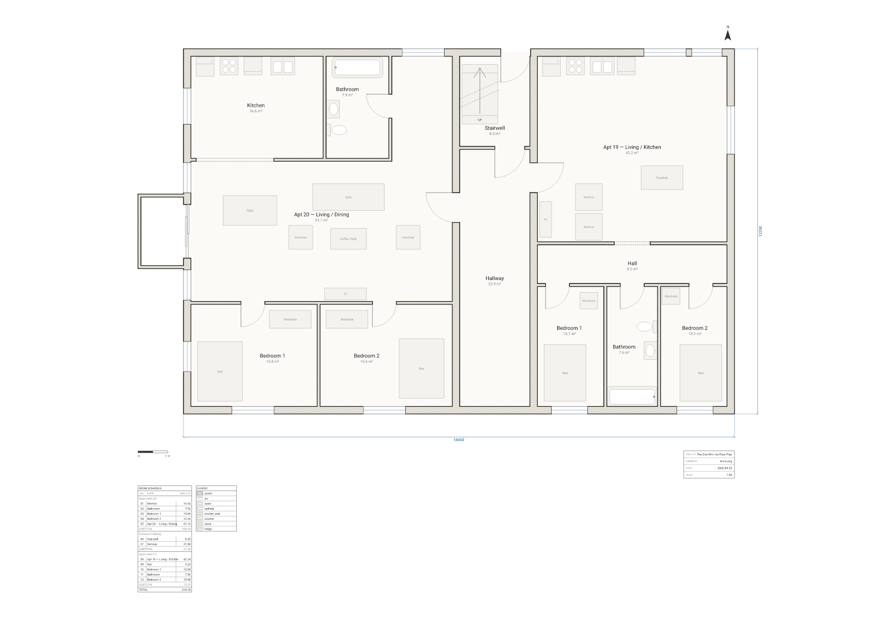
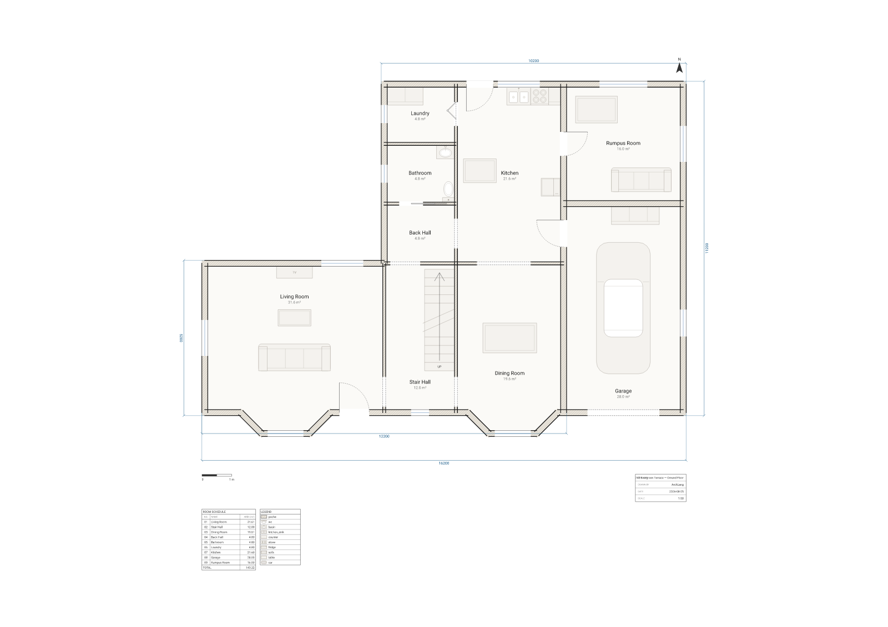
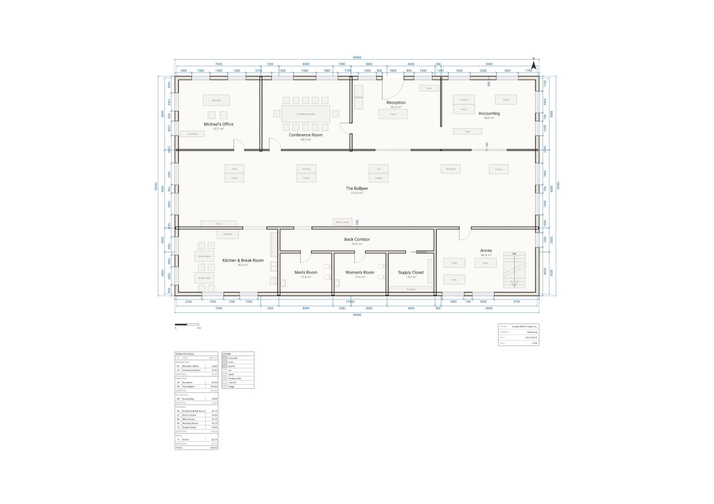
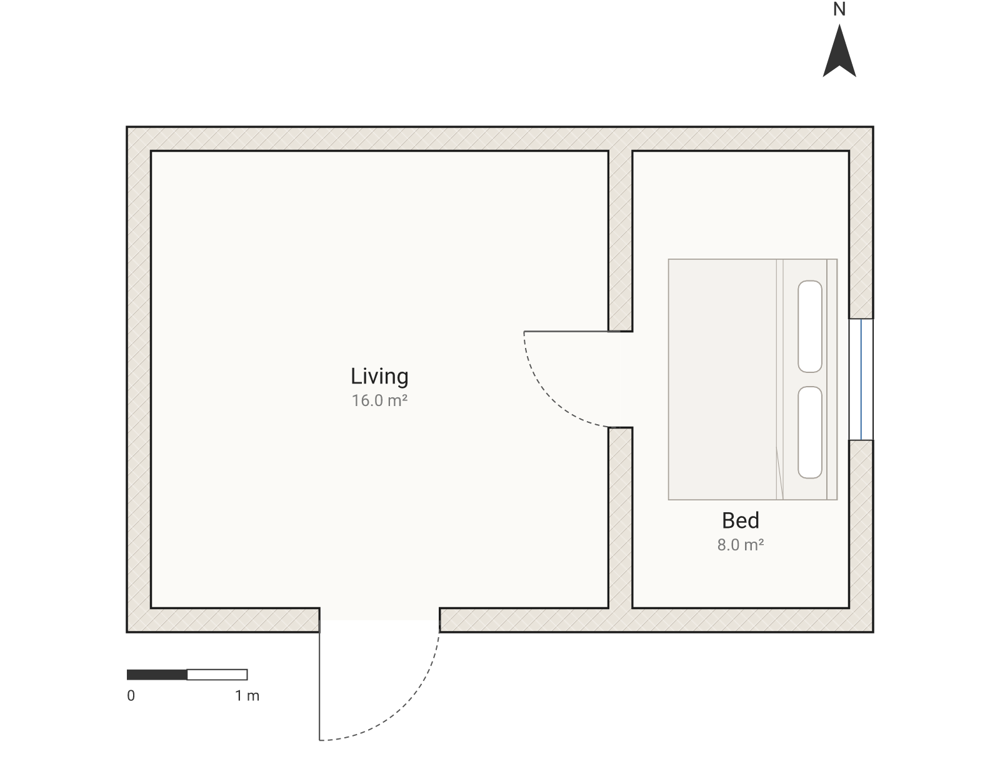

# ArchLang Showcase

Every drawing in this repo is **compiled, not drawn** — each one is a few dozen lines of `.arch`
source. Change a line, recompile, get a new building. Famous buildings, TV homes and game maps,
written as text.

Built with [**ArchLang**](https://github.com/ChanMeng666/archlang), a small declarative language
that compiles floor-plan source to professional SVG.
[Docs](https://archlang.uk) · [Playground](https://playground.archlang.uk) ·
[`@chanmeng666/archlang` on npm](https://www.npmjs.com/package/@chanmeng666/archlang)

## Gallery

<!-- gallery:start -->

### The West Wing — First Floor

[](plans/west-wing/README.md)

[story](plans/west-wing/README.md) · [source](plans/west-wing/plan.arch) · [open in playground](https://playground.archlang.uk/#z=rVv9bhs5kv9fT1GQcYizI2vVLcmyczsDOI7zATjxwHYmtzgcbKqbkrhukTqSLVkzF2Af4p7hHmyf5FBFdostSy05Hv-RqCXyx_piFVlVfQC3Ew7fJsJy-Khyw-Ff__xf-MaNhW9CjlvwXmhj4X2mlG4cNA5o-FQZCyM2VbkBNRqJhIOQYCccFkpnKQgDTIKas6wNn2ksTj-aZUxCxuQ4Z2NuIMExMls2DiDVbAFD9chNC4wipKs5y-DKgSdqyg2o3AIzwEDzxDI5zjgshJ3gUmymMjXmViSQsSHP2o0DONPJ5JLJMUyYAc1ZBonQSZ4xDWOuptzqJS024ZqDsEg0kuH5YEv_3TAXmX0DdqI5bxyAsZqJ8cTCgmUZspkCg6Fa8BSMyu0EuExbOCpPHhy1t9dfL4DpBJQEBteDbqcDCZdW80xIjpR-0HxGq2ouU655Cje_fYCR0nB_Bve0xlLlMOYW-CNLbLYEu1Bv8NdBr99xI_Ah6nfuW4jUOEBpcU2_CCm5hhFLuAFm4Rp--usRTFg28pxmGdiJSB4kN6YNX5gVc04UMJ2YFkj3xbv_eN84gPuz6_N74NIKK7ghW5F87uEtT1u4ApNL-F2paRsOryQSO-EwU8mEw_tPl5dguTE8y5jlpv26tCm7UJDkes6R8alBkgw4i-FMGlDyDY0FkuXhY2v5GjRLRW7gGv4zWfxPkiz-C3-F86_Xv128g29nl5dw8e7DBYy0mjoiNJ8LNNo515Y_tuE-WdwTZv3fLLeGAJzeUJP4dP3pw8dbUCOwms15RtbESKB7YC5Y9sBT4MzYI6uOFrjjhmph4Obq6-1HkiytoQyHD0ynXOLPbULWSk1hprLlWEkvin_98_9W2DhxymwyEXLs9l6bZDxUi1cGkonStEejCKbOQqzZg2ItDIe43YfpvztrJXSVZUg1fmHYlAem7Q1xD0FkkKpg6xPFRBg-obrZWHPcKo0DuJpxKeTYkACdUshqhks4uz6Hy4svH24_tkAqi18Rr29omGNe55JYj3v9AUynuCaa9ULIVC1QsYs79FtoxnH_3-7JcWRL8mjw3znTuKnUqPQRWuUkP5QvI38xUQvPOLkM7xUcvoEhnwjPV8rNA3rDFPic4zbxVuXYIc8mFVgtxko6d9U4KNysUblOvEA-GZPzFGefRUh29CbqdEr7SZSc43ZVkmVo_4ZLy_CR_AuDWT7MREJeLkV9Em8CzcGI3_kb58e5Jh2JKZcGpyYTJmQLGHx4-9dbmCkjEFHI8RF7FAbGWqQFN-QJba55CxXaOEDAa9zSKQrSjVFkK7g6c9AYGlCBU85Mrnm7QX6gSZGqiEzEYRCcmvBHAyCXwhqYThvgqOh3GgAzNuMapYPSNgmb8QaASVjGnbAaAFJpO4F8hj9gKPwDCefc-h--NwDZN8ByqwqBNBoAB3B0dHQEZsKzjD6-6I8Ab2YZRh5pFUg25SmarAHN7IRrsBMKmhzuk0wZfp9CptSMdg664SUotz1gyDO1QDkS5pDDRBnLU3j7dzi_-nJze_31_PbT1Rc4vFcS_oZ78Bc0nr_NlPnl_jVtPozPzrmnWowsRnr0FLRh2w2_cUX68-LOCQmAP1quhdKreAIY7f6Aw06r8xoO-51Ohz59r0xHHwi108uJ_lM36nSewNBOu-M1ML1BMHkdigR1-_EC3l59a8O3lXuGo18A3TNJGSMGhiUMpkFEYBYOe1G_02nFxzHiUWREsRCs9xjkjVogpBEpd06p2Hc4vvB4I5awFH_Lxv7YQ9ZQhANCdCGhDTcLNnNEjYhj9CsjlmcW7hP8tsAk34wxlst0poS0BsYY1hkFE4K06MESNucGhFwwjBHSWM7SqrLJPdZqqyJmitbd4-AbH7XdQWjhJL-uxUWtLRUarMBWjYHi6R4muW4AbjsXTuuNExnGaAJMlNYiVdqUck1UpqREdZkZxrz1_VxSdHYn0RNpS74yICfqe3JO-8SUk557-F5FMDsQorgTQPinCsbbnVTEFYx4I8YuOuJeyIp_KnZYKLRXxp9OHbiBoVYPXOJ2Gio7Wcm7PBu4oOpP8rg-gZoZbUjNWYqHbnSQ6BfLKJoq1Bm67hmXoTnPz1V2J-u4cTzUKYYwprsxol2SJSCzG6gq3qr9fiFXrJkcc0jFXKRcmwrDX06hVnunBbunW7j9Ep3UAkQnBYL7tAki7vfrIOJ-30O4T5sgur1aiG6vgHCfTkMb_CzSNONrUoLDR0Ce2-0IHTlaIxocOfEjd4rLhHwobfJ1Rayf9xFrYQGn2wzgcxTVckWUlTDuaTPOPjoqcU620rOXogoc97QRZy9tFTjuaSNOL6rlqxdVNlq0zYV9vlvscqWDQFX-YQ0iqRexU9UgFE2J4w56ZFM1W_Um6tQv0Qm9QbTtZDS_2csaSpyTrThxvxYn7oc47mkzzmm9VZ32Qxx62ojTPa6lxx0PCpy1w8Iq2suVy3Q3RX8nGmklLd5RfuVSmmU2Z1IwOJtzmfMNZ_2Gv5eL9Gd9lyhT3G_xaEieCP_wUkVe5hG5Apetgub5RPARnhJvLBuNmm5ibniRXqtgZ2o4XK6wC4e9DfsShzfXLt2EjUfXJWaCsgo-3hLNneGJwy_9OeEP-uv4v-JwuOGJ5pZpv9I22vMZXsVK2ktHv4X2rzTcreBygc3t2EONQiyxywhA2FFcEl6h-y1OwgP4tVLTpsOeVC93wWHjJVe8NfvQ-o4VxuGCU2kfFNcf44DWcx9zmhX9VU9Ba-BJYB3eIRI4yYF8xQvAhwXl3rn-eZQXp2m6UA0qpt1FbNq_BTglA86LOc0N4CstTsOY_ydpcT6rbvKolEZg0OgGobTo3zCfjaYnUi5tVSobbFoaVl1hsHOFL8xne254kmthl3CWzoVBFWxbhbkBfpXKIYNWOe4_WeWGS7xVldA7-EhULg3PqisMalc491P8zTeQ2bZF0tLrrvxWyMbg6SLv-Cy3S1j3v9vZmE7N-gqD2hXO1XSaS5GQVsxOQWmlDJ_zzAb-MeSBFO62b7HCdTnF-bAdK5B7Xyj9EHjJJ8quruBc5bnSMwPflH6g61aNlNhQSG69lCpnMrfCUx7O_ZQKB1Uegut5cHD6sxyyQcWXMa88NZQbjch9PA48G5nKetyrC9t8HGzlytmNVjgpFygjNx8Lk7nyy9loxIR29rPV_gWl_irWGa4weLJCualeGXjnZgdx0OGtiSlPl0H4Xl8CP64vIebMcrjBmVtUW1mhEKhbITwKrsxzKxOhOjYbD2b4rn47u4Sr9-8_nV_8qAH5XAZl-IuSIFIRlARdzQWrJK8M8Ayz_M50uZZUgRKYszDClrlyNnXJPV8kFDrJ-KpIJ0xRV1SyhYNnGU9RSift6CjlY0cLnxk4nLJHSDkejXPNqf7lM3wcrM6ppvIGohMqgCgNnTZ9dhVKVz8wE84t5exhIlKsPuVYm1xRw-RywZZ0CcarjGNgojimRoFpzuA-5SbRYoib9B9GSSymzJS2prhak9KxsrlQeZYCS2xOxRas7LQIt8iyOU0bzD5jlQWrccgGJV-VSF25h1mfkdPSFWmMmmLZJ5eUYR2qx3bF0iiR6atoDTTJtQvD9mSLG907jvv4zaBPv_d7-BR33RO51W584p66ffytGzuk2D31-iUSxcNut7_C7vTKMXDYPe0F87snIXZ30A_W7R4PSppCngK6_a4J6uvNLVsFpcskGukLvCxtFcy_odDTuymWd6jM5q5dWLBCvmEhUjsBjBJgFlSJym1lpsZKKM109QKs0FEMcTPR3QUzV1y43B8WL8p0TpnDeQZjBS0Ajhx_1kCCMLXLLPk-KKhZ8UG5e7oRNqAsz4j0Z1Vc5AKIiih6VJmqLDqjCBXOiFHVWxctr3LrQP4eFgB1Q1k-AaLx6yD-whWKYLNCPAiN3wgSI4jPxTIL_QAl3oyyDuOP4o4Ws1sd89kTbQj5cCdDhKgT90PDXF-TpfO1NaNenTb8MXsdxh9bA5h6pabOlCoYeGysEl-vz_KY-cTC6GRYARrstDCcs3XHudPan7DjirsQ0vZ2ny0nDduoZFPB2KXl4uoSTqlVs5_wFMfdHQKcej3ThI2KrjLwg5pO2PBujZ5erw7JH-s34XCH4yshJNQ9gCruvTyAO3pM6Qe2whQzKjDlKTuAiWrZyvi4glCeogOEOOrXIJTn5JAbf04OQQYrQztFxta4ydNlFYMnep2VblxnMeXZOdiMRS_dK-NrZ253_kAQP3DNF-v38VcGynVbrmDuh5TZnJYPu-X3zhe0K-ziceyOWnBcYpc0V7u_ccZTCF5aovlRCFmKHNy2qNM-QazkPc7Y7_jrcwX8VN5hT1J5WAo9nj8hbBwXdQKaj2vGHe83LnRVdeuGzqh23Ml-43pPT0Sbx50EfOC4tYFUvsdxyEbV228aFvVqxVIOO91rWByEUFp0bVzR87Dm8jbQF4wMvVr9yNB77RgZuKjoqbSDkaEj2sQS-QFvD7BdQsWwwX7DovBkuH1YfLzfsNO1YWWDwqbWPd_DE9ybWkUTp-sC9E2G1U7E9mrtsnsmetJnuFHk5fi4Or7f2TG-Wx0_qOI_DQ0lO6NcS2EmPH2W9yLAs-ImzTJ3xdZ8RLdK19fsG7aPsN8b7pnETqh7MPmYaTi8uPv18uz84u7Xq8u_v27BYiIS1zbl8wQTJWkjSbPATmPqWzQTNlt1Sbo7P3V4OGz8hC1VrmvEUEbCZRSGRmW5de2IcC-k9-D3kPIkY9pTPOXTIddmIlxjdtEwXjQmCjniFL5IYpRkEenPozvq6XSdnS732Tmmy3dcpq_wVvR4GmZvuSMI3nHz0ISSoA3gySQCapDUHjxCcPx3lVh9PMbWhVqQuAISd54PYtSIRYD_-lKba2g4XqV4qVZzuhslfopycvwslATvGWDZMPNFo06MKINA5Me7UZieVmTbHZwQSi9MvO8Bsibb3vNBRkJzALxDUP8-cTSgPNSgylFvlYp-LzSnnsTQfqr7PEyw_-DZZIPs2dAJ3v1LaxfJf8zN0bsMK032w6KjH3aLM5sIjScwhOi028fUyxsuFwgV6y0tHwl-AgF_wcz5Jttd3Ve2IPWfj_R9TazV2ssPCfapWPHK9kSuq8JQVbI9dCiUaykLTuicuEz484UbDwahLFA4cX-jSMJr5b5YJ9FurO-NLWiU2IyOB5s1FEJsmt6Nj_ebXlXvhh6B5-r4qXoznlgsART_O9-HIjpd7fCeJ68sBdFYv7-LRBqqVXu19gu1Kg3JmqpDEgxnrrbYxUZl-AkS-Ast14L4hL7Q-EWlWvfYLwRVrOwUtb4bNHVJj4TFTnPsW37hbnCB1G3BsqGmNP_grxJaKxAuvKxB-DNCxkcWfzPcIpcrF41dDdtQVt03G1AGFZTeM1A0VZD2QQl8wgplu1BidA_r_ASCXXX7lCcnTKU6StAuaoQbwKwae14EExSn_1SYobIW6z7PxAkaPDaQE-8LE3RxbCJnb5ygT6OWHNyyJ9thgmaMenJ24AT9Fi8jp2yqeBE5QQn_RUoPCvUvwgkq2fU4O_kqa-718sGYMdjuLYL2gE04nQIHPQ65jLJJxk30p4mVyw9e_AL2-MNlQvc-C75JhiexCFJm8yn2WmNNsvoWGcvota43vnzOMgMyx5saT-kVHbz24e3eVY8nSovflbQ4LOPWH5roUo8vV2HqyNXoiU-Dd0R4d3H9Cd8epXdGjdIYyQo-CRRvlVizdm9GLTS-LdbsNrGM3jxv-ndAp2qOFGGdXHNHobtXLiYq4-7VNAzUS5W3y6TDkF7Y0hpfrJVK4st3_mVAfIMZ32IoBdOiGrh_kUYYeipfz0NEUocL_o8Y7Tst6hxqgesKAddYBK77x7XttUj8HZqzLObQz9S704LY_-fmUEW5OANYYTN8aW6m1T94Yv2retteKm-6F63vhktoFm9pN5E7Ds24Ex8fdU6O4n4Tvje-N_4f)

### Villa La Rotonda — the Piano Nobile

[](plans/villa-rotonda/README.md)

[story](plans/villa-rotonda/README.md) · [source](plans/villa-rotonda/plan.arch) · [open in playground](https://playground.archlang.uk/#z=pVz9UhtJkv-fp8iwYgMYJI0Ag21m7QgNlj3cMsgn8Fds7A2l7hKqc6tK21VtoVlPxD3EPeE9yUV-VHW3AK_Xyx8OI1VnV-V3_jKLDrwzRaFgWCx0aTIHp2pZqi5kqih0Do_OFUxccDZXj-D__ud_YWjzUit4o4pC5cZ1YapvKgv7R8dP6Psw17A0yjqwbmoK3d_qbHXScphWpggQ5saDsxqCg6kGY3Mzm-lS24CfrOYmm8NKrWHtKiic-wQqgAknoMD_vVKlhmnhsk_drQ4oyN1C55CZMqsKVcJcFQXkWuWQaRtK3QVlc3g1fjsBk2sbTKYKCHqxLDTMSmeD79JOlrqEmcp0H66q0m516CB5qVbG3oACfG3QJYSqtETRBDCeFnm1SCv7cOn4Q1eVmcYlq9KEoG1autWhoyGvxhejSLgLqgpzV-ocnM10F5aFynQOM1eVEMxC-xNiJPAX8bGdXVAerCvDHHm0M5687sJg96GFWvkAtHD04aoL48nrXeCf0gUVNDwbPPSod5W8Y_ThCnpAbxp9uNqNj-4_ffDZlY6vHdAz_Phu_dqDJwM63eizLtdhjiyf6sKtiGnXmVssndU2XENhbIupyCsSB_LfNrjVhyvk93qx0KFcb3XwIesCKO91GXTehWyus0_I7hL0Wk9Z3VEqtWSdLdbA2wlzFeB0eAGZW2hwVUDFz1TlUZ7XdObrbR-P3SM1MR6UBX2rsgDe3Fid95a6XFRBBeMsLFQozS3soJoa7aG3_2XwZb8LX3IdvsBz2N9FBfesT3SypSuDyZwHNIHM2ZuyEpPBJQtTFAaPq2G6xq99KKsMX8U2-P6Xj3D1ywj-8-1wcjWawNklDOHN2cX7X0ajcxhevISL8RUM4_e9S_zPiBnppp-NqzxkVSAe-cJkGt-KO2STVIVDsbkwF8sjYXmSDusEbjK4Za_QswCZKy2aXJIY09WfdemFsLo1qsCFpcldCblbWTlonhe6i6zB5et6ycpVRQ5z9Tl6lmRUykNYua0O-ofP2oOx-DvUfsdYH5TNtO_CyoQ5vQiPgZ9B7lwJTmxYq0UfTqtAv5WoHG621YHSuQXSDY4PVcvn8mpy9uaS3qBV3gWtsjmUlbWsWBpmVVGwS4OVycMcX4U-yZuc-GBz8MEtl7jez10Z4l5cmOsyOgaAvd7DP3uQfvBJdhk-lGaJW_FwC4N-f__pYDAQYl8AWqvk50v6pyZGboVXkeUo-a1L7lLn8GwAub7pRsr3722TMh3b4VFLV9mcmU-6hoFgaexqrnXRb2y38XD8ZZPoKxQNbc5DMIWuhUh2Wqw5XlgXNuju4EJRbPzZBd2ki-JCDejCCgMQqasrkR1oMsai3s3qva742amyuegbf67gy8Z7aX8cgOW9_s6azZ8vEFprgLnc5nmv12utqf_Hrl6k_uVbdIs0EP0Eeh3990qj0axIeUqtctLzleF4SOpBJsBvyHVWqFL76G01cdCjG3Yr67tiAPgFRfHT8Zuz0SWcXVyNJufj07-wgyLr2Y6hEAN5F2YoADHrbvTptAC9Fr582-M7wM91UaAZ_JTeD1nhfLRPMQOTa3AzaCjClDIBJFxqtNTanXiMawttg09ZEUXB-NpQKlMgfXxZd9Mktz2T5i-VzSUfqQ1t20cPSrvFdxBPC2WJ3c7CGmPIs8FgAGqGqYsJfFqKuRgV4MJRcMPoaJtZi1drDPjM2WhokDvtOZJgFDl7ORqeQ4wRB0dwi_8shDMUp4Nr_NbFd-ChPPLwCXyB_X34Ak_4JezStzqJo_v7sEiRRcQfzcCgm_VZaaY6R6omdGOYzMtqgd9fDS9ejy6ucAuqKLY64pJpN73EWg5OHEOCsjcouKUzlhIARVL1c1dwWsBZKeYe8zXzmnUhEk-rfbR6Uvku5yhhXrrqhsOKR-HfzAOLDrdwZ4kqs60O7Fy733Cz17To2v2Gx7vucpAVkaXkaLcPvxovKanOnM1pE5F5S5fNdb1lihy8AR8M_UuyEarovFZqzcKRcIbaxuQx2S40FFpxKCXLaCUDmL2h8WAVQH6R9pGpslzjJz6b67wqUKSrE3xyTSkNBXflnS3XsouFlo3hlm23FoJ4a1ihN0kEjIV3JtP2d8WKOno3uiBtfTl5-ysmPJLbjF7yyRoaRckhZmuZXlJ6JllVVP8TkvlWJ1UCeBhM2zi2lVqTYqMucq6BMvQcTYiBxHrnNXkWTQGD-diHsS3WYuGvzsfjCalfylxCw-P04aVD8zaB_ShWEgv1STflsu3B6xv0PWTmop-9GSoyJeOodJ7cgZ-rpZbES4sTCrg3uCZVkywcHSlqfagzwa1OK8OETFnk4FTqLVotPKDSKnKtVKR4Ya44xdlRWE6pYu2Nh5vSoKcrlQ-6NB6TR1bRqQ4rrS3t-d1ocnV2Orokm1dAepbNXZlDgW5LwXKubHALsa6sdD4mlFgb7rLkY2WHviSVhdqIVaxPxCtgIBFnUFYaLt-9_vHlh1d4LJSLsmv43bkFK9v44vwjvB-en192YTIe_3pJOfX4zeji7OL1JVy-nbw7ezeqE2y4eju5gNGH4enV-cdu27-wZRfVwiKn5xq9YKklERKrraY-WbcPeumjDZmS_HzA0CtJeJPtzItrJi-uxQdlymvQBcesPvyMLkZ-JaVg6qyMpoTKY3oatGg4uWeNpsullrEwGQ1f_jrqL3LmzvnZzyg4khvGRioKjC2aPsbr8jNmCbQbfqHJtSqM1znaY6zTozLt8FEQU6CgN2fLS1tag1-aUhW7HNeNRbXirIzrRZQhBJOvOXaJ81oRv5l2qVVMzdFJaFXqEg6O-49h8VPz5AV8JhgFkwHOeR8f1X6BNXdOftaR5W51ag1T6D3JiH2VfJxC_ljZp2wsuiR1o6PB-blb9eFS6ya_6clHjOvU-A3Z-RuCZi4ImnkE_9gCqCzubbHYArI_OBpsASwV8nm4TyVnqUzYAvCZKjTsn-wPcAVnK9WSvkje3C38FkChb7TNt7YAOnCpl0aBsZ-QC4UyudDGzaA85_oWPquiwpiBtTV7stXcFXjQQoeg-1uUBi8IsFnAo87R9PHx4fEjfgEmoCxeVJXIqq9kq1_5ob0HGFLG-xyeYPLU-unErAvDsqz-WVbv728u77TyRDzxRiqz7SE3aqGDLoXY5dnLERI7gB9gCHtCnIkdHA0GA84VGf96MNmKxLDwhOcbhJgYlXpdmKN7VyWbVsz0pCzEgKe90JrIKX-GH-Fgg9bRUdwXRg1MTet9lSo3ld8SKm_GkyukcnQPZwXdQL0PM1cuuozPRT-IJ6REPR1u9ObyASFRUV1QjmWskKHgHLcxGf8HboO2syekImMOWoxRaV_CD1hiEp6EEE82nrwm_jDpu9uJBcoGAEJpMdlr5lyZG6tCYjkiZUiSdGKPVEKod-AxJfbusy6pRKCMcIXxL1YbjQDHJiFETz-wHJF4W5IdOHicBCmKK-XOnF4iv4juuRl7MC4hyBTRkVtjdY_fSJkQpwhVqQrIVagWHJDQpNWt9uSBAG7RExOiiGzcg2H6D2pu_AX5QMvX_8ryPxpuAgHXGH2_z0NEN9GBYUzQjE2lVUOGXXZWO4PuYDfmcK6ixJE9iHCTIncfzh0mIGuiTHjM2cX74eTlCQxi4Tp1AbMaXN-FV8PTUUIpiSqXij8PT_8SP2_4nj7vOAKVKXclqALtgiscLIm6krdS0j51t3gSlLAgeYRqeNSsqGpUtBB9wkDMjcmxurWebdhjCcAYKqIgGFk_WbfyCJFkVPdzvBN2UB5gQgwGuPFU4TRAZVYb8tUfzi6jjTT1GQ05abOYcPJMgiNbKIjtt4ka8fUeI05ugR9Yt2wBUYQkg0SKRCGk9iSkCKln95FqiCvRuByeD-_zlh3I9TIkpolGocg408kUNnOsk7SCcxQfEt3T8WQCz-HxXbpCjuBUZFehVcmgZP3we3IgxPgekyLGd2B_QByv4VhEPDCFrp8d1c_utZ993H6WoA56dot3Rnh-BGq4g8RxClGiE6iWbE4m1yRzK4B0nU1wd-cV12Jb6bheR5iyK6VZDTT2YbzUlpQdk4ql8warHazKEvHJ2wvJ2YQmVRyxIhOMxoS5w2IcpqVWn5KTpvLCB1UGjz4CD_Ychn0iRFm-yZ_zmfWt5K5hbrJPVnuPWoE9BF0iSj4tTfZJzAKoz4L6t0v_Q6XehR3KBuQ3WvdHk7UN9dv2oPMbLR6scYyIx0hN5SKaQXCUtnkfzoIXmguTJyiFgP8WvpJSbEZsgqsotCJf5tpKr-Bo8CcuQNsMWREmAktVBsOVemLJ4WAA_4CdYTq9nJl_q8_7Sw0FbF9iBf9y9HoyGl3C-FWCC74VIRCaMXn6SfpH4qs0VmCfdCNUgi683sQFdMIF6jqeT90R-u9LE6TyJ961C-lMt3ECriNVuAccEHqXo9e_ji6uhldn44sGQBCc2-j4NKt8lA9tmtEzRnG5x2YyIaymqOkxIrbFjs9brXMPflkY-ZRUv66WmDWYUv7o_16GnYNdMHHTJAKw1WKqS6q-qWLJlAUE3n4Cb9USORTTbFIubJ14mGqGRWvU5RK3IISlNxP7Koe9x70jQMUuNOwcHqJnevx4MNi9B4FyFia8Z3RwEmGFrK-WSwG1YyvyhF0X1_BLZT0cHvefPkm14lTPHMov-A3exbjQgaPD_v4hg7p19W31bQqQ277Vm6Z3RRcnQKmm5JjgGQy0QtlxryI96cocvRceGRU49eSpvRlL0baejj9u5B8So5Ihie-ut7qROPVj5Bx_hB5MauHf8SL3YSZ3vBjtRp7aaItGheV-D36rShPmCx1M1m-4RnTLN057GA0vr-BqDO9Hl1cNZAlz-hSKSbm6RJDCX3AUypKghG5uSs02ZTwUTuW9qVbYhzpBH3OtyuwaplWBaZf42fPRqyt6S6k-64IEuVLFp4QGJhlGDAuWVWhLgmW2KjF0EWYblQdTLFPokqoGX7cW5ThJAA0MG9UDET4x4eQZljqowtcGNcMRjbJa9OG9KrDfLuq_bjJDz1RVBHEN1sF1trrup6Rh_BHrTlSKPZi0QgHZ932B4PgrsVGSD7ZqUjIybQL16MsYL7h0hUn9jayVx5BCvaoZUutQJZHz68GKAzRvrg5WG4RWtOArhE7fNyjRbw9Q0v-U0qhFadSmxEbRamCdNPKxbU91s6bOJkNZ1H5CrWmNRzTwHqF7gUVp7Rhwh2uiLyHJSic-KqIJHDTrAFcZKvQJiNrMGmjHXz13M0O6kztsMFEtHmLiAROTxAsL0eH5cDcJOn2Q0hEqTXl84N8oSqUwBa7cTP68cDc3hprGOHkz7DLMEQd-vPldw89wK5BM-inUVBfw6JwefoSfVMhg9CDrFnnJ1I0j8i3li-Qpv79t1D6J_Gl8-BGTp6ktmeFKrjm-yauCe99xhKj5In7TEG65WLrzpktV8DHkIIX5jHhF6ySxWmrST2JK9HeG0JPPmieRhx8JfR9cqW50-wAZAZkqSeLuAXZO30MPhrsNdsUDyMPxBQ9xiU6RxN0y4fQSBgR7gJ_zi5qnaIh7qnOk29JQinSNwbnvUlYh-Iu-VT6sC30C3twmiI9jKrZMCZ-EKSJaaRyHm8TkBlbYtOGmAFb54F0jSSAf8UljRySmoerWSGKJTy8wwyo1eiH0YDRYRLnsrFD202a3V8UkkXNpTC8TJhhzBwU-K7W27VxoKAfjjJ3aSNgf4uxARtu4CSOdls1mSkylBA7HUBuj_IxdrsB8Jzw9IQgO-xI6bSxffVV-Np91PcnIPliSWOogCOXUR0hVapyhqGEdmurA4_D-tz1cq3CNcJ-KyUbdRGGysZeU6xl1pJCN1FcTPFTaeTL2mLnCWYuNEcxxPKAyLBbgZrMo0pi83dIkKaUiTQgJK2vfh0vJuilrxTrhckS4Gc-mYDUn25Lvce6HCVd-I7Ed2jy2I1kRFEzGby9eCg_qvo1UyZFyRjNp1oU-6gOGq5wyyhqDiH1SUhDprcdcTRXFtofT0cXVZHR-djHqyvCp5xPSvAeXfogfMNbOZN-cv-UO5K9nF28vaf6ITTgFKur7uiQywsTcDE7H578xLEP9epp_TdYVn03rsOeGJSgBYIRn4KAkfUVbs2CsbXwVwUBsvRVFM81W1lYFVpwc0mmSToF3hckhNz7rwszQkGZyCJSE8mADt8t6OPHA8ohgTEQ67RrnGRoIGO6QIDDY_IkoGJmukl7hCelgo1sjdM6BEK2aaXfo1MwV2TJAwJPQCLHUxD4yMe5H7AnRJjF2vKVbxXkN0ZPYM0lQJJY-iW7milt4Dn-NKezTo0E34neHg8YvCJl2IzrX-qWxbI8I_I2o04gV1nSDfv84pdhkJPelRnyguAxgB3f2V_M3POt5F04_ShYeP-6ljyXLPj1vL9i7u0CI_7FV__uN-2Gqg5oqMuFpKg3it73Nb-_b231U2lv8jq0dfXVrR9-4tfuobG6tYZbSR-PpWy5Fb1SZa9uV5jT7qTXNSGgVjNdSRuLEPnmcehChjtILr3EQt5tmO9ANomsg1fVxDBPevvnx5QWoEnWeOqik65r8jnVWbxbWG6MM216eNc2ytjHTjVNtHI8xHpJrQe8qUZIKj7hpt5SjCC1OsAXBmBWYdTBuKhhL4CjpCR6g3ohHEBUHeE94CIAJc6rS6FkiDBMbDDLbsO1hoZWvEFBELJhgM8kVpAsI2VwZBAOTu-ZxkUNsH9Se7woDPPdN75jw_uCf2_ARV63Re2A1bOAHJrtbV9ebX3yTPd5De7C78QE7x16b7rdQ3NukuPcQxXbWm8b6_s26TMyJPDimqN3ovDGH6cO1s_BnPMcLjI1_Xjr_4lr6NwoKE1DGlDjELgSlkQnDAn27LLX39EWajBeolMe4mvcmKrFNJFg3IBp4fgJGbWpZYn_ELKY-NVqY7ahAQ2nEcyulHgqyUWt9q9XWafRP5NKN8EFsq2QUlHr7HIkGNM16FDWZp6vz5_lvC1F67pOowKtkkP4Ai3HPjXDMJ1LRGmV8ZsWnCT6JSVobdy0MT_BcvR_HodEgd3S8IzheebltkFVRHjzt7ErYHL0UB0TT_Q_PXZ7cmQiNgHIcHW2OsrLTUQy6x75L98HB0nZa-3jQf3Z8fPyn1OGAWYWwaX0ThvHpH-GZNFNnpWLkMtYgkqRyWy55tRnxSuDse7BbHmm9R-c548e5wDJDUBZPNZycCtnz0cXrq19g8kOY66BabRBcSJOAMr42MzekeXRlJ_WyKGlMAL-yNw18sx4g5v4EDkkPScWrNHXmZYxVRo5kdJANrdu8rlOjptGBtK_tpAsHWGISvM56WNEEN0tJ6jfUdB4FRk2UBpgK1CETRX8s7rz1BJ3GWT4VAQNJ3I3Hml1AxtBO6j5s7wUk-AL_j1hM70XqMHdbKxmD6DZ6FYJK9F7Q4TYAvrpN3dDQFrCY-rUyO1sTZl5hnct9M8W3OFR9V2Se6ovaWaSjEBsFU0Wf8TS5DJriariM-MgGpQS3MCX9DZT4kc0dRXCL6TBcvEFnw4nhI_ftBjnJVBicRAWpXeEzrHQ2d2Os26BEXEz7EcxUBcoivn6uZtS8KdTv-P33h8w6ak4aMc-DulHGdmlyJSVEtW0LAN2MWn34maIfxRLThJvrELaDvosW9IA71o3bdF5myBYpXO3-hF3Oz7pxVTBNOXQaxPbglts7FPl2BZA2NsdgnD9fGUvi_83utwLYs8OjAURec4HakSstWMYdHB4NHqR00A6F-8dHg4cpPT5-mNIKWpRwOuPOnnjYgoKzsfcQytQC6bS3NKgJPePiOxI6HtSEpMmw4mlZvgSMaXFlcx2jKkFwXQbt0lW6lF7dy20UxOaGjp58jUdPn9zLo2j-TUoHhwdfo7R_fHDUcratcedYTWEywXXDTNIHCliCByrWtnQxkQuGpsP9pJchpnLSh-ERL4yNirJBGUHG6qrQagZ-RQUI5iSxpMAYnHQ-uvLo6JO3lgEQ9GA-IFRL40L9u2XFwTeXFbAHT45qCP7wgMwI6whqttGCg6-t-FfqjHtetgt3Pz8-qgl_A8k727tv2zXNPzbGmNu5xvc6TtYwxo1jDdmHEV1bwhk9K2hjaxaxnmEhNHzjMjNRpaSlleb8s8vIqA7fdGf9u2-sf_999e-_rd6WWRxu-PeCXUdupmAGGrwuZhRZ0YYS4hn1ohtZn_WWdFciXldsDri8RyMXudHIscQqumN00riy2h4dar5H_t4BjvTQcBcKW6Xply0efPph8l8HuEsBt3nu06aMNmjvdcEdK65Bmvd9qN_E9Z-l0_J-LRYhOQH-caaDr9tzli4wLP2Vih5NrcQrHfKOuAK1L3bIopQEhqU22YcunH5otPobXUM4JTeL9yTqpViNkummtmVDFWjiKgJUqfD9PlW4zs2CboG5azqcLsxUlyroYg3jV6_6_LcSSIhivYcHqY-WOgn0JzFUmXW5Q9YhgrBweYwoalqsYU4laONO4yI1ziYYxwqtcrmyEeamDOte3W5ZdJluPQ2T_hRG_KMfgpARW3x9CTA3C209J3XUDPhJBuHoNi3wyDon-o7-kAB1nUjodPXlRoc6LaNh8mk1nRa6cStKLqbQ-LOMQOeGQPLZzOvAk9Y1FEEjNtaVC0Vj0Ui89yK4emjKykzjePJyNGl0Bzs8a8M3cKmNUoV4KbLhfqkqJZQuoXm0YvxuNBmen0Mcm2evzKd3Gz6a4P2Fo3vAOAmeGpXCJ0B_gItXJlBg4gtgnEUJ1MCefLEMa7mM05jWITny3zyRDAu5l5tFdIe7vRfsi8mZCiMxB2wsG-AiWc7FxJ1lyYTFKtGMggmFllRhWbr_1lmI15jaf56GVLHxl2m4hkH7_226hkfDMpufK3sjn6M1PjoYHBz3Bk97B0ePKOj-sfX_)

### Operation Absolute Resolve — Miraflores Palace, Caracas

[](plans/miraflores-raid/README.md)

[story](plans/miraflores-raid/README.md) · [source](plans/miraflores-raid/plan.arch) · [open in playground](https://playground.archlang.uk/#z=tVzNdhs5dt7zKe6RFra7SYb_kjxxzlFL7LZmbMmR5PaZbCSwChTRKgLVAEoUu49z5iHyArPJLptkl2X6TeZJknuBqkIVyZI0M_HCZpF1P1xc3H8A3oezDx8-X11fHl-f_TiFy-nJxfnV9eXnk-uzi3P4y5_-DYS0XAulIWFrlVkQBky04EtmRdSGGTM8BiUhzWaJiFr7oHmqtBXyDl6fnJ-34fPV-Rmc85Vpw6fvrt504VxZYBJYZDOWwCwTSYxvax4pHXdb-619-Cg0mydKcwOfWMIi3oYTplnEDLFkFxwMZxbUnD7_yCX_JeMJk5BqbkTMZbRuA5Mx_tzaLwdhlggiLq3mOfkQfs9kxvQaBr3BBFTKNbNCSRASVgsRLeBz96oLJuWRYElrv3zDwFzpiBuIWGozzWP45Me3cC4ilfz2ZwMfWZxpRdyciEQw-J5m5mb65f3xNZxdwafP3304O4Hj89Piq7PzH6fn19PTLlwvOKQkh1cG-KNfj2iBIrFcgzCtfYhVlC25tDx-CwwSZnmnf2QXHZxrptcguerMmFY_Zxz--fPx6eXx-Q8fprDSLE15DEyrTMbAZGsfmI5YzGMnJpZApDJt10zHbVgJuwAGhpPwJVvSa5ovlRQsgQVLErdGVyz57b8Q7HjNoixaKHiNsv7XwbjXobVjWSys0iJbvmn7t-FKJRDzBD5x_dt_F9_-XrGfs9_-A8FONDepatOyHS9nzBgWK21ewXuWJAXBd2rNot_-TCJnKKeUJyhFZTixbNpeL37OWKyZvEt4oS3lZIFpDrFmKwlzrZZew8GoDJe8C9Mfp5d_vH5_dv4DTD9cTf9PzXDe_IHrNcRiyaURSrb9FyuWJJAqIyx9iQOtlL5HnVwJeffKgMlmsXgQjojJuLXv9JzNOWillqiNKdNWRFnCtDNNAwzShGVGzBJemiUI-cAljtSFUwVSWdCcOURhaE5kDEhuMv3A17kp5IbilPP6_RROLj5fXv_x-PIUVfL84hqO4fLi4iOZ8QJREJBHCUPtFxKVv7UPrwe9ca_X7h-Me703ndejI3wa0tNbEOREcLiFSjh9KBcCf6rqZNtZnASrnETu1104pSFpfAsMblFCt7BSWRJDmlkYH_Zg-T__ifNacWYXaCXSAbT2YZ4opUlecZZwWnr69TbmJtJixl-_6VplWWJuu_BlwSxwGSXKcOOZV5JgVKY7ht-h2dEKt-F2dUMKdNuGVHAd8Rhma7Arnjxwb1f4z4Kb39FkUq6FsesE4SKVZEtpCk2cq0xaJiQY6zikb0kUTOg2zHii5B3KwOIiOy1By0qScv2OL0-OT6e4eN9ffL6ktbtq00JenE-7cIx-1zJ5R0rFpMySzOAMUWkYGLFMibdUJes71EyjUAQRk_jCjKMknPThL3_69_y1W-eztNePCMMGyhcFRhPVWsRKE8cGtcZyFheufcWNJSFwhh_00oDOJMyzJIEFF3cL96taSb-ckdKSa2fVIJVGFyVjtFT8hPQmZRJm3K44J6IlDUbOTCpnnP5Xb3ZIRZN1D7RuaENudVB_8CMpAkRKWiEzlRmIhEbzpOiRKJV2WylGpb2NgEbjnyVJZiyGkgcOlzxS0lidRUi9B7-2ADIprIHlsgVwp0UM414LIGUp13A8gITJ2EQs5S0AE7GEQ__toIevOBlkaQvQExlgmVWgHrhmSUIve8Un-bcAEn7HZdxqAbAouhY24VtYrsZgEfKuq7w7nFO0Jdg7BiPQsDvGKs3XQAJRc2Bw0EPbGI9hyTEahwEq8AcbAWp3eOrCST0UqSjK0nVNMUjBEB4jAas4YqcTZJl5JEcwNZ-LiDs0wZ3zIu0klDJ4EEcy4vDAjRUzlDEBzhMmaYy7DCNLqow1MGeRhzJWc4yozsJJb7t_38Tsb03L9lA59oNMBGOitOgPTZgAzBUSZLqYzNXF5-v3vytUB0OWJSg2Q6b7ve4YYn6nOTduhbpwa4TltxSmyA9RmKEZWxe-YY5KFwt0XZiFEZ6SpfuGTucnoyR0OoYnPLJAiF1UfWE5_JoL3HmIBV8Kky64znXkq5tsp9PpgFlw9OtOW7YkCZ1n_WmBczIifkeAZRZnFyK6l9wYmPR68Cu87rV7b-D1Qa_XCz-Nx70ePhWfKBzlnF6vFLnHzkrEduHSBJefxgqWyhSZMqr6W3JaM74QfjJu0jRDJ8m5M542vSikW-ocwsmM3u7ClEULl4Y4I89dacQy48CQJBGS4nrgKPkDOWKV3S1ghQFWWDA8ZZpZTKcXXtwY4EDYbiC_1c2MyfhGlrMMZDjMZdgfOXk56fmnr5swphlm1A9h_NPX0hbsSgHxmHuTSuxqA7tjGN2CKFKdimby_mbVxEP_IJiAfyr42IDiTVDjYQjlnjanVKq2sIYnc6cuLrvB-A0-4TFtp4NxdUbO-Bu4CDND8Jlh9Wnon9yb_qmi7-elxkKklTHEgKlyIvuNbBzmBuY-bVUROWiCGE1yCPepgCAevxRBJmCxyuGqkcNemzgrVt0_efhpEX3KvCmIY9WBeONAThMGFVUfbFMx3igOBzOswAy3wgyfATMahzDuqQYz2goz8DCH4wDGPQV2sw_jXs9RvXVptVfyPM2mNMWSZzK-Clxw9iA4umwm0TgIRmJCOlMZpp95dFAyoTwncsVNNTsCw9YYSNYurrl8PYiIlaKvuoz09bY5j92cJ6NQdO6pauBXpfPebTimUVv6Iax_8jGpuj6mUVsGkxDGPW2HadSWYejF_NN2mO3akptyBWbUADNu1N0wTPin7TCTJphJBWZShSlTE8re23CnVZZyX8Gi7RtMq29_UZLfPiM9IbxjwNdhwQz8y_TyAu64wqR8_da3L4xlllOZ60p80Nyo5IFjO4pFNlljLSQoQSA8l7RrWGFSFfOEWx534SNfzrg2C5GiUZ1OTz4cX05P277JhoX_wqXqRYESMUl4EdN6Td2KGdXlQOBU-qKJSgVsidUyJimJUvdBry_vdkTYGyCwBcPskWvx4IIXTT3IYfeCKoJMxRVj4Nsw8Tt9w_KmFgCO45I2_GPELxzIUz-SaUDCZjyBPd-Zypthe_Ryhg2FhTP_EN2oJOU6gxy9iFWE3t-JXmmf7e2Ej6iJBgV8Eccc86Nd8Hkfznfhdg_Ays6cl44PjY7_g40BNlp5e7uFM8PmHiu5LwJjCD7c5N43BZ3kd8O7bmEI7-3QwW8K54QIcthm8LIqdOAV7-UG6G0MMM1ryh9zai95LDbX-TDkGEiTXZ5pYO8k6GTSV1v0WEc3K2KlkmcSK8Nxr_c4OAg4oZTmmLDyBQobHts0QUc33CmZS_Qa8SmneTG-dDbSq-MPjlCUOEqO79LGfIDn4psA3yejO_BddH0Kv1wp_sijjBooe9PiIzqrLQslLS-VspLJB3pPwiyMSloeLRi63GZ3E3OTMnJmJfagv2FTvWClTnOSfL8Dd0b8lF2vpDYGTvUG-37BGMONMUiYhTYUIjnx_cJNmdZGcUPfsHAmPh2iUTCIPk5okGLNLJvP4YII9wopbZ2DR5959DDB3IV-LGJuXgXwu9EpuStWuJLKETo66TrvSHKp1HKv4niw0caoli9VzXD9gB2svSv_YUdgW6jM8IVKYucURhv-abDhn94XJB7bL1NmRSLsujYANcBuVnlkm9QHCIJDPsAP1DP7hG0M9EDNYnT4uYMdbTjYZnz0QM342BY0pSH2nuHAPxHJ5jptxb8XNlpwmavBc_DzJf2DIy3491C5HvisMeg3ur7O8zpYW9PGj7g7UfQ8w_YlNjdZzNvFrkvZEW27bqjfGXFNFEILeqOYlsW4RyPid_HNEoeheHkYpMKu14XpikusXWPNULInZAUg137E8P20XoCBSr2JoTLbqqDkqqskUFnCLGmTBznq9YrBrYJC07dAcA8xeh4Er0CUFupABjUQVJAqSkFRwfGJjgPp10EGdRD3egXBmYIDGD_JBb1doc9V3SFMnkTI9ZmUpUiGim1Bv9uDavfW7_IXabxdaG5QBG2sFRLO5sVGGdCOGg0Tv1OUogW65k3PsURGR3qSdw_r1F6ouZ5VyfuTp8idRMmx9Md18sHm6FWr3tiHxw0r9DLhJtaTVl1hCOscFwkOD8ZFxuH4Gdb5kXVqoxKf54bJ5Q5ZblBjmeKc-OEG9dNjI-fEQFlAHewAkP0tjAfDTxqJBxsjL32G4Nt2_R2Urvdbp56pdUjtM4AG6tKe2HJG5EhNyYkvjLz2jUviVb9qWUHBVtOpyt7Y3xApaDtYZXZrR2yukkStzNtcRy2elimS13b4AFYV2wpbduja-U6ddwrFTjO1CTAM5DtuYYctECGm2eSPfDudWapTQhlWJSdt1T0XybTLETc0oIw11JZtBisT5sMgYQ78Yw40qALlTGyAYUFTnx-Z9k6nWyTuFawi0SbmxugbKpp6FPA2rALmpNvwZi7p6Q9ejjcr1AyXtkMJFeK7UJAw2oTxQSDPVEghw7Ytd3qyYr636w7OYDOqqiakPcTqppE2sFrKsmpklXMhoGShvM_fZPTbgHTMJHJbv86r4PGK8FQKCsFZGKDxdOGW1MFt2zAL_5gq80-3ronHkntnLTifV4ZOXOBJDNxwGBzBsg2DHv1dfKafylMTOB2mXUswP_zk8r6K_eMCREyCxGYjxFrMbRG2VptBmuHWTpXrg8G4B4GX3CAY1Aj6o9KqtxIMawSDfmkl2wh4naXhqNc4Aq-zNDx6gqDO0uiJEUydpfFk0DgHU2dpMmyWkqmzdNBrltKqztLhsHkOqzpLh4dPENRZOqqPUNreXcJ--evjWmh7KyFjtUIOpMs8XFMt79tur1W20XGfbXnC59BhsrLyedbghXTcl8m9F9BhYuTnN34xXRSEs5fQeXc7aaSrEHKXwQU134Si50Y2vTkm9-22ktRvUD-HFGOv70n6rdTR1iR-J60JaQ-fTUvVUUA6Gm8tPbZIyhRN76Ju8SX2MwY2rrzM-zm9zQK9kTivqV2WPq4T9xs0w1CtVqj-cIO4eWQizvV_8ELivI4n4oMXsp23kFzu9FRHo0bsltl3h7YQ9xoWelXWc3lB84wxV2VFU8tlm6mKSqaWIDVToSrmGy9Nyl8rfV94HmtXBnVcHsh1p25d9lY5eOvSn8PiuO5PmSm2RctsLs-gkrY_hl6c5vXJp9t-Z4_C4Nk7md9GMHRSCvtdVJ64o-CI5TZiNXU8KEmls87M3PvtU8p47YKv_blgzPHo-O4aYsX9gd40TdaYTc0xk8VRet3ukW8Cu_k4S6RC51sQ8A3gHlUb-oeDsIWKOw1PEw0nvS1EX2vjj3eM34Y6YvP4o4OjZxHR-JmWAm9slMtS7scNxmXXnfb7wmbr9_79vUADa5u7ruTYdtPh6e5LkcRrtTKkEisu7boNJk2ExcyZAWWiy2V-i4UJg01VfzNDc6adbrkzJfhjWVLkBXZeCblz2sRlRPvn4SHSLp0MtnA1Pb6GdzCi08e4ctqvXH_glw7fMmt4B9g0g29BwzdwMHYrhARRTtDzBOEKRAs0qjx6wLcQwTdUJrfBrP0yEAuP7h8hodyAb0BDPfir4L5uKEnMhIvK_T5lA6UtTPJufLEzxoTZq4FWfZWi2wgbzboX-qqSOcvw8geNmB8cQM3geCGDeHTnBQ6DLeugMYrEe7vw_EmBKtykDnfJI566kyyNaOGxgCrkUR2yciCgGdWfB3iCxxOVyUgU86UVcTv3b8GIR0j5yp3uxSPQicW7EMHRTddbzkvRkg33phOV7_zKaKE0zJS1agnzJDOL8ljF41EwQyTd8waVevuYePMoR0i5y40ou_EV37eQokqPqnta6PUCTvJdn8Ay0MC5Z7c8ieA5tirtJHxuQ57RGz5uW-jqYsy4xOM7W2EJUki8L-b2FLxCPtZKsY1e41zYDh6He3EQD6yWm3vHVtmUKybrmRoUTNFkKU8Otu2K9iJi7VTBAr6qhJj0VBBPlJxzzXGvbItOGzVn29l12tTZKstcr6orotQ9doG2wwU4oxxm7MNca4cEqSCqq0qdFzS4TV5K7QhBNN3jadaMD3xu_0H7Cz9IZdqUxliV-kOb1Pszr6g1R60mn10J7U-1U8aYp1DMTShlGncfMxlz7S_w4HUMNM7lEmOua9q9_nJz9eXs_Iebi-_cxYvp6ZvuDvGU_dBAxH52B4V4Js6cnokRSuiFGLO_Ax-z5_Gxa61di3RD4Q7DlUbdrbooNhOS200EVLmQj8MKH5MNV2LCUw5_XU2wQzpFwVr3JJtmUD1fsOlBAmnVUH342Grrk50LVxSl_w-s8eeytstH-q3NDdbGOYI7WTcoefvA8XJzmFQEqWdeNITZ5agxuRyH2eWEoumkV2SrQTTdSA7znes8M6xM0W9K3xgh74ucwff_zQQ9lPezPjqXhzICz2_VA8-PhuzEmDRi5NG9GeOwEWOuRXzHn-LDHQTbCRKseb7BXw2Lw_pCf9I8DRKzrVDlqYcnwL4ofb8tulayn-CUU6mQQeIz8ofpgos-dClylqjo_pWBB5ZkPK89sTSgk_vDXnkn32Dbgue31uiG1Fw8cheHhiMMNBfndEH36v10ek2nEdwb0O8e4c92nXLixt-5pf9kgEXClvW8OxpNd6Vc-XdLd0NvQWm4pRuht3n3ATsCXOPBHwxtRUMAz2nThWyd-Wt05KtxNvmNcPXobts-cJ1qkV_5o60gtXJSd1VkLEyUMLF0_yGB36TVHG8E0vltwWOgS3a-n-J2ovBumHEdjbmwbX8X2132dS_6A-CuwsAJpMjbLV7Q6NA1ZIaHy83D3W2b9rryq6e3BRiOdjk9Pv04xfjtltK5ilSrn_B-YMNt1z16kW6A3MzWsHfWfPEVIGaWw17tP5WgfbG8sN4jN_K19b8)

### We ran a building-code linter on de_dust2

[](plans/dust2/README.md)

[story](plans/dust2/README.md) · [source](plans/dust2/plan.arch) · [open in playground](https://playground.archlang.uk/#z=tVvdbts4Fr73Uxw4WLQLOFn_Jk4HvUjT7qDYzmTQZnf2zqEl2uJUJgWSquIOBtiH2HfZ-32UfZLFISlZlCXR6WR8EZiOzsfD88fDw6MziOkqzpWejiCWpOBAFBBY5yyNGd8C4TGofL1jWtMYNkIC4yqjkWaCXwzOBmdwn1CICBecRSQFSWIiISV7kesRKKpB5BqIBgJZSnLF1imFyfgSHuF6DjuDryUliE4UsA0wPTiDgkoKhIOQMeNE7kExvk3pudJC0j0oLfNI55K-gjegmKagRXae0o0ewe09qAwXgj9FlGtJR4MzuLHPSbZN9Ah2LAaZc45LzDPQCcWf4pSOoCQnkRRKmX-thdZiNwKdc05TBbEo-ODM_AvnNItIBd_CTQlmpjlP8B803tJSUpJSiBLxmWaCca2ASAop01SSFGKRo2xiIaQawZpGJFcUBLfMEYO7L59O90j7anAGP7x_C2_v7j5-GsGHux-_t98NR2_s9wt494XKvU5wrTRVFBhqOKVkc55SpeBBZBQF8QD_-9e_gQzOICKKxqATSVUiUvxGNCjN0hQikRvGESISnFtLAGbZJFGEiFtJsmQERcKiBGcrEoJK3ZHPVMEDkVECKeP64YUCSUmUkDVLmd4D4aqgUsGOEg6EW56d7AoBieBUaYjELpNixxRFOQmdgNi4uYxGGNdUwlZQZaQngAvNIiMsgP_-x1oit1JIhGRfBdckhcgYrAACn-5vbv-GoJEkmip8UheiGnEQnCJGRL8rMXFi-qipZEKCSmiaQkIUcGH0iTRMH5RaatQ-wp15_BUXLfUF3KDdsy3jaBWSFKg4sQECW7IzhC-U87DvcG1ANhuWMuNCBdMJ_IOkX-jFwKxyWLr3EH4dAOScaQW73QBgK1kMk_F4AJCRjEq4mUBKeKwiktEBgIoIuuqr6QIf4ULqBPJsABCznQKSawHii7FF83BC4zylIIXYqQFASreUx4MBwBm8fq6PQfv55sOHT8-Ma-DOz8_PXTh5ZVSE30aAAjNOaWNVQl0YgJ3IdWKomp8BQEHSFFj8ulitVxzwU5kH6IRFnzk6yuV4DL_Cy8vxeDyaj8fjP8PL2fww-K0BVDwFyHyfjluBYka2YSBH_HJiWJouW6FUiCeP-uX0sgdL5yiqjEjNTFQ5YM0tlkftRNWBRY3Ye_iqC9oNJtM2KKv8PrY86pKtUvLGtu44xf0GFJVfqDKhFcMA41tlba1gPBaFcZ8XCgqMc4rFdOQMEj1eFFQCJUobRPvf0iTxZ8uz2NRt1ETujChFFaxpwnhsIuaFt0KVMU5XRVhYpUHY0WJaX6HxnsPMqtUxTvl4rOmcG6vvYc23CTtatCkSsdQp9rWYnrDM2_tzLc7fQCSkZLGQT11vw8ZskAhqoLQx5LPTXq1PBu211OZ82R0p4pWa9mN51I6vLiwa4MtbVRPLF3_NX77J0gzae62s56Az4TavspRpk8wUApOHLJeZUG47yDPcJdGLmU0LMTAUZA-Ma2HwtMgwjRzZPMT4Kz4eESkZtTSCp3vIGI0oeuo2JV9xd3fpU5l1--5ZML6K9BOUYEezNiUgFua-QayZj9W2HyGWOsVoHXUT66BQ5OhblNjpT5FeRTqwTs-8ylHbXmKQ0HYD--UhCNlRqwIsWP924mtgcRkCm_Zx5pH3cYZQRSAIeRp0o0WbzIzEMKadzJkbXbctk2hjtH0y88jdaL7o5EydwJkjd6OuZdrsIKhNR94EO_hAdWwtt3RJdpk5aeIR5uYk_2j6wEmJ53h0aVlbzg-Dpp2tilA65UH1bE-RDqeMvjctu9O8SK9ICGzpbXY9YAQlji7Qo8y6jHzkNqx--_ewri-7hG-h-sNPndoNetjqjz6-vBpgB3uNiC5I-tlujXieEHhc3UixM-Ec6yBotioRUncZ75GX80Cu53v51bTbMIgOZhueKbhR60aHYOokKysjo-WsGyywTI-8GcwOKnAlrefbNomLGGFTq46Gk2m3sVkN9B8OPfpy2Jq-E3f8PV0LdjRv0wJxR-AwmCN_ed3HmQqLrU7uhNgKljEdPAt45C8n4240sjJ1yV4_8OmPdODn3Rnr9OZT7c3m3bagZDlVoETKYncSJnu77ZlY4mzcFOtiKbKRrXiVuffFkexCKYwvu0PgbFVEyOs98lKQnWihgNRURAPuoAhXa34-x0dAE3z7XHXcWKzZpK_arM7ABWKcT18N23bA1J0c-2VXpy-Hy1Y45I6eFJcaPtENFzgH-ewcwTU0a1PKZ9JsfEpMb5NdlypOiHX-YgOqCCbQPnfX4w7RlfnzszmFXvFgNJkt67zNl52CK4994ZNCCWa3_XawFbceEUyVfKl1gIW3aV-jdnTdlnfpE8zDysyR94OFd3wLtizLuEsPrG4cmJSWRytbmnEl0m80DlcTCKvAP_l1GweesIJH7xLMji7bg28R3Gk88tLu2rYtx5kKc3Y1DvoAchYsc7Zw1rnM0PY8a-OsbZkIVoSKph5nMx_sYGki16aa-HvK4B5vooxDfTXwcX236qmBizJ0BIt2C2-hXWDBG6kGZ-Oatx6BBesCHrnv-kdg4fuf5fEyWy3NgO2eYmmzbh8QeqVDuYy_qTSW-QfcqH68u_vhk7n830qRZzSG9d5dgMZ4ib6pLqyzlOzxgp5EOjdNCJzs6PPfxX7FC_Y1DN_AJxZTe3MNttbP4tcSbx3xUACZSPdbwbsvUP0rwsZVZO0gO7D7TErWNLXTajrErhVnchOrixyv0RJ74-3z4y6IdeOeRrGvFIw7PuKktRneIsHQTmtxIyajPCVoEg34PLMXo4af-m2Xgcevj9N5Hf7v5qbi3kagYRv8b5WYcV8c_sDiYym7K5baqtwx3UxrZPlo_pbT_mwIWuer40aumou43sWFxZ0a3HEN9_YeDIMBXAMKddzZuCkmTwsGNCx-V-k6WFtPFaqvqNRT1vHt79ZOaA3wamKIJovKALs0GWkjqnaXiXQlm3ql1hqoUeV06ov8E2bTTujYRbVvIJKVqVAjYr2SWVdi3Thu4CPZZcN2cR8WQfDJ9iUQ6_WVGvxCZW8lqVF-qVd2fNHf1Fz_-tpIvt_1sR7i5OpVFqwYxpXnO3xslvuJaSdW7GYjW9qALCs25Tqbh8fmwbmtBtFezPEPns2VfxB8a1c-GS8XiFlbepe-NAy7TE6v3IWGbmxpRjaGJd_oKpuDelxss73UeroV-7gJbcXuhRBcmxdzAz7vQlQtliyaIXfixRIXosDnvXuCVBQmqB-Ec9luOIcVFPWYHpxA5LqawEvC7ARmCbO69O9c4hrcNp47_bj76d2P73_8_o_r6TJdKabjRlFt8hlJTcPlE8osBu0dsf2MBDLCJAKllGA_z45Sbbr0uCthpukLBbb51HZVwpbynHFab_McGVBbzyxQ9LbJ9QIesDGIAqdEgtJE6gf4CzyYIeXxAySEb7FzAfsoKdngtNilhkXTX8hujUVR23YYv47NhWcK-EztvhLNAndHnFcngPkNNCcFVdjeBC3A7K5HsLINdtENSzn6VC-sqaalFvZQHSIa5k_iNm1BlS2ol09itoG6Rrk6EZRdYt8gWZvNNpBlO_LThOuQjZndJ9hSzRTENGVrir2smL8L2IgcK_GK6gvTy91oYxWbqkO83tJqME1bKzbqFgj-yjbjakp22Gy2dU0tUuQ8BpJKSmLslfEb10w_DJb8dWIPElXnOVNAv2DHG7bz0hjH672t8bmWGaYv4K3rjyXcbBSERxQMN-WZxYCWjbZl5w5-NVLQODFTtiNY0o2JeVqAJp_pRS2E0LYW6mabdDiEuE5rVLKo-h2dmsuR0fKfnJLR6pt0ZR-bpatGQbp1jCn9wazceZtouKroZotWOps9lnQUTpqv7FuydNUoSFe1yBi6auTRLVrpXNOPo3Oj8Hxle4mlI4fjST8dWdnL7QMdPUkuVZ-BoatGwfVVl_c1uqZcLlv5dBmlpStHQT5dauvoqgusIF0auylsuG21l7b1lTmXs-uyYB6kqwqeLrwXLXx20RUeXXESXVXCMXTV6JiutWPxW-qBhwwE-4gzwukFvHepRiLSRuOgnQerTa7Zr_K_I3eYVWw-X96FaLcfb-7fPXdCh2g3J7-7sRaPh1c33MCKTOFbFOb1jQuD-QZ3rbXYrc1Vs30pBwVqX10SG9yzo8-q3LNwC3WbTozvmGD-lkmq8XUHhBM6obJgyiZ-tXdg9vXXU3BHUmJH7Z6iBSiyB7LGGXVCd2bv2eSSM3zLCZUZrdYTsO-guDOaOcmZlB5sUm-O8fUz9y0-PcR117KMI9S1h7pE1GUNFasDpr70JNTpMa-TmWX2d_A681CXtUqbRZ2ZU81TUed11KmtSM0WDV6niyeiLuqoppQwua5r6xRej2GJZwTX81qZy52rEXbRAUs6mCWeEVwvbMnpVMF2oh4bwXg0rR3Ue42gE9UzguWVKeWcbASdqHOfV1ucu1o8iddj2Me1eKzhLrCM53NryyA13H-uxaODtYejBqSeQJ3VueH0enyqAFxV5hg3IhLA_HEiMKWiq1rZA2uVHqu3RDpU3PBx-ZrplLpKUCbFLxSLktX5AQMivr1H8ebjC61eEyXKBtyhoTOvoa7WexjeyCj5QPjW_Y5LHk7H08vz8fJ8uhiagsRvg_8D)

### We compiled The Skeld, and the impostor's map stopped being a matter of opinion

[](plans/skeld/README.md)

[story](plans/skeld/README.md) · [source](plans/skeld/plan.arch) · [open in playground](https://playground.archlang.uk/#z=tVzrbhs5lv6vpzhwsEgakA1ZF996eoAkne4JkMSD2N0D7GJhU1WUinGJrCFZkjWDBuYh9l32_z7KPsngHLKqyKqSrHQ7_pGYUvEjeXiuH1l-AbcZh5sHnqdDSDXbSGAGGJhMFMBkChmTKU_BKmCQqFUhcq5PBi8GL6hjwqSSImE5vF4puYRfDKxYMQTDLajSArPAoMhZacQ853A5gkeYjmBF0FZzZnlKA8rBC1A6FZLpLRghlzk_NlZpvgVjdZnYUvMr-MxZYpVGWJtxmKsNvMr5wn43hE9sLZbMCiX9t4MXUCghcQBjuZbwSotlho9iV7tRwOVSSA6SJTzPuQGrimNEo8nNlbVqRe2hmy1BvmULbrkWDBYiz4VcOjRVgFrASqQot0Y8NAH8Bh9C6WIHYUAqG350Au8tfrzJmIUFy3NDwlMLEPZq8ALumU4ySLlJtJhzOD7-YpS8B80Lpa0BvuZ6C1qp1RCENcA0Z0MHJgiXpV9YwqWlXZTp4EX1pYFUKW2AJbZkeb6FREnJEwv__6__AaNojonmm5cGVmrNV4ix1KzIwFhVGJhzXBAbvACb4W9bVQLTy5IDm-MKhIQERyKB8kStOOpW82zCJPy95HpbiUxzDinPxZxrZjmsVMqdlJNMiYSbIXCWZCiZTSaSjCbIJMu3RhhsSEh5wWVqQMkrwgT4v_-lvfArlSBWhULVotENZzkKDO7xezC5SIVc3p9QF5tpbjKVp7hjc5VusQthAiS5Mpzk5JXypSGlWqnSZmYIr9OVkC-N07ZEaS1SpeFLKRPUUUM9cdycs8Vxzo3xuPeq4BKnYE7gjbIZJKqUFm3E7w31FtItPUm4MW5Lvgcl8y0oyb3CrTwiKgCt_qQSx1s_HVIV-Hx9_fFmSDq5ZIXBpbNGHVfsgZNo_cZnSnJjr2j7UuWHwL4blj_AQqtVYCNWwY1Vmi35kDr0PSMk-ZaM5fmGbT2gxaGNWnGSOs8NhxXbwpyDsUymZEbyJNzeX999ur2h9SxKLQX6ixO43fB8zSFnc7TwFMzfS6ZRi1AhpXKKuFL0aMZhzaWtVsTtRukHFAN_ZInNt87Qs8rkvU0lWy-XVHFn14mSlgk59BoqTL0kDptM5Ry-qAd-BfeVPd_DUqy5IQGFBod-VKJt06eV1r40zlZ-YhKYtifwWoLSYikky2sXoxbAYMlWKLXipYGcbVVpv6f5scVC5IIc70bYDN5LybXJlc1OBkXOJBzVEeEI_jkAKCU6itVqALDUIoXT0WgAULCCa3g9hpzJ1CSs4AMAk7Ccw-nVmB6RStsMymIAkIqVAVZaBWrNNctzejjjaZlz8lxmAJDzJZfpAFCtb4XNeTAVspeUJw8YTeSRe-hHlCAcva4CBn1vCpZwCl_45BBjznxLQYdbzc1JXxBRzpycs-9EklYc8Q9TNBlWQYTW8EQEYZAzveSB7rNEK2P6QsjRYADwAn54rh9C-8svHz6QIHFA_ohzUBq4XPNcFXyIXmWhSg26lOaZhye4Wyfuq8BlMtw4tEXDTwaADiIHkf6wucvKPL_DvannaTORPEj0d7PRCFaMRJijvSWaW066CvDqfDQaDccXo9HoO3g1psYsbIxcgx47xX-_GwD85ib4Rm3QZ7l9Zrlqwns4Z63Uwvn1Xwo0gndRHkHfEJop8GNUeP_gX3B1qAm1BjiYv3FWoFen7zVHnz6sPuyRivx9MnGLhVenZz2tqWtddhoTLyGAV2fj-oOqMWuE2Wr4xy7GncbpLBY6agVJ_CowvZemtrpEJQ-FsH2CYOuvFkU4B3h1cR62LiMN8a1p-OT4MlyJazUruSG9mbPkAbUIlbfRIecNruAmEzxPzRDeqtWqxNyZIvqwDpSE9C7nidWYWDsN-aA2HUXrEYj5neKIlzWphDPttqZ-K897WpNZoyvnEZJrTSPViVvVk2ejbms6bnCn0-aTuuWRJqNua-K3bzzutkLcyxD2MnQhgT9pdvr5HCOivf90--7zp9cf4Nfr9z_euOSbM_SLGMKsD2kw53bDuY8-GG9O4Nq1VqzA_43zO5gEkcrlqImY01XJdp2n2Uyrcpl9Dxl3D2-pF6oTWhxbCyu4cbpY5TGwybZYFKxKl4HbTBiqE18aOKr07sip5IImLOSG6fTkm4USsaziJayVSIew0awoMAH6yNM3bItVyJqTx73hSamF3aJfwfzalDmDOc_VJjYjxLlbifSrDcmplLej8XmnQX4WVXbUbfkHpw2EV3ZnnKf-64ue1kWo0K1WYI7OGKpA6Fqn0dO-RWVN7JtRJDDnmXBFcBO8fMVjsOKp8nfTI06GpdBXC3Q2DZc7O-tpnYcepNUKxOi8SOXjfMsv3o_y1OIbwwtCdxW2Ub-uxz0L33BWfPW63fxPT8Ng2mpVXvespxVs-lnwSdWqJHgWqtaudXNmiIWgWnbXxt7xr09HIr0-P-tpXYaBw7da03w-j4Jof339-fb97fvrT87_Ok6lKaYNb-roDdsC1g8wL_OHjLO0IYgQKRWLBddcJjxSHDQVR1IAl1bouHr_Bk6y2qziTvuKx_0UTFtB5U2zXZPRCP7Znxp62_gtQiy5XEL98zRiFHd9K0bMvw6x1_HFiIYncBBi5AAj59mz6rsSPd1BiJMQ8LIHb8XTOdseMsMwnoQxI8ZL2OJuc8iKp-H8pjvnh3hJtdy9eFFoijx3CxHR7oxXxqcR-7x0d47skDnOdvu_GJHQfNDaixhhxFGohUh-0vhZPo3Y5_xaum2VrgH3IvbEvkmfbidqtTKH6E6cr0d5fmuObq-p3tmLeB7VGS4A7EHkT8uxFUR2I_KD5xhixHVSjKjGgdN5GvE0WnWvPm58mnEoYlxsT3oQsW4-aI6tYnm3PqIVSn6IPoa0QZTqtKbodoYyqP2L7lIPvYAYX-7yg313HF8mfRGL52GA2YMYV6KuZu1FzA_2jqE_bCPWORxmHFWKYhzZKxVg9uLLvyGyEll1XOAO864C7gFMhnQ5AV7Aio5dcLIE5fkKSn2wvDRW5DlkbI18masytSopL6LBHMOKPAbh-XrBpU4VJYvUCR7dWNVlPar50zkNninl-UlnP2rhPS29eD986f9bX97kc5M9iBFhsCdtUuM6rjxhJnFOHAerb5D9-jOgpVZlwVNYKM2PrTpmC3sC9_9Qkt_T2YKpD00wRxbWdXBJbUXnOwpCpv5U475zbMkcovmv_74HrfL8uCy-QfaLQxAFd4SkLk7X6RHXQi6PfCWCLArujK5T5ELl26WSB1CmPfzQbr554HacDqLgyKv7EZSGGyityIXdtiZUImN8R4rHbMjFAoAR_-BAnv2RfF2FG9LRe8HJDFvgfgkR-DQAD41xL3hlNeRrET6qAQj-rINeeQCkwD16InRS5kSPtkYwnswBN_0ofyd8_PURN6aReUUAeXC1WIikLiZJWSoq6eij-6WrJG5P6nWFWb4blzb78YwGjvbkoGUF5QDBB0l_uCvnIbwjuo5aSEl9wkRI0x0TJZFVSDWx4eeZCjyG7gLf-RhKwGHe3-xsLPnmuOsgKbhkuRZylLY3Q5xFQxBB8RXwUAs5yuGdkEk0F6GQCb6tOF17ainGOFBI-iRWDGdPB82ZNxEZ4aN8ws0Zf3-8DOGbKL7XWI2P4tWGTtszP-3aqo_8HtcjRKbkDtCO6Dyka0aY1HktarZgFmjnRXeHwyOyJ-UVZMw4QHgg5RdF20E73RqgbUlBOk9zDZP2QF2inb0et1GQSAtWHCXqjU6TkjQbiOTbQcvFdL6OW9_kfCuIXc0RXXuRxAM3RhBVnoEqRaK6Ie74oFUGBWqjNZPOTkSGG5-xdSbsjuJqNZkegOiP746-FQ354_X1Z8dA3ld3kWBTHdIEl0DAsLmyaLkrLsvmKpOw7tCmvkbkewvrz3--yWnMG7Vp7lVkLLwJ1WTz9SUod_mGbj7hZQoubIZ3CgH8nHF3VJ1G0IWLhsNkFsaz_4CNSG0GqLy7-plOv_N2PyolRPpDWvOZXuaua0ByMguzUd171Oqd9_XOD-1d8ZRR74C8jHpjyHYy_1hdNmyv4473rMPTlvtnUiUgUe84K5ns7l2xj1HvgJKMx27vAD5o-nontd_c09s4TWn1bsrpA8ZuSy0gFvt6RzrnchZcJ3WNGMS483hXZ1N3DsnCWOLjHr3r7HZAdOzf7Yq_iHoHpAazcDHbrbUo8U177H0Sb65IDJsLVMd4vxhypVqKjNLnfergWaYnt8TnAHcb1zXik_q2pBm6yh6ioeOUYo9U1fhOdqQaZxGN_yJrbvU2T_Q-391bsjUNHvUOyD4ce7S3d8cC494X7d6RyD2ZWilyxNY-Yb4UVe9kSxdDcrZP6tHoHmMTjd7XubPwKrOIdS1KN_a5bzSEthEG_PwOQ3i-CIxoP394_Z_vP_1cX-6jq8AYhN29REcxudsaPiFgckt3a3OlHui6-XMnBoj2lkureVpdmcQJ-Qt__lKXvyiCPkDJ6kD9pb85irzZCdwrCX_CX__smCULfyqU-fM9UYwmuFarSznE-yl0Q7xQxlFr_sh1JdLoMr7hS7zNTpDC0k0QucQLnO5iNmyETPEyIN5D1kxCgdk4vgGhJdewUWWOLFmeeo7TX09znfCAXEhvjUpCcFst8udTp0rdXqbb63x_L-fXgl5t_41Z97dQvJ_e3x5f_3L7LZLKmje4crdSLZvjWxqsYpU5Hc_PS2tJvfDCOL2U4K5HlZIuHtWXwVFSizs7z-_kxkG5gpdKsfOgNiSOZRJUhrf48BFejg2IlR3QPICezZ4T2nRnHZahfwi6O-vngPY74_8j7NPgeKbmoR7HAfa7FddLulb_hvp1hvFZBHEOV5DgayKmvn9RXUcj97coed6jAtTl1PUMhDkZ7ZnVW3zYT6XhO_qAxyHw5TMCT7oznjwL8DQAnj2nKGZd4Is_Cox7iu9SMPkAoShC4CkCTxvgn0qet3DdjR-6W4makyhpVM5Nn7YojWloUEW-Op81JIobEo3lcdbDZr9VulqSR-iOQMUZVO8ROMKcuI2zYITz9ggVD0_Y9VlBP3rehz4ZNyLbj14fFvRIh1GO5OXnuM8J2XhA-5B00KE0hPCKawZvXa9qazw_3x3EILlB75bgmypuEOKdT0M9neGuB4N85OlNwir_4YrYHh_F01MAmPPUMavjNu7prKVNb3j6NOY4xJzOngVzEmKeP8M8N0JzcwoFk9zzyqcdAmzmaOWaJBXu9IxwG1Z6B_a4gz09fQbsgojzEHvWnrfjrMcN-F-pz4_CWC3mJbGXTw-0LKmSC7X7fNJw1Y1yh27s51K2NNuXjl18NWZ0DIx-yCv2WXhXuD_6Xo_hVvMKXI37cOdtXHeC_AdxfS0YysO9FOAPRgl32hbIJ7ZuCUSydZ-jpXorBD8jYU_O9rkS6hXDE1KPG3GlYLSbLnictwYIPaHje-G11mxbeSpHAXdH8ISPy6U8S02qOZ605BPK3Z1dhTkV4XyLZN29I0k1onsx0r8P6d5-rN7uBsPxjU_3xFw9cvM9lkhI60oFIuWMwOqXBr4oId0b4piPM7whwHXz-iMUmifCcP8GJVVhz19rRluxDshjfKfThT0XmC5mjQcat7zEr1za_eF6HdDLLeRx6Dd_D3JDN9fIY_dGS-vkahfyzjRgHZDRLezJ5WGz3pkErIPT-AYbz4-GYwynB2DvCv3rgHuuoScX7csE-6D7Y9-6dvsBsDskjyLUHuDdcWMdnL434JOv2cidRdU6OL6usd3x5vj8sIk759LBbfjNGvdi1K7W9uHuiHLrgEFskJ3BnB2G3BMu1sHZXYP6VRtYefEBgKV3jd0pdaHVF_wDCPvePAb3hzLu5ls4eq2T7AOTS_851jtH3pGm7p16etadF_42-Dc)

### Windows on one side only — because the roof is a hill

[](plans/bag-end/README.md)

[story](plans/bag-end/README.md) · [source](plans/bag-end/plan.arch) · [open in playground](https://playground.archlang.uk/#z=rVvrjts4sv7fT1Fw42DTe9yGL-2-LbJAMsnuZDfIDJLGWZxf3bREW5ymSS1JtdozCJCH2GeYB8uTLKqKlCVbfQkm-eGWbNWnYt2ryBzCa7GCtyYf4oUvbICPth7Cj3axUMEa-PrlPyCgoNvjwmoJlcmlg6tCwo9K69HB4cEh_E0YEC5cgjBgnVopIzTkTtTKrCCXTt3JHJbOriEUEmwpDf5QipUEu2QsesPo4BA-2ABiuVRaiSBzqFUoiOrK6lslDbz1QQTJ70XKhbW3f_KwVM4HhlQeBPhSZmqpMhGUNUPwFkKh8DEtITgpggcVQHiwRl4SGMDg65ffBdxJt4HMrpfWBbHAxytjpCZObBXAr-2t_Prld3p7-s1WJgdrQNCfIcHByuIyl0I5vYFFFcDYAP-uVJDggxNqVQRQJlhan1c5SQOvC6U1vgHR1sJsGE6rELQER-_KrXWeRClzQLbsElQYRjlYg-tiTAQJhcRvGEcYGwrpRvDBRhar0gehnIeldcwAqYNY0Bpq6SRCEptiLWGprXXDhJaDMrmUeeeRUngvVnLEOpI-gLN27RkLQePDWi7DcSFMzmjE8QvmSpmjYeLIS6Yk-zF6g8vzECwU4k5CrUxuaz-EXMry2MvAYCyp-CNoa28R1t5JB2gLK-Fyab5--X1A-v9kL-GnD28T5_DCXUftshN4ZVZaQmn1ZmUNLYetEyXtpNAQKmdAGdTDwSEM9rU9OBqCscDCHiYdLpewsKGgtfukRxSrRFM8OIQbXsINYqMAyIi9Cmi8xHKNAkUu62te1Aj-31ZoxJJpnK1W5EYHhy37SXhS-EAusrGVI40AagRKq0zw4G0Vikv-g86FJPwaXCZ_vZIh_qCF9y32Q4EyN9ahoNi6k4CVj8EkmfzWqbUyQTp8AoUo_K3MUdmiLJ29i26i_AjeBfL29LuTIm-kx6uthaNgowI4iQryaQm0OpKal_zGUbgPo4NSCwODJi6mUDiA3w4AKoNiX68PAFZO5TAfHwCUopQOXs1AC5P7TJTyAMBnQkuYXE7G-AgLoCoPAHK19iCqYMkShdb4MFrJb2gnUgbSBxRyrXxZoNEz8WcCLWReURCwa38AoOVKmvzgAEBk2ZXC-JBYfzJ2D5jqjfSZg8GraODHPlgnN5DXUmuUnLzPxB3FYopVglSFtjqCnwz7Hj7GvnJcCK1rsQFXGc8LCRZq9H-K_yKa39JZE8gI_xIDA4ayXl8YwVsKyewEqL0UZ8jyXrApHpETDGEhM1F5DhQktyG_nUKp9SEZIbGWDFJT_pKwqJyidW5NcoCyPYTjP_iPGS4kaRuTXJezF8ia3hwxW8iKFA6d7nQ8hvU6CeIqctU4BoEtRSZyOUQTp9RH0WCD_i8MPpVVgexAYzAYHQA_oPKX9TWBAcj7IJ2iSKuyWyO9pxf_Bi_Gw_ERvJiejMd09blDTew_TT0eTsbT8R416-1R6kgX39-LggK7fgyl4T1ezc8eAPFPglzM-rghHaBmdi0bjJS5b0wev0LPCBbdHVUBV5iGyKAl3AiX3RBWptGCL0FAcJUEL9cqUy7TFPc-Ts7HYwwUVXaLjhC5OZuPx0dDXBKGQjJ8wuIgd_zX6Cx0O4SbrL6BRaVX5LgUC11WUBkRbC1c3orxsKJyC8HeYQzFEIIhFwQYEdSdhE__93cQLotFlmwWqnxcuUAj38Cv1q675sevfVLurDLhsq4inMhV5YEEktVJE9_BT2OCIrjBM4q40aBdCyoPk_l4DLVCp0TvLoRe1mJDeEJbzkY-yDIyv17HEJ8StQBfWBf422NWHeaGkBUpTxMYFT9YP2LhEWqV0R0aAWCa0tKsQjGCtyLjiIq8deoFQeWMVoYX2xTbrUqG1htqgtUe1lIGFAjqFDLrjHRdnYbKXBsohQsKS--WTqfJrWdj8qPJbD7euTk5b3kY33zeQ_ePo5_MGXBKGO2b0-i_k-1Ny31TWZJbydHVq3WpN5Ar762-k9tSvUjiIzUKF3wUh_AyZy27rKjFZgh1oTIqmupCBFiLW-m3EIKLyFisJPsR8aIrVkGe8sjCeVVJgPtL_HZXaF7mhykzohElth7j5YxDbrxiFX9-BuH8JBHS1fMJzyeJkK52CEmCCxEKt76uH4OZjM9jsuCrR3DkozhkzbtG_pyFTJII4tWOEzxGeTZLlHT1DZQX00RJV8-nZDvbWlyi_A4WF7NP2-Ia8T8ufLK56Ph03Vs43KpwXT_qUaetAHLaV4A8QnuxpY0330DciVZ88y3Up_MWNd18A3U7csSbbqXzzVrt0XPqXrqBVwUv9fISaqdCkAZrDOrHueGmxHeTY7OiFhKOj3_x1tyAk6V11AnLmBK5_2g6c-Gk4N64E4pDHB1BQoxNK_0oqCUgPJxiESuYAjPrnMqxaU9psLaVxnorYLSmaK7yl83gILJ-gMOIZ-W9rRMxTUcbPWYRrTNeEI0WC6lhgIK9Ii4GmJzYgGdn8_ERVF56wIqy0jQdI5lt86A0wQmTcY4abks4rCioPZEkpjSNadW72JFfFayHrHI49HOVQZEvRSaxgyziJKmsXGm5xqVZEjcujaYR91-v3r8HxVZC2RFrYSozm3xZWxArJ7noUThpAAFrpbVay0B988LmG2yDSI1dFVEG7iiom0FP9m64DH0xnWN0PZ3OGyXNz1MFnn49J0E_0jZ0XKutt7dJ-j8KrQesK9TIZut94LDopKEZV3VpXHbZ18DilC-OwLiTHhFIRxaZFdgGAlkK51Gaxf0qAQPoPdpqYvAHfPYHqbVwAwBmEEcGXDBvMWtlZIPZFAT9mP_CZ5-Bqav1QrqI2dQK_Zjv-dmP1q4fxfQlttsRsykj-jE_0bOvZe4IlTAXfNfBpBKBSrvQqin6MV_HZwckrIgpqH1rCVO43NmFZMBUXBDg5GI8vkc7bYQZn_WDLWDfwkuBZjXjhTdlRz_mz_QsvHv3bvAMzGnETAXJE5jP4nMSMVOpwpjnD2C2hdmHmZGtJeNMRQxhom46mFu73Mfc-mQzx951yda0lOOaCNJxEMMI1MxM970SrWDrlLGY6PglRqS2HTVMPmBGC5nTKL5xyQjKC5_tIuKjTxv7rQoZbi80WaYDOt4B_Sc_3VZQBOh6ZajyTVz7xZOgn_DprobscqmyrtJzRZNgtqNWLiVMxL-fXWwx3_DTMX4QJgPsGKfTODQnzFbh1Y_5Mz_dXrxWd4j5h0orMqLWthCB8dCU8jLXeb7ZkWsGM8qA1PKOqgCeLtIoFAeGOCQXt6RWHg0IRUNpTD1UisVCidM3kwmDc4s6DdjTPl_K11qK5V-afB5HWqkeE-BlRtUIl1QIxCx1CgwuOcTaVjw1-_rlP4ToC1bXRmpta1g49KhbYxfNHse9yAKsVZ5ryaMPE8uRgK9XHubj_-HpDHfwhgZOPFTm0pG4tutSaeloyOJhsYFXH3-A928__P3qRxLLYPdlAy6H7BqNsiLf25YzpbwHJ3A3Dtkw6cfIZhxPZ4V1ORYvLIP8ZX7NMkFhxRmaCMR_rfJQABo3eFY1ziy42GEbwy3OqI84pGjPHhZypQxNM1BEqDAtcTvHW5x1_GLxx1h6sdhLkUmfZCyyDDuJlRNl0WyXCoKhqWfkCAQPyNbrZpfwABprUflLy9MOWp6Iq8sk7QhtF8jLwQ2D1shuuFcbNXuJtAitPJah7X2Jo45gm8RAL-dZlggwPZnxRC8UcL4rXKbpwDQ5awcGk-BDMJGmB2e6hzMez5_AmfbgzHZxJueTp3BmHZymDtnBwWr4IZxE0wFqKqQdoMnZwwJKNB2gpnzrAmHOgIeAiKaD0hSWXZTTs_nDKEzTFU-qebswJ-NHYGoevrZMMBXjO6KZPQKCNA84xE5hst1b3zEQzmPbl1IUmFycNvq42DcQoungpBy7i3O6Ndg9nCattrQa0_8uzHj-MDtE00FJlckOyunZ1jb2ULbFSMtYY9m0g3PS0sgeTqTZM3roWdVjmqUa7o8PXsgmYhtIaG_iSQnKg1QNDLsnJFo7QClhrKWgkxQLubH4vNe2VDFf5rY2EOfjeN6HjpcEycldefjw0xWlWyqIneQdzO3JBjrUs5aU1LjeoL3JIfAuI_6NO33WpWvf2e1NmHzgIG4RLykuH7YO11g8SUI7GbiXw6cOoNlbzl_WyjR6IjUlGXT1dEa7-jtkMr8W-2Sz0625YafRS7fYp5tPnqBL5r1Dh4MIaCfKXbrkXLvLaznX5KSHLvn2Lt3JNvhPTnvoUmzZpcMhSZvu-4wXYalCSFb5tj3Lau14pQM8ac_S05wQy9hM5iAW3uoqSL1B21hWzqhQoX3lL5fXpVx5AP7k7hE754v5vOnwp9zhN0W_XGErrkyqw_YgF9JkBfAnQ2KTe3raNBLYR0xaLelrfHTQgqTFxu7iMp4RcpKWAwuR3WKxnDavcMvf894kVn_NsTzqQnsWXNBRBIh_6J1N12OwNoVgy2OquwBgqSuPT2FoQSFwn36CPfWW_78l5gb7r_OSTrnFP32vW9gQ7PqYzim1XzdNrzvdEdcnwup5VxkP-NFn911cb9KW168Sw_t9q4-7QoJ4MiT2iWhNtGVPWHhqTdCYfRMPK7kgpYG8Fu4OR82lruiohvpVcG2_w1ne5oyHPrP5eHi-bS5p9rHHEy-iyajIh8LvxqPRjA4wtd-UFUK57UgJ_hcU_Bnm8_EQzs7aXez9yXy8g_xMnIvZEzhxV4E6-D45SH8LAPyHKDl6ddWD7cR9S-FvpL_tUTfO-_2EjuEs22DRrsigokUxx-Px_bRltq-R_iHc6YO47BpP45Ig4nyEYhXlUmFWzRlOPKJ1CyscewtlfNzF4JkvJbXmDIZtdvQpEvsgNmxveDuCmwSAVDfxiK7no1el9bw39OrDG3A20HSADxqlUNHuiqmB34DBbpwbVo_R5x7Fg6Pr3ENV4gYAn8Lr0bEPeKaPP-O_NntNqeTliiqEMRa56PBnqHKS97Zq28VGgaUJE989D_t8_iR27rDbzWxFnWkf37zHGBGnp004RNc9fRL_th0D2o_2GdZuxJ12PaIdsWiuFyd5PepYyByAPuidzcywHXzb1kzON21PtGXe4yTUNtJHH2xMHy1YCuJUOu3MtdMqxPbwH-WzI_KSNE6HF02iO-pZZKgWEwCakIZqsau3eLAtmdm8kSoOXc-S4uJ4dQe5zhAY6qzXIuLudUTG8P0Y1kJ4ZSZAf_ax4tqTeU06fPUuefrwkuNJwGbRkymOBh5YdezC-7idPsRtc_wivWDeWXw_ZJ1NnxAmncR4BJKzCw0JoslfQln5Ih1njV1CPMrUPT9KB83T4FFob5vhJf3CnUacfZHN0ShR41FoPO-m4wF_OhzEfca-q03J1ThpEJd7NVXLJ9DL7mmVbVeLxZ8JTmFp0cxouMDl6ZQfxc0RJT280Db4JlgfjfqqsOK67GTK7S7Mlr9WBZbm8p289qmQ-k72ZUyEn-7DT78j_Gwffvad4EsK_PxJ8NvtuYfh5zvwPyN5LzwOlgCyAoMQwW-3PRt49od2FD6NOaWz_dmDzuOlBbkooW83f5-PjpvAZHhPFJjC38aOZtbUhbgbCtuyMAWXhCz8baxim7nq550XTR9-Ee2sfuN74gSOKtFAR-gZ_rD1vwB6_3fUgCYldNIdQ8DPH3_6x9sfriATJdVPHBkiFAMvtM2IUfp_AU2Rx1_TGYiluscDvKxxu0QjlqF1qMHHLQ-aanD4EjlXIsqDL7XC3B5q7Daas-0G_0eOWGCBlbY9RoRROvuLzEL_Qgf0CB2AuV5sYPDKZcV7YVbxexEkDKbj6enx-Px4Oh-QCD8f_Bc)

### Apartment 20, Apartment 19, and the hallway between them

[](plans/friends-apartments/README.md)

[story](plans/friends-apartments/README.md) · [source](plans/friends-apartments/plan.arch) · [open in playground](https://playground.archlang.uk/#z=5VrdbuO2Er73Uwwc4DQLOK6k2E687S6QtrtYoNtt0QYtepXQEmWxkUiDpOO4RYE-RJ_hPFif5GCGlETLsp2enquzi2AjO9Sn-eNw5hudwc2KaVtxaSGJRsGneD4CJjOwBYeCleWGbWHB7YZzid9V48HZ4AzeMglM25fAJCgtlkKyEphOC2F5atealZBpthFyCSoHBiXbqrUF_sj1Fh4F33ANrNScZVt4kGpjBmew2ELBmbZj-KAssDwXpWCWZ7ARtiB5TKE2oDQIa0CLZWENFKrMuDZOqtuCw6ZQJYe8VLjOgJK8lmQMt4XmHO5_VZLfw6JU6YOBv_74E-xGAastYGr1B2eQqqpSkuxAC1Om9RakgiVXFbd6C8wCK8vPcP0WlCy3sNRqvSJxtVKVGcGmEGmBsmyK7eDMKZIWPFuXHG-nlagMWsppybmFtFSGG-AsLVrZnClQfbWRgzMw64VVlpVksgKtLQyslBFWKMkzMilpsxEpf-nNr1Zc1kuFxGVWAQO9RsRMGMtkyoGVSi6BgWQVugAtcH6vJHyOl69R8M9Xyry-f0Hmcsircl0thFx--iBsWnDEy8WTXWsOmhtVPnID92zJhDSWIO9HYBRU6lHQs1BNEh2_4mgwZlGBpQGV5yDseLAqmYThTeuseA7_giQawm8DgLVE21TVAGCpRQbTaACwYiuu4SaBksnMpGzFBwAmZSWH-CWtkErbAtarAcAZ3G4UqEeuUeNMVFwaoaQZgWUPXELOUo72wt9jeMdkdrEqWcoz0MwWXIMtmCSc-0xUBtjaqntUEj37yLUVKSshLZiQTh5QtK-AM2MRlWUc0D6cZaByQtJrSQ6zhVbrpdsKC1amSm7HgwEAS9NbYUsOQ5Q9ZylZszWRkrQNaE8M3fqvuEk1DG_ACLls9suqZJa_pO2qlxxy8cgvMIiDALROkw03dgQs3CCYKCg8GRjLhN5wNKDaOPUqkWUld6mFgalYWXJ97AlojzHtaNyduVbSQqaUNs4FtC8UWZylWhkTJqzxcECG--vPP_7vf0jRm-9uvr_95s2HW0gil9EwRMQS_T6GOTxBnEA1prU_qzW6DaOMdlWY6I3VjFKRkN4NpaC9iT5y3vBbG4QhNEwm6DJhm_BkkIxnUEHKDM_qbPOZj1pcpCryJCagBTcCA9462fABy5L9ihmH-xwB5xgAGyEztTHABfmc7qKTxZQiQwkJUXmxCcxvkRf4HIpZBFMrSo_cxZi0ejuGL5QtYMEzytfAdJ38KBmrtS3GH1M04ekIbGWTKMizPsMOAMDZUWSvNkl05zInf7JcC6UBbCHSB8mNgWQawW9wHo2iF3A-jyK6-H0PgNx8GiAaxUkU9SKQh44j-HudGA0QIZ2FQf0pxicsKEe1SYV0bIsiHyh7y5pI2RXvQdg7A8HR1soXR16-yxmJN7uO6ut9NRGHH8WZzJyR3cUhHFTxjh_DITFOyrPg2Z08odf1pDW7u-7HqY7rNWlud9d9HvSbHQ8vzUQp5HIEEstISl1NTtzNFisujcsZlMaY0Pv-82g1ap-ak2uS7SJGu-98uEoiF73uwktMEonslXZupXTKrA9198-IXzmgH5_Q_lCyBS9h-LVbPPSLYI0VYl1rdZEplgEIuQ6NGjlJOshf-MQ8DJERYR_W-csL7NzSCDzpwvq9Eu-K7LdQL7auRW693m-MGjvpxw5iIzjDYKPZyu3X_T2PQcIkvB9BxZlZa1dA-2obNLYQeyJ77JUqt0slg81Tp7ww-s-Di709P3BKeO1uVrY-y9-7R3wKXwk8SYdOT__gjL7ryWXU_PjDuXOQd85iYXCnONWa3iB7pYLoVBKCXMYsYHTDRmS2gGQWRXQv7SkAvDcL4s_f6_MO3nvd3ItXhrpEKjjqsO2F83FXw7n0wyzF8hE4vO0Qnu7Dm81O4enQ3N1y5aUvVch1O-nGO8JnKvq7WzoO5Wus51bVCF5MegwKGTVCkjlxGYeS59YlMCdCeFNj-fq2xLvtwNpJEqyNjq-9un7-2jhq_XVgrSsqEHce4E5617rTvw6DZ64lF4drvT99fsWGKygBnTjo2zHcqzw33N7XNWXTLudaVU2V-YnxgMYy3XQ0K8FT_omBL998uP3-TVtQ5ErZlRbYqVFd3kD53tljpcyyUi1dXDlElBM5FIPxMAr-8zuM4xloqF-1TJQuzvK1loJ68lyLbMl98gzb8sALTl8ggwkJwZHVATNWPdZYJ8DQ5MfBUrWWluvngJHfj4L5b--MkA8nwC57wDpomJ_senECaHrVAjUZLQQxQvap5qq82k7zoyCb9IB9dkAwPe-AHDgYhUECxh1jxMrguVcqDJ_2kUgZObaDLYwq15aXW493fi8kfI5Qr4HJtFAa_vrj3_cOV_PUMiQaLogiS0u2Npw2gOY5HWeMztcX3RC1bOFYsnPMV764onoAc9kTJpD6xLzFpU0t4DV2GnZDVeXMFxkE2hYZCRYwlHQ86A8qZw3mUdBWUhRyNJ23kmKxdRWAfqnynHPwAh8DRZ5IE-gllkPTVn3UnrJuUzDoilYPT0ragl5F_zNQ-7hTa14F6qNNJ4H6tz-2Fu2CdvcJz5oVrgDwobVQ1qrqAg88yMu1KZAzw2jHs5CeOo2ipyTaKReHHXStFrwX3arVhaNk4QA66jQLdPqJ6Qzhuo_oKqA7CrinhM-4_Cca6FADMg78Vyr8_pHxZ7fv3sC7m_fvf7r5mc5XR2CpvOY3U6W1yJRuD22iOGv63rMgMmtZrC5paYTFMkRYiBF5TWx_KSR3nGlLZ358XJO38fBL9_ud4yL36aY79IIvJIkv2FJ07_I9FUMeiJWwUmnBsT_fbcT6aSQHTRT834GO45pycVcHwVExbC-OMl2NoA3sASDzHKCa8zoqGfK-dy6UjzEwBHiZBHiXvXzGXbMrGmUaxoHa96TNZj_UMwLfz6ZCp-uSoQAdUJq-taDu0S3o9XUL2sSOJwPw1rDgyUvHbhukfjk2-My6QgcHHvpii5sYzu8zoWG9un8RDO8cX5x5dhkBa9KcGjccSpgxfM2xb4cKqHuoy3RUxUlYMANGVXxTcE11uRG-83amE9krc1fhcIj0pfJkt5CgE8HJF2qGguBdMquTC3UQONYJOg2huae-PPGPI6iG13CkfPYqu-NPwrrWOAxeRsdH2LztdMfO-x0kpxYhBcG2ywLsI3X91smmo3rIdXgK1NEoie7c_V6nOpEwC9PdfhRwjMpBcqZ9-9ZhAILyp4GP53vwlEzqPvq58PG8hf_YzuB2hhXPHRW369ERzMazepIF30ru6C3H6vk3BAjIN27cWt7bxY_oM4aU5ikewdoAE5VLBvin2x-bLUOAuVJmgUnI1fhu7zJPvdVfqnWZuVDcCMNhqcbwRTNSCsAa2o0qghxHWKTnBaU5L8GCpQ8fXyHAVjaeh0OneL5fBcTz00On4Fy-TnqP0njuT_tjKPW9_qr_DI3npydQO2dwF20PjvKkPHYeO7zZJICb9Y1XajBzGuzqOgBzH_bBiMPdHAWbRAHY5HDFVaMdnUTF2Js2aPRh12xNkdAkzpqAskEU1DUI0n5PaKiQZPfJpiHZmxlLyLL3zli8dZtOtn3mrD2z6ZnxZLdECfvfsFLpwmNL94vi2w781fUuYTFJjk1cjs1cvBd2VQhc2DItO8_oDIsOjou8Cim-g4SvexB84NPjKiSHVNibVISewBO43UTMwuVlewAnPaOKeN7aOLzZ4M0Bsd0dBgT-6cNs7LqHGQjUh9k3_4jnrRH38KaHBxYdBwy6pHiTTLFQmbR26uHPw6XT66MUfpNcmacf_dJZ79KGlY-TfUcdWDqd7C59PrHdqNEltsPS65m8dher4bUPYR1hortYyeUJrCMUeRfrMt7DOsjexTGxl1E7d8X8lfTSd0fFa0jG-DLaJVnnNcdaI37vy7Dh30Kc_mPEgFzGJmB0eb1LWl4HWr_1NWAX0Tcp8fgKqvA92fZYM1Byhm8zUlLLsVd0cx16Me_bD29cr-jeTpLl9qWHXChfr14Ua5ww4_TIwFLRm3G-hsU5RFslc5m1vd6GlQ_N63cekloeenXKWLZF0h1fYuU0Kuoy7_3ThfbY7on5Zw869lCaIc4hlL6ZS5MQmji_7KAcImP3jtZ9UvkIaUpjmWdwsgeeEpLL_U_BkmE6DcL5JLu8d9CeIJn_kULdpxzkmlGF0wpRKZeJylEo7etaF693K2Xv5DmdDMH6cFFzz-56et_Xv3FNHdkAoORLLjP8k6V3Z38jrVda_cJTC0NkHbDH_Kl-9_wtvSH7Xcmksw--VC7vFlsckqTFeyaX_ntmOQyTKJldRNcXydSp-PvgPw)

### 742 Evergreen Terrace — Ground Floor

[](plans/evergreen-terrace/README.md)

[story](plans/evergreen-terrace/README.md) · [source](plans/evergreen-terrace/plan.arch) · [open in playground](https://playground.archlang.uk/#z=5Vvdchu3kr7XU3RJF06qKIWiJVlW1qlyYtlxRbFStrLZcyWCM00OoiEwB8CI4p5KVR7iPMM-WJ5kT3cDMxiSirM3u1UrVyoSxUFPo9E_X__gAF6cTODyHt3CIRq4QedUgfDH7_-EhbOtKWFeW-uO9g72DuCtMqBcuABlwDq90EbVoFxR6YBFaJ2qoXRqpc0C7BwU1Gpt2wChUgHwQfvgwZp6DcqDAo8B7HzvAAq1RKdAmUWNHpQpwRqU10JT0yvBV3YFK6cDOmjaWa19hSVoA5PxZHwEH2wANZ_rWquAJax0qPYOIFQoC60DHTw4vaiCh8rWJTr_NRgLS-Xu_Ahqu7CeHisq5VRBbzFqScw0DSoHFToUCdxUKDxp4hSuwBqmbVcGakuSgbm-x8MlBoeHJWIDc2dNgBnta64Kkg0zFhxiIDnvHUCt7-nvztrlCHxQ2kGl6noEpTb9F6iKiuRKy8PKRsL0nYdCObemRxUUygQs9w5gptZ8jiQOlre71wUCH88MK21K0IHlTRQXyqkFfuXaZdN6mNW2uAMVgipI0qq2wvfeAaDy4YgFYWwoKl58BTWqe_R0JIG_caE6XKEPUFhn0JG86IuZKu5grVwp4vxgQ0XsaA-N9Tpoa7CEsNIFHrFWrsE2aNIj2vDXFhSfTwkrlhLyg03dLmfaLPYOeE93OhQVGpjrh9A6BIfe1sTiVC2UNj7w4imd-lQb-DeS4zegTFFZB3_8_l_TEXjLPEeV3jsAH3RdswJ5CHaBoaKdkaY3ygVmH5b2Hv3RHivJ_k7j2od_7AG0hvRmudwDWDhdwukYsn8HgA8BnbYOJuPxqKfv4Xg85mOVXZNIHCkWQq1MSQYGivg_He8BNKpBB68n8l2hGtwD8IWqEY4v-Ak-KWibPXrnG71E4_ktyiFUypSHTa0KLMEp3myolIFpqZceVBvsVBSBfl2qoAsyIG08BHWHTFGYLBNdZBtQJY6i3mkPs1bXJZ1wxW5BlEqTWV2w-EWLiO4zzzRXOhj0HmptkLXKgGsNeP0AbHYeVOGs31A4UhvHJsTmJ8YQ6ZnFEbzV95jYF8dHz9k2eF1iMrsr8GotBNQSQZSXdsLqzwZCFPl9uGzCegSrStN-PKzICyr5TvujPX6SpFfZ1qNYs899gxVb8rYN1WhgWegMVLjUviHPdAFTWTEFLRKiB8U7JGlPSQ5T_oIZYJ_AjsQhirSP4I1TK08HQNv6mpwDe2t2hT1dklOpHRaijlPy_1CiL5yeIRwe_uqtgcNDjzUWAbwOOAWHjXXBH5H26YDwj7RH3ly2l6iPv5F0VFHc6FDjI2Y0GgSofVnwhviAfRJr_q2Eo7Cyhz5Yh2vw7ax1M2Wi8MVFmt7hiTcU7RZJlkymQeOJd0WxBLQJ4iIGDlxOXLRZnDG74pU2pV19TZ648_AkDQ8zZB2LzljlXr933oU1Qkf7pBlz5YBWHsG34s5DhctNTx-9VYXJI47-5R_YKiTE0IdQ8bvk7bVqTenWsneRA0e7rVjAkWDUq1IMHUyqiy9H-6Lof_zz9__f__EuP31_eXXVGbYoDoUZjs8aPcxsqOgUvdicAIdGheoCZsrjiBVmxP48_s7U-LyirolJH8HrpA2G0I8BrHGJJoij0J5c_qKlw6NgoQOfITMTTVmFFLRFgw2yAhSWgA-9cJSUTzS317qCdXWp7pAt-mkcLh-jLl-tbuVYu_gcKl3ccUCajMcc2gG-GI-Oj8fj8ZfwxTHF7-7DS_7wgj88P80-nPSPCYXz82zdy_zRY_pr9il_8PhsnNP5bcA4R9LH-Caez4RIR264XKLa55czC_L7bwxlBt7RJp_ZRebBS9gTPv6SjLb83r0kd3ojAQ2kqQPijsD8Z4j3UtwSAPm7P1l-vLG-EyLbyE8dgjuCaXMrjnXKJjdtbsV3Thl2kXAI76351WKeG4GJKfpKEdjp_C-HsoRa10yKOKv1HcZcCOt6AOSOx-OjbIfNba3vSfl6NNtv8viRA9ihKs1tqc1n6Jyf9HT49510fENu6a_yQ6bWad6ADkfCz_PTMbOLBoXJvyCbk2xPJzvIUHj9C2QmGZnJDjIxMO8ik9Rx0qnj5NGDijH7s2ROcvdykuv1_7lv_l_w_Qfw8fr6x09PaL83O2oM5FB-ur7627vrD59GjDooCZCyzairIzhUlAB0-f76AhST7B4GH2xDgDKDM12y3SNlWNm2LgkhS07LSmssMyMQxrZF9S-sQviGcnQzglkbYIYEULnOYlMyI-xpc6-9ntVI30xTyvLFl5LFCpO0bqXqO0-pXw_wiS3FAJxwUeRVUguHqq7XsLCCpByOxGM7lH1HSeCDonSoskgJNcz1onXYiy3uWYC207M2SKWDRUqIWgeouYBFHlv-Ur5ytzG2NrZeL6xJ4GM7Eg-cdY42NnDIAKEMsMsAntRqhjXsX8nbP1q73IfWo4-xfsAiJzoAdOA5R-D1fyJMTsbjh9MxxSkh-YmTo-9VXe8DCE0mUGhXtLUiJzWgHpOlgQDy4JIHhaEn3IROA1g1QFwDLJZFq1wUb4SPTBTC2YBZxjy5KE42RTHJRPEtPZ0k8RdEESNUT33y59Ql7WPiQp0IDLVLcsGeIpGDxyheydNCUCi2Qdc6rAdEU2WOiKaw2xF9fjYeP5xlRH-Qp3OikcCAaIyHTDQPWUyUfn14kRF9x09HmkKUCgOCrHqiMTpmRIXVnuhJRvSjPC0aMLCGpxQ4vr-Etx-vP9xsZMFcPomucFXZGqGx2oRUWJNOwYU4UElq4R590LO2Rgo2TK6wlLTa2Ww9Sp79CN6HWPlc2zZVyZa6LOuuajdXS12vn3lYKm34eJ9O2ipyL1-VMW0lVT7NnOBKl6Ei5DmWAJvSW5ItQo3zAJ7RM4fCFG8IQ8aAVb5aaXM7U-sUiugNkxe994xvmGy-AVJFcabWo9RHSSnbFvHo5tkSx8__CvWDLrbGtTO13iLN_pSIvphsyuRsB8NddZ5DcVehpZDl-4Ju9EVJ5RXVWeY1Yepp7GZML6SmRy6cmmb0ZK3nVA-6R1ehKhlk6CCJ3gqxYZMQxBH31RkKkSesQCCI0RDBIB1iu6KwxmARS8tZ-hjBRapwR8tRRUGMLpxqqlTKVNTy0gYWqkmPiWAYoBkbyJy6Pk35yiZvzKd1sqVtFDgGon1qDvLj5acbuH7Lv1__dPnh_Yd3Tym5uOrrQYyyoyZKPZotMvtrVgy_kPKp9AzEtzO9OVtjB8u5-XPYKO9JB11rPBQ1VX60icEoxoWZDcEuwQdstjS41ve9cxDsTG5n22Fy0WRzNa3kIkiHcR5dXWrDmyCcB4TI2kUFeYksMhurO9H-jp-Px7BcptZB54W29sGcMB3eyIsOC29zwsWW2AfsGxDBdq1Uci2Sq1BHzPRJW1CUVGnPRTjq8TlaSJmLMgvc4qnUhkBgdObjTZbOt1kaLKfddOtZuKeP7GjVga_X0NjiDgPMuXKHXdODHPHk6AQeYHI0hqXsmXo3xq7YxQYLTRuiE-eyORMsKd2jHHhu2xpQx6IaRv1NL_HacLmPXjflLqCq76hxTfXJYGMLxQu8mfqaJMtzClMonU7F-UYZrPtklJwpHb6dg7e1ljY4k0rK8qtazr7OaVIgn0aHrTRnkzH_PhVaG9FAuvYjSL3yZGrnp_y0MnAu64Q1g1jGGsD0l9ufrr_74fLm9uPPH9IrqWvq7dEAj3C2Ek-FdfNlB9rlJDM94Gcz6XShNiUoc-5y5bVNRi2ejpehTCnnx0dKx8udTYaKqqiokcwk47klhQ-WNY-D8ii2x2aa3tXFZDn54c4SU_HRzAfs3FyvpbQjFj_ROoK_2ZZ6QLAgvU0mVSiXDiuxSRVg8pjs-OKACdMTj9p1oPmADUKjsWBwnCWS0qmf2XJN8BzujF156SOx42FyqnaoyrV8Odwyc92nSblBvux3GmHBY9iyz-sO4HUqJ_VNxZH077EEO58PBJCfe-dCO7Qz5DQS7Hmd7D6Vz_AqZJhVTtP5BfFcZL5lqOvRAb-cSBK5IZrYmvicYLbgq0Du2xXTHo_OT8cxl96GxeRxHlsvcerkrK_NxPUZUEudmg1kLhWHPko-z9cThE7rSUO23x8tJY-y_5P1SQFiKDntMvRt_lnAbOP30VN7be62KMq5RokIdh1QPBtSfGx9NIazTQXLT4Qc9tb6VMfI1p9vGNNg_ROCjYSWP928fv9RHEQfmST05XM64vjQBHQ5HGH0d0HzSw7aJovHAiPTY7VyC3SHa0AjeRhVFqgvntBXX9IYQWidkaCUux6JJoJa-iKvAFV6bZwEXNv26ZQiZOxFl6_8bdtI0v38dDw6m3R1OjL-h-dktHJCT0m7377_j5ufP14-0TxQRv0C1kgtGur3ZObN0ZOdXjIkb-cK_N9bakmlrE5Mbg46bEEeGjl2nIvwhAzDmg7oE_CBGQ2WcRMJtCGTnLfOaB4c1eWr-W24h3AP-eRoDImERWiSmeJeVOKJ1IVTWfjm3_eJx6x0JukI9yuEDYdzLhdPZfx0-tW0iL5rOsA2qmmcfdA0aikob8mtMRkRomk3LnPZB4L3fYJCRaAvLm9_unr93eUtNfC-7BI3kqO0qwo7n2PK5JQpu3m_mH_LF9RbW3EjMI6F8khjYa0rtVGBDsMHVOUOCcqR0f8ktFFL5fxFZ_rcTHiZtYHsXO13Bbeh_DYoF0HNEuNUezw5HY9enJ52TuWYOkynHeXvZKc3tGB4MtukyyHpl8-7cCykz8fjh-OsBRAT55x27AKxPGMv44KhB7SmjEhEIMBI0mVW8pV1d8E2VLwL2rRpapzmXAVkxnp4zNKkdICYKpKdxRzBdUp05k6XMsoXH-pnTEbdiesgI4kx0FG2QFU_nhZjrSeL4RIjhhXZTIbRy6w2mRcaJU6-kHxRKjF2ztPsNMQ2184HMr15oP1nMihsS0YAJc3IdRwIm6JmMePkCdRam5AGTVEm2z23sBttOGn45fXVD5-G5uSj7RS2rtntXGykw7KLETwf_DXLSXYpOp0tpNxEPm44johFo-s4oXeyrvQJ0CbNYO-RIij_kH9_SvN08lmaSbzp5-dpvkgu7kR6dJ95QVS4-GMH012SlXzoyekWTUmKZw7V3ZxQnhgj6-iKxpm4kEKpLJrgkLtBpKLBXmRK_8yzQSXvyzqoTIGdtibv1un0UrIwlfSBYGI6flIq0ulkJUxzw5hgmuujF_XliWBn24AyPiETwkn3dqjS3dD9nJ-djkeT0_HAs51vtUoH7idLHQ_gWy6fKqODopqJ3IzwsLCbE8UJR3N06nAxbfqi2zF9WtG0hqK59ee5ecdyWKJEh0Utug4LU8ltchqrbRK3yUtJXSY2F1hixA-_vi84RVC9Q1pcbZOam-yds9N4oyPY5lBQOgDM69ZXIkNqN5_wTYgNaquCs76iCz85NakcR4IZtRPpM--IJCvlq87UJOik3nrPIOtcRo6hxFl_wL8oT3L9Ct64Nbr9zY4TuVMqD6WZ4O7uiyQ1cRyYqzexvRTbU0S9jllQP6bDsd1jqcwzD3NrQ-OoY8tXinJ8VVmDbNLrrgllDe44IOKNGexkGu0_oZ0sqp5kCOo7xeP9m8eNpuhFuuFYoouOjoUbTkL7bEOi1t0xof2coR3n5zL8wk-mOtKjCqFNxIUR4IyHxsoAZ8d7yORTQX37PZ2W9Gq88Z7jDSD1ji-yiUt4SvnUm_c_Xn749P76g2RUl6aMAweOUFeji7t42UaXKLEiKgs3jPpLDixtY91S1XRdMRUKDr8Jlo0ou5XnGV3RNcWAJkGo7qqMeDSqEaw8md71zzeJIEO2eA3qCD5SRuIpOK3ZHQrxZaquv3n_4-37D5_ev7mcUl3dx8L60zjXUi95RsD382iH3wzHutI5ElrhIrg0zrpePd07epzS2Q5KXPSLlUMO8OlWjCnqtmS_mVHLSXQUd_AVqUGJDd3v6mpYu6gxpXwAa4vaZrswH4ff3O1ZZK3f6C6KjKwcUn2rb7f0GfszH2-S8SyxhxJrPUOnAtZr-HB9k1_6Y1gmr09NLCYpd_3S3brRLg2fa0IoPADKl_Pi4AMHIM7cKezITa84LdGb4EVE6xTL_B3dwMOuTcf3XeY8X69N10OlW5vPPM_40zWcPA_uLxLqwRJ5li-YGbg69JVq6MJXutSYejMzlHp-POFNm0_ztkkp4kVEvtYL3X1DbebkiAKjRb7JWWFJ2-MB3T2AGhdoSvoq8M05uY3SOPsr3cXbfY-OA_o7EeHbdJUOpBhyO1vD_mtXVFfKLOLfKc3fn4wnZ4fj88PJ6T5fM_lt778B)

### The annex finally has an official square meterage. It is 46.75 m².

[](plans/dunder-mifflin/README.md)

[story](plans/dunder-mifflin/README.md) · [source](plans/dunder-mifflin/plan.arch) · [open in playground](https://playground.archlang.uk/#z=tVtdchs5kn7XKTKoiG3PLqUlKVGS1e3ekGXZ62lb8srq6didmLDAqiQLrSqgBkC5xO5wxBxiz7AH2Jd576PMSXYzgfqjiqTs7taD-Ad8yEzkP1C78KJQMRp4K-fzVCp4J3I0cK6zXKjlEN5HRiinFTw3QkUJ_ONv_w0WI61imKdamyG4BEHP5zJCsIV0uL-zu7MLZ5AzUOSBIEaL5iNaEOGH2IhSqsU-3CTSQp4KBXgvrbMw1wa0QjAorFan4DTkhQOhdnbh6uXL1-evz97A-__4_uz6At5e3Fxcn726AK2YEKEU3jORQsX0JX5EswTtEjRgtM5AgJUu0hkkwoLNUTlQUuHOLlhez4IzKJxUCxBE7RwxpQ9GMIZLhKJviXcQBoVn9yZByDBKhJI2A2nBlRqsEw4zVM6CcEye0znoOb9ljonIufyIUBqR52gszDDVJQ3IThkY4PYnEsY3Mv4WBm_EDNMB_Az_-Nv_wKdbAAE_vL589a8vLt6dXd-8vbi8gYXRRU4El9Il8F8X11ewQJ2hM8t9uCBpMOqGv5pskMrKmDbC6pT2Du9F5NIlCUZ6LgLdUKLBbbgxpugw9iokMoRIaxNLJRzaof9GxnYIs6XDPRmjcjISKbz_06v9bdBvMZuhsYnMSfYvLs7fnF1fvBiCou0HqeZoDMYwNzqDMkGDIFgbtuEmxB2phCat8WTc2ijBuEiREextm0MjSstyYVWrB3oLYwWQLkWYpTq6O4XLq3345e9wefb2An75-zZazq4vzuBJ9sv__mEffqC9ZcW49WAWcoMWlRuG5UsLr66vvn8Hs637zfpFmogiSrz-QJRqi9brkID33z-_ubo5e0O4fvv0NtBBokvIiigJpiItvBVKLFix_m1AnwVZeDwEpR1ZZZF5U2IddQmpsPRGXctRWojRyI_VVlaSZplnFklJv6b3hscGYKkWKSknWSu4ZY4xCLX0asArSAtzmeI-3AoTJeSqIiNnCHt7P1qtbsFgro3zG8tqqgpWN7-vO7t-J-yf_3LLYqwV5M9_uR1CmcgoYY9ARm80m39wB8EH8izWDjFLESKhlHY7uxAbOXcgcmGcF81LchnGBZ9JIlRwdf361evLszc1mJ6Tf5KRk1qJFCy6ryykYqnJh1qIdVTQHvy_Ic6WMBfK0o7u7HppKe_KpUjBYKRNPGTi-Lf5XKZS0ERWC5YG7TLtrrNg5CJxFhKdxmjs_g47uMFKdCHlWQkpA_h5B6BQhJFlOwC7cLswMobp6PbUS00YJ4kdS3sIk9GINi26q-W2SIW1UIo0tTAejYZgNcvg3hUGYSaiO4wZWCvHv4gIIRUqthQiBHnT6ajljvwOCcICJiXSReqlgPdkaHZ_ByAQuQMhop0deMxI5LgDYCORIoxPxyMaorRxCRT5DkAsMwuiIErSlAe2_ckOQIoLVPEOU0yBJS9mqYyAfXFQpJQ0I9Wz2bKKfH6BuYhEjCxmVjCtjfUxkIy8FOmdZViXGF0skn24tdLhbfBcl1c3__768tXXIB1olS5BiQz9ghylYmkw8htxu2olDBssxSuNdN7KYyPmHE8TLIy0TkYc4kmXbY6Rq9y0gFgsU9IiiFIhM5IxUQc_g3UG0QUeP5FkRBTdsC9d1bBau2Y-YQmpCUnEeyLSy4FHeEE8wOBMgc5R7bHGtlOZU8hqnxV-sMyawQhzEgSIVKvFgw0YsiXlqMCKFC3MijSlT0HsPD6TcZyiF9WddFGCakih1nmPVum2z2hEZLT1O0HqvD_w2rG3t7cHNsE05be_9o8xD0ZwD-MTyMiTpCgs1qke6ZB12uByWNPHepJqEe_NUBjJwmj5bpIpbSQZJ8j4mScW7x0aqY23Y4XWwsFoBJmgr0UKkVaRQd76J6Ph6A_w5GA0GrXfjU9GI_pUv-OI5XUjyKVxG6etDZoR4V8kmLcySgSmX9lKRyoRRJoSDFRRiPtO3GGz4l6J1kGkjULzdUtzrHTeFmfIlk0TUDnSWvyatFMXypuNsC00FDVaW67lh0xGyYeWs2zJljzmz_DkuBIhvzlisX3qYBAnmzHGh9MA4t81KJTz28ggqbGPvIR7Sm7AOp0zwogihnFVDhzMwvvrhmH2GudX15cX16DnwV-htydvw91knIW-1AUopNjOXo9cTFc-Iorch7KXt7HnbTKpBOTfHQbeakc8F5kubAg3qVSUMtQ6qzgbC_45oYTAQSIcZUDa0JyfiDcuTRoiAnOCXSU5YQWzwrH85jJNMd6H59olwZEnguP7HKQb-nAwW_LrsE7NfVrjEmRkjs954XOXrEdf7Fp5dPjyduj3eov2fAZiC6hHm27qwB4JYyRyrM5J-1ve17KaSev2ErlIav1jyyyMsiB9xE91yaCx_CgpWgiji8rBNooXzMqLnFKNvFAUnEnMAiJ2hbekhlItbqGUsZcyquDUQ1rnddQ6maac4lqikytaUlTSgFnhqggRFL6kydVOUfXo9y8XkWc8UEqyXBiRJ57HAWl9REizj1IXlhRApHc-BR40OXCklfKRGwQDU1kuU-S8XKSpLjGmIkdYW2TY1ROW9udsa3srgyX1aQvbo4XtBhmQvN8_attkr5un-PhlXn6vQx_H5A9qkzMcDceTKRN3QiyHD6tGYcwH1c9mgGlPfjIZr4XiVGAzRZ3ZVajsw_LcbXT1HbL8h5OefSwjYu8RDB52GDzsIaqMsg-4GWp8MGphhU_9ZJVbsY7bdIVPfVhe8P2xo1fw4dNJW1mf_cZ_DHp9dfX2_dAX7d5PxUhUUsa672MWJe7dVoHvMQkfJ6BMdIrwo75Dtp8l44qYyp26c0T9K5Gmdda35Nnss7yb7Zbp3uc2lIjUJzpFvEDHgZNjYvBu7DcT8RFDHZAI6tyxF_odpLYTGh7ZInMwaHoSvgz1aYyPAyHNO4VSqpgaKrTvpQ4pvh2G6BScs0ukiffhtbM-_wiSCpgrKSLlkJTNcD3ayoS4spaU05DYqa_qmzLcv9xnLI4hMn5mOIALTGlvfJJs5U8IFFTvyUtCSs1CGDRp6xXzM4CCWjueuRVIIpO-IcgqW_So0xXU84aha62zVdBPtZx9ATR4zy8vKTJWkm6W5RATlq0TzP51r6vYH1akjHnZz0wlUy8fHzgYlN3i_dG0QSVDee6HdziBSJqoSEVI1RquKHjB4KxOHR7yxCNo6Tqr5LVPVrenjbFOhiJDBYOzDJV0Eu3DxUL9GFgNXsivRwKctlj9Lgz9J3huUNy1dy-gPNAJYyqdaIcEhmcHfD9p8fOcwu-5NkbGtNUM3JViG7yMPmRd8MMGnN7eH7Rof4vqK9umuIwe4pUVXidU9AP-oLOtkLbI83QZII8f0DhagXzvh59TOeoCJtXMYrGyp1zXD87opfE9pIjcc47l_T5cKd_C4Zy_UzDViY51QhqIdakguJJSGEx0YTEcOgTkuTCAKvTzuAqxvgwLhUdTnPju5qq3CX0ItxLq-pUscNWjzyFp8_XMZydo64vzW63gG4rY3xKN3-TafnsLuVQ2ONCQaTvNvcpEWwfP_xPOry7f31x_f37z-ury1M_yTbK6giJI8talAlMo33YmhLk01kGuJbXcraZgyTvF5Rdl5BzKZhhaYhiTHPYIjQTLQ2X8LP7g_RdQFPGtkaC9nDtQieESfg-29F0Vp6FxmLtNH7zpCHbwqyChFdQlH-FPKW8J-E_pbQc_zOogVbGBkUKpx5S2kMajVUpp4AMYShgbGGSYw40EhcV3q66zcVCKJUg19BKoS8LOWl5nw1pV9iwckOquJ5kHdnAqL8U4Vb5LOJPpBppp1ipM2QdzdLwFpqwL4uCMuNnluNHEJ6o6ukPHK52ydqYo5lBy05pTh1JaBFsi5qFh5d2zr16r7vBfCyzQel_ikxppWMrBsdS9ya4GV_4xENEwR7oxbrSYOLMpnydSj9c7g3OuqYN18kkEWRKRP-QimXNNX0mHGraqj6vsUT6sjYm-urSOn-naXJi2qp4VDthve-ooVqxO4xBeq08oV0lVRxunVcGYp1VVJG1zs9qkZ1oVZ4Nh-KqRlKzlCKajUcuJVj2l38yJXrZa2Ke1oFs9cN7-YasBg5IbcdyLCk29qofJkcYXE3WK85Vtty45rfYhJaRILT59-cU-sTt2-hljT066Y082jOWARoMfM3Z6Mm2P3UTDZNTF3Tj24PE0TI43jmXJ_0BNyGo_m0LA78GwJ6XglJB2eWWDRsMJ58-PYWI0JF_ejJ1sHHvSwd3E8Gg4HnHO8bixvnv7KHrHR9P1Y1mQF6IlyB597pElh5EVMfqGzOTRLPvxjxenH_94kYYG0aPFGsYftMdPesT1XhcrjqTRrO7JVo-Aqr7JYwg66hm_2cBaEx5jZNPptvG_X3Pn5eubvavvb363PkgIIw_OtX51HKFMJUZ7xwfttj6JXrkMQRd8DLbDS57IVFudJ8u6NPGnuKQl88IoyQf6Mn42rxNbXidUfFRqs-GHuoQ-33NG1e2FDChraGe5K9iLAq0bA0QJFVcB-4gs96TGPvJ1PMBjsCZdrIMvxIroEhMARGImFbrKYoaHzHLgmQrSaYvnc4Mxqp_ECtPN_vcdYf76_ffn4nShJXQNS7qe48VgYYEKjXDV0Uqqdd451PPXdHThqjtrfBqC4Zxs9Q4QLxOqtIjyD_Sncw8l6G_Y-P-cIBxPR0NyCu1ynjSop8_Fs4IUQ1lDXUxJ34z296ehiG9W9Fvu85DpCP4FJPwzNYCGMD6qV5xOuXTuwD4O5OBkugnk084amBGxfNxoTN_kvonjydN65pqJjVI1KeKv8SZtpXonqG3K5k5H52D_WnALW69knXMR8fXHRHMJHml_hcVfvKBLfA-UIhcZX09sHMn4iCQ8aXZpcjga3Z-0rOqdyIIqMKcPQUshHYDVc1GDHp74A6xK8MdV66xuRwnpG4GbgOmqmu24gMlo0gUm9er4gJc0pwPbNf-QuFCoNhh8d5QW1uFndmlCshQl1fTqLixBWsgLS8epfP_Kaf8a7iotwSa0n9Q6iRfYihVlsqzbMcuqygh3kJnSEE_q30JvJi0sF8Mx5nSc66-x8d0UTG2fcxAqXkKlCSRY8gbD48mKYKlar_tc8TKINYiw12mz115BfTpdi3pOM7bBWidUissGdjxqqO2Ffe9nbAPOk2WaSvsA-Ol0HfA7P2Mb8I8yg454x0dbKP6jzLaBxiVfGHsAup7aFzxjG25Gfbw2sb6Nv4HYt2gwli5ZQe5RCJ1LNADVa5Vd9Kha2-Oc8_Ct2qZ16sH9a6sRPj7u0n7U8TyOfSVN2rbEzHugFRfEKzxt6D9YzUPaPqglnJYXenAT40tjR59pLzAV3WQxHA80QjkJEq-Nm-YEiqn98xD2Dj9KBT2wk8la2O9ozkZUbSNhVlCPppuJvaI5G1FFT-A4aMrLJsy1-vjtPWPUZsPu6nOkVmn3hfsVWvhiIaSyzhdX_MCDns-pz_lNllE3v7odk0uMKN07v7i8ub7w58d0vNHcxWSEqv3k08VQhnAsqI5TKP74Yp1yCYdmj06zmyMSvqYKkXAi1YuCAle4Ukw3pqtu9FxrlxtJ5-2Xun2J2EccSEQ632vuC1BAM9I5VHxW0BOG2AjYGv2rPxJoy6a5vhEExBlrk_4ftfNXBgl72JzwrUYTqVjXwgD_efOaB1T4b0adGxkvEKB6fQQnVMpsQf2IiqsgeiVfwX_tKUAlI10u1TnM08Im_SbzJz9_0FMlzNIxgfo6oaKb-35shYddR_q0dfrJttCuFNay4WbpZMMiR5MvW6RVkUw2VCTcxWhXJAdr8vr2ofCjgKbT3wjoeNJf3zRAnzoFR3Vz-kud0MYAUkbZGMqoR4GrS0uVKdZmEc5_HgJNHgU0GW8GmtkMYCYsXRfZbFJH2ygq17JWrmWt7AVay1q5lrUeoJkt17C2KqOjDlDrTnznnOw31wZb5ONOJB0fH5PRHh_UKntw1A2lfC9A1tHUExhOXcKY6iYRsWoKdQoCpqPRXskXffV9eDCIn7Dh66TVddMQlBzeO1576E9dVMx3TD-imaeaTxT9MhSBtLHoOy1K9zZKbJFPVjK8p8ThdNxYd1W-thlayej4APZ3MUinZ8tOes69v-lobYZ0o2dV7VOd8D7I5tJ0-QDyaH3S9R1N2IxplkK1yeQewCYyr5dCdSDrjtq2-x77cBuH3_geOj3kZdptMoqbCgV5yrqg9jvku7PWA764BGHoST9_d9mvseQL9iJyhUirW8a-meIpokc7PjCF_mxqsnJPhtmkdBMqGokx_zhk-_JL6wHJr-ihRv0jnflGdDOCHwuYy3uM4eAQsowvYFdGYxNEV7MwL7iRT6Crzwd1nm_ufx6NTIYzOt8_IFm_u77648X5jd-k_Ra94SkjumktMt_OrJ_uZV6G3buR_JwlP5PMCbNWQYpQ87qO4P0BD-OHBD7MljA4M1HyRvgEBiCmlHMwGU2O9kYne5PpgOPjp53_Aw)

### `arch lint` reviews a $2,950/mo apartment

[](plans/railroad-apartment/README.md)

[story](plans/railroad-apartment/README.md) · [source](plans/railroad-apartment/plan.arch) · [open in playground](https://playground.archlang.uk/#z=rVldchs3En7nKbqorbKdorgzpKgfp_wgO0lFtY6VcpR15UkBZ3o4CDEACwA1ZFyu2kPsSfYIe5Q9yVY3MH-ULD1EfCA5M8CHRvfXf5gjGM_efvwG_vevf8PfZpOLRfL3yvBVZv7cT6DYKgWmgKwUVmQe7Xh0NDqCS_jh6t3N1fWHy_fw7vqnn69_ubr5nsYJWKG2-Bp8ifABa_jN2DVYIZU1IodaqPXxdgO-FB5WBt3oCO6kFQqMzhAEVEb7cgofjAcBFoUCJZ2XejUB3d0TeW7Ruf690REst1LlUq-m8P0d2j2Iutgq8KXUK5AapAfpQMQbLIF0oHAl1AQsao_5BITOR0ewKY03Kys2JeZQS1-CgFrmeCz0SiEo1A6cqbAu0SJh-1I6yKTfT1k9NyWCK8UGaQXSRF0ahbCxZqmwmvLzrZYeKhRua9HBfHoGO0jPp3OowNyhBekdmK1HOzqCQmTo2CrzaUoDCsgUCktC-TLojpbxtYF5kkBVwUZYvyd9KwfCInixRk2AzR4vwjhTwM2PlzckaGaslbmxU3hrfAnK6BU4mWMAcKWwjTZorUbbDjTu_OgIcmPsBJyhpxZ5Du5E5tUebj5d0x4EYbHiM6GhNCqHlRLOBbY4bxE9vNTG-vLV6Ijk5AeWdiqkdaUoPLx0ZuvLV9HIrXWX6GtEDUtjrakdqy8XeyVXpe-MIkgtFWo2fW5FTWJodF7tXwdq5bJC7aTRbhJuFHLnyUTxknbppqMjomhY29E2Vyu0wmMOhbEs9B9mjcHQ9I9G_a6k9lO_879PRxslNIw_Nm7xidzi1w1b-FfixfzjGD6PgEnioKpGACsrc1gkI4CN2KCFyxlsjPVWSD8CcJlQCOlrHsAahO1mBLQdB2LrDZNKKEVjpUf43Og7DC6xkm7Dhgs3vjBoiflWIVhjKjcCchbU-WgEILLsRnqFvU00vt3qeBI4Pv84DhO-Q5dZGF8y2Zf7yHb0tm8Xo0E0XNvapdCgjJ8E3tNQx44IUhMzp3DZ8LghL9itDj7HoSvHjS-hsKbqc4yMCN507CI_-Rac3IWtQin0CkxRMI1qdJ4dgXgmQEmNbCkl7zgwLTGnWRNYS5-VqCe0A8yMzrtH7DHCl3TFxBawFNmal5vCtVb7vnw0oJXLdd5SS52b2n3bOvuBj_ad_tBfNcpVuTRbS6RtnXc6JmsewfFf_4Arkfl11IsfXQDqyfa6CVKmaMSshDPa7oO4FFqNRoZC5fCFGxKErSssBAr8ZrakIUoF2dZzpCYtgdTeAEqKRmA0TkfAq4PM39S3bFMA3Hm0kl1WZmuNzrFon-FlMkle0Xd6niTJK3aHbjaKJ2bPT5IAwH8exIimfkqCBmk4mbnzuPhx0QMJWKcUlVp_IVBiYLCQ9NLoCaTnULEBJ-RPOiRMBNReWoxOZQoG84OwSn6BnH2Z6TIYi-OA2VDaJKfibGk0sisN7VLSv1aQ3r7SsK_ZPCqW_wy39c4a57rJbkJ-rz05OulrCt-LrKRIrEXVi9TkR8HrpYdc3pE39YXa3AZHv11ingI8Jl0yOTklgaJ44eLLAItAbmOgeALr7KSHFS6GWBGGMGdPYKXpLOnUFi7uCTa7pRAF8NQm09lFDyxcHIAJX96aopAZPgm2SHpgi75BnyMoNanrgPVcCTYU5VKr1mCpWOD6KBaLHJI5kh8rYVcUM2gOw0Vqt9SfQnoxPYfqv_-hsEY8rsU-ZIzTlG-TFxCxwrL5GxvYLnxHayf_REjTJNkxtUGJJSoY_yiUGsPWIRWZNtsqwdqk6aMBYGAqMCYD0odBaYUdEbLBfM9Dx9B-GD4ADDAj7SNmJHiHOTvvMN-GdAfpuI8Zk-AAtPGAABqZ3oHOe6D_CEPHQ0EjwKGks07SyPIOND27L-nsm_ETkjYuEUED23vbT3ugwpc9hTagwpcDxMYvImKgfG_vPcO_NXrr4KMxVZSTEQPA8_kI17Stj_RrpBCzOZP6nvtMoC5liKWx_KKijLjNs2T-Jr8NsddoaFOd8DA7XySxaaGJrg7VuzcQnGE0gGjYzCCNr8xpYsQ4P8Ro6duBNPQdgJwmHQixgip5KpGoqPDC-iEqQQwwG_YOMM9njwjW0XUg2eyeZOksaVV0dohCMwYQDZWGEKeLJPmaIH3u3PSL0lI4-HAdzX5o8ClcUYykMjUsHhJ560WU9xkytH8H5S9HWxUfNZExrsCY3kiFvl8tTBntiqPwaUexHvFq6iNrQR184bm7GfKP_dZo6Gc2Uk7aqvf0nnrJU5_Hq5pSPei5NlO40iA0pOfH3MYc54i9VonrjVi25m9qqRvuH_hPT3qKG_dmRT7wrFgjDmddJMmz7LA15b3U-sKBovKYhPbBVBu6pgn8oD0nCDk2nKFwfySzfaZC2a_kHTruny03z9qEcdQOEHXWrL5myhR-FnaNeeipwhwPZum83WY-GEGb5uCH606PlvuqeALTI1bLypUxOWisXeg54okBHTCNAIqt1ZIOBkj1xe1SrmkDa4zpfJFM0rOTRRPYLyj59sK6XOOY6N5Fvb9qkbivGP4OpHOmEMBfvGbkltBZaWzwn0JtXRlkPV8ku1kvB_1iCjG-j-nvAIC_aMfpxSKZnLaJjNNtLzPe_HPcX_oZNtzGlqZRvOSG_5iXX2Iem-xa2NyaZTyKaa746LHHvPZ-Ib2bMFxLhyWWMh5EEXMfsj1nGFoz7JGvv6Lc9IQ0czEoRB5QLgmTAovE2j0l7XZ0Ok2SXQ_jUxR_3K3_HBqmLXd5izS8EkrhHgS39vS4a-pD2UztXyAiH9qGg9QXjk4-tzmVz5Vp2kSGFMFooaG8rNBK8kmLhZV8oMa5KJqIDqI3G0OnVw8YITPb4NPxlz9iJaR2PkyOTb8pCoeUrRdJrDhTUiclA9Zet-NDJ5Ka4mmjknD9yAoXJ7TCE5je3FGH1Pw-JXWaUCh_HLOwMl8hQPP7ECaXCo0mzlpNnEVePb7A2oulQoDwQ_y8oNYtmSf9cNcrtm9o4HiI-owRwNeG0bqifkyOm07PoALKs8H5yUHZ70XGBwUytnp1-yagaJo-hrN0-t6UKU2Z9LD7z0LEIU9dcOPReiq1cbs0Gfg7vPS11K86b509Xykfm40DEeuMSRB_HuPXfNGY_2GkpXBSA8Sfx5BO0seRXGlqtBB_HuFnekKZs-XVxQD2OTJnexDLYD9RJUEn-YKOCEpTYey3Aov6_XdlclTdO5wYptbEGen50Lk9IQvdEFenVJCdTS-g6qKl0Xy2QKWcoRBWVUQ9PjswGo8j0R_gXo5uDRC-WSmxAPxK9qFAl_bqkO_QrR_IPlkppIXwTaQ-J_c-7dz7ZJHsTpo41DUUnl8I0GsLoID_B2YexvF1xvAF45jH8PuX2-Uexpc2K98LvYr3hUcYz5LZ6XFyfjxb0N0voy-j_wM)

### One tweet = one house

[](plans/tweet-house/README.md)

[story](plans/tweet-house/README.md) · [source](plans/tweet-house/plan.arch) · [open in playground](https://playground.archlang.uk/#z=VY3LCsIwEEX3_YohqxZE0hDEjRtXLvyJ1Iw6mEkkTU1R_HchtT42c2HOudyrM17sAqN4ZOMckN1kwDFhpBAhnelw8dj3oKR81JoXsqnldDQ39YrnkM2b6vJ6VjEEBpOK3dMdQfOoGZzp0Ik93cifxEcq1WKpH2uLVlQ2hAjBQwaToJUMmWw6Q8v_RKmZrKWsMnkb8re2-qkdh-gpDRGhQ1vGl5oXLU_77VLzqPj5Ag)

### Kevin's battle plan, but it passes plan check. (Mostly.)

[](plans/mccallister-house/README.md)

[story](plans/mccallister-house/README.md) · [source](plans/mccallister-house/plan.arch) · [open in playground](https://playground.archlang.uk/#z=5Tzbchu3ku_8ii7pwU4dSiGpiyVnvVVypCSq2JZLUtb7JoIzPRyEGIABMKK4qVTlI_IN58P8JVvdAOZCUfI-r1wuWRKBBtD3q3fh-M0YPkidGaXh7B51jfD1739gbk2tcyiUMXYINyWih7O98Wi8P9gd7MJPQoOw_i0IDcbKudRCgbBZKT1mvrZCQW7FSuo5mAIElKZ2CDN0HhbarDQU1lQgYHx6OoJCqmp_sAufjAdRFFJJ4TGHlfQl-BL5czAWpHdg5bz0DkqjcrTuB9AGKmEXbgjKzI2jZVkprMg82sEuaFGhA7FcorBQosV9uC0RvBVLB8Ii31LzKSuxBgEOPeSYGSu8sa8cLK1ZgtT3qL2x68EurEyt8gTRaBCQGe28rTMvjYbcZHWF2jMShQOXlZjXCnOQHisXHrU0TtJqF5BJN5rVUuWELukYLZORg5_R2LkU-i3da11V6K3MhILxCTzA-AAqmCmTLYbgS4sI1hg-IMfBLojMGucC-qzRftiiE7W3QmcIpVAKchQ5ZPQ7BKFzXlEJqaFQhGooREbX8iVBZVCQG2P34QbtvczSsYVUivfORLYgyAVjYCF9VqIeQlXntHAIlilBJ6cLDXYhQ6WEjUcOQYla53Y9hFntFTIZhPZ2HdD1yfgyYiohEnPwK5nhPlzco12DWaJOS6Tmjw0I5oYcVnT4bA221pBL5wkXw8EuIG8t5IOvLYJFZ9Q9OpiKuZDaed43JQabSg3_Qa_5TxA6K42Fr3__ezoEZxgDifGdl0oNdplXHXgzR1-iBUnysBTW882hMvfoAlcajYAPGS75A-kgRyVnaIUPpJGBnqvSKELa72YRZNUh8gfa0MKZuUeYFneVzKyZ7g-WSmjYeULMz7FA7ZCElCBco1DVDvw5AKg1iVtVDQDmVuZwNILOn13AB49WGgsHo9GwfY-D8WjEoAM6CfuWmAhBCZ27IDJf__730WgAsBRLtHA2CZ9lYokDAJcJhTB-yyu0sb6EejmgMwlJhTF-aaX2QVIyhUKDxcwLPVcYmEobwkVWgtQgfUMYUXtTCS8zUhFSO4ZJSoA-ZMUC3hj1FqZMaaJjwPjP77-_TTzl4F8gHiT9Y-7REi95idaBqb0j2WPkBFYSmchxCM6L-Rwt5sN0Pd1g3IkK9wgAZEYp6RiFAkqh872Vld6jZojErKRJ898FCStMc1lNCbJHUjesqPI6Qwevp1_uzi8_3l3918X1h7PPUyaGRx1PrIZEAhI7AltI6zy9tPDhc-nAkbL_bn8AkMvKMdZAKDVoSBCUOeuCgB_nLdmHABecqX05JNwHprTE9hpKrKRbBh08ddJjxDCD1UGmfwBJYNQ6Ku6g_e8RckkkZuRMycxAji6zcoawt_e7Mxr29hwqzDww5IAyXBrrHb9_VUpiBzIcq56QZkKDE2vYaXQXabcdlreKWIvvT8ggwPBneis_svOmyKh_EZZElt1Kr3Cb1A2ftqw7Yes5vQx2CNHdpcGOKmHn2BiGSIlgw4R7yhbtw1nQ8EJtKP-ompLKd15ImwnXqJtCCb3AnLSlACXvCWOk-PhzAbnU7W82DM4-vMdSBoNSsZQJcL7O10P6ptYQzIHYYhA2zYFI1qNd0VBq2CClMTWitR90pLFI3yzNKkfbvf2mcYEbZIFOJiA4CErMUJH9FqSPSVsSP5Jb4MAK1ui-FBqK2mpJ2_Z3gqR8_efv_99_-ZU3v1x8-MDf_WRqS9IhWJE25oGsZh9TpP0yZRzmsBS-fAsospJ_GwycBsEAg2p3Xli_580e6py1oC-FZ7cz2niS4Bl27Pxs3Zj1_RdDCXZqZP5udRd8tAb_vpTZQqNzZKjhT3g9Go4PRqPRd_B6fDIaNT_91QPCQvkskBbAo80rcvO_ufmJk1E8v7k5c_P6TOrPjR-yD9PlnVtKjdPkODkZXAS22cRFDpeCvKvwcfCiA_rYqQ0WkgKV6DZLi-Ci20suLnsWBfF9LosCLaadZL_nrcdgigKk3--8M16NXKnWFWzfOk6IOulS6uQRupZ3St6z7nwOzPFJszl8vwXxyzsCk0v9LKTxeNKCCj9sheVqzbr--ccdBjiHBOZwCxTio8w8_zbe3EDZhqGqzr-JId48OebrMKrD931A0cA8C6hhzicJRvz9rUcxTgOPHzxJ-GDj_g9w4rvGTz4smsbnQR0ddkDxD_TlESg2pd8AxbcKu-OtEqgXo6534frq6uNNMJyscWbklLA7PgRWoN4A8crboLpC-L9OYUMILZJioxDvlXs5xo6dOJm_s3fRJwXhW21Jf5z8HwTSdQ9Ho9EoOHGw8yGsvjam2uFltUMX_doe2KAwAtiO9gxgDw83wF4kn_oXodROAsswkMUhkzarlSBx6B0T_Wc-pqtat9_-PKzeuH2AMejBJfc6XZ_1SPwTrj8ZjR4OO3Bvat0B-gxWgkpPYA_7yH4MllbvdHIGDNYUhcywB7aq8-a2SZ03YA8IC6R2EtiPIRTY6YNlPPegBg-mAzXorg5UUjoJ6jWtTuSDHgmfIl4yB3RAUvvNtYluDycdbPwaVm9cO8Los3RU7MwUBy3gFm4XHR_C6g24tZdK-vUG9YzFiJCuYWC4E-LpyUmXesbiI-oRDDHvky9ZD4bbsRIB7vEG3M9h9QYTr7I-yGhF2qsGA7EdBe9THPeZt-30r_pilOIu3P5yAT9dX3265Z_O2jRBay1Ea0mEnXN24C34lYGV1LlZuWFIjnBg3f11SJXNTO1jgE75YkUerPDwAO_gdDQahSxmzsmKJWrXRoNG-5CCCyH9y7FUjAyZv8tjWGY0pAhNeEYaJex9CaT9gVJgCJp0EYe94DhHJQl7wSgROweacLQkNVnAOzfeADx-MxpBgnw4Gm3fNdnYdTT-xq5c6i1nTU7bVzy5a_Os8fFBf9eLYYkgp-_PfvwVzq-urpusKmf_OW8ssszUuk3IhiwfyWoIbC9j7nupKGnHTJODQlF0M7ts_9gxjy5jzKH9ACsKfSuxQEfZVm28mClWDm2taobKrIb0WSiavRjitPLKGUbmWcak8HA8bjl29E1prer8JfH05afbi-vLq2u4-nzx6fLTzzcNX5MZ4TxyShU78GKBzLCKwkJKOOdtsoTLFcT2zOOB9ynvywBzUxOzEpkczNCvEEOZgV21VL-0mIpofN4wJnx7B4EM-R2WBpYlHSs-qzLAtCwU2qS8EUuYN4HML0ckGnzl7wzbDUa10dAmn4SHg8NWOI7ZCPT20TIyBGFfSjVt2cdovSpicYxyZDEA5thj1pQUutWIYSR6qiO0q0IxrlvyCGs3Uv9duJ2aBvkzTWE9VtkDF7bZPhSOilKUdsbANPtJjQAETZLCpvD2kPcTHiYda0sWtKc9eM9WJNrYd9CB9OawY7dHjPzeBcJrH11gTGHRUxcIiBlsXiFFlhFUSvOl5_S8gN7Gqs47V29ycrSxwwHj7RsX0scTmxwc3f-gp483N9JpvPPRxuNJ_8ToLs9kYVSeqpgxDKPei66FZbUQvFuUXNOgKnAsoWWl1BTj2uAutxWxePorBytjWRFSqTjppXiwWyEuHegAd79njVJQ2N6xzST2UXHS0j9yXwj7NrccHHW3bHKfsbiJzygqm3CO3_Sp0Oj9bsHNs7dBRbhsgZ5T8wEc5-ZXQlGRsZv14sz61KlUUFdYeKoXy_uYrF8KjSqUAWUKLvhJVUUOjzNKpk6PxkpIB7-LakZYZ6AcyRir0f4QzwpdANPU5CMr8pBEiHneBODxLC5TrFihxP6QBuTJIS8UmhFbVfGuGjGPpmj65e7z1Y-_XtzeXf_2KZ1GVWhn-mSPOAxoC6iPZCAKnvYpyA8gRL0kv-PL5afzqy83L-bF_dDK1fpuFYQ7lt1IoY5acxC-j4yZqu5RHDm-p-rsY7Ck1O9WfbBHJxvR4dbb6HSb5DV3zdxkW3i4kP5Ojzd2nU76h_EbGk3rpF5shzPZgDMev3k-OCXFSpfu7zo-7AXmW6Ju2oZxG-uCpIVbg_poE0nzo02HHWodb9sktH-06fjN8ydRyI2web3x5MWG3De3Z5fXbUzSbXCULqazGtPfxBLx57brcUgdCGwS2fJ4k0rElEab5tJCvWSThtpTw1dbPeYeFbu3BtQ5G7e1qSEzFZedTT0vm8Rb8B2iN9reMfZhrk1NbqnwqfaTmSp1QYbLc8AkXeqzNexJ7DZP7_XW0LrYp9W4z8PHl0_tN6jzlxP37EKSl9AO1WGSlPActn1l-CAyr9ahQZNFLJGwzZUy0FTAa3jqbZfQaVPyvIhLqL1T-oZPUsMidQ7GTE9sfuTMkFDOkKtKjtL46Cg5RNRME8Mjo0PHDbmgzXViqxW_h6GSX0ZstmCndGZ82UbxTawulktrRFZSBol75KiBjJSQu2MRCyn8EyoKnEyaDD7h9YEDvyAx_Y2RQbluc0ydAU9tzM1KvyQd9tPlf9_-dn1xEzMkUdRfDAKaBjtik-KuoGYcKpjjUlF3cbdLO3ktpiion_-U3WNmoJNQpEylo5_S9h1Sg6mc_PgwZwoBEL5yUYo4-nTSFhS5fkb-eFM_M4Voy2fPAs-8mAGELCwBn4yORsPxqK14UZD6cNwB_qMpCkS4pS3fuDl1qwKEr52FqXF9Zrw31R5FDVCo2lHLNKHsoMEYiRwrwnj2rUXkDseNg_LOK1LljrF00i8ydmHFinb3HbGc_ZgCMyoSc14c7Sax2cNJxJ70iH3UKWnKHGdG2Lx_1JazpF4ApKA9_LhxYkhldE4MINt67iZIT135EP8Jf54BOR7RvZ8HWViZz8mQ8D_fBsl5ludBZtrbp7DcBv0RILcmtIjuFGR_DPt3Nk_bhSnzxzRUFqbxnClPEUmnUtOxRdyj_k2eh6FuTiykZg8nhs9pYzJUlNr1Qpl5jTl8_vDbx_eXn35ObbzsbSkaGAhxNof4ah3bw8myFsoIH3O6GxiJt2qF85QL3K1Jom9Z8OPbL3lDp3D-PMYXLDU9sSF2Gh61JXRKiz6MO60E7y2KRUEs3xWcdMQWyUS32JDMbUd0ivTn6BYRbEpEbsCcGbN4klFS315klOOWUY776ve9MQtKyvfO2iY8rWoJC2vNbhV7qa2a6rwgYGYLrJVw5ZN6pCcvhwdP8fcX4Sjx9z2c23XD5jFDt-X2JaqiOTE-1PC0FavgMHgSlG_opCF6d1sxSlSks7c9Zyac1BC-MuiYMYqwvVkG3Q7QPYHJwOM1m9jJaGX4ugXcY2vRXPhNiienAX_TIJfdGSsQyoRJsu4gFgcZl7c3cRRlaWQcnkupLobKBTa32RDCok0SSIeRUz4-oh9iJEQlnaBpaMkW4Xb2fv0UD6dsZ2CGSWNUKKHS5QWagkNqOgnoarLmL8Mn2-KUtjMSlOp2Tex50xSXRZiqdMPu-J6SC2wGL5oxvmZOysXulTSN0Q983sK0IW2a2-JOlxlpIRonKowNVgLnhqbSfBx9ETBX62VJnw97gXdjUCA36JiLePjAgNDr5lIvKRp-jxwwcuBBM6OpraBNpaTJMp7mS0WOLXK3FCTj_PUuEzqI9enxRpB41Be0z7yJl7-ekORzwcKKXNYOxvsTqKIMcpvMYz9YWAFwL--FlXWVTC2dedq2XI4Pj1iTtVbECu1rJeC1kvf4XTNtebY3GY13uha-bCbkzprUTZzaejxzK71DVVAeJ5S5fWz_WErMsBmjo8kwhsgRSg5cp-4OBkJmjM2lpvnQ7oBNjlQnydOMNadumP-5XtGwueT0TwQe6t1UYajt0jh8Sx8rSY10f9SUcpCbubBXrlsJD1N55GZNoaRRNBrQkZqyUqltTPgh_FEbGu2-RzsTnsorsS4TOpjh-uLs_OPFFpbhYVZQxji841FjzivQ6Ol4fNqh36hHv4-862Osyw3Dfh5V3tmk2m1_qIzzHcS-1LEaZzd2aap2oc1sSrOALqZUIoGpOPjKAaXcCF8e7V4uXdajy6yVIK5Dff37n0CMpvOGh8QpBEvrYlku4HPWjPYFP5idWrZf3MkjaLh2m7zRnQFKYfMVUTKkVhh3R31x6wRL58ZY2jckYSeSJdbP0Qup4E3EILW5PBY2Q8yAf9RyybPwTRt1J2Imj7bnCyqzCvtoqFUa3W0-bcSs6ap5lMocBveCMSf9xsAZ_YYH8ltMu9KEXg_yxGLtLuF6uVSSpnVJ64cVlIcL4QMbKuoCoQBlC7K9oFFejifCu8lbOTzs8-hpT8cM04l8x96rIpbJMW3fnYrBWVn7oIz34Qvl6uZkqigtFmW7bejiwUkahZ5hJihBHAYzQgsMa5pg9RhiUA6Ohkk9zxYLG_STcA6rmVpveXbYGfeTl3bMw0EbMUZHNj_0HkEPl5YY29VuiTrHfMOv5puey4qcC-q44Nw5a7hpb0x5muq1XSPF3T3RQ0ltPT6SPXb39BRrmK6OOAr42R_waHrknjQfpnCOusOSnud--b9leOXgXqiaMvSqrnTwXwr5wNSgBHFXz6cZdZfG0IQNmb10I2-gIKL60GRb1EpFupEvzW_rTRs_Ndwf1H936jjgvjtIwlosvIT_N4FOmptTwtM0fD1NM9bEEGED_dcBQP7d7zSMvTkAzWc1w84QJpfvZmvY-RXvpYbXYo5w8h18D2c2Kz8ICnp4HZm4nXPMsJqhpd_9Nfhr8L8)

<!-- gallery:end -->

## Reproduce

```bash
npm install
npm run render <slug>      # → plans/<slug>/plan.svg + plan.png
npm run render             # every plan in the repo
npm run permalink <slug>   # → a playground.archlang.uk link with the source in the URL
```

Each plan lives in `plans/<slug>/`: `plan.arch` is the source, everything beside it is generated.
A multi-storey plan also writes one `plan.L<n>.svg` / `plan.L<n>.png` per floor.

`npm run overlay <slug>` adds annotations — routes, numbered beats, highlighted places, a caption —
from an `overlay.json` next to the plan, and writes `plan-annotated.svg` / `.png`. The plan itself is
never modified; the annotation is a single `<g id="overlay">` appended to the SVG. Where a plan has
one, the gallery above shows the annotated drawing instead of the plain one.
## Social kit

Every plan can carry a set of images sized for posting. They are all generated, all deterministic,
and all built from the plan's own source — the drawing on a card is the compiled **vector** output,
framed in place, and the facts under the headline (`24 rooms · 1,568.98 m² · lint-clean`) come from
`describe()` and `lint()` rather than from anyone typing a number.

```bash
npm run social <slug>                 # → plans/<slug>/cover.png  (1600×900)
npm run social <slug> -- --mode code  # → plans/<slug>/code.png   (1600×900)
npm run overlay <slug>                # → plans/<slug>/plan-annotated.png
npm run gallery                       # rebuild the gallery section of this README
```

| Per-plan file | Produces | What it is |
|---|---|---|
| `social.json` | `cover.png` | Headline left, the drawing on a white sheet right, a dark chip of the source tucked into its corner |
| `social.json` with a `code` block | `code.png` | The source alone, set large — for plans where the source *is* the story |
| `overlay.json` | `plan-annotated.png` | The guided tour: routes, numbered beats, highlighted rooms, a caption |
| — | `plan.png` | The plain compiled drawing, from `npm run render` |

Both cards follow the family's light social grammar, the one
[`archcanvas-og.png`](https://archcanvas.uk) sets: warm paper ground, the lockup small in the
top-left, a short two-line headline in near-black, a quiet middot line of facts, the url in plum, and
a white rounded card on the right holding the artifact. The cover adds one thing that reference does
not have and this repository needs — a small dark chip of the actual source, tucked into the card's
bottom-right where the reference tucks its 3D render. That chip is the whole claim in one frame: the
drawing above it was compiled from the text inside it.

### `social.json`

```json
{
  "title": "The West Wing",
  "hook": "The most famous office in the world is an arc, not a polygon.",
  "headline": ["The Oval Office", "is an arc."],
  "features": "{rooms} · {area} · one arc clause · {lint}",
  "url": "archlang.uk/showcase",
  "codeLines": [201, 203],
  "planCrop": { "x": 0.62857, "y": 0.5226, "w": 0.19025, "h": 0.26936 },
  "code": { "full": true }
}
```

`title`, `hook` and `url` are required; everything else is optional.

- **`headline`** — one or two lines, breaking where you choose. Without it the `hook` is wrapped to
  two lines automatically. Keep both **short**: the headline is set at up to 72px in a 734px column,
  so a line is about **twenty characters**, not eight words. A line that will not fit at the 48px
  floor is refused with the width it needed.
- **`features`** — the middot line. It interpolates `{rooms}` `{area}` `{doors}` `{windows}` `{lint}`
  from `describe()` and `lint()`, so the editorial half can be written by hand while the numbers stay
  derived and can never go stale. Absent, it defaults to `{rooms} · {area} · {lint}`.
- **`codeLines`** — a 1-based inclusive range of `plan.arch` for the chip. It is a *teaser*, so keep
  it to three to nine short lines: the chip fits about sixty characters at 15px and refuses anything
  that would need to drop below 12px, naming the budget that does fit. A plan whose statements run
  ninety characters belongs on the code card instead.
- **`planCrop`** — the region of the drawing to fit on the sheet, as fractions of `plan.svg`'s own
  `viewBox`. Fractions rather than millimetres, so the framing survives the plan being re-issued at
  another paper size. `null` (or absent) fits the whole sheet. The region is always *fitted*, never
  cropped to fill, so the region you write is exactly the region you get.
- **`code`** — its presence enables `--mode code`. `{ "full": true }` renders the whole source;
  `{ "lines": [from, to] }` renders a range.

### `overlay.json`

`paths` draw routes, `markers` drop numbered beats, `highlights` box a place, and `note` writes a
caption in a strip added *below* the drawing so it never covers the title block. Coordinates are the
SVG's own user units — the millimetres you wrote in the `.arch` source.

```json
{
  "paths": [{ "points": [[x, y], [x, y]], "arrow": true, "label": "breach here" }],
  "markers": [{ "at": [x, y], "n": 1, "text": "01:00 helicopters insert" }],
  "highlights": [
    { "rect": [x, y, w, h], "n": 3, "label": "no windows, dead centre", "side": "above",
      "color": "#8052ff" }
  ],
  "note": "drawn in a caption box at the bottom"
}
```

Two accents, and they mean different things: **red** (`#c1121f`, the default) is the architect's
markup red and reads as *what happened here* — a route, a breach, a movement. **Plum** (`#8052ff`)
is the brand accent and reads as *look at this* — a place the drawing itself is pointing out. A tour
that uses one colour for both is a tour where the reader cannot tell a path from a place.

### Brand and type

Token values are copied from the compiler repo's shared brand block with the token name they came
from noted beside each one. `assets/brand/archlang-wordmark-black.svg` is a byte copy of the shipped
asset; the plum mark is a **fill-swap only**, never edited path data — the lockup carries its mark
fill and its letter fill separately, so the first becomes the light-surface plum and the second
becomes `--ink`. The one dark surface on either card is the code, and that is the point: it is the
only element that is *source* rather than output.

Type is Archivo, Public Sans and IBM Plex Mono, loaded from `@fontsource/*` and rebuilt into
`assets/fonts/` on first run — `scripts/fonts.mjs` unwraps each WOFF back into the plain SFNT that
resvg's font database can read. No system font is ever used, so a card rasterizes identically
everywhere. Those are Latin subsets, so `assertGlyphs()` checks every string against the face's own
`cmap` before drawing it and refuses rather than shipping a tofu box.

## Disclaimer

These are original fan-art and illustrative drawings based on publicly available information, made
for demonstration and educational purposes. They are approximations, not measured surveys. This
project is not affiliated with, endorsed by, or sponsored by any rights holder, and uses no official
logos or trademarks. See [LICENSE](LICENSE) for the full notice.
