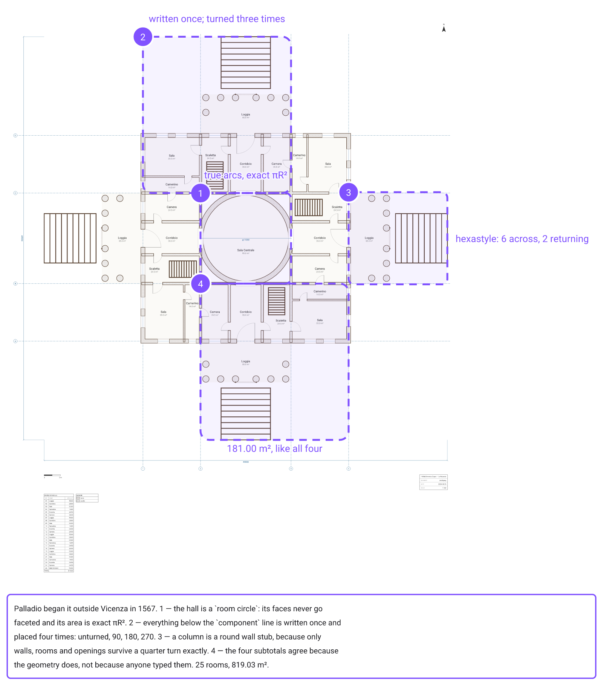
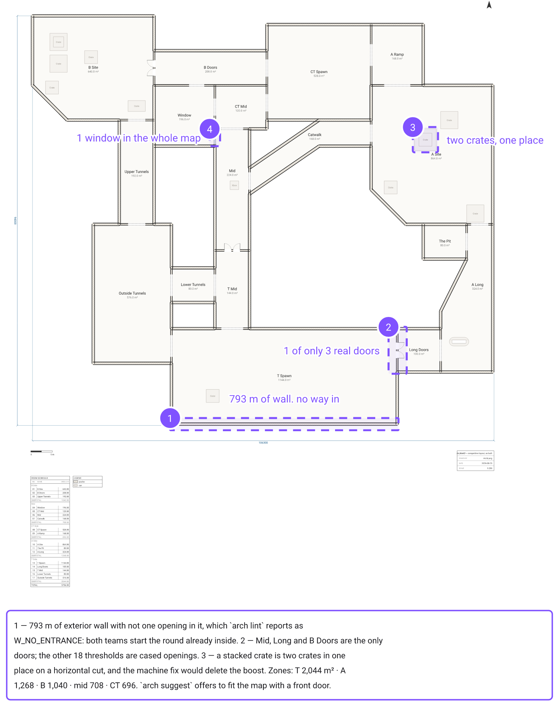
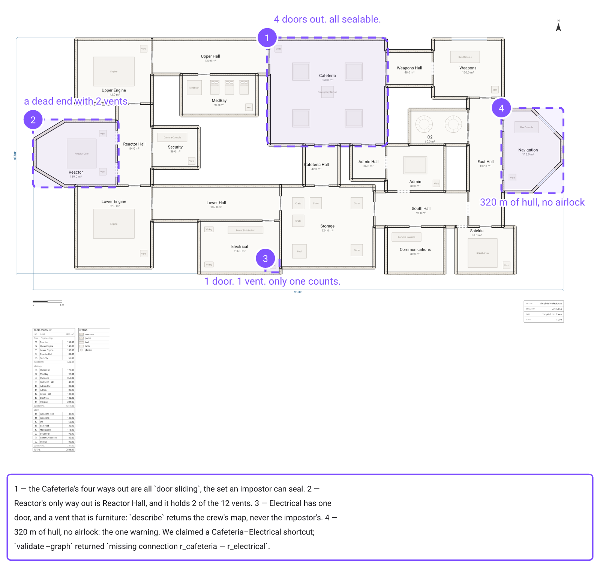
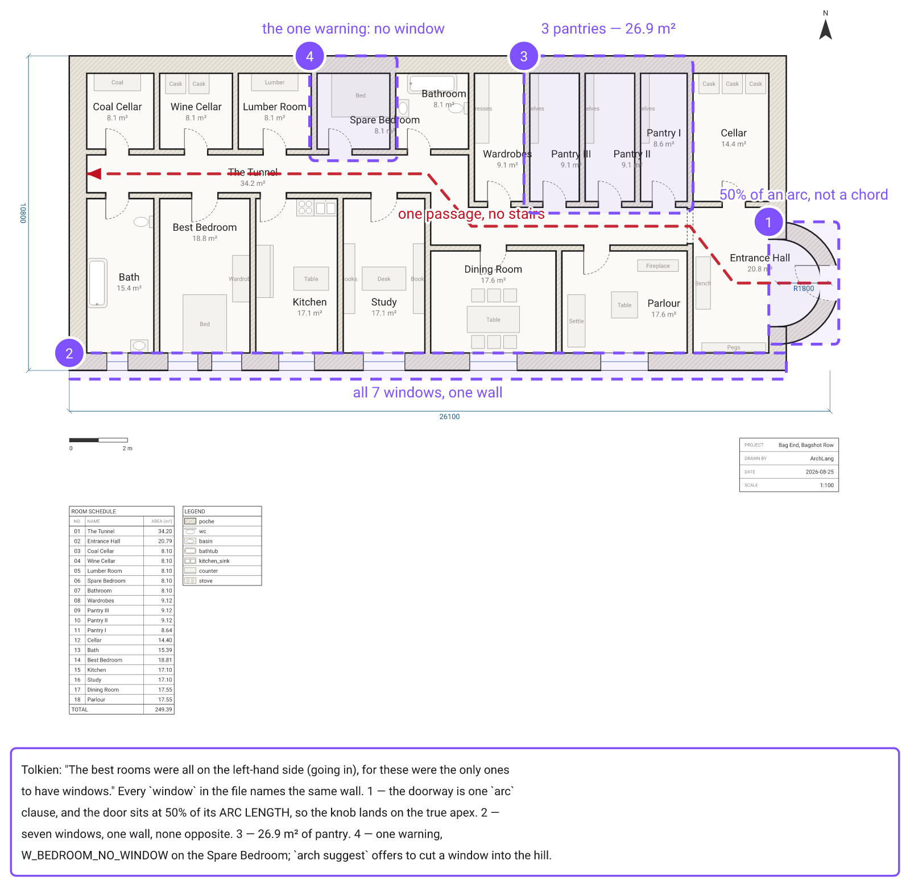
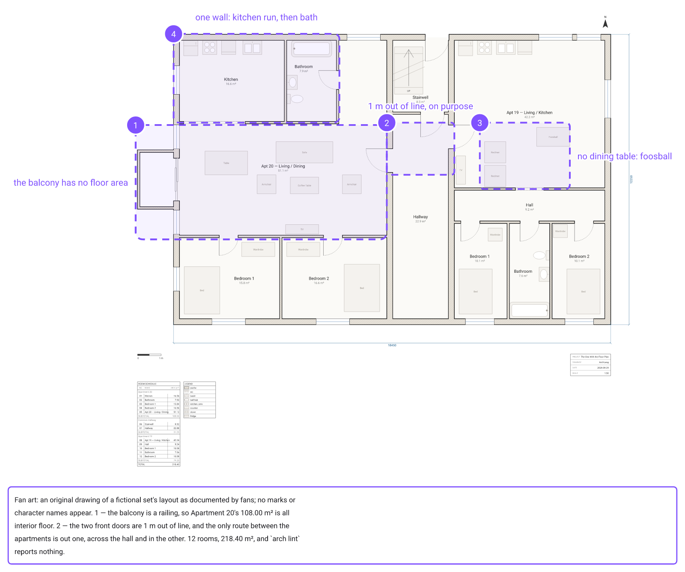
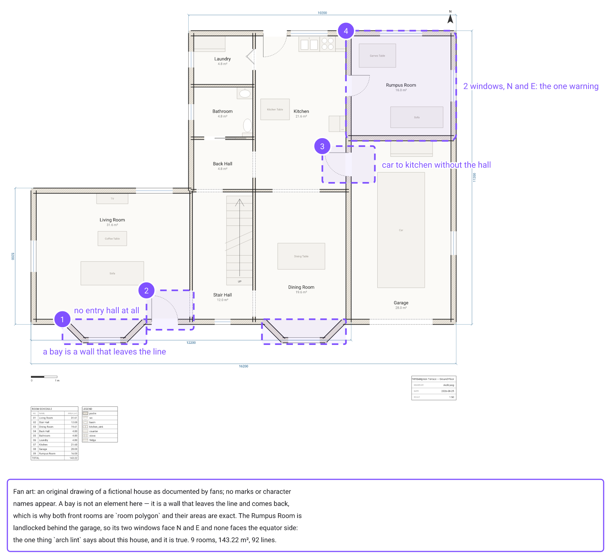
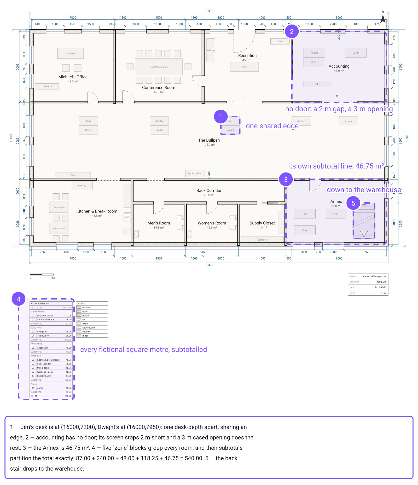
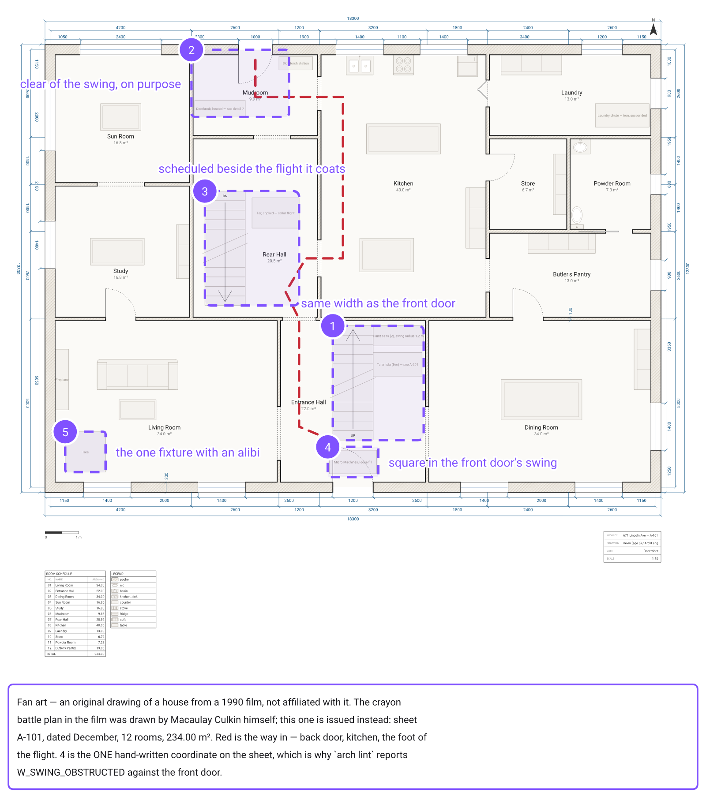

# ArchLang Showcase

Every drawing in this repo is **compiled, not drawn** — each one is a few dozen lines of `.arch`
source. Change a line, recompile, get a new building. Famous buildings, TV homes and game maps,
written as text.

Built with [**ArchLang**](https://github.com/ChanMeng666/archlang), a small declarative language
that compiles floor-plan source to professional SVG.
[Docs](https://archlang.uk) · [Playground](https://playground.archlang.uk) ·
[`@chanmeng666/archlang` on npm](https://www.npmjs.com/package/@chanmeng666/archlang)

## Gallery

<!-- gallery:start -->

### The West Wing — First Floor

[](plans/west-wing/README.md)

[story](plans/west-wing/README.md) · [source](plans/west-wing/plan.arch) · [open in playground](https://playground.archlang.uk/#z=rVv9bhs5kv9fT1GQcYizI2vVLcmyczsDOI7zATjxwHYmtzgcbKqbkrhukTqSLVkzF2Af4p7hHmyf5FBFdostSy05Hv-RqCXyx_piFVlVfQC3Ew7fJsJy-Khyw-Ff__xf-MaNhW9CjlvwXmhj4X2mlG4cNA5o-FQZCyM2VbkBNRqJhIOQYCccFkpnKQgDTIKas6wNn2ksTj-aZUxCxuQ4Z2NuIMExMls2DiDVbAFD9chNC4wipKs5y-DKgSdqyg2o3AIzwEDzxDI5zjgshJ3gUmymMjXmViSQsSHP2o0DONPJ5JLJMUyYAc1ZBonQSZ4xDWOuptzqJS024ZqDsEg0kuH5YEv_3TAXmX0DdqI5bxyAsZqJ8cTCgmUZspkCg6Fa8BSMyu0EuExbOCpPHhy1t9dfL4DpBJQEBteDbqcDCZdW80xI3vYiRWERJiRKWi2GueUG-CNLbLYEu1AEkajplMnUgHVC0lymXPMUbn77QIq7P4NBr9-5R8IaB_QY9Tv3LRqtcss1kSyk5BpGLOEGmIVr-OmvRzBh2cgzn2VgJyJ5kNyYNnxhVsw5rcF0Ylog3Rfv_uM9rXF9fg9cWmEFN0SF5HMPb3nawhWYXMLvSk3bcHglkaEJh5lKJhzef7q8BMuN4VnGLDft16WZIddJruccRkpPDZJkwBkRZ9KAkm9oLJBsDh9by9egWSpyA9fwn8nif5Jk8V_4K5x_vf7t4h18O7u8hIt3Hy5gpNXUEaH5XKAdz7m2_LEN98ninjDr_2a5NQTgVInKxafrTx8-3oIagdVszjMyMEYC3QNzwbIHngJnxh5ZdbTATThUCwM3V19vP5JkaQ1lOHxgOuUSf24TslZqCjOVLcdKelH865__t8LGiVNmk4mQY7cd2yTjoVq8MpBMlKZtG0UwdRZizR4Ua2E4xO0-TP_d2SOhqyxDqvELw6Y8sHb8bj9BZJCqwBsQxUQYPqG62Vhz3D2NA7iacSnk2JAAnVLIaoZLOLs-h8uLLx9uP7ZAKotfEa9vaJhjXueSWI97_QFMp7gmmvVCyFQtULGLO9qdzELc_7d78iXZkpwc_HfONG4qNSrdhlY5yQ_ly8iFTNTCM05exDsKh29gyCfC85Vy84AOMgU-57hNvFU5dsjZSQVWi7GSzoM1DgrPa1SuEy-QT8bkPMXZZxGSHb2JOp3SfhIl57hdlWQZ2r_h0jJ8xG0GDGb5MBMJOb4U9Um8CTQHI37nb5xr55p0JKZcGpyaTJiQLWDw4e1fb2GmjEBEIcdH7FEYGGuRFtyQc7S55i3vpZiEa9zSKQrSjVFkK7g6c9AYLVCBU85Mrnm7QX6gScGrCFbEYRCvmvBHAyCXwhqYThvgqOh3GgAzNuMapYPSNgmb8QaASVjGnbAaAFJpO4F8hj9gdPwDCefc-h--NwDZN8ByqwqBNBoAB3B0dHQEZsKzjD6-6I8Ab2YZBiNpFUg25SmarAHN7IRrsBOKoxzuk0wZfp9CptSMdg664SUotz1gyDO1QDkS5pDDRBnLU3j7dzi_-nJze_31_PbT1Rc4vFcS_oZ78Bc0nr_NlPnl_jVtPgzZzrmnWowsBn_0FLRh2w2_cUX68-LOCQmAP1quhdKreAIYAP-Aw06r8xoO-51Ohz59r0xHHwi108uJ_lM36nSewNBOu-M1ML1BMHkdigR1-_EC3l59a8O3lXuGo18A3TNJGSMGhiUMpkFEYBYOe1G_02nFxzHiUWREsRCs9xjkjVogpBEpd06p2Hc4vvB4I5awFH_Lxv4kRNZQhANCdCGhDTcLNnNEjYhj9CsjlmcW7hP8tsAk34wxlst0poS0BsYY1hkFE4K06MESNucGhFwwjBHSWM7SqrLJPdZqqyJmitbd4-AbH7Xd2WjhJL-uxUWtLRUarMBWjYHi6R4muW4AbjsXTuuNExnGaAJMlNYiVdqUck1UpqREdZkZxrz1_VxSdHYn0RNpS74yICfqe3JO-8SUk557-F5FMDsQorgTQPinCsbbnVTEFYx4I8YuOuJeyIp_KnZYKLRXxp9OHbiBoVYPXOJ2Gio7Wcm7PBu4oOoP97g-gZoZbUjNWYrncHSQ6BfLKJoq1Bm67hmXoTnPz1V2J-u4cTzUKYYwprsxol2SJSCzG6gq3qr9fiFXrJkcc0jFXKRcmwrDX06hVnunBbunW7j9Ep3UAkQnBYL7tAki7vfrIOJ-30O4T5sgur1aiG6vgHCfTkMb_CzSNONrUoLDR0Ce2-0IHTlaIxocOfEjd4rLhHwobfJ1Rayf9xFrYQGn2wzgcxTVckWUlTDuaTPOPjoqcU620rOXogoc97QRZy9tFTjuaSNOL6rlqxdVNlq0zYV9vlvscqWDQFX-YQ0iqRexU9UgFE2J4w56ZFM1W_Um6tQv0Qm9QbTtZDS_2csaSpyTrThxvxYn7oc47mkzzmm9VZ32Qxx62ojTPa6lxx0PCpy1w8Iq2suVy3Q3RX8nGmklLd5RfuVSmmU2Z1IwOJtzmfMNZ_2Gv5eL9Gd9lyhT3G_xaEieCP_wUkVe5hG5ApfAgub5RPARnhJvLBuNmm5ibniRcatgZ2o4XK6wC4e9DfsShzfXLt2EjUfXJWaCsgo-3hLNneGJwy_9OeEP-uv4v-JwuOGJ5pZpv9I22vMZXsVK2ktHv4X2rzTcreDSg83t2EONQiyxywhA2FFcEl6h-y1OwgP4tVLTpsOeVC93wWHjJVe8NfvQ-o4VxuGCU2kfFNcf44DWcx9zmhX9VU9Ba-BJYB3eIRI4yYF8xQvAhwXl3rn-eZQXp2m6UA0qpt1FbNq_BTglA86LOc0N4CstTsOY_ydpcT6rbvKolEZg0OgGobTo3zDFjaYnUi5tVSobbFoaVl1hsHOFL8xne254kmthl3CWzoVBFWxbhbkBfpXKIYNWOe4_WeWGS7xVldA7-EhULg3PqisMalc491P8zTeQ2bZF0tLrrvxWyMbg6SLv-Cy3S1j3v9vZmE7N-gqD2hXO1XSaS5GQVsxOQWmlDJ_zzAb-MeSBFO62b7HCdTnF-bAdK5B7Xyj9EHjJJ8quruBc5bnSMwPflH6g61aNlNhQSG69lCpnMrfCUx7O_ZQKB1Uegut5cHD6sxyyQcWXMa88NZQbjch9PA48G5nKetyrC9t8HGzlytmNVjgpFygjNx8Lk7nyy9loxIR29rPV_gWl_irWGa4weLJCualeGXjnZgdx0OGtiSlPl0H4Xl8CP64vIebMcrjBmVtUW1mhEKhbITwKrsxzKxOhOjYbD2b4rn47u4Sr9-8_nV_8qAH5XAZl-IsqIVIRVAldzQWrJK8M8Ayz_M50uZZUgRKYszDClrlyNnXJPV83FDrJ-KpIJ0xRalSyhYNnGU9RSift6CjlY0cLnxk4nLJHSDkejXPNqf7lM3wcrM6ppvIGohMqgCgNnTZ9dkVLVz8wE84t5exhIlKsPuVYfVxRw-RywZZ0CcarjGNgojimRoFpzuA-5SbRYoib9B9GSSymzJS2prhak9KXKoeFyrMUWGJzKrZgZadFuEWWzWnaYPYZqyxYjUM2KPmqROrKPcz6jJyWrkhj1BTLPrmkDOtQPbYrlkaJTF9Fa6BJrl0Ytidb3OjecdzHbwZ9-r3fw6e4657IrXbjE_fU7eNv3dghxe6p1y-RKB52u_0VdqdXjoHD7mkvmN89CbG7g36wbvd4UNIU8hTQ7XdNUHJvbtkqKF0m0Uhf4GVpq2D-DYWe3k2xvENlNnftwoIV8g0LkdoJYJQAs6BKVG4rMzVWQmmmqxdghY5iiJuJ7i6YueLC5f6weFGmc8oczjMYK2gBcOT4swYShKldZsn3QUHNig_K3dONsAFleUakP6viIhdAVETRo8pUZdEZRahwRoyq3rpoeZVbB_L3sACoG8ryCRCNXwfxF65QBJsV4kFo_EaQGEF8LpZZ6Aco8WaUdRh_FHe0mN3qmM-eaEPIhzsZIkSduB8a5vqaLJ2vrRn16rThj9nrMP7YGsDUKzV1plTBwGNjlfh6fZbHzCcWRifDCtBgp4XhnK07zp3W_oQdV9yFkLa3-2w5adhGJZsKxi4tF1eXcEqtmv2Epzju7hDg1OuZJmxUdJWBH9R0woZ3a_T0enVI_li_CYc7HF8JIaHuAVRx7-UB3NFjSj-wFaaYUYEpT9kBTFTLVsbHFYTyFB0gxFG_BqE8J4fc-HNyCDJYGdopMrbGTZ4uqxg80eusdOM6iynPzsFmLNrrXhlfO3O78weC-IFrvli_j78yUK7bcgVzP6TM5rR82C2_d76gXWEXj2N31ILjErukudr9jTOeQvDSEs2PQshS5OC2RZ32CWIl73HGfsdfnyvgp_IOe5LKw1Lo8fwJYeO4qBPQfFwz7ni_caGrqls3dEa14072G9d7eiLaPO4k4APHrQ2k8j2OQzaq3n7TsKhXK5Zy2Olew-IghNKia-OKnoc1l7eBvmBk6NXqR4bea8fIwEVFT6UdjAwd0SaWyA94e4DtEiqGDfYbFoUnw-3D4uP9hp2uDSsbFDa17vkenuDe1CqaOF0XoG8yrHYitldrl90z0ZM-w40iL8fH1fH9zo7x3er4QRX_aWgo2RnlWgoz4emzvBcBnhU3aZa5K7bmI7pVus5l38N9hC3gcM8kdkLdg8nHTMPhxd2vl2fnF3e_Xl3-_XULFhORuLYpnyeYKEkbSZoFdhpT36KZsNmqS9Ld-anDw2HjJ2ypcl0jhjISLqMwNCrLrWtHhHshvQe_h5QnGdOe4imfDrk2EzGjx6KHvGhMFHLEKXyRxCjJItKfR3fU0-k6O13us3NMl--4TF_hrejxNMzeckcQvOPmoQklQRvAk0kE1CCpPXiE4PjvKrH6eIytC7UgcQUk7jwfxKgRiwD_9aU219BwvErxUq3mdDdK_BTl5PhZKAneM8CyYeaLRp0YUQaByI93ozA9rci2OzghlF6YeN8DZE22veeDjITmAHiHoP594mhAeahBlaPeKhX9XmhOPYmh_VT3eZhg_8GzyQbZs6ETvPuX1i6S_5ibo7cVVprsh0VHP-wWZzYRGk9gCNFpt4-plzdcLhAq1ltaPhL8BAL-gpnzTba7uq9sQeo_H-n7mlirtZcfEuxTseKV7YlcV4WhqmR76FAo11IWnNA5cZnw5ws3HgxCWaBw4v5GkYTXyn2xTqLdWN8bW9AosRkdDzZrKITYNL0bH-83vareDT0Cz9XxU_VmPLFYAij-d74PRXS62uE9T15ZCqKxfn8XiTRUq_Zq7RdqVRqSNVWHJBjOXG2xi43K8BMk8BdargXxCX2h8YtKte6xXwiqWNkpan03aOqSHgmLnebYt_zC3eACqduCZUNNaf7BXyW0ViBceFmD8GeEjI8s_ma4RS5XLhq7GrahrLpvNqAMKii9Z6BoqiDtgxL4hBXKdqHE6B7W-QkEu-r2KU9OmEp1lKBd1Ag3gFk19rwIJihO_6kwQ2Ut1n2eiRM0eGwgJ94XJuji2ETO3jhBn0YtObhlT7bDBM0Y9eTswAn6LV5GTtlU8SJyghL-i5QeFOpfhBNUsutxdvJV1tzr5YMxY7DdWwTtAZtwOgUOehxyGWWTjJvoTxMrlx-8-AXs8YfLhO59FnyTDE9iEaTM5lPstcaaZPUtMpbRa11vfPmcZQZkjjc1ntIrOnjtw9u9qx5PlBa_K2lxWMatPzTRpR5frsLUkavRE58G74jw7uL6E749Su-MGqUxkhV8EijeKrFm7d6MWmh8W6zZbWIZvXne9O-ATtUcKcI6ueaOQnevXExUxt2raRiolypvl0mHIb2wpTW-WCuVxJfv_MuA-FIzvsVQCqZFNXD_Io0w9FS-noeIpA4X_B8x2nda1DnUAtcVAq6xCFz3j2vba5H4OzRnWcyhn6l3pwWx_8_NoYpycQawwmb40txMq3_wxPpX9ba9Z950717fDZfQLF7cbiJ3HJpxJz4-6pwcxf0mfG98b_w_)

### Villa La Rotonda — the Piano Nobile

[](plans/villa-rotonda/README.md)

[story](plans/villa-rotonda/README.md) · [source](plans/villa-rotonda/plan.arch) · [open in playground](https://playground.archlang.uk/#z=pVzrbhs5lv7vpziIMIjdltSyHTuJe9OA2lES77itrOTcMJhtU1WUxUmJ1BRZkdWTBvYh9gn3SRbnQlaV7GQyGf8IIhXrkDw8l-9cqA68NUWhYFgsdWkyB2dqVaouZKoodA4PLhRMXHA2Vw_g__7nf2Fo81IreK2KQuXGdWGmbyoLB8cnj-l5WGhYGWUdWDczhe7vdHY6aTjMKlMECAvjwVkNwcFMg7G5mc91qW3Ab9YLky1grTawcRUUzn0EFcCEU1Dg_16pUsOscNnH7k4HFORuqXPITJlVhSphoYoCcq1yyLQNpe6Csjm8GL-ZgMm1DSZTBQS9XBUa5qWzwXdpJStdwlxlug9XVWl3OrSRvFRrY29AAU4bdAmhKi1RNAGMp0FeLdPIPkwdf-mqMtM4ZF2aELRNQ3c6tDXk1fhyFAl3QVVh4Uqdg7OZ7sKqUJnOYe6qEoJZan9KjAR-EF_b3QPlwboyLJBHu-PJyy4M9r40UCsfgAaO3l91YTx5uQf8V7qggoangy-96l0lc4zeX0EPaKbR-6u9-OrBky--u9Zx2gG9w6_v1dMePh7Q7kafdLkJC2T5TBduTUy7ztxy5ay24RoKY1tMRV7RcSD_bYNbfbhCfm-WSx3KzU4HX7IugPJel0HnXcgWOvuI7C5Bb_SMxR1PpT5ZZ4sN8HLCQgU4G15C5pYaXBVQ8DNVeTzPa9rz9UMft90jMTEelAV9q7IA3txYnfdWulxWQQXjLCxVKM0t7KKYGu2hd_B58PmgC59zHT7DMzjYQwH3LE-0s5Urg8mcB1SBzNmbshKVwSFLUxQGt6thtsHHPpRVhlOxDr579QGuXo3gv94MJ1ejCZxPYQivzy_fvRqNLmB4-Rwux1cwjM97U_zPiBnpZp-MqzxkVSAe-cJkGmfFFbJKqsLhsbmwEM2jw_J0OiwTuMjgVr1CzwNkrrSocunEmK7-pEsvhNWtUQUOLE3uSsjd2spG87zQXWQNDt_UQ9auKnJYqE_RsiSlUh7C2u100D580h6Mxc9Q2x1jfVA2074LaxMWNBFuA7-D3LkSnOiwVss-nFWBPpUoHG6-04HSuSXSDY43VZ_P9Gpy_npKM2iVd0GrbAFlZS0LloZ5VRRs0mBt8rDAqdAmeZMTH2wOPrjVCsf7hStDXIsLC11GwwCw3_vy3z6kP3yTTYYPpVnhUjzcwqDfP3gyGAyE2GeA1ij5-5z-qYmRWeFRpDlKPnXJXOocng4g1zfdSPn-tW1Tpm073GrpKpsz80nW0BGsjF0vtC76jeU2Xo4ftom-wKOhxXkIptD1IZKeFhv2F9aFLbq7OFAEG__2QDfp4nGhBHRhjQ6IxNWVyA5UGWNR7ub1Wtf87kzZXOSNv1fweWteWh87YJnX3xmz_fcZQmsMMJfbPO_1eq0x9f_Y1Mupf_4W2SIJRDuBVkf_vdKoNGsSnlKrnOR8bdgfkniQCvAMuc4KVWofra0mDno0w25tfVcUAB-QFz8bvz4fTeH88mo0uRif_ZkNFGnPw-gK0ZF3YY4HIGrdjTadBqDVwskfepwD_EIXBarBT2l-yArno36KGphcg5tDQxBmhASQcKlRU2tz4tGvLbUNPqEi8oJx2lAqUyB9nKy7rZIPPZPmh8rmgkdqRXvoowWl1eIcxNNCWWK3s7BBH_J0MBiAmiN0MYF3Sz4XvQJcOnJu6B1tE7V4tUGHz5yNiga50549CXqR8-ej4QVEH3F4DLf4z1I4Q346uManLs6Bm_LIw8fwGQ4O4DM85knYpO90EkcPDmCZPIscf1QDg2bWZ6WZ6RypmtCNbjIvqyU-vxpevhxdXuESVFHsdMQk02p6ibXsnNiHBGVv8OBWzlgCAIpO1S9cwbCAUSlij8WGec2yEImn0T5qPYl8lzFKWJSuumG34vHwbxaBjw6XcGeIKrOdDuxeu99wsdc06Nr9htu77rKTlSNL4GivD78aL5BUZ87mtIjIvJXLFrpeMnkOXoAPhv6lsxGqaLzWasOHI-4MpY3JI9guNBRasSslzWiBAURvqDwYBZBdpHVkqiw3-I3PFjqvCjzS9Sm-uSFIQ85deWfLjaxiqWVhuGTbrQ9BrDWs0ZokAsbCW5Np-7tiQR29HV2StD6fvPkVAY9gm9Fz3llDoggcIlrL9IrgmaCqKP6ndOY7nRQJ4GYQtrFvK7UmwUZZZKyBZ-jZmxADifXOa7IsmhwG87EPY1tsRMNfXIzHExK_hFxCw-L04blD9TaB7ShGEkv1UTfP5aEHr2_Q9pCai3z25ijIBMZR6DyZA79QKy3AS4sRCrg2uCZRExSOhhSlPtRIcKfTQpiQKYscnEm8RaOFBxRaRa6VigQvLBRDnF2F4ZQqNt54uCkNWrpS-aBL4xE8sojOdFhrbWnNb0eTq_Oz0ZR0XgHJWbZwZQ4Fmi0Fq4WywS1Fu7LS-QgoMTbc45OPkR3akhQWaiNasTkVq4CORIxBWWmYvn354_P3L3BbeC7KbuB355YsbOPLiw_wbnhxMe3CZDz-dUqYevx6dHl--XIK0zeTt-dvRzXAhqs3k0sYvR-eXV186LbtC2t2US0tcnqh0QqWWoCQaG0180m7fdArH3XIlGTnA7peAeFNtjMvrpm8mBYflCmvQRfss_rwC5oY-UhCwdRZGE0JlUd4GrRIOJlnjarLoZaxMBkNn_866i9z5s7F-S94cHRu6BspKDC2aNoYr8tPiBJoNTyhybUqjNc56mOM06Mw7fJWMKdATm_BmpeWtAG_MqUq9tivG4tixaiM40U8Qwgm37DvEuO1Jn4z7VKrCM3RSGhV6hIOT_qPYPlTc-cFfKI0CoIBxryPjmu7wJK7IDvrSHN3OrWEKbSepMS-SjZOIX-srFMWFk2SutFR4fzCrfsw1brJb3rzAed16vwN6flrSs1cUmrmAfxjB6CyuLblcgdI_-B4sAOwUsjn4QGFnKUyYQfAZ6rQcHB6MMARjFaqFT1I1twt_Q5AoW-0zXd2ADow1SujwNiPyIVCmVxo42LwPBf6Fj6pokKfgbE1W7L1whW40UKHoPs7BIOXlLBZwoPO8ezRydHJA54AASgfL4pKZNVX0OpX_mjtAYaEeJ_BYwRPrb9ORF3olmX0LzL64GB7eKeFE3HHW1DmoYfcqKUOuhRi0_PnIyR2CD_AEPaFOBM7PB4MBowVOf_1RbAViWHgCc-2CDExCvW6sEDzrkpWrYj0JCxEh6e90JrILn-BH-Fwi9bxcVwXeg2EpvW6SpWbyu8IldfjyRVSOb6Hs5LdQLkPc1cuu5yfi3YQd0hAPW1u9Hr6hUOioLogjGWskCHnHJcxGf8nLoOWsy-kImMOW4xRaV3CD1ghCE-HEHc2nrwk_jDpu8uJAcpWAoRgMelr5lyZG6tCYjlmypAkycQ-iYRQ78AjAvbuky4pRCBEuEb_F6ONhoNjlRCiZ-_5HJF4-yQ7cPgoHaQIroQ7C5pEPojsuTlbMA4hSBXRkFtjdY9nJCTEEKEqVQG5CtWSHRKqtLrVniwQwC1aYsooIhv3YZj-g5IbPyAfaPjmXxn-R8NMYMI1et_vsxDRTHRgGAGasSm0apxhl43V7qA72IsYzlUEHNmCCDfJc_fhwiEA2RBlysecX74bTp6fwiAGrjMXENXg-C68GJ6NUpaSqHKo-Mvw7M_x-4bt6fOKY6IyYVdKVaBecISDIVFXcCuB9pm7xZ3gCUsmj7IaHiUrihoFLUSfciDmxuQY3VrPOuwxBOAcKmZB0LN-tG7tMUWSUdzP_k7YQTjAhOgMcOEpwmkklVlsyFa_P59GHWnKMypykmZR4WSZJI9soSC23yZqxNd7lDiZBX5h09IFzCKkM0ik6CiE1L64FCH19D5SjeNKNKbDi-F91rIDuV6FxDSRKDwyRjqZwmKOdQIrGKP4kOiejScTeAaP7tIVcpRORXYVWpWclKxffkcGhBjfY1LE-A4cDIjjdToWMx4Ioet3R_W7--13H7XfpVQHvbvDK6N8fkzUcAWJ_RRmiU6hWrE6mVzTmVtJSNdogqs7LzgW20nb9TqmKbsSmtWJxj6MV9qSsCOoWDlvMNrBqCwRn7y5FMwmNCniiBGZ5GhMWDgMxmFWavUxGWkKL3xQZfBoI3Bjz2DYJ0KE8k3-jPesbwW7hoXJPlrtPUoF1hB0iVnyWWmyj6IWQHUWlL89-h8K9R7sEhqQTzTujyZrG-L30IPOb7RYsMY2Yj5GYioXsxmUjtI278N58EJzafKUSqHEfyu_kiA2Z2yCq8i1Il8W2kqt4HjwJw5A2wxZU04EVqoMhiP1xJKjwQD-AbvDtHvZM3-q9_uqTgU8nGIE_3z0cjIaTWH8IqULvjVDIDQjePpJ6kdiqzRGYB91w1WCLrzezgvolBeo43jedUfovytNkMifeNcOpDPdzhNwHKnCPckBoTcdvfx1dHk1vDofXzYSBMG5rYpPM8rH86FFc_aMs7hcYzOZEFYzlPToEdvHju9brXMPflUY-ZZEv46WmDUIKX_0fy_D7uEemLhoOgKw1XKmS4q-KWLJlAVMvP0E3qoVcijCbBIuLJ14mGlOi9ZZlykuQQhLbSbWVY56j3rHgIJdaNg9OkLL9OjRYLB3TwbKWZjwmtHAiYcVsr5arSSpHUuRp2y6OIZfKevh6KT_5HGKFWd67vD8gt_iXfQLHTg-6h8ccVK3jr6tvk0O8qFv1aZprmjiJFGqCRxTegYdrVB2XKtIb7oyR-uFW0YBTjV5Km_GULQtp-MPW_hDfFRSJLHd9VK3gFM_es7xB-jBpD78O1bkvpzJHStGq5G3tsqiUWC53oNPVWnCYqmDyfoN04hm-cZpD6Ph9AquxvBuNL1qZJYQ0ydXTMLVJYLk_oIjV5YOSujmptSsU8ZD4VTem2mFdahTtDHXqsyuYVYVCLvEzl6MXlzRLKX6pAs6yLUqPqZsYDrDmMOCVRXaJ8Fnti7RdVHONgoPQixT6JKiBl-XFmU76QAaOWwUD8zwiQony7DSQRW-Vqg5tmiU1bIP71SB9XYR_02TGXquqiKIabAOrrP1dT-BhvEHjDtRKPZh0nIFpN_3OYKTr_hGAR-s1SRkpNqU1KOH0V9w6AqT-omMldeQQj2q6VJrVyWe8-vOih00L652VluE1jTgK4TO3jUo0acvUNL_lNKoRWnUpsRK0SpgnTbw2ENPcbOmyiansqj8hFLTao9o5HuE7iUGpbVhwBVuiL64JCuV-CiIJrDTrB1cZSjQp0TUNmqgFX91302EdAc7bDFRLb_ExEMmJsALA9HhxXAvHXT6IsERCk25feDfCEolMAWO3Ez-rHA3N4aKxth5M-xymiM2_Hjzu4Zf4FZSMumvUDNdwIMLevkBflMhg9GCbFrkBakbR-RbwhfJE76_bcQ-ifxZfPkBk6euLenhSqY5zuRVwbXv2ELUnIhnGsItB0t3ZpqqgrchGynMJ8xXtHYSo6Um_XRMif7uEHryXXMn8vIDoe-DK9WNbm8go0SmSidxdwO7Z--gB8O9BrviBuTlOMGXuES7SMfdUuE0CScEe4Df80TNXTSOe6ZzpNuSUPJ0jca57xJWIfhK3yofNoU-BW9uU4qPfSqWTCk_CTPMaKV2HC4SkxlYY9GGiwIY5YN3DZBANuKjxopIhKHq1giwxLeXiLBKjVYILRg1FhGWnRfKftyu9qoIEhlLI7xMOcGIHRT4rNTatrHQUDbGiJ3KSFgfYnQgrW1chJFKy3YxJUIpSYejq41efs4mV9J8p9w9IRkctiW02xi--qr8ZD7pupORbbCAWKogCOVUR0hRauyhqNM61NWB2-H1P_RwrcI1pvtUBBt1EYXJxlpSrudUkUI2Ul1N8qFSzpO2x8wVzlosjCDG8YDCsFyCm8_jkUbwdkudpARFmikkjKx9H6aCugm1YpwwHVHejHtTMJqTZclz7PthwpXfArZDm8dyJAuCgsn4zeVz4UFdt5EoOVLOqCfNutBHeUB3lROirHMQsU5KAiK19YjVVFE89HA2uryajC7OL0ddaT71vEPq9-DQD_MHnGtnsq8v3nAF8tfzyzdT6j9iFU6Oiuq-Lh0Z5cTcHM7GF79xWobq9dT_mrQrvpvGYc0NQ1BKgFE-Axsl6REtzYKxtvEoJgOx9FYUTZitrK0KjDjZpVMnnQLvCpNDbnzWhbmhJs1kEAiEcmMDl8t62PHA5xGTMTHTaTfYz9DIgOEKKQUG238xC0aqq6RWeEoy2KjWCJ0LoIxWzbQ7dGrmytlygoA7oTHFUhP7wMS4HrEvRJvE2PCWbh37NUROYs0kpSIx9El0M1fcwjP4S4SwT44H3Zi_Oxo0PmDKtBuzc60PjWH7ROCvRJ1arDCmG_T7Jwlik5LcB414Q3EYwC6u7C_mr7jXiy6cfRAUHr_upa8FZZ9dtAfs3x0gxP_Yqf_9xvUw1UFNFZnwJIUG8Wlv--l9a7uPSnuJ37G0468u7fgbl3Yfle2lxaTTq9FkRBmx8Zur5-PxZArTq-HkatqH6_y3pTI2toisjC4zAeKUsezCTFpkOYFJtfnkDQSbSmEc4wVO3JLJiE_JHhK8EUslwq6yDDl0U6rVIlbRUS9iNEnNuuIfU28AekLsp8eUZmzWFBtjOdZNnVJYjVsotNkUp5rka9hkwbuIDbAn5JRcR05VDkTJumyW3FWDBX344CoZQhUO6mlp4BZBQd1GWB69oOAAsiLkqhAntf2TXDyIHfLSVpmfRqclzGPeStplXiCvKE3SAj0xt1UfWDI8ycJwj-XZB6oBsDFlu4WUmt3NEasJfJsp6bHNqnhimHmBTKFnFMDChiV4QT6Ftjdhgell6g0cDKgrP3bgi0FtNOwRwkqojRrKUl_vgju28SUBRRI-VkFyu-wm1w7-ppYzHx17weixwRMcIpuSo8M4VYWUfJV-rwhusXE54VPcLmdHmph6O2atJeCeAsABB5qk1Id_TfEdf3FUf8GWJnLW5M_cbxG_OgvNSVSgpDs3oSOwblYIpKDObfgsbDeqzLXtSpcKA5YNNUtpFYzXkk_CqzvE07ojqRb7pdfYkd9NTV7IVjpelEsfzw3evP7x-SWoEp0ftVKQ09NkWKyzejvDttXT9NDLu6aZ32pc7sD2VgbmCIwJY6AAClymDERctFvJVqJa3q9TKdkaGC57yhNSkdRjNQU7-U-5G4gJc8zSaF7AfGysNIohe-hhqZWvsLKAMkH5c7EX0g4A2UIZrAok3MZ9Y0dYR6wh0BUifW6guOPLDwb_3Jkfc_oqwghMixn4gcnu1Wm27Qff5JjvoT3Y2_qCrU2vTfdbKO5vU9z_EsV2-Jv6e__NBI2oE1lUtAXd5Nhuje_DtbPwH7iPn1Ef_2Pl_M_XUshVUJiAZ0wRRCxHNq0dFahWpfaeHqQrMlIzYWfdvEBViW4iwboS2SjspQqJTb0LWCg1y5lPFVdmOwrQUDpyuKZa-zIbpda3au6dRiFVbt8JH0S3Si6HUJMPQ9IBtbUfR0nmaxb5M4YjyEnGGyrwqGjMMCvnuSMGnX7KXsUzPrdi06RQgdFauwBTGG7lu3o3jt3jQS7reUd1OeXl2lHt2vjagythuwdbDBBd8_lyA_bpndbwWFmKPeTNnnY2Ooqrb7EAG9MedzvM2_jh0aD_9OTk5E-p1AnzKgIDdrBcqPoRnkpXxbxUXMKIYEuiVa7PJ6s2J15JXeueIg73tt8j8xz6Y4NwmSFGwF0NJ2dC9mJ0-fLqFUx-CAsdVKseigOpJVj6WOfmhiSP7u6lojZFj6nSp-xNo9BR3yTgQiXelhiSiFep_dRLP7v0HkoPMStat3lvry6fRAPSvr-Xbh4haKA6G8thRVc5-ne990ygiFTC2177kZjz1hu0G2d5V5QhTMfdeK3ZDsDJ9NO6IaP3M6Q8Jv4fk7K9n1OrSbc1kpOR3UbRUtKTvZ9pc1uZ_rpfpSGhrQpDatwQUFUTZl5hwosL6Iqvc6n60tgiJRpqY5G2wgiIiytoM54kk0HtnA2TEV_ZopTyrkxJfwMlfmV7RTHLLZiM6kZbdLaMGL5y32qQk0yFqxQoILUpfIopj-3VGOu2KBEX03qkeKICoYiv76vpNW8K9Ts-_36XWXvNScPneVA3ytgutbAlQFTrtlSiml6rD7-Q9yNfYprRaO3CdtF20YAecOtK41qtl2bSZXJXez9hu8Mn3bgznNqdOg1i-3DLdV7yfHuC8o3N0Rnnz9bG0vH_Zg9aDuzp0fEAIq85U9WRuAvzOYdHx4MvUjpsu8KDk-PBlyk9OvkypTW0KGGb1p01cfBOzlmi5TahTC2RTntJg5rQU87CRUIng5qQVBvX3DbPvwaAsLiyuY5elWKZLmfv053aBK_u5TYexPaCjh9_jUdPHt_Lo6j-TUqHR4dfo3RwcnjcMratew8xmkIwwXHDXOADOSwpDHA2pb6hzAFD0-B-xEhWoJwUZDnsRd-oCA3KXQSMrgqt5uDXFIAgJokhBfrgJPPRlEdDn6y1dIKhBfMBazbUN9i_G1YcfnNYAfvw-LiuxR0dkhphHEFVdxpw-LUR_0qccc9ke3D3-5PjmvA3kLyzvPuWXdP8Y-s-QxtrfK_hZAnjNEqMIfswovuL2KxrpezQakqum9moLLb1qwZElUBLC-b8s18lQHH4ph-v-O6frvj-H674_p-taJ9Z7HL695xdR66oIQINXhdz8qyoQ6n0EeWiG1mf9VZ0aSreW252ur3jpBRRprsH4qvosuFp4-56u4ewOY_88An29lGXJx62SqnCHe6A_GHy34e4SqlycQO4TYg2aO91waVrjkGaF_-o8Mzxn6Xd8notBiE5Vf5ic5dk_QilSz2Gfq6mR-1r8W6XzBFHoPTFUnk8JanHUL38fRfO3jd6fhrtA3BGZhYvTNVDMRol1U39Cw1RoOxfTFClwPf7ROE6N0u6DuquOa9bmJkuVdDFBsYvXvT5R1PoEEV7jw5TzjGVFOm3cVSZdblU3iGCsHR59ChqVmxgQSFo43LzMlXQJ-jHCq1yubsVFqYMm15dd112mW7dFpd-Eyf--o9kyIgtvr4NnJultp5BHaXYf5KOWLpWD3x3hYG-o18UofIzHTrdgbvRoYZldKtkVs1mhW5cj5QbanQPQu5C5IaqZfO514GvXNSpCOq1s65cKrofgcR7PwdXd09aaW4eT56PJo02gQ433fFVfKqnViHejm6YX4pKKUuXsnk0Yvx2NBleXEC8P8NWmXfvtmw0ZeGXjn4QAK-EpOS98AnQHuDgtQnkmPgmKKMoSTWwJV-uwkZu5TXa9ugc-cePBGEh93KzjOZwr_cz22IypsJIShrXwwY4SIZzMHFnWFJh0UpUo2BCoQUqrEr3N52FeJ-x_TtVJIqNn6jiGAb1_7fZBh4My2xxoeyNfI_a-OBwcHjSGzzpHR4_IKf7x87_Aw)

### Operation Absolute Resolve — Miraflores Palace, Caracas

[](plans/miraflores-raid/README.md)

[story](plans/miraflores-raid/README.md) · [source](plans/miraflores-raid/plan.arch) · [open in playground](https://playground.archlang.uk/#z=tVzNdhs5dt7zKe6RFra7KYb_ktxxzmFL7LZmbMmRZPtMNhJYBYpoFYFqACWK3cc58xB5gdlkl02yyzL9JvMkyb1AVaGKZEnumfSizSLrfrgA7s-HC0D7cPbu3cer68vJ9dmnKVxOTy7Or64vP55cn12cw1___G8gpOVaKA0JW6vMgjBgogVfMiuiNsyY4TEoCWk2S0TU2gfNU6WtkHfw8uT8vA0fr87P4JyvTBs-fH_1qgPnygKTwCKbsQRmmUhifFvzSOm409pv7cN7odk8UZob-MASFvE2nDDNImZIJbvgYDizoOb0-ROX_JeMJ0xCqrkRMZfRug1Mxvhza79shFkSiLi0mufiA_gDkxnTa-h3-2NQKdfMCiVBSFgtRLSAj52rDpiUR4Ilrf3yDQNzpSNuIGKpzTSP4YNv38K5iFTy218MvGdxphVpcyISweAH6pnr6ee3k2s4u4IPH79_d3YCk_PT4quz80_T8-vpaQeuFxxSGocXBvijn49ogUNiuQZhWvsQqyhbcml5_BoYJMzyg96xXRxgXzO9BsnVwYxp9XPG4Z8_Tk4vJ-c_vpvCSrM05TEwrTIZA5OtfWA6YjGP3TCxBCKVabtmOm7DStgFMDCcBl-yJb2m-VJJwRJYsCRxc3TFkt_-C8EmaxZl0ULBSxzrf-2Pugc0dyyLhVVaZMtXbf82XKkEYp7AB65_--_i2z8o9nP2238g2InmJlVtmrbJcsaMYbHS5gW8ZUlSCHyv1iz67S805AzHKeUJjqIynFQ2bW8XP2cs1kzeJbywlrKzwDSHWLOVhLlWS2_hYFSGU96B6afp5Z-u356d_wjTd1fT_zMz7Dd_4HoNsVhyaYSSbf_FiiUJpMoIS19iQyul79EmV0LevTBgslksHoQTYjJu7Ts7Z3MOWqklWmPKtBVRljDtXNMAgzRhmRGzhJduCUI-cIktdeBUgVQWNGcOURjqEzkDiptMP_B17gq5ozjjvH47hZOLj5fXf5pcnqJJnl9cwwQuLy7ekxsvEAUBeZQwtH4h0fhb-_Cy3x11u-3e4ajbfXXwcniMTwN6eg2Cggg2t1AJpw_lROBPVZtsO4-TYJUbkft1B06pSWrfAoNbHKFbWKksiSHNLIyOurD8n__Efq04swv0EukAWvswT5TSNF5xlnCaevr1NuYm0mLGX77qWGVZYm478HnBLHAZJcpw45VXkmBUpg8Mv0O3oxluw-3qhgzotg2p4DriMczWYFc8eeDer_CfBTffUWdSroWx6wThIpVkS2kKS5yrTFomJBjrNKRvaSiY0G2Y8UTJOxwDi5PsrAQ9K0nK-ZtcnkxOpzh5P1x8vKS5u2rTRF6cTzswwbhrmbwjo2JSZklmsIdoNAyMWKakW6qS9R1aplE4BBGT-MKM40i40Ye__vnf89duXczS3j4iTBs4vjhg1FGtRaw0aWzQaixncRHaV9xYGgTO8INeGtCZhHmWJLDg4m7hflUr6aczUlpy7bwapNIYomSMnoqfUN6kTMKM2xXnJLSkxiiYSeWc0__q3Q6lqLPugeYNfcjNDtoPfiRDgEhJK2SmMgOR0OielD0SpdJOK8WstLeR0Kj9syTJjMVU8sDhkkdKGquzCKX34NcWQCaFNbBctgDutIhh1G0B7MOHi8vry8nZdRsTL8Z6GZuIpYH70vBXneqwO-524RFGI_wXs5s1oDLLNWHOWYRx0eU7g78tWJqKZA0s0spgv2HS_w5W6A2x4s5C5qUv9_sHWq0KpyLQTMboeDYPvpbNEsyWyljo9_qwXKKDmgXnNp9ZxMeQ6Vw9YhiaE84eKGBJQp30gy73hrAEs1C6YAMuU8LL2883VyeTd9Obi0_Tyx_eXXy-fdWB60xL8hgKrUvuGifYWbb2UclpMmPRfWECKUu5RkdcG2w_d1FS0H_de93vdjst8O9O-oBESDOB8O5FeqUF3kaztAWYKQywzCpQD1yzJKGXfWAi_2gBJPyOy7jVAmBRdC1swreYVJUjidC2dNW2HM4pxjrYm4ARaCMHxirN10AGq-bA4LCLsWs0giVHthQSiMC0NgjEbvrQgZM6VVBRlKXrmuNSAEB4tEhWSZTOZ2lGcqaFYGo-FxF3aIK7aaToQShlcieNZMThgRsrZjjGBDhPmKQ27jLM_Kky1jiXcNNsNZqochGY4krn70uc_1bavNciGy6ZInIWaQ15eUDQ5goFMl105uri4_Xb7wrTQUrh3IHNUOletzOCmN9pTh6vseO3Rlh-SzSCogDRAOqxdfQK5mh0scDUgiyZ8JQs0yscHPxklISDA8MTHlkgRPQd_AC_5gPuIviCL4VJF1znNvLFdfbg4OAA_RfzrrOWLSTu4Fn_tcAlARG_IcCSZduFiO4lNwYwbP4KL7vt7it4edjtdsNPo1G3i0_FJ6ILuabXK0Xp62AlYrtwNM6tH2IFS4yGPnahqb-mpDLjC-E74zpNPXQjOXfO06YXhXRTnUO4MaO3OzBl0cLRROfkeaqLWGYcGIokQlKKCBIZf6BEqbK7hQv5woLhKdPMYgBf-OFGAoLxPRi_1c2MyfhGlr0MxnCQj2Fv6MbLjZ5_-rIJY5phhr0Qxj99KX3BrhSQjnk0qXCLNrA7huwjyPLVrmgm729WTTr0DoMO-KdCjw0o3gQ1GoRQ7mmzS6VpC2t4Mnfm4tgn8ivwhNS0nQ3G1R4552_QImTu4Jl79Wngn9yb_qli7-elxYJjD6iAqWoie41qHOUO5j5tNRHZb4IYjnMI96mAIB0_F0kmULGq4apRw26bNCtm3T95-GmRfUpeG-SxakO8sSFnCf2Kqfe3mRhvHA4HM6jADLbCDJ4BMxyFMO6pBjPcCtP3MEejAMY9BX6zD6Nu10m9dsseb-T5MohoiqXIZPwqfYE0kZgjI3ZLMBLJ3ExluDzIs4OSCfGcyC0-q-wIDJI5Jtcur7n1VJARK4vy6jTS19v6PHJ9Hg_DoXNPVQe_KoP3bscxjdbSC2H9k89J1fkxjdbSH4cw7mk7TKO1DMIo5p-2w2y3ltyVKzDDBphRo-2GacI_bYcZN8GMKzDjKkxJTYi9t-FOqyzlvsKAvm-QVt_-oiS_fQY9cUsewNdhwQz8y_TyAu64QlK-fu3LS8Yyy6kM4UowoLlRyQPHciGLLK7iDAgiCITnSLuGFZKqmCfc8rgD7_lyxrVZiBSd6nR68m5yOT3NF4VYmFms_bLHL1AivySLmNZrqibNqG4CBO4WWsziGpstsZqBJCVR6j6oxebVqAhrNwS2YMgeuRYPLnlR1wMOuxesIshV3GIZfJksfqNvWF50BMB2HGnD_4z4hQNF6kdyDUjYjCew5yuHebFyj17OsOCzcO4fohuVpFxnkKMXuYrQezvRK-XNvZ3wERU5oYAv8phTfrgLPq-T-irp7gZYWTn1o-NTo9P_cKOBjVLr3u7BmWHxlZXaF4kxBB9sau-Ltm7kd8O7am4I7_3QwW8OzgkJ5LDN4OWq0IFXopdroLvRwDRfU37Kpf3I42JznTdDgYEs2fFMA3snQaWZvtpixzq6WZEqFZ5JqgxG3e5j_zDQhCjNhLDyCQoLUtssQUc33BmZI3qN-MRpvhpfOh_p1vH7xziU2EqO72hj3sBz8U2A78noDnyXXZ_CL2eKP_IoowLK3rT4iMFqy0RJy0ujrDD5wO5pMAunkpZHC4YhtzncxNykjIJZid3vbfhUN5ip01wk34_CnSvfZVcrqbWBXb3BumzQxmCjDRrMwhqKITnx9dzNMa214pq-YWFPPB2iVjCJPo6pkWLOLJvP4YIE94pR2toHjz7z6CHB3IU-ETE3LwL43ehE7ooZrlA5QscgXdcdRS6VWu5VAg8W2hit5UtTM1w_YAVr78p_2JHYFiozfKGS2AWF4UZ86m_Ep7eFiMf205RZkQi7rjVABbCbVZ7ZxvUGguSQN_Aj1cw-YBkDI1DzMDr8PMAONwJsMz5GoGZ8LAua0hG7zwjgH0hkc5624t8LGy24zM3gOfj5lP7RiRb6e6jcDjxrDOqNrq7zvArWVtr4HnePippnWL7E4iaLebvYFSsrom1XDfU7V66IQmhBbRRpWYx7aCJ-E98ssRnKl0cBFXa1LqQrjli7wpohsidkBSC3fsTw9bRugIFGvYmhMtuqoOSmqyTQsoRZsiYPctztFo1bBYWlb4HgHmL4PAhegSg91IH0ayBoIFWUQqKC44mOA-nVQfp1EPd6BcG5ggMYPakFvV2Rz03dIYyfRMjtmYylIEPFtq3fjUOze-1PYRQ03i40NzgEbVwrJJzNi41MoB1PaiZ-o4iiBbbmXc-pRE5HdpJXD-vSflBzO6uK98ZPibsRpcDSG9XF-5utV71645wEbihilAk3GZ_06opCuM5xmeDocFQwDqfPoK6PrEsblXieG5LLHWO5IY3LFBfEjzakn24bNScFygXU4Q4A2duieND8uFG4v9Hy0jMEX7br7ZB0td-69EytQ2nPABqkS39iyxmJozSRE78w8tY3KoVXvapnBQu2mk1V9sb-hkxB2_W4G7ytIjZXSaJW5nVuoxZPMxXktR0-gFXFtsKWHbp2vlPng0JxEoDKBJgG8h23sMIWDCHSbIpHvpzOLK1TwjGsjpy01fBckGnHETcsoMw1VJZtBisJ81FAmIP4mAP1q0C5EhtguKCp949ce2fQLYh7Basg2qTcCGNDxVKPA90GVcBcdBvezJGeXv_r8WaFmeHUHhChQnyXChJGmzA-CeRMhQwyLNtyZycr5mu77mATFqOqZkLWQ6puOmmDquVYVp2scm4HlCyM9_mbjH4bkI4BRW7r10UVPP4SnhrCQXAeBug8Hbglc3DbNszCP6bK_NOtK-Kx5N55C_bnhaETMXhSBjcc-sewbEO_S_8vPtNP5akW7A7TriSYH05zvK_i_zgBEZMg6WBGrMXcFmlrtZmkGW7tVLU-7I-6EETJDYF-TaA3LL16q8CgJtDvlV6yTYDXVRoMu40t8LpKg-MnBOoqDZ9owdRVGo37jX0wdZXGg-ZRMnWVDrvNo7Sqq3Q0aO7Dqq7S0dETAnWVjustlL53l7Bffn9eC31vJWSsVqiBdMzDFdXyuu32tco2Oe7Zlhd8jhySlZXnWf2vlON-mdz9CjkkRr5_o6-Wi4J09jVyPtyOG-UqgtwxuGDNN6bsucGmN9vkvtxWivoN6ueIYu71NUm_lTrcSuJ3yppQ9ujZsrQ6CkSHo61Ljy0jZYqid7Fu8UvsZzRs3PIyr-d0NxfojcL5mtqx9FFduNdgGYbWaoXpDzaEm1sm4dz--18pnK_jSfjwK9XOS0iOOz1V0agJu2n21aEtwt2GiV6V67l8QfOMNlfliqbGZZulipVMjSA1S6Ep5hsvTcZfW_p-5XmsXQxqUh6YdqeiHXurHIx29OeoOE79U2aKbdGSzeUMKmn7awLFaWtPPv2p10dh8OydzG-LGDophfUuWp64o_qI5TZiNVU8iKTSWXRm7v32KTFeu-Brf24bOR4dr16Xx2lZmiZrZFNzZLLYSrfTOfZFYNcf54m00PkWBHwDuEfVht5RPyyh4k7D00KDcXeL0Jda-6Md7behjtjc_vDw-FlC1D4e08UbNeW0lPtx_VFZdaf9vrDY-oN_fy-wwNrmrltybLuJ8nT1pSDxWq0MmcSKS7tug0kTYZE5MyAmulzmt4yYMFhU9TdnNGfa2ZY7U4I_lkuKfIGdr4TcQW7SMqL98_AQaYdOBlu4mk6u4Q0M6XQ4zpz2M9fr-6nDt8wa3gAWzeBb0PANHI7cDKFAlAt0vUA4A9ECnSrPHvAtRPANLZPbYNZ-GkiFR_ePkFBuwDegoR38LrgvG0YSM-Gycq9HbKD0hXFejS92xpgwezXQaqxSdFtko1j3lbGqVI4OvbsW84MDaBkcL8yQju68wFGwZR0URlF4bxeePylQhRvX4S55xFN3kqURLTwWUIU8rkNWDgQ0o_rzAE_oeKIyGYmivzQjbuf-NRjxCClfudO9eAQ6sXhXJTi66WrL-VK0VMO96YbKV35ltFAaZspatYR5kplFeazi8TjoIYrueYdKvX-MvXuULaTccSNiN37F9y2kaNLD6p4WRr1Ak3zXJ_AMdHDu1S1PIniNrUoPEj63oc4YDR-3TXR1MmZc4vGdrbAEKSTe53N7Ct4gH2tLsY1a41zYAzwO99VJPPBabu6dWmVRruisV6pfKEWdJZ4cbNsV5UXE2mmCBXzVCJH0VBBPlJxzzXGvbItNGzVn29V11nSwdSxzu6rOiFL3WAXaDhfgDHOYkU9zrR0jSAuiuqnUdUGH29SltI4QRNMdmGbLeMfn9h-0v5CFUqZNNMaq1B_apNqfeUGlOSo1eXYltD_VTowxp1DMdShlGncf3eUhd8EKr2Ogc_oLQ2SBLz_fXH0-O__x5uJ7d_Fievqqs2N4ynpoMMS-d4fF8IydOz0TIxyhr8SY_R30mD1Pj11z7UqkGwZ3FM402m41RLGZkNxuIqDJhXocVfQYb4QSE55y-H1rgh2jUyxY65Fk0w2q5ws2I0gwWjVUnz62-vp458QVi9L_B9X4c1XbFSP91uaGaqMcwZ2s65e6veN4-TwkFQH1zBcNIbscNpLLUcgux5RNx92CrQbZdIMc5jvXOTOsdNFvSt8YIe8LzuDr_2aMEcrHWZ-dy0MZQeS36oHnR0N2YowbMfLs3oxx1Igx1yK-40_p4Q6C7QQJ5jzf4K-mxUF9oj9ongbEbCtUeerhCbDPSt9vy64V9hOccioNMiA-Q3-YLrjoQ5ciZ4mK7l8YeGBJxvO1Jy4N6OT-oFv-zQSDZQue31qjG1Jz8chdHhoMMdFcnNMF6qu30-k1nUZwb0Cvc4w_23XKSRt_J5r-CASLhC3X8-5oNN2Vcsu_W7oaegtKwy3dCL3Nqw9YEaALpnRnuigI4DltujCvM3-NjmI19ia_sa8e3W3oB65TLfIrf7QVpFZu1N0qMhYmSphYuj8Y4TdpNccbgXR-W_AY6JKdr6e4nSi8G2ZcRWMubNvflXeXsd2L_gC4W2FgB1LU7RYvaBzQNXGGh8vNw91tm_a68quntwUYtnY5nZy-n2L-dlPpQkWq1U94P7DhtusevUg3QG5ma9g7a774ChAzy2Gv9kc_aF8sX1jvURj50vpf)

### We ran a building-code linter on de_dust2

[](plans/dust2/README.md)

[story](plans/dust2/README.md) · [source](plans/dust2/plan.arch) · [open in playground](https://playground.archlang.uk/#z=tVvdbts4Fr73Uxw4WLQLOFn_Jk4HvUjT7qDYzmTQZnf2zqEl2uJUJgWSquIOBtiH2HfZ-32UfZLFISlZlCXR6WR8EZiOzsfD88fDw6MziOkqzpWejiCWpOBAFBBY5yyNGd8C4TGofL1jWtMYNkIC4yqjkWaCXwzOBmdwn1CICBecRSQFSWIiISV7kesRKKpB5BqIBgJZSnLF1imFyfgSHuF6DjuDryUliE4UsA0wPTiDgkoKhIOQMeNE7kExvk3pudJC0j0oLfNI55K-gjegmKagRXae0o0ewe09qAwXgj9FlGtJR4MzuLHPSbZN9Ah2LAaZc45LzDPQCcWf4pSOoCQnkRRKmX-thdZiNwKdc05TBbEo-ODM_AvnNItIBd_CTQlmpjlP8B803tJSUpJSiBLxmWaCca2ASAop01SSFGKRo2xiIaQawZpGJFcUBLfMEYO7L59O90j7anAGP7x_C2_v7j5-GsGHux-_t98NR2_s9wt494XKvU5wrTRVFBhqOKVkc55SpeBBZBQF8QD_-9e_gQzOICKKxqATSVUiUvxGNCjN0hQikRvGESISnFtLAGbZJFGEiFtJsmQERcKiBGcrEoJK3ZHPVMEDkVECKeP64YUCSUmUkDVLmd4D4aqgUsGOEg6EW56d7AoBieBUaYjELpNixxRFOQmdgNi4uYxGGNdUwlZQZaQngAvNIiMsgP_-x1oit1JIhGRfBdckhcgYrAACn-5vbv-GoJEkmip8UheiGnEQnCJGRL8rMXFi-qipZEKCSmiaQkIUcGH0iTRMH5RaatQ-wp15_BUXLfUF3KDdsy3jaBWSFKg4sQECW7IzhC-U87DvcG1ANhuWMuNCBdMJ_IOkX-jFwKxyWLr3EH4dAOScaQW73QBgK1kMk_F4AJCRjEq4mUBKeKwiktEBgIoIuuqr6QIf4ULqBPJsABCznQKSawHii7FF83BC4zylIIXYqQFASreUx4MBwBm8fq6PQfv55sOHT8-Ma-DOz8_PXTh5ZVSE30aAAjNOaWNVQl0YgJ3IdWKomp8BQEHSFFj8ulitVxzwU5kH6IRFnzk6yuV4DL_Cy8vxeDyaj8fjP8PL2fww-K0BVDwFyHyfjluBYka2YSBH_HJiWJouW6FUiCeP-uX0sgdL5yiqjEjNTFQ5YM0tlkftRNWBRY3Ye_iqC9oNJtM2KKv8PrY86pKtUvLGtu44xf0GFJVfqDKhFcMA41tlba1gPBaFcZ8XCgqMc4rFdOQMEj1eFFQCJUobRPvf0iTxZ8uz2NRt1ETujChFFaxpwnhsIuaFt0KVMU5XRVhYpUHY0WJaX6HxnsPMqtUxTvl4rOmcG6vvYc23CTtatCkSsdQp9rWYnrDM2_tzLc7fQCSkZLGQT11vw8ZskAhqoLQx5LPTXq1PBu211OZ82R0p4pWa9mN51I6vLiwa4MtbVRPLF3_NX77J0gzae62s56Az4TavspRpk8wUApOHLJeZUG47yDPcJdGLmU0LMTAUZA-Ma2HwtMgwjRzZPMT4Kz4eESkZtTSCp3vIGI0oeuo2JV9xd3fpU5l1--5ZML6K9BOUYEezNiUgFua-QayZj9W2HyGWOsVoHXUT66BQ5OhblNjpT5FeRTqwTs-8ylHbXmKQ0HYD--UhCNlRqwIsWP924mtgcRkCm_Zx5pH3cYZQRSAIeRp0o0WbzIzEMKadzJkbXbctk2hjtH0y88jdaL7o5EydwJkjd6OuZdrsIKhNR94EO_hAdWwtt3RJdpk5aeIR5uYk_2j6wEmJ53h0aVlbzg-Dpp2tilA65UH1bE-RDqeMvjctu9O8SK9ICGzpbXY9YAQlji7Qo8y6jHzkNqx--_ewri-7hG-h-sNPndoNetjqjz6-vBpgB3uNiC5I-tlujXieEHhc3UixM-Ec6yBotioRUncZ75GX80Cu53v51bTbMIgOZhueKbhR60aHYOokKysjo-WsGyywTI-8GcwOKnAlrefbNomLGGFTq46Gk2m3sVkN9B8OPfpy2Jq-E3f8PV0LdjRv0wJxR-AwmCN_ed3HmQqLrU7uhNgKljEdPAt45C8n4240sjJ1yV4_8OmPdODn3Rnr9OZT7c3m3bagZDlVoETKYncSJnu77ZlY4mzcFOtiKbKRrXiVuffFkexCKYwvu0PgbFVEyOs98lKQnWihgNRURAPuoAhXa34-x0dAE3z7XHXcWKzZpK_arM7ABWKcT18N23bA1J0c-2VXpy-Hy1Y45I6eFJcaPtENFzgH-ewcwTU0a1PKZ9JsfEpMb5NdlypOiHX-YgOqCCbQPnfX4w7RlfnzszmFXvFgNJkt67zNl52CK4994ZNCCWa3_XawFbceEUyVfKl1gIW3aV-jdnTdlnfpE8zDysyR94OFd3wLtizLuEsPrG4cmJSWRytbmnEl0m80DlcTCKvAP_l1GweesIJH7xLMji7bg28R3Gk88tLu2rYtx5kKc3Y1DvoAchYsc7Zw1rnM0PY8a-OsbZkIVoSKph5nMx_sYGki16aa-HvK4B5vooxDfTXwcX236qmBizJ0BIt2C2-hXWDBG6kGZ-Oatx6BBesCHrnv-kdg4fuf5fEyWy3NgO2eYmmzbh8QeqVDuYy_qTSW-QfcqH68u_vhk7n830qRZzSG9d5dgMZ4ib6pLqyzlOzxgp5EOjdNCJzs6PPfxX7FC_Y1DN_AJxZTe3MNttbP4tcSbx3xUACZSPdbwbsvUP0rwsZVZO0gO7D7TErWNLXTajrErhVnchOrixyv0RJ74-3z4y6IdeOeRrGvFIw7PuKktRneIsHQTmtxIyajPCVoEg34PLMXo4af-m2Xgcevj9N5Hf7v5qbi3kagYRv8b5WYcV8c_sDiYym7K5baqtwx3UxrZPlo_pbT_mwIWuer40aumou43sWFxZ0a3HEN9_YeDIMBXAMKddzZuCkmTwsGNCx-V-k6WFtPFaqvqNRT1vHt79ZOaA3wamKIJovKALs0GWkjqnaXiXQlm3ql1hqoUeV06ov8E2bTTujYRbVvIJKVqVAjYr2SWVdi3Thu4CPZZcN2cR8WQfDJ9iUQ6_WVGvxCZW8lqVF-qVd2fNHf1Fz_-tpIvt_1sR7i5OpVFqwYxpXnO3xslvuJaSdW7GYjW9qALCs25Tqbh8fmwbmtBtFezPEPns2VfxB8a1c-GS8XiFlbepe-NAy7TE6v3IWGbmxpRjaGJd_oKpuDelxss73UeroV-7gJbcXuhRBcmxdzAz7vQlQtliyaIXfixRIXosDnvXuCVBQmqB-Ec9luOIcVFPWYHpxA5LqawEvC7ARmCbO69O9c4hrcNp47_bj76d2P73_8_o_r6TJdKabjRlFt8hlJTcPlE8osBu0dsf2MBDLCJAKllGA_z45Sbbr0uCthpukLBbb51HZVwpbynHFab_McGVBbzyxQ9LbJ9QIesDGIAqdEgtJE6gf4CzyYIeXxAySEb7FzAfsoKdngtNilhkXTX8hujUVR23YYv47NhWcK-EztvhLNAndHnFcngPkNNCcFVdjeBC3A7K5HsLINdtENSzn6VC-sqaalFvZQHSIa5k_iNm1BlS2ol09itoG6Rrk6EZRdYt8gWZvNNpBlO_LThOuQjZndJ9hSzRTENGVrir2smL8L2IgcK_GK6gvTy91oYxWbqkO83tJqME1bKzbqFgj-yjbjakp22Gy2dU0tUuQ8BpJKSmLslfEb10w_DJb8dWIPElXnOVNAv2DHG7bz0hjH672t8bmWGaYv4K3rjyXcbBSERxQMN-WZxYCWjbZl5w5-NVLQODFTtiNY0o2JeVqAJp_pRS2E0LYW6mabdDiEuE5rVLKo-h2dmsuR0fKfnJLR6pt0ZR-bpatGQbp1jCn9wazceZtouKroZotWOps9lnQUTpqv7FuydNUoSFe1yBi6auTRLVrpXNOPo3Oj8Hxle4mlI4fjST8dWdnL7QMdPUkuVZ-BoatGwfVVl_c1uqZcLlv5dBmlpStHQT5dauvoqgusIF0auylsuG21l7b1lTmXs-uyYB6kqwqeLrwXLXx20RUeXXESXVXCMXTV6JiutWPxW-qBhwwE-4gzwukFvHepRiLSRuOgnQerTa7Zr_K_I3eYVWw-X96FaLcfb-7fPXdCh2g3J7-7sRaPh1c33MCKTOFbFOb1jQuD-QZ3rbXYrc1Vs30pBwVqX10SG9yzo8-q3LNwC3WbTozvmGD-lkmq8XUHhBM6obJgyiZ-tXdg9vXXU3BHUmJH7Z6iBSiyB7LGGXVCd2bv2eSSM3zLCZUZrdYTsO-guDOaOcmZlB5sUm-O8fUz9y0-PcR117KMI9S1h7pE1GUNFasDpr70JNTpMa-TmWX2d_A681CXtUqbRZ2ZU81TUed11KmtSM0WDV6niyeiLuqoppQwua5r6xRej2GJZwTX81qZy52rEXbRAUs6mCWeEVwvbMnpVMF2oh4bwXg0rR3Ue42gE9UzguWVKeWcbASdqHOfV1ucu1o8iddj2Me1eKzhLrCM53NryyA13H-uxaODtYejBqSeQJ3VueH0enyqAFxV5hg3IhLA_HEiMKWiq1rZA2uVHqu3RDpU3PBx-ZrplLpKUCbFLxSLktX5AQMivr1H8ebjC61eEyXKBtyhoTOvoa7WexjeyCj5QPjW_Y5LHk7H08vz8fJ8uhiagsRvg_8D)

### We compiled The Skeld, and the impostor's map stopped being a matter of opinion

[](plans/skeld/README.md)

[story](plans/skeld/README.md) · [source](plans/skeld/plan.arch) · [open in playground](https://playground.archlang.uk/#z=tVzrbhs5lv6vpzhwsEgakA1ZF996eoAkne4JkMSD2N0D7GJhU1WUinGJrCFZkjWDBuYh9l32_z7KPsngHLKqyKqSrHQ7_pGYUvEjeXiuH1l-AbcZh5sHnqdDSDXbSGAGGJhMFMBkChmTKU_BKmCQqFUhcq5PBi8GL6hjwqSSImE5vF4puYRfDKxYMQTDLajSArPAoMhZacQ853A5gkeYjmBF0FZzZnlKA8rBC1A6FZLpLRghlzk_NlZpvgVjdZnYUvMr-MxZYpVGWJtxmKsNvMr5wn43hE9sLZbMCiX9t4MXUCghcQBjuZbwSotlho9iV7tRwOVSSA6SJTzPuQGrimNEo8nNlbVqRe2hmy1BvmULbrkWDBYiz4VcOjRVgFrASqQot0Y8NAH8Bh9C6WIHYUAqG350Au8tfrzJmIUFy3NDwlMLEPZq8ALumU4ySLlJtJhzOD7-YpS8B80Lpa0BvuZ6C1qp1RCENcA0Z0MHJgiXpV9YwqWlXZTp4EX1pYFUKW2AJbZkeb6FREnJEwv__6__AaNojonmm5cGVmrNV4ix1KzIwFhVGJhzXBAbvACb4W9bVQLTy5IDm-MKhIQERyKB8kStOOpW82zCJPy95HpbiUxzDinPxZxrZjmsVMqdlJNMiYSbIXCWZCiZTSaSjCbIJMu3RhhsSEh5wWVqQMkrwgT4v_-lvfArlSBWhULVotENZzkKDO7xezC5SIVc3p9QF5tpbjKVp7hjc5VusQthAiS5Mpzk5JXypSGlWqnSZmYIr9OVkC-N07ZEaS1SpeFLKRPUUUM9cdycs8Vxzo3xuPeq4BKnYE7gjbIZJKqUFm3E7w31FtItPUm4MW5Lvgcl8y0oyb3CrTwiKgCt_qQSx1s_HVIV-Hx9_fFmSDq5ZIXBpbNGHVfsgZNo_cZnSnJjr2j7UuWHwL4blj_AQqtVYCNWwY1Vmi35kDr0PSMk-ZaM5fmGbT2gxaGNWnGSOs8NhxXbwpyDsUymZEbyJNzeX999ur2h9SxKLQX6ixO43fB8zSFnc7TwFMzfS6ZRi1AhpXKKuFL0aMZhzaWtVsTtRukHFAN_ZInNt87Qs8rkvU0lWy-XVHFn14mSlgk59BoqTL0kDptM5Ry-qAd-BfeVPd_DUqy5IQGFBod-VKJt06eV1r40zlZ-YhKYtifwWoLSYikky2sXoxbAYMlWKLXipYGcbVVpv6f5scVC5IIc70bYDN5LybXJlc1OBkXOJBzVEeEI_jkAKCU6itVqALDUIoXT0WgAULCCa3g9hpzJ1CSs4AMAk7Ccw-nVmB6RStsMymIAkIqVAVZaBWrNNctzejjjaZlz8lxmAJDzJZfpAFCtb4XNeTAVspeUJw8YTeSRe-hHlCAcva4CBn1vCpZwCl_45BBjznxLQYdbzc1JXxBRzpycs-9EklYc8Q9TNBlWQYTW8EQEYZAzveSB7rNEK2P6QsjRYADwAn54rh9C-8svHz6QIHFA_ohzUBq4XPNcFXyIXmWhSg26lOaZhye4Wyfuq8BlMtw4tEXDTwaADiIHkf6wucvKPL_DvannaTORPEj0d7PRCFaMRJijvSWaW066CvDqfDQaDccXo9HoO3g1psYsbIxcgx47xX-_GwD85ib4Rm3QZ7l9Zrlqwns4Z63Uwvn1Xwo0gndRHkHfEJop8GNUeP_gX3B1qAm1BjiYv3FWoFen7zVHnz6sPuyRivx9MnGLhVenZz2tqWtddhoTLyGAV2fj-oOqMWuE2Wr4xy7GncbpLBY6agVJ_CowvZemtrpEJQ-FsH2CYOuvFkU4B3h1cR62LiMN8a1p-OT4MlyJazUruSG9mbPkAbUIlbfRIecNruAmEzxPzRDeqtWqxNyZIvqwDpSE9C7nidWYWDsN-aA2HUXrEYj5neKIlzWphDPttqZ-K897WpNZoyvnEZJrTSPViVvVk2ejbms6bnCn0-aTuuWRJqNua-K3bzzutkLcyxD2MnQhgT9pdvr5HCOivf90--7zp9cf4Nfr9z_euOSbM_SLGMKsD2kw53bDuY8-GG9O4Nq1VqzA_43zO5gEkcrlqImY01XJdp2n2Uyrcpl9Dxl3D2-pF6oTWhxbCyu4cbpY5TGwybZYFKxKl4HbTBiqE18aOKr07sip5IImLOSG6fTkm4USsaziJayVSIew0awoMAH6yNM3bItVyJqTx73hSamF3aJfwfzalDmDOc_VJjYjxLlbifSrDcmplLej8XmnQX4WVXbUbfkHpw2EV3ZnnKf-64ue1kWo0K1WYI7OGKpA6Fqn0dO-RWVN7JtRJDDnmXBFcBO8fMVjsOKp8nfTI06GpdBXC3Q2DZc7O-tpnYcepNUKxOi8SOXjfMsv3o_y1OIbwwtCdxW2Ub-uxz0L33BWfPW63fxPT8Ng2mpVXvespxVs-lnwSdWqJHgWqtaudXNmiIWgWnbXxt7xr09HIr0-P-tpXYaBw7da03w-j4Jof339-fb97fvrT87_Ok6lKaYNb-roDdsC1g8wL_OHjLO0IYgQKRWLBddcJjxSHDQVR1IAl1bouHr_Bk6y2qziTvuKx_0UTFtB5U2zXZPRCP7Znxp62_gtQiy5XEL98zRiFHd9K0bMvw6x1_HFiIYncBBi5AAj59mz6rsSPd1BiJMQ8LIHb8XTOdseMsMwnoQxI8ZL2OJuc8iKp-H8pjvnh3hJtdy9eFFoijx3CxHR7oxXxqcR-7x0d47skDnOdvu_GJHQfNDaixhhxFGohUh-0vhZPo3Y5_xaum2VrgH3IvbEvkmfbidqtTKH6E6cr0d5fmuObq-p3tmLeB7VGS4A7EHkT8uxFUR2I_KD5xhixHVSjKjGgdN5GvE0WnWvPm58mnEoYlxsT3oQsW4-aI6tYnm3PqIVSn6IPoa0QZTqtKbodoYyqP2L7lIPvYAYX-7yg313HF8mfRGL52GA2YMYV6KuZu1FzA_2jqE_bCPWORxmHFWKYhzZKxVg9uLLvyGyEll1XOAO864C7gFMhnQ5AV7Aio5dcLIE5fkKSn2wvDRW5DlkbI18masytSopL6LBHMOKPAbh-XrBpU4VJYvUCR7dWNVlPar50zkNninl-UlnP2rhPS29eD986f9bX97kc5M9iBFhsCdtUuM6rjxhJnFOHAerb5D9-jOgpVZlwVNYKM2PrTpmC3sC9_9Qkt_T2YKpD00wRxbWdXBJbUXnOwpCpv5U475zbMkcovmv_74HrfL8uCy-QfaLQxAFd4SkLk7X6RHXQi6PfCWCLArujK5T5ELl26WSB1CmPfzQbr554HacDqLgyKv7EZSGGyityIXdtiZUImN8R4rHbMjFAoAR_-BAnv2RfF2FG9LRe8HJDFvgfgkR-DQAD41xL3hlNeRrET6qAQj-rINeeQCkwD16InRS5kSPtkYwnswBN_0ofyd8_PURN6aReUUAeXC1WIikLiZJWSoq6eij-6WrJG5P6nWFWb4blzb78YwGjvbkoGUF5QDBB0l_uCvnIbwjuo5aSEl9wkRI0x0TJZFVSDWx4eeZCjyG7gLf-RhKwGHe3-xsLPnmuOsgKbhkuRZylLY3Q5xFQxBB8RXwUAs5yuGdkEk0F6GQCb6tOF17ainGOFBI-iRWDGdPB82ZNxEZ4aN8ws0Zf3-8DOGbKL7XWI2P4tWGTtszP-3aqo_8HtcjRKbkDtCO6Dyka0aY1HktarZgFmjnRXeHwyOyJ-UVZMw4QHgg5RdF20E73RqgbUlBOk9zDZP2QF2inb0et1GQSAtWHCXqjU6TkjQbiOTbQcvFdL6OW9_kfCuIXc0RXXuRxAM3RhBVnoEqRaK6Ie74oFUGBWqjNZPOTkSGG5-xdSbsjuJqNZkegOiP746-FQ354_X1Z8dA3ld3kWBTHdIEl0DAsLmyaLkrLsvmKpOw7tCmvkbkewvrz3--yWnMG7Vp7lVkLLwJ1WTz9SUod_mGbj7hZQoubIZ3CgH8nHF3VJ1G0IWLhsNkFsaz_4CNSG0GqLy7-plOv_N2PyolRPpDWvOZXuaua0ByMguzUd171Oqd9_XOD-1d8ZRR74C8jHpjyHYy_1hdNmyv4473rMPTlvtnUiUgUe84K5ns7l2xj1HvgJKMx27vAD5o-nontd_c09s4TWn1bsrpA8ZuSy0gFvt6RzrnchZcJ3WNGMS483hXZ1N3DsnCWOLjHr3r7HZAdOzf7Yq_iHoHpAazcDHbrbUo8U177H0Sb65IDJsLVMd4vxhypVqKjNLnfergWaYnt8TnAHcb1zXik_q2pBm6yh6ioeOUYo9U1fhOdqQaZxGN_yJrbvU2T_Q-391bsjUNHvUOyD4ce7S3d8cC494X7d6RyD2ZWilyxNY-Yb4UVe9kSxdDcrZP6tHoHmMTjd7XubPwKrOIdS1KN_a5bzSEthEG_PwOQ3i-CIxoP394_Z_vP_1cX-6jq8AYhN29REcxudsaPiFgckt3a3OlHui6-XMnBoj2lkureVpdmcQJ-Qt__lKXvyiCPkDJ6kD9pb85irzZCdwrCX_CX__smCULfyqU-fM9UYwmuFarSznE-yl0Q7xQxlFr_sh1JdLoMr7hS7zNTpDC0k0QucQLnO5iNmyETPEyIN5D1kxCgdk4vgGhJdewUWWOLFmeeo7TX09znfCAXEhvjUpCcFst8udTp0rdXqbb63x_L-fXgl5t_41Z97dQvJ_e3x5f_3L7LZLKmje4crdSLZvjWxqsYpU5Hc_PS2tJvfDCOL2U4K5HlZIuHtWXwVFSizs7z-_kxkG5gpdKsfOgNiSOZRJUhrf48BFejg2IlR3QPICezZ4T2nRnHZahfwi6O-vngPY74_8j7NPgeKbmoR7HAfa7FddLulb_hvp1hvFZBHEOV5DgayKmvn9RXUcj97coed6jAtTl1PUMhDkZ7ZnVW3zYT6XhO_qAxyHw5TMCT7oznjwL8DQAnj2nKGZd4Is_Cox7iu9SMPkAoShC4CkCTxvgn0qet3DdjR-6W4makyhpVM5Nn7YojWloUEW-Op81JIobEo3lcdbDZr9VulqSR-iOQMUZVO8ROMKcuI2zYITz9ggVD0_Y9VlBP3rehz4ZNyLbj14fFvRIh1GO5OXnuM8J2XhA-5B00KE0hPCKawZvXa9qazw_3x3EILlB75bgmypuEOKdT0M9neGuB4N85OlNwir_4YrYHh_F01MAmPPUMavjNu7prKVNb3j6NOY4xJzOngVzEmKeP8M8N0JzcwoFk9zzyqcdAmzmaOWaJBXu9IxwG1Z6B_a4gz09fQbsgojzEHvWnrfjrMcN-F-pz4_CWC3mJbGXTw-0LKmSC7X7fNJw1Y1yh27s51K2NNuXjl18NWZ0DIx-yCv2WXhXuD_6Xo_hVvMKXI37cOdtXHeC_AdxfS0YysO9FOAPRgl32hbIJ7ZuCUSydZ-jpXorBD8jYU_O9rkS6hXDE1KPG3GlYLSbLnictwYIPaHje-G11mxbeSpHAXdH8ISPy6U8S02qOZ605BPK3Z1dhTkV4XyLZN29I0k1onsx0r8P6d5-rN7uBsPxjU_3xFw9cvM9lkhI60oFIuWMwOqXBr4oId0b4piPM7whwHXz-iMUmifCcP8GJVVhz19rRluxDshjfKfThT0XmC5mjQcat7zEr1za_eF6HdDLLeRx6Dd_D3JDN9fIY_dGS-vkahfyzjRgHZDRLezJ5WGz3pkErIPT-AYbz4-GYwynB2DvCv3rgHuuoScX7csE-6D7Y9-6dvsBsDskjyLUHuDdcWMdnL434JOv2cidRdU6OL6usd3x5vj8sIk759LBbfjNGvdi1K7W9uHuiHLrgEFskJ3BnB2G3BMu1sHZXYP6VRtYefEBgKV3jd0pdaHVF_wDCPvePAb3hzLu5ls4eq2T7AOTS_851jtH3pGm7p16etadF_42-Dc)

### Windows on one side only — because the roof is a hill

[](plans/bag-end/README.md)

[story](plans/bag-end/README.md) · [source](plans/bag-end/plan.arch) · [open in playground](https://playground.archlang.uk/#z=rVvrjts4sv7fT1Fw42DTe9yGL-2-LbJAMsnuZDfIDJLGWZxf3bREW5ymSS1JtdozCJCH2GeYB8uTLKqKlCVbfQkm-eGWbNWnYt2ryBzCa7GCtyYf4oUvbICPth7Cj3axUMEa-PrlPyCgoNvjwmoJlcmlg6tCwo9K69HB4cEh_E0YEC5cgjBgnVopIzTkTtTKrCCXTt3JHJbOriEUEmwpDf5QipUEu2QsesPo4BA-2ABiuVRaiSBzqFUoiOrK6lslDbz1QQTJ70XKhbW3f_KwVM4HhlQeBPhSZmqpMhGUNUPwFkKh8DEtITgpggcVQHiwRl4SGMDg65ffBdxJt4HMrpfWBbHAxytjpCZObBXAr-2t_Prld3p7-s1WJgdrQNCfIcHByuIyl0I5vYFFFcDYAP-uVJDggxNqVQRQJlhan1c5SQOvC6U1vgHR1sJsGE6rELQER-_KrXWeRClzQLbsElQYRjlYg-tiTAQJhcRvGEcYGwrpRvDBRhar0gehnIeldcwAqYNY0Bpq6SRCEptiLWGprXXDhJaDMrmUeeeRUngvVnLEOpI-gLN27RkLQePDWi7DcSFMzmjE8QvmSpmjYeLIS6Yk-zF6g8vzECwU4k5CrUxuaz-EXMry2MvAYCyp-CNoa28R1t5JB2gLK-Fyab5--X1A-v9kL-GnD28T5_DCXUftshN4ZVZaQmn1ZmUNLYetEyXtpNAQKmdAGdTDwSEM9rU9OBqCscDCHiYdLpewsKGgtfukRxSrRFM8OIQbXsINYqMAyIi9Cmi8xHKNAkUu62te1Aj-31ZoxJJpnK1W5EYHhy37SXhS-EAusrGVI40AagRKq0zw4G0Vikv-g86FJPwaXCZ_vZIh_qCF9y32Q4EyN9ahoNi6k4CVj8EkmfzWqbUyQTp8AoUo_K3MUdmiLJ29i26i_AjeBfL29LuTIm-kx6uthaNgowI4iQryaQm0OpKal_zGUbgPo4NSCwODJi6mUDiA3w4AKoNiX68PAFZO5TAfHwCUopQOXs1AC5P7TJTyAMBnQkuYXE7G-AgLoCoPAHK19iCqYMkShdb4MFrJb2gnUgbSBxRyrXxZoNEz8WcCLWReURCwa38AoOVKmvzgAEBk2ZXC-JBYfzJ2D5jqjfSZg8GraODHPlgnN5DXUmuUnLzPxB3FYopVglSFtjqCnwz7Hj7GvnJcCK1rsQFXGc8LCRZq9H-K_yKa39JZE8gI_xIDA4ayXl8YwVsKyewEqL0UZ8jyXrApHpETDGEhM1F5DhQktyG_nUKp9SEZIbGWDFJT_pKwqJyidW5NcoCyPYTjP_iPGS4kaRuTXJezF8ia3hwxW8iKFA6d7nQ8hvU6CeIqctU4BoEtRSZyOUQTp9RH0WCD_i8MPpVVgexAYzAYHQA_oPKX9TWBAcj7IJ2iSKuyWyO9pxf_Bi_Gw_ERvJiejMd09blDTew_TT0eTsbT8R416-1R6kgX39-LggK7fgyl4T1ezc8eAPFPglzM-rghHaBmdi0bjJS5b0wev0LPCBbdHVUBV5iGyKAl3AiX3RBWptGCL0FAcJUEL9cqUy7TFPc-Ts7HYwwUVXaLjhC5OZuPx0dDXBKGQjJ8wuIgd_zX6Cx0O4SbrL6BRaVX5LgUC11WUBkRbC1c3orxsKJyC8HeYQzFEIIhFwQYEdSdhE__93cQLotFlmwWqnxcuUAj38Cv1q675sevfVLurDLhsq4inMhV5YEEktVJE9_BT2OCIrjBM4q40aBdCyoPk_l4DLVCp0TvLoRe1mJDeEJbzkY-yDIyv17HEJ8StQBfWBf422NWHeaGkBUpTxMYFT9YP2LhEWqV0R0aAWCa0tKsQjGCtyLjiIq8deoFQeWMVoYX2xTbrUqG1htqgtUe1lIGFAjqFDLrjHRdnYbKXBsohQsKS--WTqfJrWdj8qPJbD7euTk5b3kY33zeQ_ePo5_MGXBKGO2b0-i_k-1Ny31TWZJbydHVq3WpN5Ar762-k9tSvUjiIzUKF3wUh_AyZy27rKjFZgh1oTIqmupCBFiLW-m3EIKLyFisJPsR8aIrVkGe8sjCeVVJgPtL_HZXaF7mhykzohElth7j5YxDbrxiFX9-BuH8JBHS1fMJzyeJkK52CEmCCxEKt76uH4OZjM9jsuCrR3DkozhkzbtG_pyFTJII4tWOEzxGeTZLlHT1DZQX00RJV8-nZDvbWlyi_A4WF7NP2-Ia8T8ufLK56Ph03Vs43KpwXT_qUaetAHLaV4A8QnuxpY0330DciVZ88y3Up_MWNd18A3U7csSbbqXzzVrt0XPqXrqBVwUv9fISaqdCkAZrDOrHueGmxHeTY7OiFhKOj3_x1tyAk6V11AnLmBK5_2g6c-Gk4N64E4pDHB1BQoxNK_0oqCUgPJxiESuYAjPrnMqxaU9psLaVxnorYLSmaK7yl83gILJ-gMOIZ-W9rRMxTUcbPWYRrTNeEI0WC6lhgIK9Ii4GmJzYgGdn8_ERVF56wIqy0jQdI5lt86A0wQmTcY4abks4rCioPZEkpjSNadW72JFfFayHrHI49HOVQZEvRSaxgyziJKmsXGm5xqVZEjcujaYR91-v3r8HxVZC2RFrYSozm3xZWxArJ7noUThpAAFrpbVay0B988LmG2yDSI1dFVEG7iiom0FP9m64DH0xnWN0PZ3OGyXNz1MFnn49J0E_0jZ0XKutt7dJ-j8KrQesK9TIZut94LDopKEZV3VpXHbZ18DilC-OwLiTHhFIRxaZFdgGAlkK51Gaxf0qAQPoPdpqYvAHfPYHqbVwAwBmEEcGXDBvMWtlZIPZFAT9mP_CZ5-Bqav1QrqI2dQK_Zjv-dmP1q4fxfQlttsRsykj-jE_0bOvZe4IlTAXfNfBpBKBSrvQqin6MV_HZwckrIgpqH1rCVO43NmFZMBUXBDg5GI8vkc7bYQZn_WDLWDfwkuBZjXjhTdlRz_mz_QsvHv3bvAMzGnETAXJE5jP4nMSMVOpwpjnD2C2hdmHmZGtJeNMRQxhom46mFu73Mfc-mQzx951yda0lOOaCNJxEMMI1MxM970SrWDrlLGY6PglRqS2HTVMPmBGC5nTKL5xyQjKC5_tIuKjTxv7rQoZbi80WaYDOt4B_Sc_3VZQBOh6ZajyTVz7xZOgn_DprobscqmyrtJzRZNgtqNWLiVMxL-fXWwx3_DTMX4QJgPsGKfTODQnzFbh1Y_5Mz_dXrxWd4j5h0orMqLWthCB8dCU8jLXeb7ZkWsGM8qA1PKOqgCeLtIoFAeGOCQXt6RWHg0IRUNpTD1UisVCidM3kwmDc4s6DdjTPl_K11qK5V-afB5HWqkeE-BlRtUIl1QIxCx1CgwuOcTaVjw1-_rlP4ToC1bXRmpta1g49KhbYxfNHse9yAKsVZ5ryaMPE8uRgK9XHubj_-HpDHfwhgZOPFTm0pG4tutSaeloyOJhsYFXH3-A928__P3qRxLLYPdlAy6H7BqNsiLf25YzpbwHJ3A3Dtkw6cfIZhxPZ4V1ORYvLIP8ZX7NMkFhxRmaCMR_rfJQABo3eFY1ziy42GEbwy3OqI84pGjPHhZypQxNM1BEqDAtcTvHW5x1_GLxx1h6sdhLkUmfZCyyDDuJlRNl0WyXCoKhqWfkCAQPyNbrZpfwABprUflLy9MOWp6Iq8sk7QhtF8jLwQ2D1shuuFcbNXuJtAitPJah7X2Jo45gm8RAL-dZlggwPZnxRC8UcL4rXKbpwDQ5awcGk-BDMJGmB2e6hzMez5_AmfbgzHZxJueTp3BmHZymDtnBwWr4IZxE0wFqKqQdoMnZwwJKNB2gpnzrAmHOgIeAiKaD0hSWXZTTs_nDKEzTFU-qebswJ-NHYGoevrZMMBXjO6KZPQKCNA84xE5hst1b3zEQzmPbl1IUmFycNvq42DcQoungpBy7i3O6Ndg9nCattrQa0_8uzHj-MDtE00FJlckOyunZ1jb2ULbFSMtYY9m0g3PS0sgeTqTZM3roWdVjmqUa7o8PXsgmYhtIaG_iSQnKg1QNDLsnJFo7QClhrKWgkxQLubH4vNe2VDFf5rY2EOfjeN6HjpcEycldefjw0xWlWyqIneQdzO3JBjrUs5aU1LjeoL3JIfAuI_6NO33WpWvf2e1NmHzgIG4RLykuH7YO11g8SUI7GbiXw6cOoNlbzl_WyjR6IjUlGXT1dEa7-jtkMr8W-2Sz0625YafRS7fYp5tPnqBL5r1Dh4MIaCfKXbrkXLvLaznX5KSHLvn2Lt3JNvhPTnvoUmzZpcMhSZvu-4wXYalCSFb5tj3Lau14pQM8ac_S05wQy9hM5iAW3uoqSL1B21hWzqhQoX3lL5fXpVx5AP7k7hE754v5vOnwp9zhN0W_XGErrkyqw_YgF9JkBfAnQ2KTe3raNBLYR0xaLelrfHTQgqTFxu7iMp4RcpKWAwuR3WKxnDavcMvf894kVn_NsTzqQnsWXNBRBIh_6J1N12OwNoVgy2OquwBgqSuPT2FoQSFwn36CPfWW_78l5gb7r_OSTrnFP32vW9gQ7PqYzim1XzdNrzvdEdcnwup5VxkP-NFn911cb9KW168Sw_t9q4-7QoJ4MiT2iWhNtGVPWHhqTdCYfRMPK7kgpYG8Fu4OR82lruiohvpVcG2_w1ne5oyHPrP5eHi-bS5p9rHHEy-iyajIh8LvxqPRjA4wtd-UFUK57UgJ_hcU_Bnm8_EQzs7aXez9yXy8g_xMnIvZEzhxV4E6-D45SH8LAPyHKDl6ddWD7cR9S-FvpL_tUTfO-_2EjuEs22DRrsigokUxx-Px_bRltq-R_iHc6YO47BpP45Ig4nyEYhXlUmFWzRlOPKJ1CyscewtlfNzF4JkvJbXmDIZtdvQpEvsgNmxveDuCmwSAVDfxiK7no1el9bw39OrDG3A20HSADxqlUNHuiqmB34DBbpwbVo_R5x7Fg6Pr3ENV4gYAn8Lr0bEPeKaPP-O_NntNqeTliiqEMRa56PBnqHKS97Zq28VGgaUJE989D_t8_iR27rDbzWxFnWkf37zHGBGnp004RNc9fRL_th0D2o_2GdZuxJ12PaIdsWiuFyd5PepYyByAPuidzcywHXzb1kzON21PtGXe4yTUNtJHH2xMHy1YCuJUOu3MtdMqxPbwH-WzI_KSNE6HF02iO-pZZKgWEwCakIZqsau3eLAtmdm8kSoOXc-S4uJ4dQe5zhAY6qzXIuLudUTG8P0Y1kJ4ZSZAf_ax4tqTeU06fPUuefrwkuNJwGbRkymOBh5YdezC-7idPsRtc_wivWDeWXw_ZJ1NnxAmncR4BJKzCw0JoslfQln5Ih1njV1CPMrUPT9KB83T4FFob5vhJf3CnUacfZHN0ShR41FoPO-m4wF_OhzEfca-q03J1ThpEJd7NVXLJ9DL7mmVbVeLxZ8JTmFp0cxouMDl6ZQfxc0RJT280Db4JlgfjfqqsOK67GTK7S7Mlr9WBZbm8p289qmQ-k72ZUyEn-7DT78j_Gwffvad4EsK_PxJ8NvtuYfh5zvwPyN5LzwOlgCyAoMQwW-3PRt49od2FD6NOaWz_dmDzuOlBbkooW83f5-PjpvAZHhPFJjC38aOZtbUhbgbCtuyMAWXhCz8baxim7nq550XTR9-Ee2sfuN74gSOKtFAR-gZ_rD1vwB6_3fUgCYldNIdQ8DPH3_6x9sfriATJdVPHBkiFAMvtM2IUfp_AU2Rx1_TGYiluscDvKxxu0QjlqF1qMHHLQ-aanD4EjlXIsqDL7XC3B5q7Daas-0G_0eOWGCBlbY9RoRROvuLzEL_Qgf0CB2AuV5sYPDKZcV7YVbxexEkDKbj6enx-Px4Oh-QCD8f_Bc)

### Apartment 20, Apartment 19, and the hallway between them

[](plans/friends-apartments/README.md)

[story](plans/friends-apartments/README.md) · [source](plans/friends-apartments/plan.arch) · [open in playground](https://playground.archlang.uk/#z=5VrdbuO2Er73Uwwc4DQLOK6k2E687S6QtrtYoNtt0QYtepXQEmWxkUiDpOO4RYE-RJ_hPFif5GCGlETLsp2enquzi2AjO9Sn-eNw5hudwc2KaVtxaSGJRsGneD4CJjOwBYeCleWGbWHB7YZzid9V48HZ4AzeMglM25fAJCgtlkKyEphOC2F5atealZBpthFyCSoHBiXbqrUF_sj1Fh4F33ANrNScZVt4kGpjBmew2ELBmbZj-KAssDwXpWCWZ7ARtiB5TKE2oDQIa0CLZWENFKrMuDZOqtuCw6ZQJYe8VLjOgJK8lmQMt4XmHO5_VZLfw6JU6YOBv_74E-xGAastYGr1B2eQqqpSkuxAC1Om9RakgiVXFbd6C8wCK8vPcP0WlCy3sNRqvSJxtVKVGcGmEGmBsmyK7eDMKZIWPFuXHG-nlagMWsppybmFtFSGG-AsLVrZnClQfbWRgzMw64VVlpVksgKtLQyslBFWKMkzMilpsxEpf-nNr1Zc1kuFxGVWAQO9RsRMGMtkyoGVSi6BgWQVugAtcH6vJHyOl69R8M9Xyry-f0Hmcsircl0thFx--iBsWnDEy8WTXWsOmhtVPnID92zJhDSWIO9HYBRU6lHQs1BNEh2_4mgwZlGBpQGV5yDseLAqmYThTeuseA7_giQawm8DgLVE21TVAGCpRQbTaACwYiuu4SaBksnMpGzFBwAmZSWH-CWtkErbAtarAcAZ3G4UqEeuUeNMVFwaoaQZgWUPXELOUo72wt9jeMdkdrEqWcoz0MwWXIMtmCSc-0xUBtjaqntUEj37yLUVKSshLZiQTh5QtK-AM2MRlWUc0D6cZaByQtJrSQ6zhVbrpdsKC1amSm7HgwEAS9NbYUsOQ5Q9ZylZszWRkrQNaE8M3fqvuEk1DG_ACLls9suqZJa_pO2qlxxy8cgvMIiDALROkw03dgQs3CCYKCg8GRjLhN5wNKDaOPUqkWUld6mFgalYWXJ97AlojzHtaNyduVbSQqaUNs4FtC8UWZylWhkTJqzxcECG--vPP_7vf0jRm-9uvr_95s2HW0gil9EwRMQS_T6GOTxBnEA1prU_qzW6DaOMdlWY6I3VjFKRkN4NpaC9iT5y3vBbG4QhNEwm6DJhm_BkkIxnUEHKDM_qbPOZj1pcpCryJCagBTcCA9462fABy5L9ihmH-xwB5xgAGyEztTHABfmc7qKTxZQiQwkJUXmxCcxvkRf4HIpZBFMrSo_cxZi0ejuGL5QtYMEzytfAdJ38KBmrtS3GH1M04ekIbGWTKMizPsMOAMDZUWSvNkl05zInf7JcC6UBbCHSB8mNgWQawW9wHo2iF3A-jyK6-H0PgNx8GiAaxUkU9SKQh44j-HudGA0QIZ2FQf0pxicsKEe1SYV0bIsiHyh7y5pI2RXvQdg7A8HR1soXR16-yxmJN7uO6ut9NRGHH8WZzJyR3cUhHFTxjh_DITFOyrPg2Z08odf1pDW7u-7HqY7rNWlud9d9HvSbHQ8vzUQp5HIEEstISl1NTtzNFisujcsZlMaY0Pv-82g1ap-ak2uS7SJGu-98uEoiF73uwktMEonslXZupXTKrA9198-IXzmgH5_Q_lCyBS9h-LVbPPSLYI0VYl1rdZEplgEIuQ6NGjlJOshf-MQ8DJERYR_W-csL7NzSCDzpwvq9Eu-K7LdQL7auRW693m-MGjvpxw5iIzjDYKPZyu3X_T2PQcIkvB9BxZlZa1dA-2obNLYQeyJ77JUqt0slg81Tp7ww-s-Di709P3BKeO1uVrY-y9-7R3wKXwk8SYdOT__gjL7ryWXU_PjDuXOQd85iYXCnONWa3iB7pYLoVBKCXMYsYHTDRmS2gGQWRXQv7SkAvDcL4s_f6_MO3nvd3ItXhrpEKjjqsO2F83FXw7n0wyzF8hE4vO0Qnu7Dm81O4enQ3N1y5aUvVch1O-nGO8JnKvq7WzoO5Wus51bVCF5MegwKGTVCkjlxGYeS59YlMCdCeFNj-fq2xLvtwNpJEqyNjq-9un7-2jhq_XVgrSsqEHce4E5617rTvw6DZ64lF4drvT99fsWGKygBnTjo2zHcqzw33N7XNWXTLudaVU2V-YnxgMYy3XQ0K8FT_omBL998uP3-TVtQ5ErZlRbYqVFd3kD53tljpcyyUi1dXDlElBM5FIPxMAr-8zuM4xloqF-1TJQuzvK1loJ68lyLbMl98gzb8sALTl8ggwkJwZHVATNWPdZYJ8DQ5MfBUrWWluvngJHfj4L5b--MkA8nwC57wDpomJ_senECaHrVAjUZLQQxQvap5qq82k7zoyCb9IB9dkAwPe-AHDgYhUECxh1jxMrguVcqDJ_2kUgZObaDLYwq15aXW493fi8kfI5Qr4HJtFAa_vrj3_cOV_PUMiQaLogiS0u2Npw2gOY5HWeMztcX3RC1bOFYsnPMV764onoAc9kTJpD6xLzFpU0t4DV2GnZDVeXMFxkE2hYZCRYwlHQ86A8qZw3mUdBWUhRyNJ23kmKxdRWAfqnynHPwAh8DRZ5IE-gllkPTVn3UnrJuUzDoilYPT0ragl5F_zNQ-7hTa14F6qNNJ4H6tz-2Fu2CdvcJz5oVrgDwobVQ1qrqAg88yMu1KZAzw2jHs5CeOo2ipyTaKReHHXStFrwX3arVhaNk4QA66jQLdPqJ6Qzhuo_oKqA7CrinhM-4_Cca6FADMg78Vyr8_pHxZ7fv3sC7m_fvf7r5mc5XR2CpvOY3U6W1yJRuD22iOGv63rMgMmtZrC5paYTFMkRYiBF5TWx_KSR3nGlLZ358XJO38fBL9_ud4yL36aY79IIvJIkv2FJ07_I9FUMeiJWwUmnBsT_fbcT6aSQHTRT834GO45pycVcHwVExbC-OMl2NoA3sASDzHKCa8zoqGfK-dy6UjzEwBHiZBHiXvXzGXbMrGmUaxoHa96TNZj_UMwLfz6ZCp-uSoQAdUJq-taDu0S3o9XUL2sSOJwPw1rDgyUvHbhukfjk2-My6QgcHHvpii5sYzu8zoWG9un8RDO8cX5x5dhkBa9KcGjccSpgxfM2xb4cKqHuoy3RUxUlYMANGVXxTcE11uRG-83amE9krc1fhcIj0pfJkt5CgE8HJF2qGguBdMquTC3UQONYJOg2huae-PPGPI6iG13CkfPYqu-NPwrrWOAxeRsdH2LztdMfO-x0kpxYhBcG2ywLsI3X91smmo3rIdXgK1NEoie7c_V6nOpEwC9PdfhRwjMpBcqZ9-9ZhAILyp4GP53vwlEzqPvq58PG8hf_YzuB2hhXPHRW369ERzMazepIF30ru6C3H6vk3BAjIN27cWt7bxY_oM4aU5ikewdoAE5VLBvin2x-bLUOAuVJmgUnI1fhu7zJPvdVfqnWZuVDcCMNhqcbwRTNSCsAa2o0qghxHWKTnBaU5L8GCpQ8fXyHAVjaeh0OneL5fBcTz00On4Fy-TnqP0njuT_tjKPW9_qr_DI3npydQO2dwF20PjvKkPHYeO7zZJICb9Y1XajBzGuzqOgBzH_bBiMPdHAWbRAHY5HDFVaMdnUTF2Js2aPRh12xNkdAkzpqAskEU1DUI0n5PaKiQZPfJpiHZmxlLyLL3zli8dZtOtn3mrD2z6ZnxZLdECfvfsFLpwmNL94vi2w781fUuYTFJjk1cjs1cvBd2VQhc2DItO8_oDIsOjou8Cim-g4SvexB84NPjKiSHVNibVISewBO43UTMwuVlewAnPaOKeN7aOLzZ4M0Bsd0dBgT-6cNs7LqHGQjUh9k3_4jnrRH38KaHBxYdBwy6pHiTTLFQmbR26uHPw6XT66MUfpNcmacf_dJZ79KGlY-TfUcdWDqd7C59PrHdqNEltsPS65m8dher4bUPYR1hortYyeUJrCMUeRfrMt7DOsjexTGxl1E7d8X8lfTSd0fFa0jG-DLaJVnnNcdaI37vy7Dh30Kc_mPEgFzGJmB0eb1LWl4HWr_1NWAX0Tcp8fgKqvA92fZYM1Byhm8zUlLLsVd0cx16Me_bD29cr-jeTpLl9qWHXChfr14Ua5ww4_TIwFLRm3G-hsU5RFslc5m1vd6GlQ_N63cekloeenXKWLZF0h1fYuU0Kuoy7_3ThfbY7on5Zw869lCaIc4hlL6ZS5MQmji_7KAcImP3jtZ9UvkIaUpjmWdwsgeeEpLL_U_BkmE6DcL5JLu8d9CeIJn_kULdpxzkmlGF0wpRKZeJylEo7etaF693K2Xv5DmdDMH6cFFzz-56et_Xv3FNHdkAoORLLjP8k6V3Z38jrVda_cJTC0NkHbDH_Kl-9_wtvSH7Xcmksw--VC7vFlsckqTFeyaX_ntmOQyTKJldRNcXydSp-PvgPw)

### 742 Evergreen Terrace — Ground Floor

[](plans/evergreen-terrace/README.md)

[story](plans/evergreen-terrace/README.md) · [source](plans/evergreen-terrace/plan.arch) · [open in playground](https://playground.archlang.uk/#z=5Vvdchu3kr7XU3RJF06qKIWiJVlW1qlyYtlxRbFStrLZcyWCM00OoiEwB8CI4p5KVR7iPMM-WJ5kT3cDMxiSirM3u1UrVyoSxUFPo9E_X__gAF6cTODyHt3CIRq4QedUgfDH7_-EhbOtKWFeW-uO9g72DuCtMqBcuABlwDq90EbVoFxR6YBFaJ2qoXRqpc0C7BwU1Gpt2wChUgHwQfvgwZp6DcqDAo8B7HzvAAq1RKdAmUWNHpQpwRqU10JT0yvBV3YFK6cDOmjaWa19hSVoA5PxZHwEH2wANZ_rWquAJax0qPYOIFQoC60DHTw4vaiCh8rWJTr_NRgLS-Xu_Ahqu7CeHisq5VRBbzFqScw0DSoHFToUCdxUKDxp4hSuwBqmbVcGakuSgbm-x8MlBoeHJWIDc2dNgBnta64Kkg0zFhxiIDnvHUCt7-nvztrlCHxQ2kGl6noEpTb9F6iKiuRKy8PKRsL0nYdCObemRxUUygQs9w5gptZ8jiQOlre71wUCH88MK21K0IHlTRQXyqkFfuXaZdN6mNW2uAMVgipI0qq2wvfeAaDy4YgFYWwoKl58BTWqe_R0JIG_caE6XKEPUFhn0JG86IuZKu5grVwp4vxgQ0XsaA-N9Tpoa7CEsNIFHrFWrsE2aNIj2vDXFhSfTwkrlhLyg03dLmfaLPYOeE93OhQVGpjrh9A6BIfe1sTiVC2UNj7w4imd-lQb-DeS4zegTFFZB3_8_l_TEXjLPEeV3jsAH3RdswJ5CHaBoaKdkaY3ygVmH5b2Hv3RHivJ_k7j2od_7AG0hvRmudwDWDhdwukYsn8HgA8BnbYOJuPxqKfv4Xg85mOVXZNIHCkWQq1MSQYGivg_He8BNKpBB68n8l2hGtwD8IWqEY4v-Ak-KWibPXrnG71E4_ktyiFUypSHTa0KLMEp3myolIFpqZceVBvsVBSBfl2qoAsyIG08BHWHTFGYLBNdZBtQJY6i3mkPs1bXJZ1wxW5BlEqTWV2w-EWLiO4zzzRXOhj0HmptkLXKgGsNeP0AbHYeVOGs31A4UhvHJsTmJ8YQ6ZnFEbzV95jYF8dHz9k2eF1iMrsr8GotBNQSQZSXdsLqzwZCFPl9uGzCegSrStN-PKzICyr5TvujPX6SpFfZ1qNYs899gxVb8rYN1WhgWegMVLjUviHPdAFTWTEFLRKiB8U7JGlPSQ5T_oIZYJ_AjsQhirSP4I1TK08HQNv6mpwDe2t2hT1dklOpHRaijlPy_1CiL5yeIRwe_uqtgcNDjzUWAbwOOAWHjXXBH5H26YDwj7RH3ly2l6iPv5F0VFHc6FDjI2Y0GgSofVnwhviAfRJr_q2Eo7Cyhz5Yh2vw7ax1M2Wi8MVFmt7hiTcU7RZJlkymQeOJd0WxBLQJ4iIGDlxOXLRZnDG74pU2pV19TZ648_AkDQ8zZB2LzljlXr933oU1Qkf7pBlz5YBWHsG34s5DhctNTx-9VYXJI47-5R_YKiTE0IdQ8bvk7bVqTenWsneRA0e7rVjAkWDUq1IMHUyqiy9H-6Lof_zz9__f__EuP31_eXXVGbYoDoUZjs8aPcxsqOgUvdicAIdGheoCZsrjiBVmxP48_s7U-LyirolJH8HrpA2G0I8BrHGJJoij0J5c_qKlw6NgoQOfITMTTVmFFLRFgw2yAhSWgA-9cJSUTzS317qCdXWp7pAt-mkcLh-jLl-tbuVYu_gcKl3ccUCajMcc2gG-GI-Oj8fj8ZfwxTHF7-7DS_7wgj88P80-nPSPCYXz82zdy_zRY_pr9il_8PhsnNP5bcA4R9LH-Caez4RIR264XKLa55czC_L7bwxlBt7RJp_ZRebBS9gTPv6SjLb83r0kd3ojAQ2kqQPijsD8Z4j3UtwSAPm7P1l-vLG-EyLbyE8dgjuCaXMrjnXKJjdtbsV3Thl2kXAI76351WKeG4GJKfpKEdjp_C-HsoRa10yKOKv1HcZcCOt6AOSOx-OjbIfNba3vSfl6NNtv8viRA9ihKs1tqc1n6Jyf9HT49510fENu6a_yQ6bWad6ADkfCz_PTMbOLBoXJvyCbk2xPJzvIUHj9C2QmGZnJDjIxMO8ik9Rx0qnj5NGDijH7s2ROcvdykuv1_7lv_l_w_Qfw8fr6x09PaL83O2oM5FB-ur7627vrD59GjDooCZCyzairIzhUlAB0-f76AhST7B4GH2xDgDKDM12y3SNlWNm2LgkhS07LSmssMyMQxrZF9S-sQviGcnQzglkbYIYEULnOYlMyI-xpc6-9ntVI30xTyvLFl5LFCpO0bqXqO0-pXw_wiS3FAJxwUeRVUguHqq7XsLCCpByOxGM7lH1HSeCDonSoskgJNcz1onXYiy3uWYC207M2SKWDRUqIWgeouYBFHlv-Ur5ytzG2NrZeL6xJ4GM7Eg-cdY42NnDIAKEMsMsAntRqhjXsX8nbP1q73IfWo4-xfsAiJzoAdOA5R-D1fyJMTsbjh9MxxSkh-YmTo-9VXe8DCE0mUGhXtLUiJzWgHpOlgQDy4JIHhaEn3IROA1g1QFwDLJZFq1wUb4SPTBTC2YBZxjy5KE42RTHJRPEtPZ0k8RdEESNUT33y59Ql7WPiQp0IDLVLcsGeIpGDxyheydNCUCi2Qdc6rAdEU2WOiKaw2xF9fjYeP5xlRH-Qp3OikcCAaIyHTDQPWUyUfn14kRF9x09HmkKUCgOCrHqiMTpmRIXVnuhJRvSjPC0aMLCGpxQ4vr-Etx-vP9xsZMFcPomucFXZGqGx2oRUWJNOwYU4UElq4R590LO2Rgo2TK6wlLTa2Ww9Sp79CN6HWPlc2zZVyZa6LOuuajdXS12vn3lYKm34eJ9O2ipyL1-VMW0lVT7NnOBKl6Ei5DmWAJvSW5ItQo3zAJ7RM4fCFG8IQ8aAVb5aaXM7U-sUiugNkxe994xvmGy-AVJFcabWo9RHSSnbFvHo5tkSx8__CvWDLrbGtTO13iLN_pSIvphsyuRsB8NddZ5DcVehpZDl-4Ju9EVJ5RXVWeY1Yepp7GZML6SmRy6cmmb0ZK3nVA-6R1ehKhlk6CCJ3gqxYZMQxBH31RkKkSesQCCI0RDBIB1iu6KwxmARS8tZ-hjBRapwR8tRRUGMLpxqqlTKVNTy0gYWqkmPiWAYoBkbyJy6Pk35yiZvzKd1sqVtFDgGon1qDvLj5acbuH7Lv1__dPnh_Yd3Tym5uOrrQYyyoyZKPZotMvtrVgy_kPKp9AzEtzO9OVtjB8u5-XPYKO9JB11rPBQ1VX60icEoxoWZDcEuwQdstjS41ve9cxDsTG5n22Fy0WRzNa3kIkiHcR5dXWrDmyCcB4TI2kUFeYksMhurO9H-jp-Px7BcptZB54W29sGcMB3eyIsOC29zwsWW2AfsGxDBdq1Uci2Sq1BHzPRJW1CUVGnPRTjq8TlaSJmLMgvc4qnUhkBgdObjTZbOt1kaLKfddOtZuKeP7GjVga_X0NjiDgPMuXKHXdODHPHk6AQeYHI0hqXsmXo3xq7YxQYLTRuiE-eyORMsKd2jHHhu2xpQx6IaRv1NL_HacLmPXjflLqCq76hxTfXJYGMLxQu8mfqaJMtzClMonU7F-UYZrPtklJwpHb6dg7e1ljY4k0rK8qtazr7OaVIgn0aHrTRnkzH_PhVaG9FAuvYjSL3yZGrnp_y0MnAu64Q1g1jGGsD0l9ufrr_74fLm9uPPH9IrqWvq7dEAj3C2Ek-FdfNlB9rlJDM94Gcz6XShNiUoc-5y5bVNRi2ejpehTCnnx0dKx8udTYaKqqiokcwk47klhQ-WNY-D8ii2x2aa3tXFZDn54c4SU_HRzAfs3FyvpbQjFj_ROoK_2ZZ6QLAgvU0mVSiXDiuxSRVg8pjs-OKACdMTj9p1oPmADUKjsWBwnCWS0qmf2XJN8BzujF156SOx42FyqnaoyrV8Odwyc92nSblBvux3GmHBY9iyz-sO4HUqJ_VNxZH077EEO58PBJCfe-dCO7Qz5DQS7Hmd7D6Vz_AqZJhVTtP5BfFcZL5lqOvRAb-cSBK5IZrYmvicYLbgq0Du2xXTHo_OT8cxl96GxeRxHlsvcerkrK_NxPUZUEudmg1kLhWHPko-z9cThE7rSUO23x8tJY-y_5P1SQFiKDntMvRt_lnAbOP30VN7be62KMq5RokIdh1QPBtSfGx9NIazTQXLT4Qc9tb6VMfI1p9vGNNg_ROCjYSWP928fv9RHEQfmST05XM64vjQBHQ5HGH0d0HzSw7aJovHAiPTY7VyC3SHa0AjeRhVFqgvntBXX9IYQWidkaCUux6JJoJa-iKvAFV6bZwEXNv26ZQiZOxFl6_8bdtI0v38dDw6m3R1OjL-h-dktHJCT0m7377_j5ufP14-0TxQRv0C1kgtGur3ZObN0ZOdXjIkb-cK_N9bakmlrE5Mbg46bEEeGjl2nIvwhAzDmg7oE_CBGQ2WcRMJtCGTnLfOaB4c1eWr-W24h3AP-eRoDImERWiSmeJeVOKJ1IVTWfjm3_eJx6x0JukI9yuEDYdzLhdPZfx0-tW0iL5rOsA2qmmcfdA0aikob8mtMRkRomk3LnPZB4L3fYJCRaAvLm9_unr93eUtNfC-7BI3kqO0qwo7n2PK5JQpu3m_mH_LF9RbW3EjMI6F8khjYa0rtVGBDsMHVOUOCcqR0f8ktFFL5fxFZ_rcTHiZtYHsXO13Bbeh_DYoF0HNEuNUezw5HY9enJ52TuWYOkynHeXvZKc3tGB4MtukyyHpl8-7cCykz8fjh-OsBRAT55x27AKxPGMv44KhB7SmjEhEIMBI0mVW8pV1d8E2VLwL2rRpapzmXAVkxnp4zNKkdICYKpKdxRzBdUp05k6XMsoXH-pnTEbdiesgI4kx0FG2QFU_nhZjrSeL4RIjhhXZTIbRy6w2mRcaJU6-kHxRKjF2ztPsNMQ2184HMr15oP1nMihsS0YAJc3IdRwIm6JmMePkCdRam5AGTVEm2z23sBttOGn45fXVD5-G5uSj7RS2rtntXGykw7KLETwf_DXLSXYpOp0tpNxEPm44johFo-s4oXeyrvQJ0CbNYO-RIij_kH9_SvN08lmaSbzp5-dpvkgu7kR6dJ95QVS4-GMH012SlXzoyekWTUmKZw7V3ZxQnhgj6-iKxpm4kEKpLJrgkLtBpKLBXmRK_8yzQSXvyzqoTIGdtibv1un0UrIwlfSBYGI6flIq0ulkJUxzw5hgmuujF_XliWBn24AyPiETwkn3dqjS3dD9nJ-djkeT0_HAs51vtUoH7idLHQ_gWy6fKqODopqJ3IzwsLCbE8UJR3N06nAxbfqi2zF9WtG0hqK59ee5ecdyWKJEh0Utug4LU8ltchqrbRK3yUtJXSY2F1hixA-_vi84RVC9Q1pcbZOam-yds9N4oyPY5lBQOgDM69ZXIkNqN5_wTYgNaquCs76iCz85NakcR4IZtRPpM--IJCvlq87UJOik3nrPIOtcRo6hxFl_wL8oT3L9Ct64Nbr9zY4TuVMqD6WZ4O7uiyQ1cRyYqzexvRTbU0S9jllQP6bDsd1jqcwzD3NrQ-OoY8tXinJ8VVmDbNLrrgllDe44IOKNGexkGu0_oZ0sqp5kCOo7xeP9m8eNpuhFuuFYoouOjoUbTkL7bEOi1t0xof2coR3n5zL8wk-mOtKjCqFNxIUR4IyHxsoAZ8d7yORTQX37PZ2W9Gq88Z7jDSD1ji-yiUt4SvnUm_c_Xn749P76g2RUl6aMAweOUFeji7t42UaXKLEiKgs3jPpLDixtY91S1XRdMRUKDr8Jlo0ou5XnGV3RNcWAJkGo7qqMeDSqEaw8md71zzeJIEO2eA3qCD5SRuIpOK3ZHQrxZaquv3n_4-37D5_ev7mcUl3dx8L60zjXUi95RsD382iH3wzHutI5ElrhIrg0zrpePd07epzS2Q5KXPSLlUMO8OlWjCnqtmS_mVHLSXQUd_AVqUGJDd3v6mpYu6gxpXwAa4vaZrswH4ff3O1ZZK3f6C6KjKwcUn2rb7f0GfszH2-S8SyxhxJrPUOnAtZr-HB9k1_6Y1gmr09NLCYpd_3S3brRLg2fa0IoPADKl_Pi4AMHIM7cKezITa84LdGb4EVE6xTL_B3dwMOuTcf3XeY8X69N10OlW5vPPM_40zWcPA_uLxLqwRJ5li-YGbg69JVq6MJXutSYejMzlHp-POFNm0_ztkkp4kVEvtYL3X1DbebkiAKjRb7JWWFJ2-MB3T2AGhdoSvoq8M05uY3SOPsr3cXbfY-OA_o7EeHbdJUOpBhyO1vD_mtXVFfKLOLfKc3fn4wnZ4fj88PJ6T5fM_lt778B)

### The annex finally has an official square meterage. It is 46.75 m².

[](plans/dunder-mifflin/README.md)

[story](plans/dunder-mifflin/README.md) · [source](plans/dunder-mifflin/plan.arch) · [open in playground](https://playground.archlang.uk/#z=tVvdchtHdr7nU5yCqmI5AREAFEiKtpyiKErRWiIVirIq2doiGzMNTJsz3bPdPRrCLlXtQ-QZ8gC52Xs_yj5Jcs7p-QOHAC3buhABsvub8__XPY_gRaFjaeGtWixSpeGdyKWFE5PlQq-G8D6yQnuj4bkVOkrgH3_7b3AyMjqGRWqMHYJPJJjFQkUSXKG8HO082nkEx5ATUMRAEEsn7SfpQIQ_xFaUSi9HcJkoB3kqNMhb5byDhbFgtAQrhTP6CLyBvPAg9M4jOH_58vXJ6-M38P4_PhxfnMLb08vTi-NXp2A0ESK0lrdEpNAx_lJ-knYFxifSgjUmAwFO-chkkAgHLpfag1Za7jwCR89z4K0UXuklCKR2IWWKX6wgDJ8Ijb9F3kFYKZjdy0RCJqNEaOUyUA58acB54WUmtXcgPJHnTQ5mQR-JYyRyoT5JKK3Ic2kdzGVqSlyQHREwwPVPKIxvVfwdDN6IuUwH8DP842__A5-vAQR8fH326l9fnL47vrh8e3p2CUtrihwJLpVP4L9OL85hKU0mvV2N4BSlQagb_tVkg9JOxagIZ1LUnbwVkU9XKBjFXAS6oZRWbsONZSq9jNmERCYhMsbGSgsv3ZB_o2I3hPnKy10VS-1VJFJ4_8Or0TbotzKbS-sSlaPsX5yevDm-OH0xBI3qB6UX0loZw8KaDMpEWgmCrGEbboLcoUkYtBom49pFiYyLVBKCu25zaEXpSC5kavVC9jAyAOVTCfPURDdHcHY-gl_-DmfHb0_hl79vo-X44vQYHme__O_XI_iIuiXDuGYwB7mVTmo_DI8vHby6OP_wDuZb9U32hZYoRZSw_UCUGicd25CA9x-eX55fHr9BXFaf2QY6SEwJWRElwVWUg7dCiyUZ1r8N8LtAD4-HoI1HrywydiWyUZ-gCSt26lqOykEsrfpUqbKSNMk8cxKN9Bv8bGltAFZ6maJxoreCX-UyBqFXbAb0BOVgoVI5gmthowRDVWTVXMLu7o_O6GuwMjfWs2LJTHVB5sZ63XnEmnB__ss1ibE2kD__5XoIZaKihCICOr015P4hHIQYSLvIOsQ8lRAJrY3feQSxVQsPIhfWs2heYsiwPsRMFKGG84vXr16fHb-pwcwC45OKvDJapOCk_8pBKlYGY6iD2EQF6uD_HXG-goXQDjW684ilpTmUK5GClZGx8ZCIo78tFipVAjeSWZA0UMuoXe_AqmXiHSQmjaV1ox0KcIO17ILGs5ZSBvDzDkChESPLdgAewfXSqhhm4-sjlpqwXiE7DnUI0_EYlRbd1HJbpsI5KEWaOpiMx0NwhmRw6wsrYS6iGxkTsNGe_iIiCanQscMUITCazsatcMQaEogFREpkipSlIG_R0dxoByAQScDHU7bj470RHHuYHE2IyEbFWsrYweRwbzxGDSUSpYVPR7ZN4aUlqtywYopgMTfsskfWTpCnBRtTKpcS14obCZPDyWgGWYbYLpHSw1wujJW0cF6oNEYiltI7wsWMzH6MKj_eg1I42B8dzCBDnVpPVDihYlzy-Prj1fuT4zenV-c_nF68fHP-8frrEaU8Nlg2bgLOCx0lqdKS0xw6LAuAdMImg9RlBp24nVNr-0fRcolwPGUlRSJHdBeJVLJodwC0sT6BIt8BiFXmQBSo2jSlhe0AvQNBUjtEIZKdF_NURUDJLXhmiq6Wmvl8VZUS_ICFiEQsSVikTmOs46ICo2Yp0huWqE-sKZbJCK6d8vI6pIKz88t_f3326htQqOt0BVpkkh9IaT9WVkZs2dfrYYdgQ-hhq1Cew2ZsxYIKlEQWVjmvIqqZMDi4XEa-ynsCYrFKydCiVKgMJYvUwc_gvEU1MI-fUTIiii4pOa27bO2uc64AQ62HEuHQjo4-YIQXyAMMjjWYXOpdCgHt2vAIsjoJhD84Ys3KSOYoCBCp0cs7ChhSaMqlBidS6WBepCl-C2Kn9ZmK41SyqG6UjxKph1i7eE4RVbDgElFE1jjWBMaH0YCtY3d3dxdNNE3p42_9R5h7Y7iFySGQc6ZSOFnXzmhDzhsrV7Xfs52kRsS7cymsImG0kiHKFBWJ0Q5U_IyJlbdeWmUsB0YtnQOMNJnAX4sUIqMjK0n1j8fD8dfweG88Hrc_TQ7HY_xWf6ISgG0jyKWJw0ctBc2R8C8SzFsVJUKmX7nKRioRRAYrNqmjUEhRiKufuFtK5yEyVkv7TctynArRbS7Js3GD1B6tVn6D1mkKzW4jXAtNihqtLdfyKlNRctXKPi3ZYgr6GR4fVCKkD_skts8dDORkM8bkySyA8KcGBZsoF1mJZsylDOIeYRhw3uSEMA7hOjQVwS04ATYMU9Q4Ob84O70AswjxSrI_sQ93uxsS-soUlLUwjOCShVmTj4gif1X28jZh3qbTSkD86UngrQ7EC5GZwoX8jWljBNe1zWoqb0N8TrDC8pAIjyWlsbjnJ-SNer2GiMCcoFCJQVjDvPAkv4VKUxmP4LnxSQjkiaCCaQHKDzkdzFf0c1j3OlwnVvmNCp684GIw67EXd688OnyxH7Kut1jPr0BsAfVY02VdKUXCWiWp-MnR-lvR15GZKed3E7VMavsjzyysdqC4hEpNSaCx-qQwWwhriirANoYX3IpFjrUb1QdcegqIKBReoxkqvbyGUsUsZalDUA91Mtuo8ypNqWdwSCeNCNBQ0QLmha8yRDD4EjdXmsJ2nPWXY5FVTwuiCGW5tCJPmMcBWn2ESPNPyhQODUCkN9xTDJqmIjJac-YGQcA451CppEZHpKkpZYxdo3CuyGTXTkjav0atbVUGT-qzFvJHB9sdMiBx3N9v-2RvmMf8-GVRfrdDH-XkK70pGI6Hk-mMiDtElsOXdaew9kr3sxlg2psfTyf3QlEpsJmizu4qVfZhMXcbQ32HLP5y2KPHMkL2HsDgkw6DT3qIKqPsSm6GmuyNW1jhWz9Z5VasgzZd4VsfFgu-P3f0Cj58O2wb67Pf-R-BXpyfv30_5CkIx6lYIpVYsXLPQ4V7d_bCQzsR2q0yMamEH82NJP9ZcccVY_9Yj-JwICjStK76VrSbYhaH2e7cg2NuQ4lIudAp4qX0lDgpJ4boRnEzEZ9k6AMSgaNQikJ_gNR2wgQpW2YeBs2Qh_t6LmM4D4Qy7whKpWOcUKHeSxNKfDcM2SkEZ58oG4_gtXdcfzR9McfbTomINSRWM9TgtyohGlUorGlQ7NSV0pSLBsIjwqIcouJnlhK4kCnqhotkp36SgEn1FqMkpDh9hUFTtp4TPwMocFbGzK1BIpn4G4SsqkVGna2hnjQMXRiTrYN-ruXMDdDgPf14iZmxknTzWEox4bF1gdn_3Isq94cnYsW86memkinLhxMHgVJYvN2fNajoKM95eYcTiJSNilSEUq3hCpMXDI7r0uEuT7QCH11XlfTsw3X1tDHuk6HIpIbBcSa18kq6uw8L_WNgNUQhfh4KcNZi9fuw9J_guZXipq29gHLHJqytbKKdEgieAvDttMXPc0y_J8ZaFaOqCbgrxTZ4GV1lXfAnDTh-vN1r0f5W6q9cm-IyuotXVnidVNEP-NFkWyFdkefpKkAe3KFxvAb5npefYDvqAyb2zGK5plPq6wfH-KOJPWiINMSP1e0IzjWPcKjm7zRMdaHjvFAWYlNqCKGkFFYmpnAynOIE5IWwIHUYkFIX4taHXqE54XHxerQJcwi_lur6jSxw1WPPoWjjfuZXF2j3N-fXRsO3mLG_Qxq_zY377hpypV0IoKHS9oYmmIlxHp7_J5ycn72_vPhwcvn6_OyId_GQrO6gEBKjdanBFprn-IiwUNZ5yI3CMwxnMFmSpqj9woqcUtlchpGYjFEOu4iGgqWlKn4WX3H8AswiPBoJ1ku1A7YYPqHP4EqeqngDTcB81BwsNBPBDn6VJIyGuuVD_BnWLQH_KX7s4IddHaQqNxBSaPWI0hbSZLxOKS68A4MFYwMjCebJRoLCwx9VY3zroRQrUHrIEqhbws6z2GbDs6rqWXhA072fZFrYwamiFOFU9S7iTGcbaMZd6zBlH8z-wRaYsm6IQzCiYZenQRMdUZvoRnp60hFZZyrFAko6BaDSoVROgiulzMPAisMzd6_VdPivhSyk41jCRY2yJOUQWOrZZNeCq_gYiGiYQ9uYNFaMnLmUDmhxxsvB4IR66uCddLSDnoTkD6lJplqTO-nQw1b9cVU9qru9MdJXt9bxM1O7C9FW9bPCA8Vtpg5zxfo2SuG1-YR2FU11vHFblYxpW9VFopqbp017tlV5NjgGd41oZK1AMBuPW0G0min9bkH0rDXCPqoF3ZqBk_qHrQGMVDSIo1lUGOpVM0zKNNxM1CXOV649uqSymlNKKJFafHL7RTGxu3b2K9YeHnbXHm5YSwkNFz9k7exw1l67iYbpuIu7ce3ew2mYHmxcS5L_iEPISp9NI8A6GPaUFFQSopbXFDQeTql-fggT4yHG8mbtdOPaww7uJobHw8mYao6HreXp7YPonezP7l9LgjwVLUH22HOPLCmNrImRBzLTB7PM6x8uTl7_cJGGAdGDxRrW77XXT3vE9d4Ua4GksazuyVaPgKq5yUMI2u9Zv9nBWhse4mSz2bb1f9xw5-Xry93zD5d_2BwkpJE751q_OY9gpRJLd8N3BOqT6LXbJXhjysp2eskTlRpn8mRVtyZ8iotWsiisVnRDQsXPFnVhS88JHR-22uT4oS_B77dUUXVnIQOsGtpV7hr2spDOTwCiBJurgL2PnntYY-9zHw_wEKxpF2vvC7EivBUGAJGYKy195THDJ8Ry4Bkb0lmL5xMrY6l_EmtMN_rvO8L87frnc3G8IRGmhiXed2IxOFhKLa3w1dFKakzevV5B955M4atLgHQaIsM52fqlKnpM6NIirD8kn87dlSDfAOH_qUA4mI2HGBTa7TxaUM-ci3YFKYa2BqeYCn8zHo1moYlvnsgq5zpkNoZ_AQX_jAOgIUz26yfOZtQ6d2AfBrJ3ONsE8nnnHpgxsnzQWEzf5r6Nk-nTeuc9GxujakrE3xJN2kb1TuDYlNwdj87B_bWgEbZZqzoXIqL7pImhFjwyfIWFL17grcg7RpGLjO57NoFkso8SnjZamj4Zj28PW171TmTBFIjTu6ClUB7AmYWoQZ8c8gFWJfiDanRWj6OE4kHgJmC8--c6IWA6nnaB0bw6MeAl7unAdt0_FC6Yqq0MsTtKC-flr5zShGIpSqrt1eVihHSQFw6PU-lCmzf8M9xVWoFLUJ84OomXspUrymRVj2NWVZcRLnUTpSGf1H8Lsxm8eIaGEsscj3P5XiDdTZGp6wsOQscrqCwBBYvRYHgwXRMsduv1nCteBbEGEfYGbYraa6hPZ_einuCObbDOC53KVQM7GTfU9sK-5x3bgPNklabK3QF-OrsP-B3v2Ab8o8qgI97J_haK_6SybaBxSRfG7oDeT-0L2rENN8M5XptYHuNvIPattDJWPllD7jEIkytpAaqfVXXRY2rtiHNCy7damzEpg_PP1iB8ctClfb8TeTzFSty07RFzjkBrIYie8LShf2-9DmnHoJZwWlHozk2ML80dfa69lKnoFovheKARymGQeO3cuCdQjOOfu7A38pPS0AM7nd4L-z3u2YhqXCTsGur-bDOx57hnI6roSRx7TXvZpLnWHL-tM0JtFHZTnyO1Wrsv1FcY4YulUNp5bq7oDRKzWOCc89ssw2l-dTsmVzLCcu_k9Ozy4pTPj_F4o7mLSQjV-InLxdCGUC6ojlMw_3CzjrWEl3YXT7ObIxK6pgqR8CI1ywITV7ijjVfQq2n0whifW4Xn7WemfSubMw4kIl3sNvcFMKFZ5b3UdFbQk4bICcgb-ScfCbRl01zfCAKiirUp__fb9SuBBB02J3zr2URpsrWwgL9vfuYeNv6bURdWxUsJUP18ACfYymxB_YTXyAEAf2KsoH_tLYAtI14uNTks0sIl_S7zA-8f9HQJ83SCoNwnVHTT3I-88Ek3kD5tnX6SL7Q7hXvZ8PN0uuEh-9Mve0irI5lu6EhoitHuSPbuqevbh8IPAprNfiegg2l_f9MAfe40HNXN6S8NQhsTSBllEyijHgOuLi1Vrli7RTj_uQs0fRDQdLIZaO4ygLlweF1ks0vtb6OovJe18l7Wyl6ge1kr72WtB2juyntYW5fRfgeodSe-c072u1uDK_JJJ5NODg7QaQ_2apPd2--mUroXoOpsygSGU5ewprpJhKzaQh-BgNl4vFvSRV9zG960oleW6Dppdd00JCUvbz09exhemonpjuknaRepoRNFfgxmIGOd5EmLNr2DElfk07UK7ylyOJs03l21r22G1io6OoD9QxzSm_mqU57T7G82vrdCujTzqvepTnjvVHNpuroDuX9_0fU9btiMaVdCt8mkGcAmMi9WQncg64natvseI7iOw9_oHjq-NWfbYzLMm1oKjJR1Q80a4ulseOXpxRkIi69O8t1lfsaKLtiLyBcirW4Z8zCFKcJXO66IQj6bmq7dkyE2sdyEikZkjN8vbV9-ab1x-hW-JWp-xDPfCG9G0GsBC3UrY9h7gi-PkWMEp6H3tGoWFgUN8hF0_f2gzgvj_S_4octQRcfzA5T1u4vzP52eXLKSRi16w1tGeNNaZDzOrF-XJl6G3buR9OIqveRNBTO9Ucd4Fa_3ETwa0DJ6SeBqvoLBsY2SN4ILGIAYS87BdDzd3x0f7k5nA8qPn3f-Dw)

### `arch lint` reviews a $2,950/mo apartment

[](plans/railroad-apartment/README.md)

[story](plans/railroad-apartment/README.md) · [source](plans/railroad-apartment/plan.arch) · [open in playground](https://playground.archlang.uk/#z=rVldchs3En6fU3RRWxU7RXFnKFE_TvlBTrwb1Tp2ylE2lScFnOnhIMQALADUkHG5ag-xJ9kj7FH2JFvdwPxRsvQQ8YHkDAcfGt3f190Aj2Ayf_Pxa_jfv_4Nf5lPLxfpX2vDV7n5Yz-FcqsUmBLySliRe7ST5Cg5giv42_W3N9cf3l-9g28__PDjh5-ub97ScwJWqC2-Al8hvMcGfjV2DVZIZY0ooBFqfbzdgK-Eh5VBlxzBnbRCgdE5goDaaF_N4L3xIMCiUKCk81KvpqD7e6IoLDo3vJccwXIrVSH1agZv79DuQTTlVoGvpF6B1CA9SAci3mALpAOFK6GmYFF7LKYgdJEcwaYy3qys2FRYQCN9BQIaWeCx0CuFoFA7cKbGpkKLhO0r6SCXfj9j99xUCK4SG6QZyBNNZRTCxpqlwnrGv2-19FCjcFuLDk5m57CD7GJ2AjWYO7QgvQOz9WiTIyhFjo6jcjLL6IEScoXCklG-Cr6jaXxj4CRNoa5hI6zfk7-VA2ERvFijJsB2jZfhOVPCzfdXN2RobqyVhbEzeGN8BcroFThZYABwlbCtN2iu1tsONO58cgSFMXYKztCvFnkM7kTu1R5ufvlAaxCExY7PhYbKqAJWSjgX2OK8RfTwQhvrq5fJEdnJP1haqZDWVaL08MKZra9exiB30V2ibxA1LI21pnHsvkLslVxVvg-KILfUqDn0hRUNmaHRebV_FahVyBq1k0a7abhRyp2nEMVLWqWbJUdE0TC3o2WuVmiFxwJKY9no380aQ6DpGz31m5Laz_zO_zZLNkpomHxsZfELyeLnDUf4Z-LFyccJfEqASeKgrhOAlZUFLNIEYCM2aOFqDhtjvRXSJwAuFwohe8UPsAdhu0mAluNAbL1hUgml6FnpET61_g4PV1hLt-HAhRufGbTCYqsQrDG1S4DEgrpIEgCR5zfSKxwsotV25-Np4PjJx0kY8B263MLkism-3Ee2o7fDuBgNouXa1i6FBmX8NPCeHnUsRJCamDmDq5bHLXnBbnXQHKeuAje-gtKaesgxCiJ407OLdPINOLkLS4VK6BWYsmQaNeg8C4F4JkBJjRwpJe84MS2xoFFTWEufV6intALMjS76n1gxwld0xcQWsBT5mqebwQet9kP76IHOLterpZG6MI37phP7gUaHoj_Uq0a5qpZma4m0nXhnE4rmERz_-Re4CplfR4P80SeggW2v2iRlytbMWjij7T6YS6nVaGQoVA6_cmOCcHSFhUCBX82WPESlIN96ztTkJZDaG0BJ2QiMxlkCPDvI4nVzyzEFwJ1HK1myMl9rdI5N-wQv0mn6kt6zizRNX7Ic-tEonhh9cpoGAP7yIEYM9VMWtEjjwcydx82Pkx5YwD6lrNTphUCJgSFC0kujp5BdQM0BnJKedCiYCKi9tBhFZUoG86O0SrpArr7MdBmCxXnAbKhskqi4WhqNLKVxXCr61hkyWFcW1jU_iY7lL-NlfWuNc_1gNyXda09CJ3_N4K3IK8rEWtSDTE06CqqXHgp5R2oaGrW5DUK_XWKRATxmXTo9PSODonnh4vMIi0BuY6J4Auv8dIAVLsZYEYYw509gZdk87d0WLu4ZNr-lFAXw1CKz-eUALFwcgAlf3ZqylDk-CbZIB2CLYUCfIym1peuA9dwJthTlVqvRYKlZ4P4oNotEj3dXH__-9qebIZ8Zbsz57HJ2AfV__0MpjTjciH2oFmcZ3yYFTEGshNTOQ5bOFt3jgV2hEiQQ5yle26AF4XvSO_kHQpal6Y6JD0osUcHke6HUBLYOqQW1-VYJ9jUNT0aAcSbGZEB6MSjNsCO6tpjv-NEJdC-GDwAjzCiKiBnp32POL3rMN6EYQjYZYsYSOQJt9RFAow560JMB6D_Co5OxoRHg0NJ5b2nUQA-and-3dP715AlLW8FE0KCFwfKzAajw1cChLajw1QixVU1EDIIYrH0Q-DdGbx18NKaOdjJiAHg-BXHH2ylo2EGFjM511g_ENYWmkiHTxuaMWjbiNo-SxeviNmRmo6ErhMLD_GKRxi0NDXRN6O29gSCGZATRsplBWq2c0MCIcXGI0dG3B2npOwI5S3sQYgX1-dRAUcvhhfVjVIIYYbbsHWFezB8xrKfryLL5Pcuyedq56PwQhUaMIFoqjSHOFmn6JUOG3LkZtqyVcPD-Qwz7YcBncE0ZlJrYMHko852KKEMyZNgcHjTHnItV_KnNnXEGxvRGKvTDXmLGaNeco896ig2I19AusxG0vy89733G_GPdGg3DukfOyTr3nt1zLyn1eVTVNvLBz42ZwbUGoSG7OOZNznGBONhIcTcSm9ridSN1y_0D_Qysp7xxb1TkA4-KHeR41GWaPssKu1DeK7xfOVDUPJPRPoRqQ9c0gH_oThFCBQ4nLLx7kvk-V6H2KnmHjnfXlrfW2oTnaLNA1Fmz-9ohM_hR2DUWYccVxngwS-ftNvchCNq0x0LclXq0vOuK5zMDYnWsXBlTgMbGhR1JPE-g46cEoNxaLenYgFxf3i7lmhawxljOF-k0Oz9dtIn9korvIK3LNU6I7n3W-7MRieuK6e_AOmdKAfzGc0ZuCZ1Xxgb9lGrrqmDrxSLdzQc16CdTisl9TH8HAPxGK84uF-n0rCtkXG4HlfHmn5Ph1M-w4C63tNvIKz4OOObpl1jELXgjbGHNMh7UtFd8MDlgXne_lN5NGa6jwxIrGY-piLkPxZ4rDM0Z1sjXX3BudkqeuRw1Ig84l4zJgE1i756Rd3s6naXpboDxSzR_0s__HB6mJfd1izy8EkrhHgRv_OnnfssfmmpqlAMR-Ug3HLN-5ehcdFvQhrw2bUMdWuwQtLDdvKrRStKkxdJKPm7jWhRDRMfUm42hs60HgpCbbdB0_ORX243z4HgkYMrSIVXrRRo7zozcScWAvdev-FBEUlM-bV0Srh-Z4fKUZngC05s72j-1n09ZnaWUyh_HLK0sVgjQfj6Eya1C64nzzhPnkVePT7D2YqkQIHwQPy9pY5eepMN0N2i2b-jByRj1GTOAbwyj9U39hISbzc6hBqqzQfwkUNa9yPkYQcaNYNP9T1C2W0KGs3Q237YpbZv0sPznIeOQUhe88eiUStu4XZaO9A4vfCP1y16t8-dr5eNm48DEJmcSxI_H-HWyaMP_MNJSOKkB4sdjSKfZ40iuMg1aiB-P8DM7pcrZ8epyBPsclbM7pmWwH6iToHN-QQcIlakx7rcCi4b779oUqPp_eGKaWhNnpOcj6e78LOyGuDulhux8dgl1ny2NXpHrqJUzlMLqmqjHpwtG43Ek-gPcK9CtAcI7OyU2gF-oPpToskEf8h269QPVJ6-EtBDeidQXJO-zXt6ni3R32uahfkPh-e8C-lMDKOH_jrmHSfyzY_z344Sf4X9nbpd7mFzZvHon9CreFx5hMk_nZ8fpxfF8QXc_J5-T_wM)

### One tweet = one house

[](plans/tweet-house/README.md)

[story](plans/tweet-house/README.md) · [source](plans/tweet-house/plan.arch) · [open in playground](https://playground.archlang.uk/#z=VY3LCsIwEEX3_YohqxZE0hDEjRtXLvyJ1Iw6mEkkTU1R_HchtT42c2HOudyrM17sAqN4ZOMckN1kwDFhpBAhnelw8dj3oKR81JoXsqnldDQ39YrnkM2b6vJ6VjEEBpOK3dMdQfOoGZzp0Ik93cifxEcq1WKpH2uLVlQ2hAjBQwaToJUMmWw6Q8v_RKmZrKWsMnkb8re2-qkdh-gpDRGhQ1vGl5oXLU_77VLzqPj5Ag)

### Kevin's battle plan, but it passes plan check. (Mostly.)

[](plans/mccallister-house/README.md)

[story](plans/mccallister-house/README.md) · [source](plans/mccallister-house/plan.arch) · [open in playground](https://playground.archlang.uk/#z=5Tzbchu3ku_8ii7pwU4dSiGpiyVnvVVypCSq2JZLUtb7JoIzPRyEGIABMKK4qVTlI_IN58P8JVvdAOZCUfI-r1wuWRKBBtD3q3fh-M0YPkidGaXh7B51jfD1739gbk2tcyiUMXYINyWih7O98Wi8P9gd7MJPQoOw_i0IDcbKudRCgbBZKT1mvrZCQW7FSuo5mAIElKZ2CDN0HhbarDQU1lQgYHx6OoJCqmp_sAufjAdRFFJJ4TGHlfQl-BL5czAWpHdg5bz0DkqjcrTuB9AGKmEXbgjKzI2jZVkprMg82sEuaFGhA7FcorBQosV9uC0RvBVLB8Ii31LzKSuxBgEOPeSYGSu8sa8cLK1ZgtT3qL2x68EurEyt8gTRaBCQGe28rTMvjYbcZHWF2jMShQOXlZjXCnOQHisXHrU0TtJqF5BJN5rVUuWELukYLZORg5_R2LkU-i3da11V6K3MhILxCTzA-AAqmCmTLYbgS4sI1hg-IMfBLojMGucC-qzRftiiE7W3QmcIpVAKchQ5ZPQ7BKFzXlEJqaFQhGooREbX8iVBZVCQG2P34QbtvczSsYVUivfORLYgyAVjYCF9VqIeQlXntHAIlilBJ6cLDXYhQ6WEjUcOQYla53Y9hFntFTIZhPZ2HdD1yfgyYiohEnPwK5nhPlzco12DWaJOS6Tmjw0I5oYcVnT4bA221pBL5wkXw8EuIG8t5IOvLYJFZ9Q9OpiKuZDaed43JQabSg3_Qa_5TxA6K42Fr3__ezoEZxgDifGdl0oNdplXHXgzR1-iBUnysBTW882hMvfoAlcajYAPGS75A-kgRyVnaIUPpJGBnqvSKELa72YRZNUh8gfa0MKZuUeYFneVzKyZ7g-WSmjYeULMz7FA7ZCElCBco1DVDvw5AKg1iVtVDQDmVuZwNILOn13AB49WGgsHo9GwfY-D8WjEoAM6CfuWmAhBCZ27IDJf__730WgAsBRLtHA2CZ9lYokDAJcJhTB-yyu0sb6EejmgMwlJhTF-aaX2QVIyhUKDxcwLPVcYmEobwkVWgtQgfUMYUXtTCS8zUhFSO4ZJSoA-ZMUC3hj1FqZMaaJjwPjP77-_TTzl4F8gHiT9Y-7REi95idaBqb0j2WPkBFYSmchxCM6L-Rwt5sN0Pd1g3IkK9wgAZEYp6RiFAkqh872Vld6jZojErKRJ898FCStMc1lNCbJHUjesqPI6Qwevp1_uzi8_3l3918X1h7PPUyaGRx1PrIZEAhI7AltI6zy9tPDhc-nAkbL_bn8AkMvKMdZAKDVoSBCUOeuCgB_nLdmHABecqX05JNwHprTE9hpKrKRbBh08ddJjxDCD1UGmfwBJYNQ6Ku6g_e8RckkkZuRMycxAji6zcoawt_e7Mxr29hwqzDww5IAyXBrrHb9_VUpiBzIcq56QZkKDE2vYaXQXabcdlreKWIvvT8ggwPBneis_svOmyKh_EZZElt1Kr3Cb1A2ftqw7Yes5vQx2CNHdpcGOKmHn2BiGSIlgw4R7yhbtw1nQ8EJtKP-ompLKd15ImwnXqJtCCb3AnLSlACXvCWOk-PhzAbnU7W82DM4-vMdSBoNSsZQJcL7O10P6ptYQzIHYYhA2zYFI1qNd0VBq2CClMTWitR90pLFI3yzNKkfbvf2mcYEbZIFOJiA4CErMUJH9FqSPSVsSP5Jb4MAK1ui-FBqK2mpJ2_Z3gqR8_efv_99_-ZU3v1x8-MDf_WRqS9IhWJE25oGsZh9TpP0yZRzmsBS-fAsospJ_GwycBsEAg2p3Xli_580e6py1oC-FZ7cz2niS4Bl27Pxs3Zj1_RdDCXZqZP5udRd8tAb_vpTZQqNzZKjhT3g9Go4PRqPRd_B6fDIaNT_91QPCQvkskBbAo80rcvO_ufmJk1E8v7k5c_P6TOrPjR-yD9PlnVtKjdPkODkZXAS22cRFDpeCvKvwcfCiA_rYqQ0WkgKV6DZLi-Ci20suLnsWBfF9LosCLaadZL_nrcdgigKk3--8M16NXKnWFWzfOk6IOulS6uQRupZ3St6z7nwOzPFJszl8vwXxyzsCk0v9LKTxeNKCCj9sheVqzbr--ccdBjiHBOZwCxTio8w8_zbe3EDZhqGqzr-JId48OebrMKrD931A0cA8C6hhzicJRvz9rUcxTgOPHzxJ-GDj_g9w4rvGTz4smsbnQR0ddkDxD_TlESg2pd8AxbcKu-OtEqgXo6534frq6uNNMJyscWbklLA7PgRWoN4A8crboLpC-L9OYUMILZJioxDvlXs5xo6dOJm_s3fRJwXhW21Jf5z8HwTSdQ9Ho9EoOHGw8yGsvjam2uFltUMX_doe2KAwAtiO9gxgDw83wF4kn_oXodROAsswkMUhkzarlSBx6B0T_Wc-pqtat9_-PKzeuH2AMejBJfc6XZ_1SPwTrj8ZjR4OO3Bvat0B-gxWgkpPYA_7yH4MllbvdHIGDNYUhcywB7aq8-a2SZ03YA8IC6R2EtiPIRTY6YNlPPegBg-mAzXorg5UUjoJ6jWtTuSDHgmfIl4yB3RAUvvNtYluDycdbPwaVm9cO8Los3RU7MwUBy3gFm4XHR_C6g24tZdK-vUG9YzFiJCuYWC4E-LpyUmXesbiI-oRDDHvky9ZD4bbsRIB7vEG3M9h9QYTr7I-yGhF2qsGA7EdBe9THPeZt-30r_pilOIu3P5yAT9dX3265Z_O2jRBay1Ea0mEnXN24C34lYGV1LlZuWFIjnBg3f11SJXNTO1jgE75YkUerPDwAO_gdDQahSxmzsmKJWrXRoNG-5CCCyH9y7FUjAyZv8tjWGY0pAhNeEYaJex9CaT9gVJgCJp0EYe94DhHJQl7wSgROweacLQkNVnAOzfeADx-MxpBgnw4Gm3fNdnYdTT-xq5c6i1nTU7bVzy5a_Os8fFBf9eLYYkgp-_PfvwVzq-urpusKmf_OW8ssszUuk3IhiwfyWoIbC9j7nupKGnHTJODQlF0M7ts_9gxjy5jzKH9ACsKfSuxQEfZVm28mClWDm2taobKrIb0WSiavRjitPLKGUbmWcak8HA8bjl29E1prer8JfH05afbi-vLq2u4-nzx6fLTzzcNX5MZ4TxyShU78GKBzLCKwkJKOOdtsoTLFcT2zOOB9ynvywBzUxOzEpkczNCvEEOZgV21VL-0mIpofN4wJnx7B4EM-R2WBpYlHSs-qzLAtCwU2qS8EUuYN4HML0ckGnzl7wzbDUa10dAmn4SHg8NWOI7ZCPT20TIyBGFfSjVt2cdovSpicYxyZDEA5thj1pQUutWIYSR6qiO0q0IxrlvyCGs3Uv9duJ2aBvkzTWE9VtkDF7bZPhSOilKUdsbANPtJjQAETZLCpvD2kPcTHiYda0sWtKc9eM9WJNrYd9CB9OawY7dHjPzeBcJrH11gTGHRUxcIiBlsXiFFlhFUSvOl5_S8gN7Gqs47V29ycrSxwwHj7RsX0scTmxwc3f-gp483N9JpvPPRxuNJ_8ToLs9kYVSeqpgxDKPei66FZbUQvFuUXNOgKnAsoWWl1BTj2uAutxWxePorBytjWRFSqTjppXiwWyEuHegAd79njVJQ2N6xzST2UXHS0j9yXwj7NrccHHW3bHKfsbiJzygqm3CO3_Sp0Oj9bsHNs7dBRbhsgZ5T8wEc5-ZXQlGRsZv14sz61KlUUFdYeKoXy_uYrF8KjSqUAWUKLvhJVUUOjzNKpk6PxkpIB7-LakZYZ6AcyRir0f4QzwpdANPU5CMr8pBEiHneBODxLC5TrFihxP6QBuTJIS8UmhFbVfGuGjGPpmj65e7z1Y-_XtzeXf_2KZ1GVWhn-mSPOAxoC6iPZCAKnvYpyA8gRL0kv-PL5afzqy83L-bF_dDK1fpuFYQ7lt1IoY5acxC-j4yZqu5RHDm-p-rsY7Ck1O9WfbBHJxvR4dbb6HSb5DV3zdxkW3i4kP5Ojzd2nU76h_EbGk3rpF5shzPZgDMev3k-OCXFSpfu7zo-7AXmW6Ju2oZxG-uCpIVbg_poE0nzo02HHWodb9sktH-06fjN8ydRyI2web3x5MWG3De3Z5fXbUzSbXCULqazGtPfxBLx57brcUgdCGwS2fJ4k0rElEab5tJCvWSThtpTw1dbPeYeFbu3BtQ5G7e1qSEzFZedTT0vm8Rb8B2iN9reMfZhrk1NbqnwqfaTmSp1QYbLc8AkXeqzNexJ7DZP7_XW0LrYp9W4z8PHl0_tN6jzlxP37EKSl9AO1WGSlPActn1l-CAyr9ahQZNFLJGwzZUy0FTAa3jqbZfQaVPyvIhLqL1T-oZPUsMidQ7GTE9sfuTMkFDOkKtKjtL46Cg5RNRME8Mjo0PHDbmgzXViqxW_h6GSX0ZstmCndGZ82UbxTawulktrRFZSBol75KiBjJSQu2MRCyn8EyoKnEyaDD7h9YEDvyAx_Y2RQbluc0ydAU9tzM1KvyQd9tPlf9_-dn1xEzMkUdRfDAKaBjtik-KuoGYcKpjjUlF3cbdLO3ktpiion_-U3WNmoJNQpEylo5_S9h1Sg6mc_PgwZwoBEL5yUYo4-nTSFhS5fkb-eFM_M4Voy2fPAs-8mAGELCwBn4yORsPxqK14UZD6cNwB_qMpCkS4pS3fuDl1qwKEr52FqXF9Zrw31R5FDVCo2lHLNKHsoMEYiRwrwnj2rUXkDseNg_LOK1LljrF00i8ydmHFinb3HbGc_ZgCMyoSc14c7Sax2cNJxJ70iH3UKWnKHGdG2Lx_1JazpF4ApKA9_LhxYkhldE4MINt67iZIT135EP8Jf54BOR7RvZ8HWViZz8mQ8D_fBsl5ludBZtrbp7DcBv0RILcmtIjuFGR_DPt3Nk_bhSnzxzRUFqbxnClPEUmnUtOxRdyj_k2eh6FuTiykZg8nhs9pYzJUlNr1Qpl5jTl8_vDbx_eXn35ObbzsbSkaGAhxNof4ah3bw8myFsoIH3O6GxiJt2qF85QL3K1Jom9Z8OPbL3lDp3D-PMYXLDU9sSF2Gh61JXRKiz6MO60E7y2KRUEs3xWcdMQWyUS32JDMbUd0ivTn6BYRbEpEbsCcGbN4klFS315klOOWUY776ve9MQtKyvfO2iY8rWoJC2vNbhV7qa2a6rwgYGYLrJVw5ZN6pCcvhwdP8fcX4Sjx9z2c23XD5jFDt-X2JaqiOTE-1PC0FavgMHgSlG_opCF6d1sxSlSks7c9Zyac1BC-MuiYMYqwvVkG3Q7QPYHJwOM1m9jJaGX4ugXcY2vRXPhNiienAX_TIJfdGSsQyoRJsu4gFgcZl7c3cRRlaWQcnkupLobKBTa32RDCok0SSIeRUz4-oh9iJEQlnaBpaMkW4Xb2fv0UD6dsZ2CGSWNUKKHS5QWagkNqOgnoarLmL8Mn2-KUtjMSlOp2Tex50xSXRZiqdMPu-J6SC2wGL5oxvmZOysXulTSN0Q983sK0IW2a2-JOlxlpIRonKowNVgLnhqbSfBx9ETBX62VJnw97gXdjUCA36JiLePjAgNDr5lIvKRp-jxwwcuBBM6OpraBNpaTJMp7mS0WOLXK3FCTj_PUuEzqI9enxRpB41Be0z7yJl7-ekORzwcKKXNYOxvsTqKIMcpvMYz9YWAFwL--FlXWVTC2dedq2XI4Pj1iTtVbECu1rJeC1kvf4XTNtebY3GY13uha-bCbkzprUTZzaejxzK71DVVAeJ5S5fWz_WErMsBmjo8kwhsgRSg5cp-4OBkJmjM2lpvnQ7oBNjlQnydOMNadumP-5XtGwueT0TwQe6t1UYajt0jh8Sx8rSY10f9SUcpCbubBXrlsJD1N55GZNoaRRNBrQkZqyUqltTPgh_FEbGu2-RzsTnsorsS4TOpjh-uLs_OPFFpbhYVZQxji841FjzivQ6Ol4fNqh36hHv4-862Osyw3Dfh5V3tmk2m1_qIzzHcS-1LEaZzd2aap2oc1sSrOALqZUIoGpOPjKAaXcCF8e7V4uXdajy6yVIK5Dff37n0CMpvOGh8QpBEvrYlku4HPWjPYFP5idWrZf3MkjaLh2m7zRnQFKYfMVUTKkVhh3R31x6wRL58ZY2jckYSeSJdbP0Qup4E3EILW5PBY2Q8yAf9RyybPwTRt1J2Imj7bnCyqzCvtoqFUa3W0-bcSs6ap5lMocBveCMSf9xsAZ_YYH8ltMu9KEXg_yxGLtLuF6uVSSpnVJ64cVlIcL4QMbKuoCoQBlC7K9oFFejifCu8lbOTzs8-hpT8cM04l8x96rIpbJMW3fnYrBWVn7oIz34Qvl6uZkqigtFmW7bejiwUkahZ5hJihBHAYzQgsMa5pg9RhiUA6Ohkk9zxYLG_STcA6rmVpveXbYGfeTl3bMw0EbMUZHNj_0HkEPl5YY29VuiTrHfMOv5puey4qcC-q44Nw5a7hpb0x5muq1XSPF3T3RQ0ltPT6SPXb39BRrmK6OOAr42R_waHrknjQfpnCOusOSnud--b9leOXgXqiaMvSqrnTwXwr5wNSgBHFXz6cZdZfG0IQNmb10I2-gIKL60GRb1EpFupEvzW_rTRs_Ndwf1H936jjgvjtIwlosvIT_N4FOmptTwtM0fD1NM9bEEGED_dcBQP7d7zSMvTkAzWc1w84QJpfvZmvY-RXvpYbXYo5w8h18D2c2Kz8ICnp4HZm4nXPMsJqhpd_9Nfhr8L8)

<!-- gallery:end -->

## Reproduce

```bash
npm install
npm run render <slug>      # → plans/<slug>/plan.svg + plan.png
npm run render             # every plan in the repo
npm run permalink <slug>   # → a playground.archlang.uk link with the source in the URL
```

Each plan lives in `plans/<slug>/`: `plan.arch` is the source, everything beside it is generated.
A multi-storey plan also writes one `plan.L<n>.svg` / `plan.L<n>.png` per floor.

`npm run overlay <slug>` adds annotations — routes, numbered beats, highlighted places, a caption —
from an `overlay.json` next to the plan, and writes `plan-annotated.svg` / `.png`. The plan itself is
never modified; the annotation is a single `<g id="overlay">` appended to the SVG. Where a plan has
one, the gallery above shows the annotated drawing instead of the plain one.

## Social kit

Every plan can carry a set of images sized for posting. They are all generated, all deterministic,
and all built from the plan's own source — the drawing on a card is the compiled **vector** output,
framed in place, and the facts under the headline (`24 rooms · 1,568.98 m² · lint-clean`) come from
`describe()` and `lint()` rather than from anyone typing a number.

```bash
npm run social <slug>                 # → plans/<slug>/cover.png  (1600×900)
npm run social <slug> -- --mode code  # → plans/<slug>/code.png   (1600×900)
npm run overlay <slug>                # → plans/<slug>/plan-annotated.png
npm run gallery                       # rebuild the gallery section of this README
```

| Per-plan file | Produces | What it is |
|---|---|---|
| `social.json` | `cover.png` | Headline left, the drawing on a white sheet right, a dark chip of the source tucked into its corner |
| `social.json` with a `code` block | `code.png` | The source alone, set large — for plans where the source *is* the story |
| `overlay.json` | `plan-annotated.png` | The guided tour: routes, numbered beats, highlighted rooms, a caption |
| — | `plan.png` | The plain compiled drawing, from `npm run render` |

Both cards follow the family's light social grammar, the one
[`archcanvas-og.png`](https://archcanvas.uk) sets: warm paper ground, the lockup small in the
top-left, a short two-line headline in near-black, a quiet middot line of facts, the url in plum, and
a white rounded card on the right holding the artifact. The cover adds one thing that reference does
not have and this repository needs — a small dark chip of the actual source, tucked into the card's
bottom-right where the reference tucks its 3D render. That chip is the whole claim in one frame: the
drawing above it was compiled from the text inside it.

### `social.json`

```json
{
  "title": "The West Wing",
  "hook": "The most famous office in the world is an arc, not a polygon.",
  "headline": ["The Oval Office", "is an arc."],
  "features": "{rooms} · {area} · one arc clause · {lint}",
  "url": "archlang.uk/showcase",
  "codeLines": [48, 48],
  "planCrop": { "x": 0.62857, "y": 0.5226, "w": 0.19025, "h": 0.26936 }
}
```

`title`, `hook` and `url` are required; everything else is optional.

- **`headline`** — one or two lines, breaking where you choose. Without it the `hook` is wrapped to
  two lines automatically. Keep both **short**: the headline is set at up to 72px in a 734px column,
  so a line is about **twenty characters**, not eight words. A line that will not fit at the 48px
  floor is refused with the width it needed.
- **`features`** — the middot line. It interpolates `{rooms}` `{area}` `{doors}` `{windows}` `{lint}`
  from `describe()` and `lint()`, so the editorial half can be written by hand while the numbers stay
  derived and can never go stale. Absent, it defaults to `{rooms} · {area} · {lint}`.
- **`codeLines`** — a 1-based inclusive range of `plan.arch` for the chip. A line longer than the
  chip's ~60-character measure **wraps** (between tokens, with a hanging indent, so the highlighting
  survives), which is what lets the chip carry a statement like the West Wing's ninety-character
  `arc` clause. It is still a *teaser*: past twelve wrapped rows it stops being a chip in the corner
  of a card, and the script says so rather than growing.
- **`planCrop`** — the region of the drawing to fit on the sheet, as fractions of `plan.svg`'s own
  `viewBox`. Fractions rather than millimetres, so the framing survives the plan being re-issued at
  another paper size. `null` (or absent) fits the whole sheet. The region is always *fitted*, never
  cropped to fill, so the region you write is exactly the region you get.
- **`code`** — its presence enables `--mode code`. `{ "full": true }` renders the whole source;
  `{ "lines": [from, to] }` renders a range. Absent above, because only `tweet-house` has a source
  short enough to put a whole plan on a card.

### `overlay.json`

`paths` draw routes, `markers` drop numbered beats, `highlights` box a place, and `note` writes a
caption in a strip added *below* the drawing so it never covers the title block. Coordinates are the
SVG's own user units — the millimetres you wrote in the `.arch` source.

```json
{
  "paths": [{ "points": [[x, y], [x, y]], "arrow": true, "label": "breach here" }],
  "markers": [{ "at": [x, y], "n": 1, "text": "01:00 helicopters insert" }],
  "highlights": [
    { "rect": [x, y, w, h], "n": 3, "label": "no windows, dead centre", "side": "above",
      "color": "#8052ff" }
  ],
  "note": "drawn in a caption box at the bottom"
}
```

Two accents, and they mean different things: **red** (`#c1121f`, the default) is the architect's
markup red and reads as *what happened here* — a route, a breach, a movement. **Plum** (`#8052ff`)
is the brand accent and reads as *look at this* — a place the drawing itself is pointing out. A tour
that uses one colour for both is a tour where the reader cannot tell a path from a place. The
caption box takes whichever accent most of the tour's elements carry, so it never argues with them.

The annotated image is **composed, not just annotated**: it crops to the drawing's own layers plus a
small margin, then puts the caption directly beneath. An ArchLang sheet is real paper — an A1 at
1:100 is 84100 × 59400 units whatever the building measures — so an uncropped annotation floats
under a band of nothing. Cropping moves the viewBox only, nothing is deleted, so page furniture
inside the drawing's extent (the north arrow) still draws while the title block out in the margin
does not. The full sheet is what `plan.png` is for.

### Brand and type

Token values are copied from the compiler repo's shared brand block with the token name they came
from noted beside each one. `assets/brand/archlang-wordmark-black.svg` is a byte copy of the shipped
asset; the plum mark is a **fill-swap only**, never edited path data — the lockup carries its mark
fill and its letter fill separately, so the first becomes the light-surface plum and the second
becomes `--ink`. The one dark surface on either card is the code, and that is the point: it is the
only element that is *source* rather than output.

Type is Archivo, Public Sans and IBM Plex Mono, loaded from `@fontsource/*` and rebuilt into
`assets/fonts/` on first run — `scripts/fonts.mjs` unwraps each WOFF back into the plain SFNT that
resvg's font database can read. No system font is ever used, so a card rasterizes identically
everywhere. Those are Latin subsets, so `assertGlyphs()` checks every string against the face's own
`cmap` before drawing it and refuses rather than shipping a tofu box.

## Disclaimer

These are original fan-art and illustrative drawings based on publicly available information, made
for demonstration and educational purposes. They are approximations, not measured surveys. This
project is not affiliated with, endorsed by, or sponsored by any rights holder, and uses no official
logos or trademarks. See [LICENSE](LICENSE) for the full notice.
