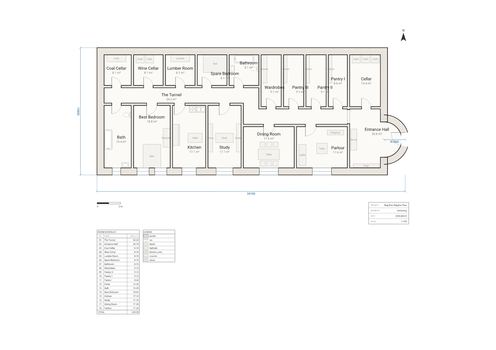

# Windows on one side only — because the roof is a hill

**Bag End, Bagshot Row, Hobbiton. Tolkien's opening page, type-checked.**



## The first page of The Hobbit is a specification

Most fiction describes a house. The second page of *The Hobbit* **specifies** one, in the flat
declarative voice of a design brief, and it is unusually complete:

> "The door opened on to a tube-shaped hall like a tunnel… The tunnel wound on and on, going
> fairly but not quite straight into the side of the hill… and many little round doors opened out
> of it, first on one side and then on another. No going upstairs for the hobbit: bedrooms,
> bathrooms, cellars, pantries (lots of these), wardrobes (he had whole rooms devoted to clothes),
> kitchens, dining-rooms, all were on the same floor, and indeed on the same passage. The best
> rooms were all on the left-hand side (going in), for these were the only ones to have windows,
> deep-set round windows looking over his garden, and meadows beyond, sloping down to the river."

Every clause in that paragraph is a constraint a compiler can check, and the last one is the
interesting one. It does not say the best rooms *happen* to have the windows. It gives the
**reason**: they are *the only ones that can*. A hobbit-hole is excavated, so it has exactly one
face that meets daylight. Which side that is falls out of the geometry — you enter through the
round door in the east, so your left hand points south, and south is the garden. Everything on
your right is under The Hill.

So this plan asserts none of that. It draws the hole and lets `arch describe` report it back:

| What the book says | What the compiler derives |
| --- | --- |
| "all were on the same passage" | 15 of the 17 doors have `r_tunnel` on one side. The other two are the front door and the cellar door off the hall. |
| "one hallway, not quite straight" | One room, `r_tunnel`, 34.2 m², adjacent to 16 of the other 17 rooms. It is a single `room polygon` with a turn in it, not two corridors meeting. |
| "the only ones to have windows" | All seven windows report `"facing": "S"`. Not one of them was told which way it points. |
| "no going upstairs" | No `level` blocks, no `stair`. 18 rooms, 249.39 m², one storey. |

There are **40.8 m of exterior wall on this drawing with no opening of any kind in it** — the 24 m
hill wall to the north, the 10.2 m west end, and the two east stubs. All seven windows are on
`w_garden`, and the only exterior door is the round one. That is not a stylistic choice made in
the drawing; it is what "in a hole in the ground" costs.

## The round door is a real arc

The front door needed a round doorway to sit in, so the east end of the porch is one `arc` clause —
a true semicircle of R1800 walked from the wall's north point to its south point:

```arch
wall id=w_porch exterior thickness 600 { (24000,5700) arc (24000,9300) radius 1800 cw }
door id=d_front on w_porch at 50% width 1200 swing into r_hall
```

Grep the rendered `plan.svg` and you will find `A 1500 1500` and `A 2100 2100` — the inner and
outer faces of that wall at R1800 ∓ half its 600 mm thickness. They are native SVG arc commands, so
the doorway stays round at any zoom. And `at 50%` walks the wall by **arc length**, not by chord,
which is how the brass knob ends up "in the exact middle" at the true apex rather than 900 mm off
it.

Every other door on the sheet is round too — the plan cut is taken at about waist height, so what a
floor plan can show is the opening and the leaf. The circle is what a section would show.

## Then we ran the linter on it

This is the punchline, and it is not staged. `arch lint` checks a plan for architectural
soundness — unreachable rooms, blocked doorways, doors swinging into furniture, bedrooms without
daylight. Bag End comes back with **exactly one** complaint, verbatim from `lint.txt`:

```
warning[W_BEDROOM_NO_WINDOW]: Bedroom "Spare Bedroom" has no window.
    --> 105:3
    |
105 |   room id=r_spare    at (8100,0)  size 2700x3000 label "Spare Bedroom" uses bedroom
    |   ^^^^^^^^^^^^^^^^^^^^^^^^^^^^^^^^^^^^^^^^^^^^^^^^^^^^^^^^^^^^^^^^^^^^^^^^^^^^^^^^^
    = help: Add a `window` on an exterior wall of this room.
```

The linter has found the guest room, and it is right: nobody has ever put a window in it. It is
right for the same reason the book is — *"the best rooms were all on the left-hand side (going in),
for these were the only ones to have windows."* The spare bedroom is on the **right**, and the only
exterior wall it touches is the one with a hill behind it. Bilbo did not run out of glass; he ran
out of outside.

It gets better if you ask for the fix. `arch suggest` returns machine-applicable topology as data —
a real `window` statement you can paste in — and here is what it proposes:

```
W_BEDROOM_NO_WINDOW: Bedroom "Spare Bedroom" has no window.
  window on w_hill at 39.375% width 1200
    → A window on exterior wall "w_hill" gives "Spare Bedroom" natural light and egress.
```

`w_hill` is the north wall. The one made of hill. The tool has correctly identified the only
exterior wall that room touches, correctly computed that a 1200 mm window fits 39.375% of the way
along it, and correctly observed that this would give the guest room **egress** — out through
several metres of packed earth, into the middle of The Hill, somewhere under Bilbo's own front
lawn.

It is the right answer to the question asked. It is just that the question has no right answer,
which is the whole point of the building.

So this plan does not pass the ship gate, on purpose:

```console
$ npx arch validate plans/bag-end/plan.arch --strict --json
{ "ok": false, "strict": true, ... }
$ echo $?
2
```

`--strict` fails on warnings as well as errors. Bag End exits 2 and always will, because the one
thing it is warned about is the one thing the author of the brief specified.

## Honesty notes

The single warning quoted above is real output, captured verbatim in `lint.txt` and `lint.json`;
the suggestion is in `suggest.txt`. Nothing was invented, edited, or engineered by planting a
fault. The plan compiles with **zero errors**, and every other class of lint warning — unreachable
rooms, blocked doorways, obstructed swings, fixtures through walls, fixtures with their backs to
the room — was chased down and fixed. What is left is what the story requires.

The layout is a reconstruction from the book's text plus long-standing fan consensus, drawn at
plausible domestic dimensions. It is recognisable, not canonical: Tolkien names the rooms and their
sides, never their sizes, so the 26.1 × 10.8 m footprint (the two overall dimensions on the sheet),
the 1500 mm passage and the 600 mm earth walls are ours. Room *count* on the right-hand side is a judgement call in the same spirit as
"pantries (lots of these)" — there are three, plus a cellar, a wine cellar, a coal cellar, a lumber
room and a room of wardrobes.

Deliberately simplified: the passage is drawn with one clean turn rather than a true meander,
because "not quite straight" has to become a number somewhere; the garden, the gate and Bagshot Row
below are outside the frame; and the hill itself is drawn only as the thickness of the walls it
presses on.

**Fan art — an original drawing derived from the book's text; not affiliated with the Tolkien
Estate.**

## Reproduce

From the repo root:

```bash
npm install

npx arch compile  plans/bag-end/plan.arch --json          # exit 0, zero errors
npx arch lint     plans/bag-end/plan.arch                 # the one warning above
npx arch lint     plans/bag-end/plan.arch --json          # …as data, with its fix
npx arch suggest  plans/bag-end/plan.arch                 # the window into the hill
npx arch validate plans/bag-end/plan.arch --strict --json # exit 2, on purpose
npx arch describe plans/bag-end/plan.arch --json --select site,totals

node scripts/render.mjs    bag-end                        # → plan.svg + plan.png
node scripts/permalink.mjs bag-end                        # → the playground link below
```

`lint.txt`, `lint.json` and `suggest.txt` in this directory are the captured output of those
commands.

To check the claim that every window faces the garden without taking our word for it:

```bash
npx arch describe plans/bag-end/plan.arch --json --select windows
```

Seven windows, seven `"facing": "S"`. The `site { street east hemisphere north }` block names the
compass for the drawing but draws nothing — it is what lets `describe` say "south" instead of
"down".

## Open it in the playground

Edit the plan live — move the turn in the tunnel, or try putting a window in the hill:

[Edit this plan live →](https://playground.archlang.uk/#z=rVvrjts4sv7fT1Fw42DTe9yGL-2-LbJAMsnuZDfIDJLGWZxf3bREW5ymSS1JtdozCJCH2GeYB8uTLKqKlCVbfQkm-eGWbNWnYt2ryBzCa7GCtyYf4oUvbICPth7Cj3axUMEa-PrlPyCgoNvjwmoJlcmlg6tCwo9K69HB4cEh_E0YEC5cgjBgnVopIzTkTtTKrCCXTt3JHJbOriEUEmwpDf5QipUEu2QsesPo4BA-2ABiuVRaiSBzqFUoiOrK6lslDbz1QQTJ70XKhbW3f_KwVM4HhlQeBPhSZmqpMhGUNUPwFkKh8DEtITgpggcVQHiwRl4SGMDg65ffBdxJt4HMrpfWBbHAxytjpCZObBXAr-2t_Prld3p7-s1WJgdrQNCfIcHByuIyl0I5vYFFFcDYAP-uVJDggxNqVQRQJlhan1c5SQOvC6U1vgHR1sJsGE6rELQER-_KrXWeRClzQLbsElQYRjlYg-tiTAQJhcRvGEcYGwrpRvDBRhar0gehnIeldcwAqYNY0Bpq6SRCEptiLWGprXXDhJaDMrmUeeeRUngvVnLEOpI-gLN27RkLQePDWi7DcSFMzmjE8QvmSpmjYeLIS6Yk-zF6g8vzECwU4k5CrUxuaz-EXMry2MvAYCyp-CNoa28R1t5JB2gLK-Fyab5--X1A-v9kL-GnD28T5_DCXUftshN4ZVZaQmn1ZmUNLYetEyXtpNAQKmdAGdTDwSEM9rU9OBqCscDCHiYdLpewsKGgtfukRxSrRFM8OIQbXsINYqMAyIi9Cmi8xHKNAkUu62te1Aj-31ZoxJJpnK1W5EYHhy37SXhS-EAusrGVI40AagRKq0zw4G0Vikv-g86FJPwaXCZ_vZIh_qCF9y32Q4EyN9ahoNi6k4CVj8EkmfzWqbUyQTp8AoUo_K3MUdmiLJ29i26i_AjeBfL29LuTIm-kx6uthaNgowI4iQryaQm0OpKal_zGUbgPo4NSCwODJi6mUDiA3w4AKoNiX68PAFZO5TAfHwCUopQOXs1AC5P7TJTyAMBnQkuYXE7G-AgLoCoPAHK19iCqYMkShdb4MFrJb2gnUgbSBxRyrXxZoNEz8WcCLWReURCwa38AoOVKmvzgAEBk2ZXC-JBYfzJ2D5jqjfSZg8GraODHPlgnN5DXUmuUnLzPxB3FYopVglSFtjqCnwz7Hj7GvnJcCK1rsQFXGc8LCRZq9H-K_yKa39JZE8gI_xIDA4ayXl8YwVsKyewEqL0UZ8jyXrApHpETDGEhM1F5DhQktyG_nUKp9SEZIbGWDFJT_pKwqJyidW5NcoCyPYTjP_iPGS4kaRuTXJezF8ia3hwxW8iKFA6d7nQ8hvU6CeIqctU4BoEtRSZyOUQTp9RH0WCD_i8MPpVVgexAYzAYHQA_oPKX9TWBAcj7IJ2iSKuyWyO9pxf_Bi_Gw_ERvJiejMd09blDTew_TT0eTsbT8R416-1R6kgX39-LggK7fgyl4T1ezc8eAPFPglzM-rghHaBmdi0bjJS5b0wev0LPCBbdHVUBV5iGyKAl3AiX3RBWptGCL0FAcJUEL9cqUy7TFPc-Ts7HYwwUVXaLjhC5OZuPx0dDXBKGQjJ8wuIgd_zX6Cx0O4SbrL6BRaVX5LgUC11WUBkRbC1c3orxsKJyC8HeYQzFEIIhFwQYEdSdhE__93cQLotFlmwWqnxcuUAj38Cv1q675sevfVLurDLhsq4inMhV5YEEktVJE9_BT2OCIrjBM4q40aBdCyoPk_l4DLVCp0TvLoRe1mJDeEJbzkY-yDIyv17HEJ8StQBfWBf422NWHeaGkBUpTxMYFT9YP2LhEWqV0R0aAWCa0tKsQjGCtyLjiIq8deoFQeWMVoYX2xTbrUqG1htqgtUe1lIGFAjqFDLrjHRdnYbKXBsohQsKS--WTqfJrWdj8qPJbD7euTk5b3kY33zeQ_ePo5_MGXBKGO2b0-i_k-1Ny31TWZJbydHVq3WpN5Ar762-k9tSvUjiIzUKF3wUh_AyZy27rKjFZgh1oTIqmupCBFiLW-m3EIKLyFisJPsR8aIrVkGe8sjCeVVJgPtL_HZXaF7mhykzohElth7j5YxDbrxiFX9-BuH8JBHS1fMJzyeJkK52CEmCCxEKt76uH4OZjM9jsuCrR3DkozhkzbtG_pyFTJII4tWOEzxGeTZLlHT1DZQX00RJV8-nZDvbWlyi_A4WF7NP2-Ia8T8ufLK56Ph03Vs43KpwXT_qUaetAHLaV4A8QnuxpY0330DciVZ88y3Up_MWNd18A3U7csSbbqXzzVrt0XPqXrqBVwUv9fISaqdCkAZrDOrHueGmxHeTY7OiFhKOj3_x1tyAk6V11AnLmBK5_2g6c-Gk4N64E4pDHB1BQoxNK_0oqCUgPJxiESuYAjPrnMqxaU9psLaVxnorYLSmaK7yl83gILJ-gMOIZ-W9rRMxTUcbPWYRrTNeEI0WC6lhgIK9Ii4GmJzYgGdn8_ERVF56wIqy0jQdI5lt86A0wQmTcY4abks4rCioPZEkpjSNadW72JFfFayHrHI49HOVQZEvRSaxgyziJKmsXGm5xqVZEjcujaYR91-v3r8HxVZC2RFrYSozm3xZWxArJ7noUThpAAFrpbVay0B988LmG2yDSI1dFVEG7iiom0FP9m64DH0xnWN0PZ3OGyXNz1MFnn49J0E_0jZ0XKutt7dJ-j8KrQesK9TIZut94LDopKEZV3VpXHbZ18DilC-OwLiTHhFIRxaZFdgGAlkK51Gaxf0qAQPoPdpqYvAHfPYHqbVwAwBmEEcGXDBvMWtlZIPZFAT9mP_CZ5-Bqav1QrqI2dQK_Zjv-dmP1q4fxfQlttsRsykj-jE_0bOvZe4IlTAXfNfBpBKBSrvQqin6MV_HZwckrIgpqH1rCVO43NmFZMBUXBDg5GI8vkc7bYQZn_WDLWDfwkuBZjXjhTdlRz_mz_QsvHv3bvAMzGnETAXJE5jP4nMSMVOpwpjnD2C2hdmHmZGtJeNMRQxhom46mFu73Mfc-mQzx951yda0lOOaCNJxEMMI1MxM970SrWDrlLGY6PglRqS2HTVMPmBGC5nTKL5xyQjKC5_tIuKjTxv7rQoZbi80WaYDOt4B_Sc_3VZQBOh6ZajyTVz7xZOgn_DprobscqmyrtJzRZNgtqNWLiVMxL-fXWwx3_DTMX4QJgPsGKfTODQnzFbh1Y_5Mz_dXrxWd4j5h0orMqLWthCB8dCU8jLXeb7ZkWsGM8qA1PKOqgCeLtIoFAeGOCQXt6RWHg0IRUNpTD1UisVCidM3kwmDc4s6DdjTPl_K11qK5V-afB5HWqkeE-BlRtUIl1QIxCx1CgwuOcTaVjw1-_rlP4ToC1bXRmpta1g49KhbYxfNHse9yAKsVZ5ryaMPE8uRgK9XHubj_-HpDHfwhgZOPFTm0pG4tutSaeloyOJhsYFXH3-A928__P3qRxLLYPdlAy6H7BqNsiLf25YzpbwHJ3A3Dtkw6cfIZhxPZ4V1ORYvLIP8ZX7NMkFhxRmaCMR_rfJQABo3eFY1ziy42GEbwy3OqI84pGjPHhZypQxNM1BEqDAtcTvHW5x1_GLxx1h6sdhLkUmfZCyyDDuJlRNl0WyXCoKhqWfkCAQPyNbrZpfwABprUflLy9MOWp6Iq8sk7QhtF8jLwQ2D1shuuFcbNXuJtAitPJah7X2Jo45gm8RAL-dZlggwPZnxRC8UcL4rXKbpwDQ5awcGk-BDMJGmB2e6hzMez5_AmfbgzHZxJueTp3BmHZymDtnBwWr4IZxE0wFqKqQdoMnZwwJKNB2gpnzrAmHOgIeAiKaD0hSWXZTTs_nDKEzTFU-qebswJ-NHYGoevrZMMBXjO6KZPQKCNA84xE5hst1b3zEQzmPbl1IUmFycNvq42DcQoungpBy7i3O6Ndg9nCattrQa0_8uzHj-MDtE00FJlckOyunZ1jb2ULbFSMtYY9m0g3PS0sgeTqTZM3roWdVjmqUa7o8PXsgmYhtIaG_iSQnKg1QNDLsnJFo7QClhrKWgkxQLubH4vNe2VDFf5rY2EOfjeN6HjpcEycldefjw0xWlWyqIneQdzO3JBjrUs5aU1LjeoL3JIfAuI_6NO33WpWvf2e1NmHzgIG4RLykuH7YO11g8SUI7GbiXw6cOoNlbzl_WyjR6IjUlGXT1dEa7-jtkMr8W-2Sz0625YafRS7fYp5tPnqBL5r1Dh4MIaCfKXbrkXLvLaznX5KSHLvn2Lt3JNvhPTnvoUmzZpcMhSZvu-4wXYalCSFb5tj3Lau14pQM8ac_S05wQy9hM5iAW3uoqSL1B21hWzqhQoX3lL5fXpVx5AP7k7hE754v5vOnwp9zhN0W_XGErrkyqw_YgF9JkBfAnQ2KTe3raNBLYR0xaLelrfHTQgqTFxu7iMp4RcpKWAwuR3WKxnDavcMvf894kVn_NsTzqQnsWXNBRBIh_6J1N12OwNoVgy2OquwBgqSuPT2FoQSFwn36CPfWW_78l5gb7r_OSTrnFP32vW9gQ7PqYzim1XzdNrzvdEdcnwup5VxkP-NFn911cb9KW168Sw_t9q4-7QoJ4MiT2iWhNtGVPWHhqTdCYfRMPK7kgpYG8Fu4OR82lruiohvpVcG2_w1ne5oyHPrP5eHi-bS5p9rHHEy-iyajIh8LvxqPRjA4wtd-UFUK57UgJ_hcU_Bnm8_EQzs7aXez9yXy8g_xMnIvZEzhxV4E6-D45SH8LAPyHKDl6ddWD7cR9S-FvpL_tUTfO-_2EjuEs22DRrsigokUxx-Px_bRltq-R_iHc6YO47BpP45Ig4nyEYhXlUmFWzRlOPKJ1CyscewtlfNzF4JkvJbXmDIZtdvQpEvsgNmxveDuCmwSAVDfxiK7no1el9bw39OrDG3A20HSADxqlUNHuiqmB34DBbpwbVo_R5x7Fg6Pr3ENV4gYAn8Lr0bEPeKaPP-O_NntNqeTliiqEMRa56PBnqHKS97Zq28VGgaUJE989D_t8_iR27rDbzWxFnWkf37zHGBGnp004RNc9fRL_th0D2o_2GdZuxJ12PaIdsWiuFyd5PepYyByAPuidzcywHXzb1kzON21PtGXe4yTUNtJHH2xMHy1YCuJUOu3MtdMqxPbwH-WzI_KSNE6HF02iO-pZZKgWEwCakIZqsau3eLAtmdm8kSoOXc-S4uJ4dQe5zhAY6qzXIuLudUTG8P0Y1kJ4ZSZAf_ax4tqTeU06fPUuefrwkuNJwGbRkymOBh5YdezC-7idPsRtc_wivWDeWXw_ZJ1NnxAmncR4BJKzCw0JoslfQln5Ih1njV1CPMrUPT9KB83T4FFob5vhJf3CnUacfZHN0ShR41FoPO-m4wF_OhzEfca-q03J1ThpEJd7NVXLJ9DL7mmVbVeLxZ8JTmFp0cxouMDl6ZQfxc0RJT280Db4JlgfjfqqsOK67GTK7S7Mlr9WBZbm8p289qmQ-k72ZUyEn-7DT78j_Gwffvad4EsK_PxJ8NvtuYfh5zvwPyN5LzwOlgCyAoMQwW-3PRt49od2FD6NOaWz_dmDzuOlBbkooW83f5-PjpvAZHhPFJjC38aOZtbUhbgbCtuyMAWXhCz8baxim7nq550XTR9-Ee2sfuN74gSOKtFAR-gZ_rD1vwB6_3fUgCYldNIdQ8DPH3_6x9sfriATJdVPHBkiFAMvtM2IUfp_AU2Rx1_TGYiluscDvKxxu0QjlqF1qMHHLQ-aanD4EjlXIsqDL7XC3B5q7Daas-0G_0eOWGCBlbY9RoRROvuLzEL_Qgf0CB2AuV5sYPDKZcV7YVbxexEkDKbj6enx-Px4Oh-QCD8f_Bc)

The link carries the entire source in its fragment, so nothing is stored anywhere.
