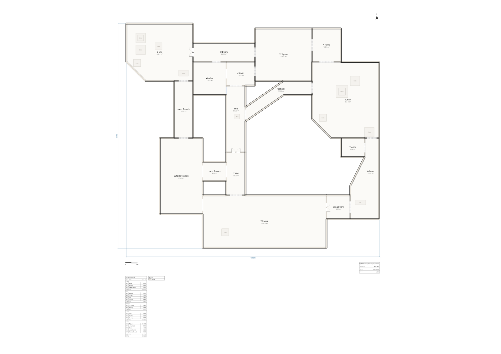

# We ran a building-code linter on de_dust2



Every drawing in this repo is compiled, not drawn. So we typed out the most-played competitive
map in the world as if it were a building — 106 × 94 m, walls with real thicknesses, doors with
swings, a room schedule, a title block — and then did the thing you do to a building and not to a
map: we ran `arch lint` on it, which checks a plan for architectural soundness.

It had three complaints. The first one is the whole joke.

## What the linter actually said

Every line below is verbatim from `lint.txt`, which is `arch lint plans/dust2/plan.arch` with
nothing edited out.

> `warning[W_NO_ENTRANCE]: The plan has no exterior door or opening — there is no way into the building.`

The building has no front door. Not a locked one, not a fire exit, not a service hatch — nothing.
There are 793 m of exterior wall on this drawing and not one opening in any of it, because both
teams begin the round already inside, and nobody has ever needed to arrive. A quarter of a century
of continuous occupancy, achieved entirely by spawning. As an architectural fact this outranks
everything else on the sheet: the building fails at the first question a plan is asked.

> `warning[W_FURNITURE_OVERLAP]: Furniture "Crate" overlaps "Crate".`
> `    --> 233:3`
> `233 |   furniture id=c_b1b crate at (10800,8800)   size 2400x2400 label "Crate" in r_b_site`

> `warning[W_FURNITURE_OVERLAP]: Furniture "Crate" overlaps "Crate".`
> `    --> 240:3`
> `240 |   furniture id=c_a1b crate at (95000,31000)  size 3000x3000 label "Crate" in r_a_site`

The linter has found the stacks — one at B, one at A — and it is not wrong. A floor plan is a
horizontal cut through a building at about waist height, and a stack of boxes is two boxes in the
same place on that cut. There is no way to draw a stacked crate in plan that a 2D checker will
accept, which is a polite way of saying that de_dust2 is not a single-storey building and the
drawing knows it. The suggested fix — *"Move or resize one so they no longer intersect; leave a
walkway between them"* — would, if followed, delete the boost.

That is the entire list. Three warnings, one of them fatal to the concept of a building.

## The bit where the tool offers to fix it

`arch suggest` turns a diagnostic into statements you can paste. Asked where de_dust2's front door
should go, it produced three candidates, ranked, with reasons:

```text
W_NO_ENTRANCE: The building has no entrance — no exterior door or opening lets anyone in.
  door on w_t_s at 50% width 900
    → A door on exterior wall "w_t_s" opens "T Spawn" to the outside as the building's entrance.
  door on w_ot_w at 50% width 900
    → A door on exterior wall "w_ot_w" opens "Outside Tunnels" to the outside as the building's entrance.
  door on w_bd_n at 50% width 900
    → A door on exterior wall "w_bd_n" opens "B Doors" to the outside as the building's entrance.
```

A 900 mm door in the middle of the south wall of T spawn. We have not added it to the drawing —
though we did paste it into a scratch copy once, for the measurements below.

## What it did *not* complain about

This is the part that surprised us, and it is worth saying plainly rather than hiding: **de_dust2
passes almost every check a floor plan is put through.** We went looking for more jokes and the map
kept refusing to provide them.

Two of those checks — how narrow the walk gets, and how far it wanders — are measured *from an
entrance*, and a building with no entrance has nothing to measure them from. So we ran a second
pass on a copy of the source with one door cut into T spawn's south wall, on the wall and at the
position `arch suggest` named (`w_t_s`, at 50%) but 4 m wide rather than 900 mm, so that the door
we invented would not itself be the tightest thing on every walk. That copy is not the drawing in
this directory; every number in the four bullets below comes from it, and nothing else here does.

- **Everything is reachable.** All seventeen spaces come back measured, and the linter reports no
  `W_ROOM_UNREACHABLE` and no `W_ROOM_DISCONNECTED`. Once a door exists, the two warnings left in
  the entire building are the crate stacks.
- **Nothing pinches.** The tightest point on any walk is 1,540 mm — the clear width between the
  leaves of the three double doors, which is the narrowest thing in the map by design. Eleven rooms
  are reached through one of them; the other six never narrow below 3,940 mm. The rule fires below
  700 mm.
- **Nothing wanders.** The worst detour in the building is A site, at 1.7× the straight-line
  distance. `W_CIRCUITOUS_PATH` fires at 3×. For a plan whose entire purpose is to make two groups
  of people take different routes to the same two rooms, that is a startlingly efficient one. The
  longest single walk is 134 m, to the A ramp.
- **The accessibility profile changes nothing.** `--profile accessibility-advisory` raises the
  minimum door width, the landing depths, the swing clearances and the passage width; run against
  the real drawing it returns the same three warnings and not one more.

`arch validate --strict` on the drawing in this directory still exits 2, because under `--strict` a
warning is a failure. So it does not ship. But it fails on *"there is no door"*, not on anything a
level designer got wrong.

## Facts the drawing knows about itself

From `arch describe --json`, which reports semantics rather than pixels:

| Fact | Value |
| ---- | ----- |
| Sheet | A1 landscape at 1:250, 106 × 94 m over the outer faces |
| Rooms | 17, in 5 zones (T side, mid, A side, B side, CT side) |
| Floor area | 5,756 m² — T side 2,044 · A side 1,268 · B side 1,040 · mid 708 · CT side 696 |
| Doors | 6 — three pairs of double doors: mid, long and B |
| Cased openings | 18 |
| Windows | **1** |
| Exterior entrances | 0 |

One window. In 5,756 m². It is the one in the window room, looking down mid, and it is the only
piece of glazing on the site. Everything else — both bomb sites, both spawns, every corridor — is
interior space with no daylight and no view out, because there is no out.

The Pit, 80 m², has exactly one connector: a 4 m opening onto long. It borders A site along its
whole north wall and that wall is solid, because the way down from A into the pit is a drop and a
drop is not a doorway.

## Honesty notes

Every diagnostic quoted above is real output, captured verbatim in `lint.txt` and `lint.json`. None
was invented, edited, or engineered by planting a fault: the two crate overlaps are what stacked
crates do to a horizontal cut, and the missing entrance is what the map's exterior actually is. We
drew the plan first and read the warnings afterwards.

The layout is the canonical radar geometry, redrawn at plausible building dimensions and simplified
where a callout would only add noise. It is recognisable, not measured. Angled walls are used where
they are iconic — the catwalk diagonal, long's dogleg, the cut corners of both bomb sites — and not
elsewhere.

**Fan art — an original drawing of a game map's layout; not affiliated with Valve.**

## Reproduce

From the repo root:

```bash
npm install

npx arch compile plans/dust2/plan.arch --json     # exit 0, zero errors
npx arch lint    plans/dust2/plan.arch            # the three warnings above
npx arch lint    plans/dust2/plan.arch --json     # …as data, each with a fix
npx arch suggest plans/dust2/plan.arch            # where it thinks the front door goes
npx arch describe plans/dust2/plan.arch --json    # rooms, zones, areas, adjacency

node scripts/render.mjs dust2                     # → plan.svg + plan.png
node scripts/permalink.mjs dust2                  # → the playground link below
```

`lint.txt` and `lint.json` in this directory are the captured output of the two `lint` commands.

For the second pass described above, copy `plan.arch`, add one line beside the other doors —

```arch
door id=d_front on w_t_s at 50% width 4000
```

— and run `npx arch describe <copy>.arch --json --select circulation` and
`npx arch lint <copy>.arch`. That is where the 1,540 mm, the 1.7× and the 134 m come from.

## Open it

Edit the source live in the playground, walls and all:

<https://playground.archlang.uk/#z=tVvdbts4Fr73Uxw4WLQLOFn_Jk4HvUjT7qDYzmTQZnf2zqEl2uJUJgWSquIOBtiH2HfZ-32UfZLFISlZlCXR6WR8EZiOzsfD88fDw6MziOkqzpWejiCWpOBAFBBY5yyNGd8C4TGofL1jWtMYNkIC4yqjkWaCXwzOBmdwn1CICBecRSQFSWIiISV7kesRKKpB5BqIBgJZSnLF1imFyfgSHuF6DjuDryUliE4UsA0wPTiDgkoKhIOQMeNE7kExvk3pudJC0j0oLfNI55K-gjegmKagRXae0o0ewe09qAwXgj9FlGtJR4MzuLHPSbZN9Ah2LAaZc45LzDPQCcWf4pSOoCQnkRRKmX-thdZiNwKdc05TBbEo-ODM_AvnNItIBd_CTQlmpjlP8B803tJSUpJSiBLxmWaCca2ASAop01SSFGKRo2xiIaQawZpGJFcUBLfMEYO7L59O90j7anAGP7x_C2_v7j5-GsGHux-_t98NR2_s9wt494XKvU5wrTRVFBhqOKVkc55SpeBBZBQF8QD_-9e_gQzOICKKxqATSVUiUvxGNCjN0hQikRvGESISnFtLAGbZJFGEiFtJsmQERcKiBGcrEoJK3ZHPVMEDkVECKeP64YUCSUmUkDVLmd4D4aqgUsGOEg6EW56d7AoBieBUaYjELpNixxRFOQmdgNi4uYxGGNdUwlZQZaQngAvNIiMsgP_-x1oit1JIhGRfBdckhcgYrAACn-5vbv-GoJEkmip8UheiGnEQnCJGRL8rMXFi-qipZEKCSmiaQkIUcGH0iTRMH5RaatQ-wp15_BUXLfUF3KDdsy3jaBWSFKg4sQECW7IzhC-U87DvcG1ANhuWMuNCBdMJ_IOkX-jFwKxyWLr3EH4dAOScaQW73QBgK1kMk_F4AJCRjEq4mUBKeKwiktEBgIoIuuqr6QIf4ULqBPJsABCznQKSawHii7FF83BC4zylIIXYqQFASreUx4MBwBm8fq6PQfv55sOHT8-Ma-DOz8_PXTh5ZVSE30aAAjNOaWNVQl0YgJ3IdWKomp8BQEHSFFj8ulitVxzwU5kH6IRFnzk6yuV4DL_Cy8vxeDyaj8fjP8PL2fww-K0BVDwFyHyfjluBYka2YSBH_HJiWJouW6FUiCeP-uX0sgdL5yiqjEjNTFQ5YM0tlkftRNWBRY3Ye_iqC9oNJtM2KKv8PrY86pKtUvLGtu44xf0GFJVfqDKhFcMA41tlba1gPBaFcZ8XCgqMc4rFdOQMEj1eFFQCJUobRPvf0iTxZ8uz2NRt1ETujChFFaxpwnhsIuaFt0KVMU5XRVhYpUHY0WJaX6HxnsPMqtUxTvl4rOmcG6vvYc23CTtatCkSsdQp9rWYnrDM2_tzLc7fQCSkZLGQT11vw8ZskAhqoLQx5LPTXq1PBu211OZ82R0p4pWa9mN51I6vLiwa4MtbVRPLF3_NX77J0gzae62s56Az4TavspRpk8wUApOHLJeZUG47yDPcJdGLmU0LMTAUZA-Ma2HwtMgwjRzZPMT4Kz4eESkZtTSCp3vIGI0oeuo2JV9xd3fpU5l1--5ZML6K9BOUYEezNiUgFua-QayZj9W2HyGWOsVoHXUT66BQ5OhblNjpT5FeRTqwTs-8ylHbXmKQ0HYD--UhCNlRqwIsWP924mtgcRkCm_Zx5pH3cYZQRSAIeRp0o0WbzIzEMKadzJkbXbctk2hjtH0y88jdaL7o5EydwJkjd6OuZdrsIKhNR94EO_hAdWwtt3RJdpk5aeIR5uYk_2j6wEmJ53h0aVlbzg-Dpp2tilA65UH1bE-RDqeMvjctu9O8SK9ICGzpbXY9YAQlji7Qo8y6jHzkNqx--_ewri-7hG-h-sNPndoNetjqjz6-vBpgB3uNiC5I-tlujXieEHhc3UixM-Ec6yBotioRUncZ75GX80Cu53v51bTbMIgOZhueKbhR60aHYOokKysjo-WsGyywTI-8GcwOKnAlrefbNomLGGFTq46Gk2m3sVkN9B8OPfpy2Jq-E3f8PV0LdjRv0wJxR-AwmCN_ed3HmQqLrU7uhNgKljEdPAt45C8n4240sjJ1yV4_8OmPdODn3Rnr9OZT7c3m3bagZDlVoETKYncSJnu77ZlY4mzcFOtiKbKRrXiVuffFkexCKYwvu0PgbFVEyOs98lKQnWihgNRURAPuoAhXa34-x0dAE3z7XHXcWKzZpK_arM7ABWKcT18N23bA1J0c-2VXpy-Hy1Y45I6eFJcaPtENFzgH-ewcwTU0a1PKZ9JsfEpMb5NdlypOiHX-YgOqCCbQPnfX4w7RlfnzszmFXvFgNJkt67zNl52CK4994ZNCCWa3_XawFbceEUyVfKl1gIW3aV-jdnTdlnfpE8zDysyR94OFd3wLtizLuEsPrG4cmJSWRytbmnEl0m80DlcTCKvAP_l1GweesIJH7xLMji7bg28R3Gk88tLu2rYtx5kKc3Y1DvoAchYsc7Zw1rnM0PY8a-OsbZkIVoSKph5nMx_sYGki16aa-HvK4B5vooxDfTXwcX236qmBizJ0BIt2C2-hXWDBG6kGZ-Oatx6BBesCHrnv-kdg4fuf5fEyWy3NgO2eYmmzbh8QeqVDuYy_qTSW-QfcqH68u_vhk7n830qRZzSG9d5dgMZ4ib6pLqyzlOzxgp5EOjdNCJzs6PPfxX7FC_Y1DN_AJxZTe3MNttbP4tcSbx3xUACZSPdbwbsvUP0rwsZVZO0gO7D7TErWNLXTajrErhVnchOrixyv0RJ74-3z4y6IdeOeRrGvFIw7PuKktRneIsHQTmtxIyajPCVoEg34PLMXo4af-m2Xgcevj9N5Hf7v5qbi3kagYRv8b5WYcV8c_sDiYym7K5baqtwx3UxrZPlo_pbT_mwIWuer40aumou43sWFxZ0a3HEN9_YeDIMBXAMKddzZuCkmTwsGNCx-V-k6WFtPFaqvqNRT1vHt79ZOaA3wamKIJovKALs0GWkjqnaXiXQlm3ql1hqoUeV06ov8E2bTTujYRbVvIJKVqVAjYr2SWVdi3Thu4CPZZcN2cR8WQfDJ9iUQ6_WVGvxCZW8lqVF-qVd2fNHf1Fz_-tpIvt_1sR7i5OpVFqwYxpXnO3xslvuJaSdW7GYjW9qALCs25Tqbh8fmwbmtBtFezPEPns2VfxB8a1c-GS8XiFlbepe-NAy7TE6v3IWGbmxpRjaGJd_oKpuDelxss73UeroV-7gJbcXuhRBcmxdzAz7vQlQtliyaIXfixRIXosDnvXuCVBQmqB-Ec9luOIcVFPWYHpxA5LqawEvC7ARmCbO69O9c4hrcNp47_bj76d2P73_8_o_r6TJdKabjRlFt8hlJTcPlE8osBu0dsf2MBDLCJAKllGA_z45Sbbr0uCthpukLBbb51HZVwpbynHFab_McGVBbzyxQ9LbJ9QIesDGIAqdEgtJE6gf4CzyYIeXxAySEb7FzAfsoKdngtNilhkXTX8hujUVR23YYv47NhWcK-EztvhLNAndHnFcngPkNNCcFVdjeBC3A7K5HsLINdtENSzn6VC-sqaalFvZQHSIa5k_iNm1BlS2ol09itoG6Rrk6EZRdYt8gWZvNNpBlO_LThOuQjZndJ9hSzRTENGVrir2smL8L2IgcK_GK6gvTy91oYxWbqkO83tJqME1bKzbqFgj-yjbjakp22Gy2dU0tUuQ8BpJKSmLslfEb10w_DJb8dWIPElXnOVNAv2DHG7bz0hjH672t8bmWGaYv4K3rjyXcbBSERxQMN-WZxYCWjbZl5w5-NVLQODFTtiNY0o2JeVqAJp_pRS2E0LYW6mabdDiEuE5rVLKo-h2dmsuR0fKfnJLR6pt0ZR-bpatGQbp1jCn9wazceZtouKroZotWOps9lnQUTpqv7FuydNUoSFe1yBi6auTRLVrpXNOPo3Oj8Hxle4mlI4fjST8dWdnL7QMdPUkuVZ-BoatGwfVVl_c1uqZcLlv5dBmlpStHQT5dauvoqgusIF0auylsuG21l7b1lTmXs-uyYB6kqwqeLrwXLXx20RUeXXESXVXCMXTV6JiutWPxW-qBhwwE-4gzwukFvHepRiLSRuOgnQerTa7Zr_K_I3eYVWw-X96FaLcfb-7fPXdCh2g3J7-7sRaPh1c33MCKTOFbFOb1jQuD-QZ3rbXYrc1Vs30pBwVqX10SG9yzo8-q3LNwC3WbTozvmGD-lkmq8XUHhBM6obJgyiZ-tXdg9vXXU3BHUmJH7Z6iBSiyB7LGGXVCd2bv2eSSM3zLCZUZrdYTsO-guDOaOcmZlB5sUm-O8fUz9y0-PcR117KMI9S1h7pE1GUNFasDpr70JNTpMa-TmWX2d_A681CXtUqbRZ2ZU81TUed11KmtSM0WDV6niyeiLuqoppQwua5r6xRej2GJZwTX81qZy52rEXbRAUs6mCWeEVwvbMnpVMF2oh4bwXg0rR3Ue42gE9UzguWVKeWcbASdqHOfV1ucu1o8iddj2Me1eKzhLrCM53NryyA13H-uxaODtYejBqSeQJ3VueH0enyqAFxV5hg3IhLA_HEiMKWiq1rZA2uVHqu3RDpU3PBx-ZrplLpKUCbFLxSLktX5AQMivr1H8ebjC61eEyXKBtyhoTOvoa7WexjeyCj5QPjW_Y5LHk7H08vz8fJ8uhiagsRvg_8D>

