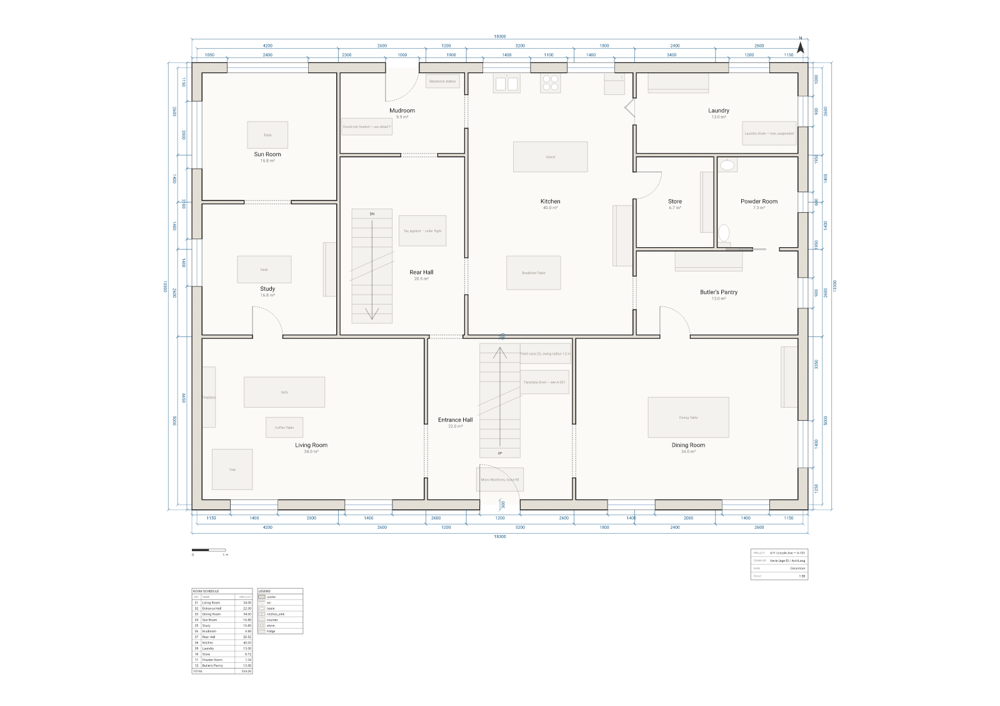

# Kevin's battle plan, but it passes plan check. (Mostly.)

**671 Lincoln Avenue, Winnetka — the ground floor, drawn as a construction document, with the
defensive works scheduled as fixtures.**



## The joke is the drawing convention, not the traps

The battle plan in the film is a crayon map: a shaky rectangle, some arrows, a lot of enthusiasm.
It is also, reportedly, the work of an eight-year-old — the drawing seen on screen is widely
reported to have been made by Macaulay Culkin himself rather than by the art department, and the
traps have since had more serious attention than they were designed to survive, including a
*Smithsonian* magazine piece working through what each one would actually do to a person. (Both of
those are reported trivia, repeated here; this repository verified the geometry, not the anecdotes.)

So the entire piece is one substitution. Same house, same seven traps, same positions — redrawn in
the register a building department would receive it in. Poché on the walls, a room schedule with
areas to two decimals, a legend of fixture symbols, GB/T dimension chains on all four facades, a
title block, and the traps entered as scheduled items with sizes and cross-references:

| Where | Scheduled as |
| --- | --- |
| Entrance Hall, beside the flight | `Paint cans (2), swing radius 1.2 m` |
| Entrance Hall, beside the flight | `Tarantula (live) — see A-201` |
| Entrance Hall, on the floor | `Micro Machines, loose fill` |
| Mudroom, at the back door | `Doorknob, heated — see detail 7` |
| Mudroom, at the back door head | `Blowtorch station` |
| Rear Hall, alongside the cellar flight | `Tar, applied — cellar flight` |
| Laundry | `Laundry chute — iron, suspended` |

`A-201` is the upper-floor sheet. It does not exist. It is exactly the sort of thing a drawing set
refers you to and never quite delivers, which is why the tarantula is on it.

## The house

A symmetrical 1920s Georgian block, 18.0 × 13.0 m on the room grid (18.3 × 13.3 m over the outside
faces), 234 m² across twelve rooms. The whole plan is a front band and a service half:

| | |
| --- | --- |
| Front, west to east | Living Room 34.0 m² · **Entrance Hall 22.0 m²** · Dining Room 34.0 m² |
| Service half | Sun Room 16.8 · Study 16.8 · Mudroom 9.88 · Rear Hall 20.52 · Kitchen 40.0 · Laundry 13.0 · Store 6.72 · Powder Room 7.28 · Butler's Pantry 13.0 |

The entrance hall is the composition. The front door is 1200 mm wide on the centreline at
x = 9000; the main flight is 1200 mm wide, centred on the same line, and `dir up` means it is
entered from the front — so the door and the flight you see through it are the same rectangle. That
leaves exactly 1550 mm of clear hall on each side, which is what keeps the two flanking cased
openings approachable and is why the flight is not any wider.

The cellar flight is the second `stair`, `dir down`, in the rear hall next to the kitchen. Seven
doors, eight leafless cased openings, fourteen windows. Four of the doors are worth naming: the
laundry takes a `bifold` (a hinged leaf there opens either over the machines or across the kitchen's
working side), the powder room takes a `pocket` sliding `left` into the 3500 mm of solid wall behind
it, and the two exterior leaves are the front door and the back door — the second of which is the
one every account of this house mentions.

Nothing is positioned twice. Every opening is pinned to a named wall by run distance, every fixture
resolves `against wall` or `in <room> anchor …`, and there is not one hand-written `dim` on the
sheet — the chains come from `dims auto all`. There is exactly **one** hand-placed coordinate that
matters, and it is the punchline.

## Then we ran the linter on it

`arch lint` checks a plan for architectural soundness: rooms you cannot reach, doorways you cannot
approach, doors that swing into things. The McCallister house comes back with two complaints. The
first is verbatim from `lint.txt`, and it is not staged:

```
warning[W_SWING_OBSTRUCTED]: Door swing is obstructed — the swing needs 1200 mm of clear
radius but "Micro Machines, loose fill" is 400 mm from the hinge (800 mm short).
   --> 85:3
   |
85 |   door id=d_front on w_front at 9000 width 1200 hinge near start swing into r_hall
   |   ^^^^^^^^^^^^^^^^^^^^^^^^^^^^^^^^^^^^^^^^^^^^^^^^^^^^^^^^^^^^^^^^^^^^^^^^^^^^^^^^
```

The linter has found the front door, and it is right. The Micro Machines are the one piece on the
whole sheet placed at a hand-written coordinate instead of being derived from a room or a wall, and
they are there on purpose: 1400 mm wide, centred on x = 9000, lying square in the leaf's
quarter-disc. The compiler measures the deficit and reports it in millimetres — **800 mm short** —
which is a more precise account of the trap's effectiveness than the film ever offers.

Then it offers six ways out, and this is the part worth reading twice:

```
   = help: Hang the leaf on the other jamb — `hinge right`.
   = help: Open it to the other side of the wall — `swing in`.
   = help: Move the door along its wall (`on <wall> at <pos>`), or the obstruction.
   = help: Narrowing the door is not a fix here — the leaf would have to drop to 400 mm,
           under the 700 mm minimum passable width.
   = help: Or hang no swinging leaf at all — a `sliding`, `pocket` or `barn` door sweeps
           nothing, so this warning cannot apply to it.
   = help: If no leaf is wanted here, make it a leafless `opening` instead.
```

`W_SWING_OBSTRUCTED` normally carries a **machine-applicable** fix: flip the hinge to the other
jamb, and `arch fix` will rewrite the source for you — but only when the flipped swing is *proved*
clear. Ask for it here and you get:

```console
$ npx arch fix plans/mccallister-house/plan.arch --dry-run
  (no fixes applied)
```

Nothing. There is no jamb to flip to, because the obstruction is centred on the doorway. The
automatic remedy declines, correctly, and hands the problem back — which is the whole design of the
trap, arrived at from the other direction by a tool that has never seen the film.

The second warning is about the sun room, and it is a fair hit on the drawing rather than on the
house:

```
warning[W_ROOM_NOT_EQUATOR_FACING]: Room "Sun Room" has 2 window(s), none facing S
(the equator side in the northern hemisphere) — they face W, N.
```

The sun room is in the back corner, on the garden, and its two large windows look west and north.
That is accepted rather than fixed: the front band is three rooms deep already and there is no
south facade left to give it. Worth being precise about what the rule does and does not claim —
its own help text says so — it reports an **aspect**, not a daylight measurement. ArchLang has no
sun model, no latitude and no date. It knows which way the glass points and nothing about how much
light comes through it.

So the sheet does not pass the ship gate, on purpose:

```console
$ npx arch validate plans/mccallister-house/plan.arch --strict --json
{ "ok": false, "strict": true, ... }
$ echo $?
2
```

`--strict` fails on warnings as well as errors. This plan exits 2, and the reason it exits 2 is a
pile of toy cars.

## What the compiler will vouch for

Everything else about the house checks out, and these are derived facts, not claims:

| Question | `arch describe` / `arch lint` |
| --- | --- |
| Can you get everywhere? | All 12 rooms `"reachable": true`. Deepest is 4 doors from an entrance — the sun room and the powder room. |
| Is the circulation wide enough? | Narrowest bottleneck on any route is 740 mm clear, at the three 800 mm service doors. |
| Two ways out? | `"entrances": ["d_front", "d_back"]` — the front door into the hall, the back door into the mudroom. |
| Is the topology sound? | `arch suggest` → `no topology suggestions`. It has nothing to add: no room needs another door or window. |
| Which way does the glass face? | Fourteen windows: 4 S, 4 N, 4 E, 2 W. None of them was told — `site { street south hemisphere north }` names the compass and the compiler derives the rest. |

## Honesty notes

Both warnings quoted above are real output, captured verbatim in `lint.txt` and `lint.json`; the
empty `arch suggest` and `arch fix --dry-run` results are in `suggest.txt` and `fix-dry-run.txt`.
Nothing was invented, edited, or engineered by planting a fault after the fact. The plan compiles
with **zero errors**, and every other class of lint warning — unreachable rooms, blocked doorways,
fixtures through walls, floating plumbing, dimensions colliding in the same chain tier — was chased
down and fixed. What is left is what the story requires.

The layout is a reconstruction, not a survey. The real house at 671 Lincoln Avenue is a private
residence; its ground-floor arrangement is fan-documented from the film and from listing
photographs, and what is drawn here is the *arrangement* — central hall with the main flight facing
the front door, reception rooms flanking it, kitchen and service rooms filling the back half — at
plausible domestic dimensions. It is recognisable, not canonical. Every number on the sheet is
ours: the 18 × 13 m footprint, the 300 mm brick shell, the 100 mm partitions, all twelve room sizes.

Deliberately simplified: the front stoop, the portico and the famously icy front steps are outside
the frame, since this drawing stops at the building line; the basement — where a fair share of the
traps actually land — is a different sheet; and the second floor, which is where the tarantula and
the paint cans really belong, is the `A-201` that does not exist.

The trivia in the opening paragraph (Macaulay Culkin drawing the on-screen battle plan, the
*Smithsonian* analysis of the traps) is reported, widely repeated, and not something this
repository independently checked. The geometry is.

**Fan art — an original drawing; not affiliated with the film or its rights holders.** No marks,
logos, character names or dialogue appear on the sheet. The trap labels are prop-inventory entries
naming objects; none of them is an instruction.

## Reproduce

From the repo root:

```bash
npm install

npx arch compile  plans/mccallister-house/plan.arch --json           # exit 0, zero errors
npx arch lint     plans/mccallister-house/plan.arch                  # the two warnings above
npx arch lint     plans/mccallister-house/plan.arch --json           # …as data, with their fixes
npx arch fix      plans/mccallister-house/plan.arch --dry-run        # "(no fixes applied)"
npx arch suggest  plans/mccallister-house/plan.arch                  # "no topology suggestions"
npx arch validate plans/mccallister-house/plan.arch --strict --json  # exit 2, on purpose
npx arch describe plans/mccallister-house/plan.arch --json --select site,totals,doors

node scripts/render.mjs    mccallister-house                         # → plan.svg + plan.png
node scripts/permalink.mjs mccallister-house                         # → the playground link below
```

`lint.txt`, `lint.json`, `suggest.txt` and `fix-dry-run.txt` in this directory are the captured
output of those commands.

To check the swing claim without taking our word for it, narrow the read to the one rule:

```bash
npx arch lint plans/mccallister-house/plan.arch --json --code W_SWING_OBSTRUCTED
```

That is a **display** filter — `ok`, `total_diagnostics` and the exit code still come from the
unfiltered set, so it can show you less but can never make a plan pass.

## Open it in the playground

Edit it live — move the Micro Machines 400 mm and watch the warning go away, or widen the flight
and watch the flanking openings start complaining:

[Edit this plan live →](https://playground.archlang.uk/#z=5Tzbchu3ku_8ii7pwU4dSiGpiyVnvVVypCSq2JZLUtb7JoIzPRyEGIABMKK4qVTlI_IN58P8JVvdAOZCUfI-r1wuWRKBBtD3q3fh-M0YPkidGaXh7B51jfD1739gbk2tcyiUMXYINyWih7O98Wi8P9gd7MJPQoOw_i0IDcbKudRCgbBZKT1mvrZCQW7FSuo5mAIElKZ2CDN0HhbarDQU1lQgYHx6OoJCqmp_sAufjAdRFFJJ4TGHlfQl-BL5czAWpHdg5bz0DkqjcrTuB9AGKmEXbgjKzI2jZVkprMg82sEuaFGhA7FcorBQosV9uC0RvBVLB8Ii31LzKSuxBgEOPeSYGSu8sa8cLK1ZgtT3qL2x68EurEyt8gTRaBCQGe28rTMvjYbcZHWF2jMShQOXlZjXCnOQHisXHrU0TtJqF5BJN5rVUuWELukYLZORg5_R2LkU-i3da11V6K3MhILxCTzA-AAqmCmTLYbgS4sI1hg-IMfBLojMGucC-qzRftiiE7W3QmcIpVAKchQ5ZPQ7BKFzXlEJqaFQhGooREbX8iVBZVCQG2P34QbtvczSsYVUivfORLYgyAVjYCF9VqIeQlXntHAIlilBJ6cLDXYhQ6WEjUcOQYla53Y9hFntFTIZhPZ2HdD1yfgyYiohEnPwK5nhPlzco12DWaJOS6Tmjw0I5oYcVnT4bA221pBL5wkXw8EuIG8t5IOvLYJFZ9Q9OpiKuZDaed43JQabSg3_Qa_5TxA6K42Fr3__ezoEZxgDifGdl0oNdplXHXgzR1-iBUnysBTW882hMvfoAlcajYAPGS75A-kgRyVnaIUPpJGBnqvSKELa72YRZNUh8gfa0MKZuUeYFneVzKyZ7g-WSmjYeULMz7FA7ZCElCBco1DVDvw5AKg1iVtVDQDmVuZwNILOn13AB49WGgsHo9GwfY-D8WjEoAM6CfuWmAhBCZ27IDJf__730WgAsBRLtHA2CZ9lYokDAJcJhTB-yyu0sb6EejmgMwlJhTF-aaX2QVIyhUKDxcwLPVcYmEobwkVWgtQgfUMYUXtTCS8zUhFSO4ZJSoA-ZMUC3hj1FqZMaaJjwPjP77-_TTzl4F8gHiT9Y-7REi95idaBqb0j2WPkBFYSmchxCM6L-Rwt5sN0Pd1g3IkK9wgAZEYp6RiFAkqh872Vld6jZojErKRJ898FCStMc1lNCbJHUjesqPI6Qwevp1_uzi8_3l3918X1h7PPUyaGRx1PrIZEAhI7AltI6zy9tPDhc-nAkbL_bn8AkMvKMdZAKDVoSBCUOeuCgB_nLdmHABecqX05JNwHprTE9hpKrKRbBh08ddJjxDCD1UGmfwBJYNQ6Ku6g_e8RckkkZuRMycxAji6zcoawt_e7Mxr29hwqzDww5IAyXBrrHb9_VUpiBzIcq56QZkKDE2vYaXQXabcdlreKWIvvT8ggwPBneis_svOmyKh_EZZElt1Kr3Cb1A2ftqw7Yes5vQx2CNHdpcGOKmHn2BiGSIlgw4R7yhbtw1nQ8EJtKP-ompLKd15ImwnXqJtCCb3AnLSlACXvCWOk-PhzAbnU7W82DM4-vMdSBoNSsZQJcL7O10P6ptYQzIHYYhA2zYFI1qNd0VBq2CClMTWitR90pLFI3yzNKkfbvf2mcYEbZIFOJiA4CErMUJH9FqSPSVsSP5Jb4MAK1ui-FBqK2mpJ2_Z3gqR8_efv_99_-ZU3v1x8-MDf_WRqS9IhWJE25oGsZh9TpP0yZRzmsBS-fAsospJ_GwycBsEAg2p3Xli_580e6py1oC-FZ7cz2niS4Bl27Pxs3Zj1_RdDCXZqZP5udRd8tAb_vpTZQqNzZKjhT3g9Go4PRqPRd_B6fDIaNT_91QPCQvkskBbAo80rcvO_ufmJk1E8v7k5c_P6TOrPjR-yD9PlnVtKjdPkODkZXAS22cRFDpeCvKvwcfCiA_rYqQ0WkgKV6DZLi-Ci20suLnsWBfF9LosCLaadZL_nrcdgigKk3--8M16NXKnWFWzfOk6IOulS6uQRupZ3St6z7nwOzPFJszl8vwXxyzsCk0v9LKTxeNKCCj9sheVqzbr--ccdBjiHBOZwCxTio8w8_zbe3EDZhqGqzr-JId48OebrMKrD931A0cA8C6hhzicJRvz9rUcxTgOPHzxJ-GDj_g9w4rvGTz4smsbnQR0ddkDxD_TlESg2pd8AxbcKu-OtEqgXo6534frq6uNNMJyscWbklLA7PgRWoN4A8crboLpC-L9OYUMILZJioxDvlXs5xo6dOJm_s3fRJwXhW21Jf5z8HwTSdQ9Ho9EoOHGw8yGsvjam2uFltUMX_doe2KAwAtiO9gxgDw83wF4kn_oXodROAsswkMUhkzarlSBx6B0T_Wc-pqtat9_-PKzeuH2AMejBJfc6XZ_1SPwTrj8ZjR4OO3Bvat0B-gxWgkpPYA_7yH4MllbvdHIGDNYUhcywB7aq8-a2SZ03YA8IC6R2EtiPIRTY6YNlPPegBg-mAzXorg5UUjoJ6jWtTuSDHgmfIl4yB3RAUvvNtYluDycdbPwaVm9cO8Los3RU7MwUBy3gFm4XHR_C6g24tZdK-vUG9YzFiJCuYWC4E-LpyUmXesbiI-oRDDHvky9ZD4bbsRIB7vEG3M9h9QYTr7I-yGhF2qsGA7EdBe9THPeZt-30r_pilOIu3P5yAT9dX3265Z_O2jRBay1Ea0mEnXN24C34lYGV1LlZuWFIjnBg3f11SJXNTO1jgE75YkUerPDwAO_gdDQahSxmzsmKJWrXRoNG-5CCCyH9y7FUjAyZv8tjWGY0pAhNeEYaJex9CaT9gVJgCJp0EYe94DhHJQl7wSgROweacLQkNVnAOzfeADx-MxpBgnw4Gm3fNdnYdTT-xq5c6i1nTU7bVzy5a_Os8fFBf9eLYYkgp-_PfvwVzq-urpusKmf_OW8ssszUuk3IhiwfyWoIbC9j7nupKGnHTJODQlF0M7ts_9gxjy5jzKH9ACsKfSuxQEfZVm28mClWDm2taobKrIb0WSiavRjitPLKGUbmWcak8HA8bjl29E1prer8JfH05afbi-vLq2u4-nzx6fLTzzcNX5MZ4TxyShU78GKBzLCKwkJKOOdtsoTLFcT2zOOB9ynvywBzUxOzEpkczNCvEEOZgV21VL-0mIpofN4wJnx7B4EM-R2WBpYlHSs-qzLAtCwU2qS8EUuYN4HML0ckGnzl7wzbDUa10dAmn4SHg8NWOI7ZCPT20TIyBGFfSjVt2cdovSpicYxyZDEA5thj1pQUutWIYSR6qiO0q0IxrlvyCGs3Uv9duJ2aBvkzTWE9VtkDF7bZPhSOilKUdsbANPtJjQAETZLCpvD2kPcTHiYda0sWtKc9eM9WJNrYd9CB9OawY7dHjPzeBcJrH11gTGHRUxcIiBlsXiFFlhFUSvOl5_S8gN7Gqs47V29ycrSxwwHj7RsX0scTmxwc3f-gp483N9JpvPPRxuNJ_8ToLs9kYVSeqpgxDKPei66FZbUQvFuUXNOgKnAsoWWl1BTj2uAutxWxePorBytjWRFSqTjppXiwWyEuHegAd79njVJQ2N6xzST2UXHS0j9yXwj7NrccHHW3bHKfsbiJzygqm3CO3_Sp0Oj9bsHNs7dBRbhsgZ5T8wEc5-ZXQlGRsZv14sz61KlUUFdYeKoXy_uYrF8KjSqUAWUKLvhJVUUOjzNKpk6PxkpIB7-LakZYZ6AcyRir0f4QzwpdANPU5CMr8pBEiHneBODxLC5TrFihxP6QBuTJIS8UmhFbVfGuGjGPpmj65e7z1Y-_XtzeXf_2KZ1GVWhn-mSPOAxoC6iPZCAKnvYpyA8gRL0kv-PL5afzqy83L-bF_dDK1fpuFYQ7lt1IoY5acxC-j4yZqu5RHDm-p-rsY7Ck1O9WfbBHJxvR4dbb6HSb5DV3zdxkW3i4kP5Ojzd2nU76h_EbGk3rpF5shzPZgDMev3k-OCXFSpfu7zo-7AXmW6Ju2oZxG-uCpIVbg_poE0nzo02HHWodb9sktH-06fjN8ydRyI2web3x5MWG3De3Z5fXbUzSbXCULqazGtPfxBLx57brcUgdCGwS2fJ4k0rElEab5tJCvWSThtpTw1dbPeYeFbu3BtQ5G7e1qSEzFZedTT0vm8Rb8B2iN9reMfZhrk1NbqnwqfaTmSp1QYbLc8AkXeqzNexJ7DZP7_XW0LrYp9W4z8PHl0_tN6jzlxP37EKSl9AO1WGSlPActn1l-CAyr9ahQZNFLJGwzZUy0FTAa3jqbZfQaVPyvIhLqL1T-oZPUsMidQ7GTE9sfuTMkFDOkKtKjtL46Cg5RNRME8Mjo0PHDbmgzXViqxW_h6GSX0ZstmCndGZ82UbxTawulktrRFZSBol75KiBjJSQu2MRCyn8EyoKnEyaDD7h9YEDvyAx_Y2RQbluc0ydAU9tzM1KvyQd9tPlf9_-dn1xEzMkUdRfDAKaBjtik-KuoGYcKpjjUlF3cbdLO3ktpiion_-U3WNmoJNQpEylo5_S9h1Sg6mc_PgwZwoBEL5yUYo4-nTSFhS5fkb-eFM_M4Voy2fPAs-8mAGELCwBn4yORsPxqK14UZD6cNwB_qMpCkS4pS3fuDl1qwKEr52FqXF9Zrw31R5FDVCo2lHLNKHsoMEYiRwrwnj2rUXkDseNg_LOK1LljrF00i8ydmHFinb3HbGc_ZgCMyoSc14c7Sax2cNJxJ70iH3UKWnKHGdG2Lx_1JazpF4ApKA9_LhxYkhldE4MINt67iZIT135EP8Jf54BOR7RvZ8HWViZz8mQ8D_fBsl5ludBZtrbp7DcBv0RILcmtIjuFGR_DPt3Nk_bhSnzxzRUFqbxnClPEUmnUtOxRdyj_k2eh6FuTiykZg8nhs9pYzJUlNr1Qpl5jTl8_vDbx_eXn35ObbzsbSkaGAhxNof4ah3bw8myFsoIH3O6GxiJt2qF85QL3K1Jom9Z8OPbL3lDp3D-PMYXLDU9sSF2Gh61JXRKiz6MO60E7y2KRUEs3xWcdMQWyUS32JDMbUd0ivTn6BYRbEpEbsCcGbN4klFS315klOOWUY776ve9MQtKyvfO2iY8rWoJC2vNbhV7qa2a6rwgYGYLrJVw5ZN6pCcvhwdP8fcX4Sjx9z2c23XD5jFDt-X2JaqiOTE-1PC0FavgMHgSlG_opCF6d1sxSlSks7c9Zyac1BC-MuiYMYqwvVkG3Q7QPYHJwOM1m9jJaGX4ugXcY2vRXPhNiienAX_TIJfdGSsQyoRJsu4gFgcZl7c3cRRlaWQcnkupLobKBTa32RDCok0SSIeRUz4-oh9iJEQlnaBpaMkW4Xb2fv0UD6dsZ2CGSWNUKKHS5QWagkNqOgnoarLmL8Mn2-KUtjMSlOp2Tex50xSXRZiqdMPu-J6SC2wGL5oxvmZOysXulTSN0Q983sK0IW2a2-JOlxlpIRonKowNVgLnhqbSfBx9ETBX62VJnw97gXdjUCA36JiLePjAgNDr5lIvKRp-jxwwcuBBM6OpraBNpaTJMp7mS0WOLXK3FCTj_PUuEzqI9enxRpB41Be0z7yJl7-ekORzwcKKXNYOxvsTqKIMcpvMYz9YWAFwL--FlXWVTC2dedq2XI4Pj1iTtVbECu1rJeC1kvf4XTNtebY3GY13uha-bCbkzprUTZzaejxzK71DVVAeJ5S5fWz_WErMsBmjo8kwhsgRSg5cp-4OBkJmjM2lpvnQ7oBNjlQnydOMNadumP-5XtGwueT0TwQe6t1UYajt0jh8Sx8rSY10f9SUcpCbubBXrlsJD1N55GZNoaRRNBrQkZqyUqltTPgh_FEbGu2-RzsTnsorsS4TOpjh-uLs_OPFFpbhYVZQxji841FjzivQ6Ol4fNqh36hHv4-862Osyw3Dfh5V3tmk2m1_qIzzHcS-1LEaZzd2aap2oc1sSrOALqZUIoGpOPjKAaXcCF8e7V4uXdajy6yVIK5Dff37n0CMpvOGh8QpBEvrYlku4HPWjPYFP5idWrZf3MkjaLh2m7zRnQFKYfMVUTKkVhh3R31x6wRL58ZY2jckYSeSJdbP0Qup4E3EILW5PBY2Q8yAf9RyybPwTRt1J2Imj7bnCyqzCvtoqFUa3W0-bcSs6ap5lMocBveCMSf9xsAZ_YYH8ltMu9KEXg_yxGLtLuF6uVSSpnVJ64cVlIcL4QMbKuoCoQBlC7K9oFFejifCu8lbOTzs8-hpT8cM04l8x96rIpbJMW3fnYrBWVn7oIz34Qvl6uZkqigtFmW7bejiwUkahZ5hJihBHAYzQgsMa5pg9RhiUA6Ohkk9zxYLG_STcA6rmVpveXbYGfeTl3bMw0EbMUZHNj_0HkEPl5YY29VuiTrHfMOv5puey4qcC-q44Nw5a7hpb0x5muq1XSPF3T3RQ0ltPT6SPXb39BRrmK6OOAr42R_waHrknjQfpnCOusOSnud--b9leOXgXqiaMvSqrnTwXwr5wNSgBHFXz6cZdZfG0IQNmb10I2-gIKL60GRb1EpFupEvzW_rTRs_Ndwf1H936jjgvjtIwlosvIT_N4FOmptTwtM0fD1NM9bEEGED_dcBQP7d7zSMvTkAzWc1w84QJpfvZmvY-RXvpYbXYo5w8h18D2c2Kz8ICnp4HZm4nXPMsJqhpd_9Nfhr8L8)

The link carries the entire source in its fragment, so nothing is stored anywhere.

---

*Scheduled for December — the drawing's natural season.*
