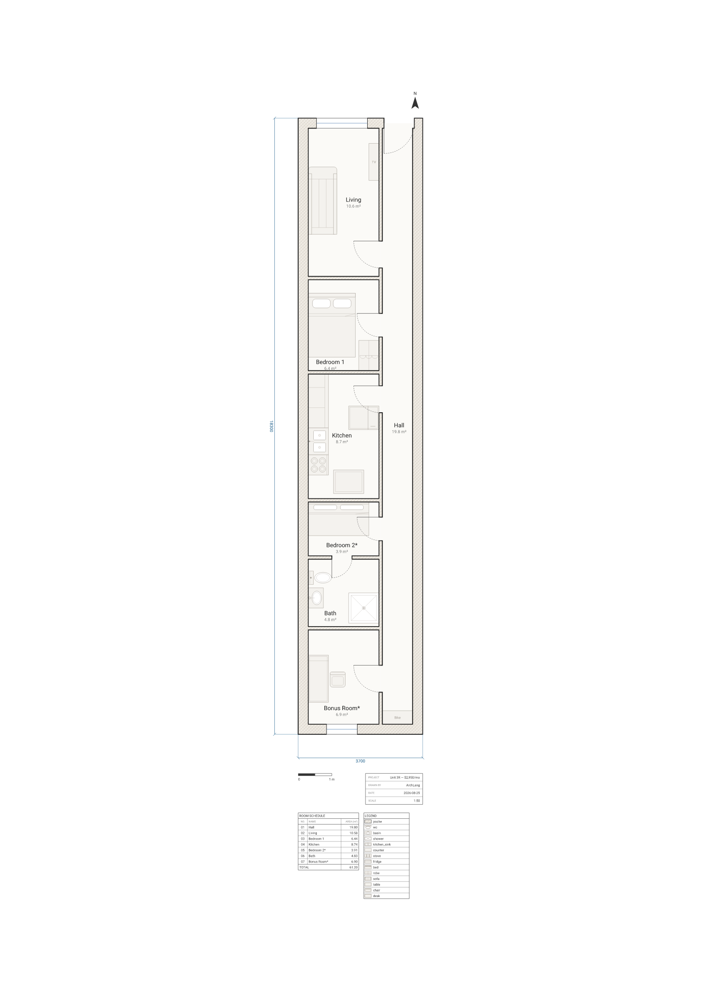

# `arch lint` reviews a $2,950/mo apartment

**Every apartment-listing floor plan is a marketing document. This one is machine-checkable.**



*A fictional composite of a familiar genre — not a real listing or address.*

## The unit

3.7 by 18.3 metres over its outer faces. Both long sides are party walls shared with the buildings
next door, so the only two facades that can hold glass are the street at the front and the airshaft
at the back. A 900 mm corridor runs the whole 18 metres from the front door to the rear wall, and
every room in the apartment hangs off that one line.

Seven rooms, 61.2 m² (659 sq ft), two windows, one bathroom. Marketed as a 2BR.

Everything above is drawn at real dimensions with real fixtures. Nothing is exaggerated to make the
joke land — the drawing is a plausible listing plan, which is exactly the problem. A listing plan is
allowed to be beautiful and unlivable at the same time, because nothing checks it.

So we ran the checker.

## The roast

`arch lint` returns **14 warnings across 10 distinct codes**. All of them are below, verbatim, in
[`lint.txt`](lint.txt). Here are the six that hurt.

**The second bedroom is not a bedroom.**

```
warning[W_ROOM_TOO_SMALL]: Room "Bedroom 2*" is only 3.91 m² (under 4 m²).
```

3.91 m² is 42 square feet. It is 1.7 m deep, which is shorter than the bed, so the bed goes across
it sideways and what is left over is the corridor to the bathroom.

**Neither bedroom has a window.**

```
warning[W_BEDROOM_NO_WINDOW]: Bedroom "Bedroom 1" has no window.
warning[W_BEDROOM_NO_WINDOW]: Bedroom "Bedroom 2*" has no window.
```

Not an oversight — a consequence. Both bedrooms are in the middle of an 18-metre-deep unit whose
only two exterior facades are 4.6 and 5.1 metres away respectively, at the two ends. There is
nowhere for a window to go.

**The only toilet is behind someone's bed.**

```
warning[W_BATH_VIA_BEDROOM]: Bathroom "Bath" is reachable only through a bedroom.
```

The bathroom has no door onto the corridor. Its one door opens off Bedroom 2, so the second bedroom
is also the hallway to the only WC in the apartment. It is 12.9 m from the front door, and the last
1.7 m of the trip is across a mattress.

**That bathroom door is 600 mm wide and hits the toilet.**

```
warning[W_DOOR_CLEARANCE]: Door is 600 mm wide (under the 700 mm minimum nominal width).
warning[W_SWING_OBSTRUCTED]: Door swing is obstructed — the swing needs 600 mm of clear
radius but "wc" is 400 mm from the hinge (200 mm short).
```

Two warnings, one door. It is too narrow to walk through comfortably *and* what little leaf it has
sweeps into the pan.

**The refrigerator is standing in the kitchen doorway.**

```
warning[W_DOORWAY_BLOCKED]: Doorway is blocked — the approach needs 300 mm clear on each
side but "fridge" leaves 50 mm (250 mm short).
warning[W_SWING_OBSTRUCTED]: Door swing is obstructed — the swing needs 800 mm of clear
radius but "fridge" is 602 mm from the hinge (198 mm short).
```

The listing photo's proudest moment is a full-depth American fridge. It is 900 mm deep in a room
2.1 m wide, and it went to the only wall with space, which is the wall with the door in it.

**And the living room faces the wrong way.**

```
warning[W_ROOM_NOT_EQUATOR_FACING]: Room "Living" has 1 window(s), none facing S (the
equator side in the northern hemisphere) — they face N.
```

The plan declares `site { street north hemisphere north }`, which draws nothing and asserts nothing
about sunlight — it just names the compass so the checker can read the aspect. The living room's one
window faces the street, which is north. The south-facing wall belongs to the back room.

The remaining five warnings — a stove with a table 400 mm too close to it, a walk into Bedroom 1
that squeezes to 300 mm between the bed and the wardrobe, a twin bed sitting 350 mm inside the
swing of Bedroom 2's own door, and Bedroom 1's bed *and* wardrobe, both drawn with their backs
turned to the room instead of to the walls they stand against (`W_FIXTURE_BACK_TO_ROOM`, new in
core 1.28.0 — it caught two real furniture-orientation mistakes that predate this piece and had
been invisible to every prior lint pass) — are in `lint.txt` too.

## Three numbers the drawing does not tell you

`arch describe --json` reports facts rather than opinions. Three of them:

**You are renting a hallway for $954 a month.** The corridor is a room, and at 19.8 m² it is the
largest room in the apartment — larger than the living room, and 32% of the floor area. At
$2,950/mo that is $954 of rent for the space whose entire function is getting to the other spaces.

**The living room is 2.5 m from the front door and a 6.9 m walk.** Its `detourRatio` is **2.76**:
you pass the room, keep going down the corridor, and come back into it through a door at the far
end. `W_CIRCUITOUS_PATH` fires above 3.0, so this misses the warning by a quarter of a turn.

**Three of the seven rooms are not in the walking model at all.** `circulation.rooms` lists the
Hall, Living, Bedroom 1 and the back room. The Kitchen, Bedroom 2 and the Bath are simply absent:
before it looks for a route, the model inflates every piece of furniture by a 300 mm body radius,
and once the fridge, the twin bed and the bathroom fixtures are inflated, nothing walkable in those
three rooms connects back to the front door. That is testable, and we tested it — delete the fridge
line and the Kitchen reappears with a 10.7 m walk; delete the twin bed and Bedroom 2 reappears at
13.5 m.

## What the tools offer to do about it

`arch suggest` returns ready-to-paste topology — a real `window` or `door` statement, with a
rationale. Here is what it proposes for the two windowless bedrooms ([`suggest.txt`](suggest.txt)):

```
W_BEDROOM_NO_WINDOW: Bedroom "Bedroom 1" has no window.
  window on w_west at 33.333% width 1200
    → A window on exterior wall "w_west" gives "Bedroom 1" natural light and egress.
```

`w_west` is the party wall. The tool has correctly found the only exterior wall that room touches,
correctly sized a 1200 mm window into it, and correctly noted that this would give the bedroom
egress — into the apartment next door.

It is the right answer to the question asked. The question has no other answer, which is what "the
middle of an 18-metre-deep floor plate" means.

Its third suggestion is genuinely the fix a renovation would make: `door on w_hall at 74.583% width
900` — cut a bathroom door onto the corridor so the WC stops being a bedroom feature.

## The two things a machine will fix for you

`arch fix --dry-run` prints the unified diff it *would* write, applying only the machine-applicable
fixes — the ones the compiler can prove correct. Out of fourteen warnings, it offers exactly two
([`fix-dry-run.txt`](fix-dry-run.txt)):

```diff
-  door id=d_bath on p_bed2_bath at 1150 width 600 swing into r_bath
+  door id=d_bath on p_bed2_bath at 1150 width 600 hinge right swing into r_bath

-  furniture id=f_robe1 robe at (1650,6450) size 600x900 label "Wardrobe" in r_bed1
+  furniture id=f_robe1 robe at (1650,6450) size 600x900 label "Wardrobe" rotate 90 in r_bed1
```

```
applied [W_SWING_OBSTRUCTED] hang the leaf on the other jamb (`hinge right`) — the flipped
swing is clear
applied [W_FIXTURE_BACK_TO_ROOM] turn "Wardrobe" to `rotate 90` so its back is against the wall
(dry run — nothing written)
```

Rehang the bathroom door on the other jamb so it stops swinging into the toilet; turn the wardrobe a
quarter-turn so its doors face the room instead of its back. Neither costs a design decision — the
compiler proposes both because it re-computed the flipped swing, and the walled edge the wardrobe
should back onto, and *proved* each one clear. The bed beside it gets no such offer:
`W_FIXTURE_BACK_TO_ROOM` fires on it too, but with more than one candidate edge in play the fix
would be a guess, and the compiler declines to guess (ADR 0005) — see the roast above.

Everything else is a design decision, and the compiler deliberately does not make those. It will
tell you the second bedroom is 3.91 m². It will not make it bigger.

## The ship gate

```console
$ npx arch lint plans/railroad-apartment/plan.arch ; echo $?
✓ ok (14 warnings)
0
$ npx arch validate plans/railroad-apartment/plan.arch --strict --json ; echo $?
2
```

`lint` reports and exits 0. `validate --strict` fails on warnings as well as errors, so this plan
exits 2 and always will — which is the correct verdict, and roughly the one the internet reaches
about these apartments every few weeks, just without a code next to it.

## Honesty notes

Every diagnostic quoted above is real, unedited output, captured in [`lint.txt`](lint.txt) and
[`lint.json`](lint.json); the suggestions are in [`suggest.txt`](suggest.txt), the diff in
[`fix-dry-run.txt`](fix-dry-run.txt), the numbers in [`describe.json`](describe.json). Nothing was
staged by planting a fault the linter would obviously find, and nothing was quoted out of a run that
had been tuned to produce it.

The plan compiles with **zero errors**. Every warning it carries is an *architectural* complaint
about the apartment, not a drafting mistake in the drawing — the two classes that would have been
drafting mistakes (furniture drawn through a wall, furniture drawn through other furniture) appeared
during authoring and were fixed, because "the drawing is wrong" is not a joke, it is just a wrong
drawing.

Captured under core 1.29.0, `W_FIXTURE_BACK_TO_ROOM` (bed, wardrobe — new in 1.28.0) is a third
member of that same drafting-mistake class, caught here for the first time: it is left in, unfixed,
because the point of this plan is to be roasted, and a real lint pass finding a real mistake is the
roast, not an embarrassment to quietly clean up before anyone re-renders it.

The building is a **fictional composite**, invented for this piece: a lot width, a depth, and a room
order borrowed from a genre rather than from any address. No real listing, unit or landlord is
depicted, and the rent is a plausible round number, not a quotation.

Deliberately simplified: this is one floor of one unit, with no stair, no shaft, no radiators and no
riser; the neighbouring buildings exist only as the thickness of the two party walls they press on.

## Reproduce

From the repo root:

```bash
npm install

npx arch compile  plans/railroad-apartment/plan.arch --json          # exit 0, zero errors
npx arch lint     plans/railroad-apartment/plan.arch                 # the 12 warnings above
npx arch lint     plans/railroad-apartment/plan.arch --json          # …as data, with fixes
npx arch suggest  plans/railroad-apartment/plan.arch                 # the window into next door
npx arch fix      plans/railroad-apartment/plan.arch --dry-run       # the one free renovation
npx arch validate plans/railroad-apartment/plan.arch --strict --json # exit 2, on purpose
npx arch describe plans/railroad-apartment/plan.arch --json --select circulation,totals

node scripts/render.mjs    railroad-apartment                        # → plan.svg + plan.png
node scripts/permalink.mjs railroad-apartment                        # → the playground link below
```

The `.txt` and `.json` files in this directory are the captured output of exactly those commands.

To check the hallway arithmetic yourself:

```bash
npx arch describe plans/railroad-apartment/plan.arch --json --select rooms,totals
```

`r_hall` is 19.8 m² of the 61.2 m² total.

## Open it in the playground

Edit it live — give Bedroom 2 another metre and watch which warnings go away, and which one moves
into the room next door:

[Edit this plan live →](https://playground.archlang.uk/#z=rVldchs3En6fU3RRWxU7RXFnKFE_TvlBTrwb1Tp2ylE2lScFnOnhIMQALADUkHG5ag-xJ9kj7FH2JFvdwPxRsvQQ8YHkDAcfGt3f190Aj2Ayf_Pxa_jfv_4Nf5lPLxfpX2vDV7n5Yz-FcqsUmBLySliRe7ST5Cg5giv42_W3N9cf3l-9g28__PDjh5-ub97ScwJWqC2-Al8hvMcGfjV2DVZIZY0ooBFqfbzdgK-Eh5VBlxzBnbRCgdE5goDaaF_N4L3xIMCiUKCk81KvpqD7e6IoLDo3vJccwXIrVSH1agZv79DuQTTlVoGvpF6B1CA9SAci3mALpAOFK6GmYFF7LKYgdJEcwaYy3qys2FRYQCN9BQIaWeCx0CuFoFA7cKbGpkKLhO0r6SCXfj9j99xUCK4SG6QZyBNNZRTCxpqlwnrGv2-19FCjcFuLDk5m57CD7GJ2AjWYO7QgvQOz9WiTIyhFjo6jcjLL6IEScoXCklG-Cr6jaXxj4CRNoa5hI6zfk7-VA2ERvFijJsB2jZfhOVPCzfdXN2RobqyVhbEzeGN8BcroFThZYABwlbCtN2iu1tsONO58cgSFMXYKztCvFnkM7kTu1R5ufvlAaxCExY7PhYbKqAJWSjgX2OK8RfTwQhvrq5fJEdnJP1haqZDWVaL08MKZra9exiB30V2ibxA1LI21pnHsvkLslVxVvg-KILfUqDn0hRUNmaHRebV_FahVyBq1k0a7abhRyp2nEMVLWqWbJUdE0TC3o2WuVmiFxwJKY9no380aQ6DpGz31m5Laz_zO_zZLNkpomHxsZfELyeLnDUf4Z-LFyccJfEqASeKgrhOAlZUFLNIEYCM2aOFqDhtjvRXSJwAuFwohe8UPsAdhu0mAluNAbL1hUgml6FnpET61_g4PV1hLt-HAhRufGbTCYqsQrDG1S4DEgrpIEgCR5zfSKxwsotV25-Np4PjJx0kY8B263MLkism-3Ee2o7fDuBgNouXa1i6FBmX8NPCeHnUsRJCamDmDq5bHLXnBbnXQHKeuAje-gtKaesgxCiJ407OLdPINOLkLS4VK6BWYsmQaNeg8C4F4JkBJjRwpJe84MS2xoFFTWEufV6intALMjS76n1gxwld0xcQWsBT5mqebwQet9kP76IHOLterpZG6MI37phP7gUaHoj_Uq0a5qpZma4m0nXhnE4rmERz_-Re4CplfR4P80SeggW2v2iRlytbMWjij7T6YS6nVaGQoVA6_cmOCcHSFhUCBX82WPESlIN96ztTkJZDaG0BJ2QiMxlkCPDvI4nVzyzEFwJ1HK1myMl9rdI5N-wQv0mn6kt6zizRNX7Ic-tEonhh9cpoGAP7yIEYM9VMWtEjjwcydx82Pkx5YwD6lrNTphUCJgSFC0kujp5BdQM0BnJKedCiYCKi9tBhFZUoG86O0SrpArr7MdBmCxXnAbKhskqi4WhqNLKVxXCr61hkyWFcW1jU_iY7lL-NlfWuNc_1gNyXda09CJ3_N4K3IK8rEWtSDTE06CqqXHgp5R2oaGrW5DUK_XWKRATxmXTo9PSODonnh4vMIi0BuY6J4Auv8dIAVLsZYEYYw509gZdk87d0WLu4ZNr-lFAXw1CKz-eUALFwcgAlf3ZqylDk-CbZIB2CLYUCfIym1peuA9dwJthTlVqvRYKlZ4P4oNotEj3dXH__-9qebIZ8Zbsz57HJ2AfV__0MpjTjciH2oFmcZ3yYFTEGshNTOQ5bOFt3jgV2hEiQQ5yle26AF4XvSO_kHQpal6Y6JD0osUcHke6HUBLYOqQW1-VYJ9jUNT0aAcSbGZEB6MSjNsCO6tpjv-NEJdC-GDwAjzCiKiBnp32POL3rMN6EYQjYZYsYSOQJt9RFAow560JMB6D_Co5OxoRHg0NJ5b2nUQA-and-3dP715AlLW8FE0KCFwfKzAajw1cChLajw1QixVU1EDIIYrH0Q-DdGbx18NKaOdjJiAHg-BXHH2ylo2EGFjM511g_ENYWmkiHTxuaMWjbiNo-SxeviNmRmo6ErhMLD_GKRxi0NDXRN6O29gSCGZATRsplBWq2c0MCIcXGI0dG3B2npOwI5S3sQYgX1-dRAUcvhhfVjVIIYYbbsHWFezB8xrKfryLL5Pcuyedq56PwQhUaMIFoqjSHOFmn6JUOG3LkZtqyVcPD-Qwz7YcBncE0ZlJrYMHko852KKEMyZNgcHjTHnItV_KnNnXEGxvRGKvTDXmLGaNeco896ig2I19AusxG0vy89733G_GPdGg3DukfOyTr3nt1zLyn1eVTVNvLBz42ZwbUGoSG7OOZNznGBONhIcTcSm9ridSN1y_0D_Qysp7xxb1TkA4-KHeR41GWaPssKu1DeK7xfOVDUPJPRPoRqQ9c0gH_oThFCBQ4nLLx7kvk-V6H2KnmHjnfXlrfW2oTnaLNA1Fmz-9ohM_hR2DUWYccVxngwS-ftNvchCNq0x0LclXq0vOuK5zMDYnWsXBlTgMbGhR1JPE-g46cEoNxaLenYgFxf3i7lmhawxljOF-k0Oz9dtIn9korvIK3LNU6I7n3W-7MRieuK6e_AOmdKAfzGc0ZuCZ1Xxgb9lGrrqmDrxSLdzQc16CdTisl9TH8HAPxGK84uF-n0rCtkXG4HlfHmn5Ph1M-w4C63tNvIKz4OOObpl1jELXgjbGHNMh7UtFd8MDlgXne_lN5NGa6jwxIrGY-piLkPxZ4rDM0Z1sjXX3BudkqeuRw1Ig84l4zJgE1i756Rd3s6naXpboDxSzR_0s__HB6mJfd1izy8EkrhHgRv_OnnfssfmmpqlAMR-Ug3HLN-5ehcdFvQhrw2bUMdWuwQtLDdvKrRStKkxdJKPm7jWhRDRMfUm42hs60HgpCbbdB0_ORX243z4HgkYMrSIVXrRRo7zozcScWAvdev-FBEUlM-bV0Srh-Z4fKUZngC05s72j-1n09ZnaWUyh_HLK0sVgjQfj6Eya1C64nzzhPnkVePT7D2YqkQIHwQPy9pY5eepMN0N2i2b-jByRj1GTOAbwyj9U39hISbzc6hBqqzQfwkUNa9yPkYQcaNYNP9T1C2W0KGs3Q237YpbZv0sPznIeOQUhe88eiUStu4XZaO9A4vfCP1y16t8-dr5eNm48DEJmcSxI_H-HWyaMP_MNJSOKkB4sdjSKfZ40iuMg1aiB-P8DM7pcrZ8epyBPsclbM7pmWwH6iToHN-QQcIlakx7rcCi4b779oUqPp_eGKaWhNnpOcj6e78LOyGuDulhux8dgl1ny2NXpHrqJUzlMLqmqjHpwtG43Ek-gPcK9CtAcI7OyU2gF-oPpToskEf8h269QPVJ6-EtBDeidQXJO-zXt6ni3R32uahfkPh-e8C-lMDKOH_jrmHSfyzY_z344Sf4X9nbpd7mFzZvHon9CreFx5hMk_nZ8fpxfF8QXc_J5-T_wM)

The link carries the entire source in its fragment, so nothing is stored anywhere.
