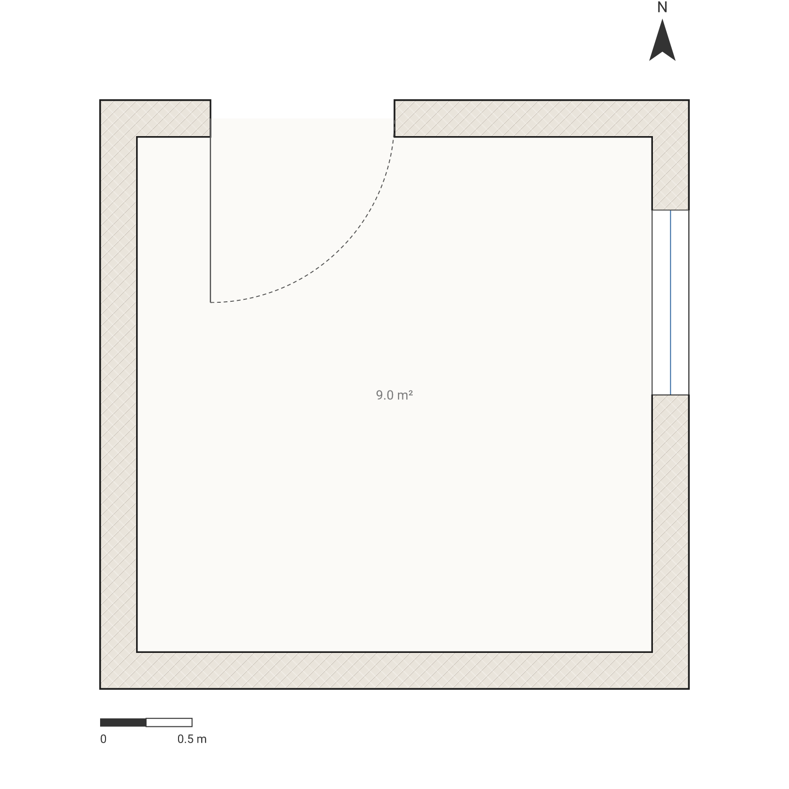

# One tweet = one house

**A complete, warning-free, two-room dwelling whose entire source is 290 bytes. The tweet *is* the
program. Paste it into the playground and you get this drawing, byte for byte.**

```arch
plan"Home"{wall id=w exterior thickness 200{(4m,0)(0,0)(0,4m)(6m,4m)(6m,0)(4m,0)(4m,4m)}
room at(0,0)size 4mx4m label"Living"
room at(4m,0)size 2mx4m label"Bed"
door on w at 10m width 1m
door on w at 22m width 800
window on w at 16m width 1m
furniture bed at(4.4m,1m)size 1.4mx2m rotate 90}
```

**[▶ Open it in the playground](https://playground.archlang.uk/#z=VY1BagMxDEX3cwrh1QyEoDEmpItusuqil3BqpRGxrODx1END7l5wmibd6IPe-_xz9Mm8qZC5VB8jcHitQEuhzJqhHPnjlGiawCJeeicrHHq8HSdDv5F74PBLXXtdu6wq4EuzJ_4mcLI4gej3FM07f3H6NH9SqzbLPlk7CqYLqhk0QQVfYESByqEcYZT_xNo72SJ2lVPQ-qhtnmqHOScucybYU2jjayerUW7749rJYgWyFl8IXvD6Aw)**


## The counts

| File | Bytes | Verdict |
| --- | --- | --- |
| `plan.arch` | **290** | `compile` clean, `lint` clean, `validate --strict` clean |
| `plan-strict.arch` | **145** | the smallest strict-clean plan I could reach (see below) |

Both numbers are `wc -c` on disk. `plan.arch` ends with `}` and **no trailing newline** — that is
what makes it exactly 290 rather than 291. Copying it out of the fence above may add one back; the
compiled SVG is byte-identical either way, so the drawing does not care, only the counter does.

**The 10 bytes above the original 280 are load-bearing, not fat.** Core 1.28.0 taught the compiler
that a bed has a back — a headboard, drawn on the symbol's top edge — and that a back turned to the
room instead of to the wall it stands against is a real drawing fault (`W_FIXTURE_BACK_TO_ROOM`),
the same class of defect as a door hinged into a wall. Re-rendering this file under 1.28.0 for the
first time surfaced it: the bed sits 200 mm off the room's east wall with its headboard drawn facing
north, so under the new rule the house was no longer warning-free. `rotate 90` turns the headboard
to face that wall — the compiler offered no machine-applicable fix here (the room has more than one
candidate edge once the bed's own footprint is accounted for), so the ten bytes are a drafting
decision, not a linter's guess. The stretch goal is still moot, just ten bytes more expensive: **the
290-byte house is warning-free.** It is not a plan that merely compiles, it is one that passes the
ship gate.

```
$ npx arch validate plan.arch --strict --json
{ "ok": true, "strict": true, "diagnostics": [] }
```

## What the compiler says it is

Nothing below is written in the source. It is all derived, and it is how you know 290 bytes bought
a building rather than a picture of one:

> "Home" — a 2-room floor plan, 24 m² total: Living (16 m²), Bed (8 m²); 2 doors, 1 window,
> entrance via door_1.

| Fact | Where it comes from |
| --- | --- |
| `Bed` is a **bedroom** (`uses: ["bedroom"]`) | Nobody wrote `uses`. The label is classified by the vocabulary matcher — which is also why the plan then *owes* that room a window, and why deleting the window turns the file red. |
| `door_1` is the **entrance** (`hasEntrance: true`) | Derived from the wall it sits on being `exterior`, not declared. |
| `door_2` connects `Living` ↔ `Bed` | Derived from which rooms the hosting wall segment separates. |
| Both rooms reachable, at depth 1 and 2 | Flood-fill through the door graph; clear widths 940 mm and 740 mm. |

## What did the squeezing

The single biggest saving is that **a `wall` is a polyline, not a rectangle** — so the exterior
shell and the internal partition are *one statement*. The path walks
`(4,0) → (0,0) → (0,4) → (6,4) → (6,0) → (4,0)`, which closes the shell at the point it started, and
then simply keeps going to `(4,4)` to draw the partition. One `wall id=w`, six segments, one
thickness.

That trick only pays because openings are placed **along the run** rather than at coordinates:
`door on w at 22m` means "22 metres into that polyline", which lands on the partition without ever
naming a point. All three openings are positioned that way, so not one of them spends a byte on a
coordinate — and none of them can drift off its wall, either, because it was never off it.

Everything else is the language's defaults doing their job. `units`, `grid`, `north`, `dims`,
`title`, `uses`, and every `id=` that nothing references are all omitted. Whitespace is only needed
between two tokens that would otherwise merge, so `…4m,4m)}room at(0,0)` needs no separator at all
(a metric suffix *does* glue to the next word, though: `width 1mwindow` is a parse error, while
`width 900window` is fine).

Measured, by compiling the same building three more ways:

| The same house, written differently | Bytes | Cost |
| --- | --- | --- |
| **This file, pre-`rotate` (the syntax baseline)** | **280** | — |
| Shell and partition as two separate `wall` statements | 312 | **+32** |
| Raw millimetres instead of the `4m` / `1.4m` suffixes | 320 | **+40** |
| Fully idiomatic: indented, ids named, settings and `uses` spelled out | 434 | **+154** |

These four numbers isolate syntax choices, so they're measured without the `rotate 90` clause — the
shipped `plan.arch` carries it and is 290 bytes, ten over this baseline (see above). Either of the
first two squeezes alone is the difference between fitting in a tweet and not.

## The warning-free floor: 145 bytes

`plan-strict.arch` is the smallest plan I could get to `validate --strict` clean while still being a
place: a 9 m² cabin with a door to get in and a window to look out of.

```arch
plan""{wall id=w exterior thickness 200{(0,0)(3m,0)(3m,3m)(0,3m)close}room at(0,0)size 3mx3m door on w at 1m width 1m window on w at 4m width 1m}
```

**[▶ Open it in the playground](https://playground.archlang.uk/#z=RYrBCsIwEAV_5dFTCh7WxqsfE5pAF7NZSRZSLP33ohW9DAMzzxzKMGw95AyO9460WqqsFbbw_CipNUxEm6MLjc7Ll15GR2_OWVvaq6og2Gdq_ErwsnpBVK3Qgo5guAo6R1tOKVH7L93-aT8A)**



**A warning-free house costs 145 bytes.** The floor is not arbitrary — every clause in it is
load-bearing. Delete the door and you get two warnings at once (`W_ROOM_DISCONNECTED`, "it can't be
entered", and `W_NO_ENTRANCE`, "there is no way into the building"). Shrink the room past 4 m² and
`W_ROOM_TOO_SMALL` fires. The room, the door and the window are the whole plan.

## Code golf: the smallest livable plan

**Beat 145.** Reply with your byte count.

Rules, so the number means something:

1. `npx @chanmeng666/archlang@1.27.0 validate <file> --strict --json` must report
   `"ok": true` with an empty `diagnostics` array. Zero errors *and* zero warnings.
2. `npx @chanmeng666/archlang@1.27.0 describe <file> --json` must report at least **one room, one
   door and one window**, and `access.hasEntrance` must be `true`.
3. One file, no `import`. Byte count is `wc -c` on that file.
4. No zero-width or invisible characters. If it changes what the plan *means*, it does not count.

Rule 2's `hasEntrance` clause is there for a reason — see below.

## One trick I did not use — and the gap that has since closed

Shortening the wall category from `exterior` to `ext` saves five bytes. It also quietly guts the
plan: `describe` then reports the front door as `between: ["room_1"]` with `"entrances": []` and
`"hasEntrance": false`. The building no longer knows it has a way in.

Until core 1.26.1 that 140-byte cheat **still passed `validate --strict`**, which is why the golf
rules above pin `hasEntrance` rather than trusting `--strict` alone. The rule was guarded on the
plan having an exterior wall at all, so a plan with **no** exterior wall was never asked whether
you could get into it — while a plan with an exterior wall and no door was caught immediately.

**Core 1.27.0 closed it.** The same 140 bytes now come back `"ok": false` with `W_NO_ENTRANCE` and
exit 2, and the rule no longer asks whether an exterior wall exists — it asks whether any threshold
actually reaches unroomed outdoors. The golf rules keep their `hasEntrance` clause anyway: it costs
nothing, and it says what is meant rather than relying on a linter to agree.

Five bytes is five bytes, but a house you cannot enter is not a smaller house, it is a different
one — so the shipped plans both spell `exterior` out.

## Reproduce

```bash
# from the repo root
wc -c plans/tweet-house/plan.arch plans/tweet-house/plan-strict.arch

npx arch compile  plans/tweet-house/plan.arch --json
npx arch lint     plans/tweet-house/plan.arch --json
npx arch describe plans/tweet-house/plan.arch --json
npx arch validate plans/tweet-house/plan.arch        --strict --json
npx arch validate plans/tweet-house/plan-strict.arch --strict --json

node scripts/render.mjs tweet-house      # plan.svg + plan.png
node scripts/permalink.mjs tweet-house   # the playground link above
```

`plan-strict.svg` / `plan-strict.png` are rendered the same way `scripts/render.mjs` renders
`plan.arch` — `compile()` plus `scripts/raster.mjs`'s `svgToPng` — just pointed at the second file.
