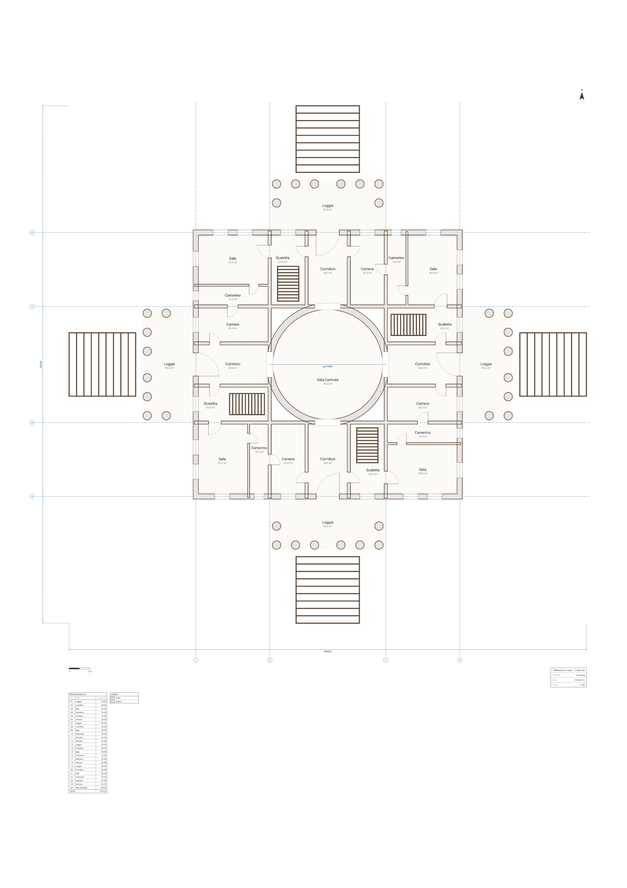

# Villa La Rotonda — the Piano Nobile

**Palladio designed it so that a quarter turn changes nothing. So we wrote one facade and
placed it four times.**



Andrea Palladio began the Villa Almerico Capra on its hilltop outside Vicenza in 1567 — a square
block with a domed circular hall at the centre and four identical temple fronts, one on each face.
It has been called La Rotonda ever since, it is a UNESCO World Heritage site, and it is the most
copied house in the world.

It is also the rare building whose *drawing* has a symmetry group. That is the thing worth
compiling.

## The component is a quarter of the building, and it mirrors the idea

The entire villa below the `component` line is written once:

```arch
place quarter() as north at (ORG, 0)
place quarter() as east  at (EXT, ORG)       rotate 90
place quarter() as south at (EXT - ORG, EXT) rotate 180
place quarter() as west  at (0, EXT - ORG)   rotate 270
```

Four statements, four origins that are themselves a pinwheel around the sheet, and the building
is complete. `quarter()` carries **everything**: the flight of steps, the six-column portico and
its two returning columns, the loggia, the axial corridor, the corner *sala* and its *camerino*,
the two flanking chambers, the service stair, this quarter's run of the outer shell, its share of
the interior partitions, all six doors, all six windows — and **ninety degrees of the drum
itself**. Nothing is authored four times. Nothing is authored twice.

The symmetry is therefore not asserted, checked, or eyeballed. It is the only thing that *can*
come out: `place`'s quarter turn is a signed permutation matrix whose entries are all `-1`, `0` or
`1`, so it introduces no trigonometry and no floating point, and the four porticos are congruent
to the millimetre by construction.

You can check that claim rather than take it. Every drawn contour in the SVG — 840 of them across
the floor, wall, door and glazing layers, arcs included — was rotated 90° about the centre of the
block and compared with the original as a multiset. All 840 land on top of something already
drawn. A rotation preserves orientation, so an arc's sweep flag is unchanged by the test: had any
curve been turned the wrong way, the flags would have disagreed.

## Why the quarter is a pinwheel and not a quarter-square

The obvious cut is to slice the square along both centre lines and place the top-left corner four
times. It does not work: it severs the axial corridor down the middle, so every corridor would
have to be authored as two halves in two different instances, with the front door on the seam.

Cut the ring of rooms into four congruent **strips** instead — each running the full width of the
block on one side and stopping short on the other, like the blades of a pinwheel. Four of those
tile the ring exactly, and not one room, wall or door is cut in half.

The consequence is the nicest thing in the file: each strip declares only the walls it owns, and
the four copies **interlock**. The wall closing the north side of the centre band is three
different statements — the west strip's trailing wall, the north strip's band wall, and the east
strip's corner wall — each landing on `y = 19000` after its own rotation. Nothing in the source
says so; the pinwheel does.

The same interlocking closes a circuit of rooms right around the villa. Each quarter cuts one door
through its own trailing wall, and `arch describe --json` reports what that door actually
connects, derived from geometry rather than declared:

```
north.d_ring -> ['north.camera', 'east.camerino']
east.d_ring  -> ['east.camera',  'south.camerino']
south.d_ring -> ['south.camera', 'west.camerino']
west.d_ring  -> ['west.camera',  'north.camerino']
```

## The rotonda

The block is 25 × 25 m centreline to centreline, in bands of 7 | 11 | 7. The middle band is 11 m
square and the hall is inscribed in it, so the drum is **tangent to all four centre-band walls**
and every tangent point is a threshold. That is why each of the four thresholds is cut twice, once
through the straight wall and once through the arc — miss the second cut and the poché of the
other wall still stands in the doorway.

The drum's faces are true SVG arcs at `R ± 300`, so the circle never goes faceted at any zoom, and
the floor is a `room circle` whose area is exact **πR² = 95.03 m²** in closed form rather than
measured off the polygon the analysis grid uses. The four corners the circle leaves inside the
square belong to no room and carry no schedule row: they are the masonry the dome stands on, which
is what they are in Vicenza too.

Splitting the drum among the four quarters is what makes its *segmentation* four-fold as well as
its shape. Four walls each symmetric about their own tangent point would need split points at 45°,
and 5500/√2 is not a number any grid can hold; snap it and the drum stops being one circle. Split
on the 3-4-5 triple `(3300, 4400)` instead — exactly on R, exactly on the grid — and let `place`
supply the symmetry.

## Two elements this plan deliberately does not use

The columns are round wall stubs and the steps are drawn as their own tread lines, rather than
ArchLang's `column` and `stair` elements. Both substitutions are there for the same reason, and
both are worth knowing about if you write components of your own: **only walls, rooms and openings
survive a quarter turn exactly.**

- A `column`'s `at` is documented as its top-left corner, but the instance transform treats it as a
  centre, so a placed column shifts by its own width on a quarter turn. With `column` the east and
  south colonnades sat 800 mm off their own axis — visible, and fatal to the one claim this drawing
  makes.
- A `stair`'s `dir` is a *handed* rule — it says which end of the flight you step onto — and the
  transform carries it through unrotated, so all four flights drew their arrow the same way on the
  page instead of turning with their quarter.

The wall stubs are no loss. A closed run of two arcs is a circle on the wall's **centreline**, and
its faces land at that radius plus and minus half the thickness — so a centreline of `COL_R / 2`
carrying a thickness of `COL_R` has its outer face at `COL_R` and its inner face at nothing at
all. The annulus closes into a solid disc. That is how you get a round column out of a language
with no circle primitive, filled with the same poché a plan-cut column should carry anyway.

## How accurate is this?

An **original illustration of a documented building, not a survey**. The parti is Palladio's and
so is every relationship: square block, central rotonda, four porticos on the axes, corner rooms
with small chambers behind them, narrow corridors from each portico to the hall.

Everything dimensional is idealised to whole millimetres a builder could set out with a tape. The
real block is nearer 26.4 m than 25; the hall is drawn at φ11000 where the real one is smaller;
the four service stairs are one per quarter, where the building has two, and they spiral. Palladio
himself did not draw it perfectly symmetrical either — the four porticos differ in their approach
and only three keep their original stairs.

The largest liberty is one a plan drawn square to the page cannot avoid: **the real villa is
turned 45° on its hill**, deliberately, so that every facade takes sun at some point in the day.
Here north is up and the porticos face the cardinal points.

## By the numbers

25 rooms, 819.03 m² in total, on an A1 portrait sheet at 1:100. The room schedule groups itself by
instance — each `place` is implicitly a zone — so the four quarters produce four subtotals of
**181.00 m²** each, and that identity is computed from the drawing, not typed in. 24 doors, 24
windows, 32 columns, and 10 treads to each flight of steps. The overall spread across the four porticos is
49 × 49 m.

## Reproduce it

```bash
npm install
node scripts/render.mjs villa-rotonda     # → plan.svg + plan.png
```

To check it rather than look at it:

```bash
npx arch validate plans/villa-rotonda/plan.arch --strict --json   # exit 2 — W_NO_ENTRANCE, see below
npx arch describe plans/villa-rotonda/plan.arch --json --room rotonda
npx arch describe plans/villa-rotonda/plan.arch --json --select instances,schedule
```

`validate --strict` is the ship gate — it fails on warnings as well as errors. Everything this
drawing is *about* passes it: every room reachable, every door swinging into space it has, every
opening on the wall it names, and all four quarters congruent to the millimetre.

### The one warning is about porticos, and it is worth arguing with

<!-- TODO(1.27.0): decide whether a portico should be a room, an unroomed slab, or a cased opening. -->

Core 1.27.0 raises `W_NO_ENTRANCE` here — "there is no way into the building" — on a house with
four front doors. Both versions of the compiler agree on the underlying fact:
`describe().access.hasEntrance` is `false` in 1.26.1 and 1.27.0 alike, byte for byte. What changed
is what the rule does about it. 1.26.1 was satisfied by any door *hosted on* an exterior wall;
1.27.0 asks whether a door actually reaches unroomed outdoors. Five lines reproduce the difference:

```arch
wall id=shell exterior thickness 300 { (0,0) (8000,0) (8000,6000) (0,6000) (0,0) }
room id=inside at (0,0) size 8000x6000 label "Inside" uses living
room id=porch at (0,-3000) size 8000x3000 label "Porch" uses entry
door id=d_main on shell at 4000 width 1200 swing into inside
```

Silent under 1.26.1; one warning under 1.27.0.

That is this villa exactly. Each `d_main` sits on the exterior shell, but it opens onto the
`loggia` — and a loggia is a declared room here, because it has a floor, an area and a schedule
row. A portico is open air behind a colonnade, and the columns are drawn as round wall stubs rather
than as a wall with an opening punched through it, so nothing in the file says where the outdoors
stops and the porch begins. The new rule is right that no threshold in this plan crosses from
unroomed ground into the house; whether a Palladian portico ought to be a room at all is a
modelling question, not a bug, and it is left open rather than silenced.

## Open it in the playground

[Edit this plan live →](https://playground.archlang.uk/#z=pVz9UhtJkv-fp8iwYgMYJI0Ag21m7QgNlj3cMsgn8Fds7A2l7hKqc6tK21VtoVlPxD3EPeE9yUV-VHW3AK_Xyx8OI1VnV-V3_jKLDrwzRaFgWCx0aTIHp2pZqi5kqih0Do_OFUxccDZXj-D__ud_YWjzUit4o4pC5cZ1YapvKgv7R8dP6Psw17A0yjqwbmoK3d_qbHXScphWpggQ5saDsxqCg6kGY3Mzm-lS24CfrOYmm8NKrWHtKiic-wQqgAknoMD_vVKlhmnhsk_drQ4oyN1C55CZMqsKVcJcFQXkWuWQaRtK3QVlc3g1fjsBk2sbTKYKCHqxLDTMSmeD79JOlrqEmcp0H66q0m516CB5qVbG3oACfG3QJYSqtETRBDCeFnm1SCv7cOn4Q1eVmcYlq9KEoG1autWhoyGvxhejSLgLqgpzV-ocnM10F5aFynQOM1eVEMxC-xNiJPAX8bGdXVAerCvDHHm0M5687sJg96GFWvkAtHD04aoL48nrXeCf0gUVNDwbPPSod5W8Y_ThCnpAbxp9uNqNj-4_ffDZlY6vHdAz_Phu_dqDJwM63eizLtdhjiyf6sKtiGnXmVssndU2XENhbIupyCsSB_LfNrjVhyvk93qx0KFcb3XwIesCKO91GXTehWyus0_I7hL0Wk9Z3VEqtWSdLdbA2wlzFeB0eAGZW2hwVUDFz1TlUZ7XdObrbR-P3SM1MR6UBX2rsgDe3Fid95a6XFRBBeMsLFQozS3soJoa7aG3_2XwZb8LX3IdvsBz2N9FBfesT3SypSuDyZwHNIHM2ZuyEpPBJQtTFAaPq2G6xq99KKsMX8U2-P6Xj3D1ywj-8-1wcjWawNklDOHN2cX7X0ajcxhevISL8RUM4_e9S_zPiBnppp-NqzxkVSAe-cJkGt-KO2STVIVDsbkwF8sjYXmSDusEbjK4Za_QswCZKy2aXJIY09WfdemFsLo1qsCFpcldCblbWTlonhe6i6zB5et6ycpVRQ5z9Tl6lmRUykNYua0O-ofP2oOx-DvUfsdYH5TNtO_CyoQ5vQiPgZ9B7lwJTmxYq0UfTqtAv5WoHG621YHSuQXSDY4PVcvn8mpy9uaS3qBV3gWtsjmUlbWsWBpmVVGwS4OVycMcX4U-yZuc-GBz8MEtl7jez10Z4l5cmOsyOgaAvd7DP3uQfvBJdhk-lGaJW_FwC4N-f__pYDAQYl8AWqvk50v6pyZGboVXkeUo-a1L7lLn8GwAub7pRsr3722TMh3b4VFLV9mcmU-6hoFgaexqrnXRb2y38XD8ZZPoKxQNbc5DMIWuhUh2Wqw5XlgXNuju4EJRbPzZBd2ki-JCDejCCgMQqasrkR1oMsai3s3qva742amyuegbf67gy8Z7aX8cgOW9_s6azZ8vEFprgLnc5nmv12utqf_Hrl6k_uVbdIs0EP0Eeh3990qj0axIeUqtctLzleF4SOpBJsBvyHVWqFL76G01cdCjG3Yr67tiAPgFRfHT8Zuz0SWcXVyNJufj07-wgyLr2Y6hEAN5F2YoADHrbvTptAC9Fr582-M7wM91UaAZ_JTeD1nhfLRPMQOTa3AzaCjClDIBJFxqtNTanXiMawttg09ZEUXB-NpQKlMgfXxZd9Mktz2T5i-VzSUfqQ1t20cPSrvFdxBPC2WJ3c7CGmPIs8FgAGqGqYsJfFqKuRgV4MJRcMPoaJtZi1drDPjM2WhokDvtOZJgFDl7ORqeQ4wRB0dwi_8shDMUp4Nr_NbFd-ChPPLwCXyB_X34Ak_4JezStzqJo_v7sEiRRcQfzcCgm_VZaaY6R6omdGOYzMtqgd9fDS9ejy6ucAuqKLY64pJpN73EWg5OHEOCsjcouKUzlhIARVL1c1dwWsBZKeYe8zXzmnUhEk-rfbR6Uvku5yhhXrrqhsOKR-HfzAOLDrdwZ4kqs60O7Fy733Cz17To2v2Gx7vucpAVkaXkaLcPvxovKanOnM1pE5F5S5fNdb1lihy8AR8M_UuyEarovFZqzcKRcIbaxuQx2S40FFpxKCXLaCUDmL2h8WAVQH6R9pGpslzjJz6b67wqUKSrE3xyTSkNBXflnS3XsouFlo3hlm23FoJ4a1ihN0kEjIV3JtP2d8WKOno3uiBtfTl5-ysmPJLbjF7yyRoaRckhZmuZXlJ6JllVVP8TkvlWJ1UCeBhM2zi2lVqTYqMucq6BMvQcTYiBxHrnNXkWTQGD-diHsS3WYuGvzsfjCalfylxCw-P04aVD8zaB_ShWEgv1STflsu3B6xv0PWTmop-9GSoyJeOodJ7cgZ-rpZbES4sTCrg3uCZVkywcHSlqfagzwa1OK8OETFnk4FTqLVotPKDSKnKtVKR4Ya44xdlRWE6pYu2Nh5vSoKcrlQ-6NB6TR1bRqQ4rrS3t-d1ocnV2Orokm1dAepbNXZlDgW5LwXKubHALsa6sdD4mlFgb7rLkY2WHviSVhdqIVaxPxCtgIBFnUFYaLt-9_vHlh1d4LJSLsmv43bkFK9v44vwjvB-en192YTIe_3pJOfX4zeji7OL1JVy-nbw7ezeqE2y4eju5gNGH4enV-cdu27-wZRfVwiKn5xq9YKklERKrraY-WbcPeumjDZmS_HzA0CtJeJPtzItrJi-uxQdlymvQBcesPvyMLkZ-JaVg6qyMpoTKY3oatGg4uWeNpsullrEwGQ1f_jrqL3LmzvnZzyg4khvGRioKjC2aPsbr8jNmCbQbfqHJtSqM1znaY6zTozLt8FEQU6CgN2fLS1tag1-aUhW7HNeNRbXirIzrRZQhBJOvOXaJ81oRv5l2qVVMzdFJaFXqEg6O-49h8VPz5AV8JhgFkwHOeR8f1X6BNXdOftaR5W51ag1T6D3JiH2VfJxC_ljZp2wsuiR1o6PB-blb9eFS6ya_6clHjOvU-A3Z-RuCZi4ImnkE_9gCqCzubbHYArI_OBpsASwV8nm4TyVnqUzYAvCZKjTsn-wPcAVnK9WSvkje3C38FkChb7TNt7YAOnCpl0aBsZ-QC4UyudDGzaA85_oWPquiwpiBtTV7stXcFXjQQoeg-1uUBi8IsFnAo87R9PHx4fEjfgEmoCxeVJXIqq9kq1_5ob0HGFLG-xyeYPLU-unErAvDsqz-WVbv728u77TyRDzxRiqz7SE3aqGDLoXY5dnLERI7gB9gCHtCnIkdHA0GA84VGf96MNmKxLDwhOcbhJgYlXpdmKN7VyWbVsz0pCzEgKe90JrIKX-GH-Fgg9bRUdwXRg1MTet9lSo3ld8SKm_GkyukcnQPZwXdQL0PM1cuuozPRT-IJ6REPR1u9ObyASFRUV1QjmWskKHgHLcxGf8HboO2syekImMOWoxRaV_CD1hiEp6EEE82nrwm_jDpu9uJBcoGAEJpMdlr5lyZG6tCYjkiZUiSdGKPVEKod-AxJfbusy6pRKCMcIXxL1YbjQDHJiFETz-wHJF4W5IdOHicBCmKK-XOnF4iv4juuRl7MC4hyBTRkVtjdY_fSJkQpwhVqQrIVagWHJDQpNWt9uSBAG7RExOiiGzcg2H6D2pu_AX5QMvX_8ryPxpuAgHXGH2_z0NEN9GBYUzQjE2lVUOGXXZWO4PuYDfmcK6ixJE9iHCTIncfzh0mIGuiTHjM2cX74eTlCQxi4Tp1AbMaXN-FV8PTUUIpiSqXij8PT_8SP2_4nj7vOAKVKXclqALtgiscLIm6krdS0j51t3gSlLAgeYRqeNSsqGpUtBB9wkDMjcmxurWebdhjCcAYKqIgGFk_WbfyCJFkVPdzvBN2UB5gQgwGuPFU4TRAZVYb8tUfzi6jjTT1GQ05abOYcPJMgiNbKIjtt4ka8fUeI05ugR9Yt2wBUYQkg0SKRCGk9iSkCKln95FqiCvRuByeD-_zlh3I9TIkpolGocg408kUNnOsk7SCcxQfEt3T8WQCz-HxXbpCjuBUZFehVcmgZP3we3IgxPgekyLGd2B_QByv4VhEPDCFrp8d1c_utZ993H6WoA56dot3Rnh-BGq4g8RxClGiE6iWbE4m1yRzK4B0nU1wd-cV12Jb6bheR5iyK6VZDTT2YbzUlpQdk4ql8warHazKEvHJ2wvJ2YQmVRyxIhOMxoS5w2IcpqVWn5KTpvLCB1UGjz4CD_Ychn0iRFm-yZ_zmfWt5K5hbrJPVnuPWoE9BF0iSj4tTfZJzAKoz4L6t0v_Q6XehR3KBuQ3WvdHk7UN9dv2oPMbLR6scYyIx0hN5SKaQXCUtnkfzoIXmguTJyiFgP8WvpJSbEZsgqsotCJf5tpKr-Bo8CcuQNsMWREmAktVBsOVemLJ4WAA_4CdYTq9nJl_q8_7Sw0FbF9iBf9y9HoyGl3C-FWCC74VIRCaMXn6SfpH4qs0VmCfdCNUgi683sQFdMIF6jqeT90R-u9LE6TyJ961C-lMt3ECriNVuAccEHqXo9e_ji6uhldn44sGQBCc2-j4NKt8lA9tmtEzRnG5x2YyIaymqOkxIrbFjs9brXMPflkY-ZRUv66WmDWYUv7o_16GnYNdMHHTJAKw1WKqS6q-qWLJlAUE3n4Cb9USORTTbFIubJ14mGqGRWvU5RK3IISlNxP7Koe9x70jQMUuNOwcHqJnevx4MNi9B4FyFia8Z3RwEmGFrK-WSwG1YyvyhF0X1_BLZT0cHvefPkm14lTPHMov-A3exbjQgaPD_v4hg7p19W31bQqQ277Vm6Z3RRcnQKmm5JjgGQy0QtlxryI96cocvRceGRU49eSpvRlL0baejj9u5B8So5Ihie-ut7qROPVj5Bx_hB5MauHf8SL3YSZ3vBjtRp7aaItGheV-D36rShPmCx1M1m-4RnTLN057GA0vr-BqDO9Hl1cNZAlz-hSKSbm6RJDCX3AUypKghG5uSs02ZTwUTuW9qVbYhzpBH3OtyuwaplWBaZf42fPRqyt6S6k-64IEuVLFp4QGJhlGDAuWVWhLgmW2KjF0EWYblQdTLFPokqoGX7cW5ThJAA0MG9UDET4x4eQZljqowtcGNcMRjbJa9OG9KrDfLuq_bjJDz1RVBHEN1sF1trrup6Rh_BHrTlSKPZi0QgHZ932B4PgrsVGSD7ZqUjIybQL16MsYL7h0hUn9jayVx5BCvaoZUutQJZHz68GKAzRvrg5WG4RWtOArhE7fNyjRbw9Q0v-U0qhFadSmxEbRamCdNPKxbU91s6bOJkNZ1H5CrWmNRzTwHqF7gUVp7Rhwh2uiLyHJSic-KqIJHDTrAFcZKvQJiNrMGmjHXz13M0O6kztsMFEtHmLiAROTxAsL0eH5cDcJOn2Q0hEqTXl84N8oSqUwBa7cTP68cDc3hprGOHkz7DLMEQd-vPldw89wK5BM-inUVBfw6JwefoSfVMhg9CDrFnnJ1I0j8i3li-Qpv79t1D6J_Gl8-BGTp6ktmeFKrjm-yauCe99xhKj5In7TEG65WLrzpktV8DHkIIX5jHhF6ySxWmrST2JK9HeG0JPPmieRhx8JfR9cqW50-wAZAZkqSeLuAXZO30MPhrsNdsUDyMPxBQ9xiU6RxN0y4fQSBgR7gJ_zi5qnaIh7qnOk29JQinSNwbnvUlYh-Iu-VT6sC30C3twmiI9jKrZMCZ-EKSJaaRyHm8TkBlbYtOGmAFb54F0jSSAf8UljRySmoerWSGKJTy8wwyo1eiH0YDRYRLnsrFD202a3V8UkkXNpTC8TJhhzBwU-K7W27VxoKAfjjJ3aSNgf4uxARtu4CSOdls1mSkylBA7HUBuj_IxdrsB8Jzw9IQgO-xI6bSxffVV-Np91PcnIPliSWOogCOXUR0hVapyhqGEdmurA4_D-tz1cq3CNcJ-KyUbdRGGysZeU6xl1pJCN1FcTPFTaeTL2mLnCWYuNEcxxPKAyLBbgZrMo0pi83dIkKaUiTQgJK2vfh0vJuilrxTrhckS4Gc-mYDUn25Lvce6HCVd-I7Ed2jy2I1kRFEzGby9eCg_qvo1UyZFyRjNp1oU-6gOGq5wyyhqDiH1SUhDprcdcTRXFtofT0cXVZHR-djHqyvCp5xPSvAeXfogfMNbOZN-cv-UO5K9nF28vaf6ITTgFKur7uiQywsTcDE7H578xLEP9epp_TdYVn03rsOeGJSgBYIRn4KAkfUVbs2CsbXwVwUBsvRVFM81W1lYFVpwc0mmSToF3hckhNz7rwszQkGZyCJSE8mADt8t6OPHA8ohgTEQ67RrnGRoIGO6QIDDY_IkoGJmukl7hCelgo1sjdM6BEK2aaXfo1MwV2TJAwJPQCLHUxD4yMe5H7AnRJjF2vKVbxXkN0ZPYM0lQJJY-iW7milt4Dn-NKezTo0E34neHg8YvCJl2IzrX-qWxbI8I_I2o04gV1nSDfv84pdhkJPelRnyguAxgB3f2V_M3POt5F04_ShYeP-6ljyXLPj1vL9i7u0CI_7FV__uN-2Gqg5oqMuFpKg3it73Nb-_b231U2lv8jq0dfXVrR9-4tfuobG6tYZbSR-PpWy5Fb1SZa9uV5jT7qTXNSGgVjNdSRuLEPnmcehChjtILr3EQt5tmO9ANomsg1fVxDBPevvnx5QWoEnWeOqik65r8jnVWbxbWG6MM216eNc2ytjHTjVNtHI8xHpJrQe8qUZIKj7hpt5SjCC1OsAXBmBWYdTBuKhhL4CjpCR6g3ohHEBUHeE94CIAJc6rS6FkiDBMbDDLbsO1hoZWvEFBELJhgM8kVpAsI2VwZBAOTu-ZxkUNsH9Se7woDPPdN75jw_uCf2_ARV63Re2A1bOAHJrtbV9ebX3yTPd5De7C78QE7x16b7rdQ3NukuPcQxXbWm8b6_s26TMyJPDimqN3ovDGH6cO1s_BnPMcLjI1_Xjr_4lr6NwoKE1DGlDjELgSlkQnDAn27LLX39EWajBeolMe4mvcmKrFNJFg3IBp4fgJGbWpZYn_ELKY-NVqY7ahAQ2nEcyulHgqyUWt9q9XWafRP5NKN8EFsq2QUlHr7HIkGNM16FDWZp6vz5_lvC1F67pOowKtkkP4Ai3HPjXDMJ1LRGmV8ZsWnCT6JSVobdy0MT_BcvR_HodEgd3S8IzheebltkFVRHjzt7ErYHL0UB0TT_Q_PXZ7cmQiNgHIcHW2OsrLTUQy6x75L98HB0nZa-3jQf3Z8fPyn1OGAWYWwaX0ThvHpH-GZNFNnpWLkMtYgkqRyWy55tRnxSuDse7BbHmm9R-c548e5wDJDUBZPNZycCtnz0cXrq19g8kOY66BabRBcSJOAMr42MzekeXRlJ_WyKGlMAL-yNw18sx4g5v4EDkkPScWrNHXmZYxVRo5kdJANrdu8rlOjptGBtK_tpAsHWGISvM56WNEEN0tJ6jfUdB4FRk2UBpgK1CETRX8s7rz1BJ3GWT4VAQNJ3I3Hml1AxtBO6j5s7wUk-AL_j1hM70XqMHdbKxmD6DZ6FYJK9F7Q4TYAvrpN3dDQFrCY-rUyO1sTZl5hnct9M8W3OFR9V2Se6ovaWaSjEBsFU0Wf8TS5DJriariM-MgGpQS3MCX9DZT4kc0dRXCL6TBcvEFnw4nhI_ftBjnJVBicRAWpXeEzrHQ2d2Os26BEXEz7EcxUBcoivn6uZtS8KdTv-P33h8w6ak4aMc-DulHGdmlyJSVEtW0LAN2MWn34maIfxRLThJvrELaDvosW9IA71o3bdF5myBYpXO3-hF3Oz7pxVTBNOXQaxPbglts7FPl2BZA2NsdgnD9fGUvi_83utwLYs8OjAURec4HakSstWMYdHB4NHqR00A6F-8dHg4cpPT5-mNIKWpRwOuPOnnjYgoKzsfcQytQC6bS3NKgJPePiOxI6HtSEpMmw4mlZvgSMaXFlcx2jKkFwXQbt0lW6lF7dy20UxOaGjp58jUdPn9zLo2j-TUoHhwdfo7R_fHDUcratcedYTWEywXXDTNIHCliCByrWtnQxkQuGpsP9pJchpnLSh-ERL4yNirJBGUHG6qrQagZ-RQUI5iSxpMAYnHQ-uvLo6JO3lgEQ9GA-IFRL40L9u2XFwTeXFbAHT45qCP7wgMwI6whqttGCg6-t-FfqjHtetgt3Pz8-qgl_A8k727tv2zXNPzbGmNu5xvc6TtYwxo1jDdmHEV1bwhk9K2hjaxaxnmEhNHzjMjNRpaSlleb8s8vIqA7fdGf9u2-sf_999e-_rd6WWRxu-PeCXUdupmAGGrwuZhRZ0YYS4hn1ohtZn_WWdFciXldsDri8RyMXudHIscQqumN00riy2h4dar5H_t4BjvTQcBcKW6Xply0efPph8l8HuEsBt3nu06aMNmjvdcEdK65Bmvd9qN_E9Z-l0_J-LRYhOQH-caaDr9tzli4wLP2Vih5NrcQrHfKOuAK1L3bIopQEhqU22YcunH5otPobXUM4JTeL9yTqpViNkummtmVDFWjiKgJUqfD9PlW4zs2CboG5azqcLsxUlyroYg3jV6_6_LcSSIhivYcHqY-WOgn0JzFUmXW5Q9YhgrBweYwoalqsYU4laONO4yI1ziYYxwqtcrmyEeamDOte3W5ZdJluPQ2T_hRG_KMfgpARW3x9CTA3C209J3XUDPhJBuHoNi3wyDon-o7-kAB1nUjodPXlRoc6LaNh8mk1nRa6cStKLqbQ-LOMQOeGQPLZzOvAk9Y1FEEjNtaVC0Vj0Ui89yK4emjKykzjePJyNGl0Bzs8a8M3cKmNUoV4KbLhfqkqJZQuoXm0YvxuNBmen0Mcm2evzKd3Gz6a4P2Fo3vAOAmeGpXCJ0B_gItXJlBg4gtgnEUJ1MCefLEMa7mM05jWITny3zyRDAu5l5tFdIe7vRfsi8mZCiMxB2wsG-AiWc7FxJ1lyYTFKtGMggmFllRhWbr_1lmI15jaf56GVLHxl2m4hkH7_226hkfDMpufK3sjn6M1PjoYHBz3Bk97B0ePKOj-sfX_)

The link carries the entire source in its fragment, so nothing is stored anywhere. Change `A` from
7000 to 8000 and watch all four corner rooms grow together.
