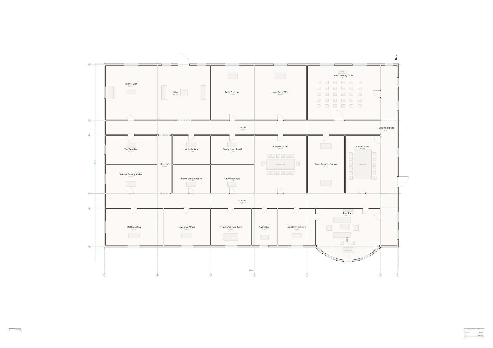

# The West Wing — First Floor

**The most famous office in the world is an oval. Our compiler does arcs.**



Most drawing-by-code tools can only put down straight lines, so the Oval Office arrives as a
rectangle with an apologetic label on it. This plan doesn't. The south end of the President's
office is a genuine circular arc — one `arc` clause inside the wall body, struck on a R7300
centreline:

```arch
wall id=w_oval exterior thickness 300 { (47000,31000) arc (36000,31000) radius 7300 cw }
```

Grep the rendered `plan.svg` for arc commands and you get 28: one door swing for each of the 26
doors, and then `A 7450` and `A 7150`, the outer and inner faces of that wall at R ± half its
thickness. Those two are the only curve in the building itself. They are native SVG
arcs (and native `ARC` entities in DXF), so the bow never goes faceted no matter how far you
zoom. Only the poché hatch inside the wall tessellates, because a fill has to.

The `cw` is the whole trick. The wall is walked east-to-west, and `cw` puts the circle's centre
on the *right* of travel — north of the chord, inside the building — so the facade bulges
**out** into the Rose Garden. Change that one word to `ccw` and the same two endpoints give you a
room that caves inward instead.

Curves pay off again on the three south windows. `window on w_oval at 25%` walks the wall by
**arc length**, not by chord, so the compiler puts them at even quarters of the bow's 12457 mm
run — and their jambs come out radial and their panes tangent — without a line of trigonometry in
the source. The floor beneath them is a `room polygon` whose southern vertices sit on that same
R7300 circle, which is why `arch describe --json` reports the Oval Office as **90.48 m²** measured
by shoelace over the shape you would actually walk, and drops the room's name at its true
centroid rather than at the corner of a bounding box.

The rest is a normal working floor: 24 rooms and 1568.98 m² on an A1 sheet at 1:100, with two
east–west corridors and the West Colonnade closing the loop down the Rose Garden side. The
Cabinet Room sits northeast of the Oval with its table and twelve chairs; the Roosevelt Room is
dead centre and, being landlocked, has no window at all; the Press Briefing Room holds thirty
seats in five rows facing the lectern, generated by a nested `for` loop rather than typed out.
The Oval's three doors go where the real ones do — west to the President's secretary, east to the
colonnade, north to the corridor — and `arch describe --json` will confirm it, since a door's
`between` is derived from the rooms it actually separates, not from anything asserted here.

## How accurate is this?

Based on publicly available floor plans of the West Wing; drawn as an **original illustration,
not an official record**. Room names and their broad relationships are the documented ones.
Everything dimensional is plausible rather than surveyed: the footprint is a round 50 × 31 m,
the bow projects 2.5 m, and every partition lands on a tidy grid. Do not use it to find anything.

Deliberately simplified: the whole thing is one storey at grade (no basement, so no Situation
Room, no Navy Mess), the outdoor colonnade toward the Residence is drawn as an interior
circulation spine so that it can carry the Oval's east door, and the real Oval Office is bowed on
its east and west ends too — here those are straight, which is what makes the south bow read as
*the* bow.

## Reproduce it

```bash
npm install
node scripts/render.mjs west-wing     # → plan.svg + plan.png
```

To check it rather than look at it:

```bash
npx arch validate plans/west-wing/plan.arch --strict --json   # ok: true, zero diagnostics
npx arch describe plans/west-wing/plan.arch --json --room r_oval
```

`validate --strict` is the ship gate — it fails on warnings as well as errors. This plan passes
it clean: no lint warnings to justify, no doors swinging into walls, no fixture stranded off its
room, every room reachable from a front door.

## Open it in the playground

[Edit this plan live →](https://playground.archlang.uk/#z=rVv9bhs5kv9fT1GQcYizI2vVLcmyczsDOI7zATjxwHYmtzgcbKqbkrhukTqSLVkzF2Af4p7hHmyf5FBFdostSy05Hv-RqCXyx_piFVlVfQC3Ew7fJsJy-Khyw-Ff__xf-MaNhW9CjlvwXmhj4X2mlG4cNA5o-FQZCyM2VbkBNRqJhIOQYCccFkpnKQgDTIKas6wNn2ksTj-aZUxCxuQ4Z2NuIMExMls2DiDVbAFD9chNC4wipKs5y-DKgSdqyg2o3AIzwEDzxDI5zjgshJ3gUmymMjXmViSQsSHP2o0DONPJ5JLJMUyYAc1ZBonQSZ4xDWOuptzqJS024ZqDsEg0kuH5YEv_3TAXmX0DdqI5bxyAsZqJ8cTCgmUZspkCg6Fa8BSMyu0EuExbOCpPHhy1t9dfL4DpBJQEBteDbqcDCZdW80xIjpR-0HxGq2ouU655Cje_fYCR0nB_Bve0xlLlMOYW-CNLbLYEu1Bv8NdBr99xI_Ah6nfuW4jUOEBpcU2_CCm5hhFLuAFm4Rp--usRTFg28pxmGdiJSB4kN6YNX5gVc04UMJ2YFkj3xbv_eN84gPuz6_N74NIKK7ghW5F87uEtT1u4ApNL-F2paRsOryQSO-EwU8mEw_tPl5dguTE8y5jlpv26tCm7UJDkes6R8alBkgw4i-FMGlDyDY0FkuXhY2v5GjRLRW7gGv4zWfxPkiz-C3-F86_Xv128g29nl5dw8e7DBYy0mjoiNJ8LNNo515Y_tuE-WdwTZv3fLLeGAJzeUJP4dP3pw8dbUCOwms15RtbESKB7YC5Y9sBT4MzYI6uOFrjjhmph4Obq6-1HkiytoQyHD0ynXOLPbULWSk1hprLlWEkvin_98_9W2DhxymwyEXLs9l6bZDxUi1cGkonStEejCKbOQqzZg2ItDIe43YfpvztrJXSVZUg1fmHYlAem7Q1xD0FkkKpg6xPFRBg-obrZWHPcKo0DuJpxKeTYkACdUshqhks4uz6Hy4svH24_tkAqi18Rr29omGNe55JYj3v9AUynuCaa9ULIVC1QsYs79FtoxnH_3-7JcWRL8mjw3znTuKnUqPQRWuUkP5QvI38xUQvPOLkM7xUcvoEhnwjPV8rNA3rDFPic4zbxVuXYIc8mFVgtxko6d9U4KNysUblOvEA-GZPzFGefRUh29CbqdEr7SZSc43ZVkmVo_4ZLy_CR_AuDWT7MREJeLkV9Em8CzcGI3_kb58e5Jh2JKZcGpyYTJmQLGHx4-9dbmCkjEFHI8RF7FAbGWqQFN-QJba55CxXaOEDAa9zSKQrSjVFkK7g6c9AYGlCBU85Mrnm7QX6gSZGqiEzEYRCcmvBHAyCXwhqYThvgqOh3GgAzNuMapYPSNgmb8QaASVjGnbAaAFJpO4F8hj9gKPwDCefc-h--NwDZN8ByqwqBNBoAB3B0dHQEZsKzjD6-6I8Ab2YZRh5pFUg25SmarAHN7IRrsBMKmhzuk0wZfp9CptSMdg664SUotz1gyDO1QDkS5pDDRBnLU3j7dzi_-nJze_31_PbT1Rc4vFcS_oZ78Bc0nr_NlPnl_jVtPozPzrmnWowsRnr0FLRh2w2_cUX68-LOCQmAP1quhdKreAIY7f6Aw06r8xoO-51Ohz59r0xHHwi108uJ_lM36nSewNBOu-M1ML1BMHkdigR1-_EC3l59a8O3lXuGo18A3TNJGSMGhiUMpkFEYBYOe1G_02nFxzHiUWREsRCs9xjkjVogpBEpd06p2Hc4vvB4I5awFH_Lxv7YQ9ZQhANCdCGhDTcLNnNEjYhj9CsjlmcW7hP8tsAk34wxlst0poS0BsYY1hkFE4K06MESNucGhFwwjBHSWM7SqrLJPdZqqyJmitbd4-AbH7XdQWjhJL-uxUWtLRUarMBWjYHi6R4muW4AbjsXTuuNExnGaAJMlNYiVdqUck1UpqREdZkZxrz1_VxSdHYn0RNpS74yICfqe3JO-8SUk557-F5FMDsQorgTQPinCsbbnVTEFYx4I8YuOuJeyIp_KnZYKLRXxp9OHbiBoVYPXOJ2Gio7Wcm7PBu4oOpP8rg-gZoZbUjNWYqHbnSQ6BfLKJoq1Bm67hmXoTnPz1V2J-u4cTzUKYYwprsxol2SJSCzG6gq3qr9fiFXrJkcc0jFXKRcmwrDX06hVnunBbunW7j9Ep3UAkQnBYL7tAki7vfrIOJ-30O4T5sgur1aiG6vgHCfTkMb_CzSNONrUoLDR0Ce2-0IHTlaIxocOfEjd4rLhHwobfJ1Rayf9xFrYQGn2wzgcxTVckWUlTDuaTPOPjoqcU620rOXogoc97QRZy9tFTjuaSNOL6rlqxdVNlq0zYV9vlvscqWDQFX-YQ0iqRexU9UgFE2J4w56ZFM1W_Um6tQv0Qm9QbTtZDS_2csaSpyTrThxvxYn7oc47mkzzmm9VZ32Qxx62ojTPa6lxx0PCpy1w8Iq2suVy3Q3RX8nGmklLd5RfuVSmmU2Z1IwOJtzmfMNZ_2Gv5eL9Gd9lyhT3G_xaEieCP_wUkVe5hG5Apetgub5RPARnhJvLBuNmm5ibniRXqtgZ2o4XK6wC4e9DfsShzfXLt2EjUfXJWaCsgo-3hLNneGJwy_9OeEP-uv4v-JwuOGJ5pZpv9I22vMZXsVK2ktHv4X2rzTcreBygc3t2EONQiyxywhA2FFcEl6h-y1OwgP4tVLTpsOeVC93wWHjJVe8NfvQ-o4VxuGCU2kfFNcf44DWcx9zmhX9VU9Ba-BJYB3eIRI4yYF8xQvAhwXl3rn-eZQXp2m6UA0qpt1FbNq_BTglA86LOc0N4CstTsOY_ydpcT6rbvKolEZg0OgGobTo3zCfjaYnUi5tVSobbFoaVl1hsHOFL8xne254kmthl3CWzoVBFWxbhbkBfpXKIYNWOe4_WeWGS7xVldA7-EhULg3PqisMalc491P8zTeQ2bZF0tLrrvxWyMbg6SLv-Cy3S1j3v9vZmE7N-gqD2hXO1XSaS5GQVsxOQWmlDJ_zzAb-MeSBFO62b7HCdTnF-bAdK5B7Xyj9EHjJJ8quruBc5bnSMwPflH6g61aNlNhQSG69lCpnMrfCUx7O_ZQKB1Uegut5cHD6sxyyQcWXMa88NZQbjch9PA48G5nKetyrC9t8HGzlytmNVjgpFygjNx8Lk7nyy9loxIR29rPV_gWl_irWGa4weLJCualeGXjnZgdx0OGtiSlPl0H4Xl8CP64vIebMcrjBmVtUW1mhEKhbITwKrsxzKxOhOjYbD2b4rn47u4Sr9-8_nV_8qAH5XAZl-IuSIFIRlARdzQWrJK8M8Ayz_M50uZZUgRKYszDClrlyNnXJPV8kFDrJ-KpIJ0xRV1SyhYNnGU9RSift6CjlY0cLnxk4nLJHSDkejXPNqf7lM3wcrM6ppvIGohMqgCgNnTZ9dhVKVz8wE84t5exhIlKsPuVYm1xRw-RywZZ0CcarjGNgojimRoFpzuA-5SbRYoib9B9GSSymzJS2prhak9KxsrlQeZYCS2xOxRas7LQIt8iyOU0bzD5jlQWrccgGJV-VSF25h1mfkdPSFWmMmmLZJ5eUYR2qx3bF0iiR6atoDTTJtQvD9mSLG907jvv4zaBPv_d7-BR33RO51W584p66ffytGzuk2D31-iUSxcNut7_C7vTKMXDYPe0F87snIXZ30A_W7R4PSppCngK6_a4J6uvNLVsFpcskGukLvCxtFcy_odDTuymWd6jM5q5dWLBCvmEhUjsBjBJgFlSJym1lpsZKKM109QKs0FEMcTPR3QUzV1y43B8WL8p0TpnDeQZjBS0Ajhx_1kCCMLXLLPk-KKhZ8UG5e7oRNqAsz4j0Z1Vc5AKIiih6VJmqLDqjCBXOiFHVWxctr3LrQP4eFgB1Q1k-AaLx6yD-whWKYLNCPAiN3wgSI4jPxTIL_QAl3oyyDuOP4o4Ws1sd89kTbQj5cCdDhKgT90PDXF-TpfO1NaNenTb8MXsdxh9bA5h6pabOlCoYeGysEl-vz_KY-cTC6GRYARrstDCcs3XHudPan7DjirsQ0vZ2ny0nDduoZFPB2KXl4uoSTqlVs5_wFMfdHQKcej3ThI2KrjLwg5pO2PBujZ5erw7JH-s34XCH4yshJNQ9gCruvTyAO3pM6Qe2whQzKjDlKTuAiWrZyvi4glCeogOEOOrXIJTn5JAbf04OQQYrQztFxta4ydNlFYMnep2VblxnMeXZOdiMRS_dK-NrZ253_kAQP3DNF-v38VcGynVbrmDuh5TZnJYPu-X3zhe0K-ziceyOWnBcYpc0V7u_ccZTCF5aovlRCFmKHNy2qNM-QazkPc7Y7_jrcwX8VN5hT1J5WAo9nj8hbBwXdQKaj2vGHe83LnRVdeuGzqh23Ml-43pPT0Sbx50EfOC4tYFUvsdxyEbV228aFvVqxVIOO91rWByEUFp0bVzR87Dm8jbQF4wMvVr9yNB77RgZuKjoqbSDkaEj2sQS-QFvD7BdQsWwwX7DovBkuH1YfLzfsNO1YWWDwqbWPd_DE9ybWkUTp-sC9E2G1U7E9mrtsnsmetJnuFHk5fi4Or7f2TG-Wx0_qOI_DQ0lO6NcS2EmPH2W9yLAs-ImzTJ3xdZ8RLdK19fsG7aPsN8b7pnETqh7MPmYaTi8uPv18uz84u7Xq8u_v27BYiIS1zbl8wQTJWkjSbPATmPqWzQTNlt1Sbo7P3V4OGz8hC1VrmvEUEbCZRSGRmW5de2IcC-k9-D3kPIkY9pTPOXTIddmIlxjdtEwXjQmCjniFL5IYpRkEenPozvq6XSdnS732Tmmy3dcpq_wVvR4GmZvuSMI3nHz0ISSoA3gySQCapDUHjxCcPx3lVh9PMbWhVqQuAISd54PYtSIRYD_-lKba2g4XqV4qVZzuhslfopycvwslATvGWDZMPNFo06MKINA5Me7UZieVmTbHZwQSi9MvO8Bsibb3vNBRkJzALxDUP8-cTSgPNSgylFvlYp-LzSnnsTQfqr7PEyw_-DZZIPs2dAJ3v1LaxfJf8zN0bsMK032w6KjH3aLM5sIjScwhOi028fUyxsuFwgV6y0tHwl-AgF_wcz5Jttd3Ve2IPWfj_R9TazV2ssPCfapWPHK9kSuq8JQVbI9dCiUaykLTuicuEz484UbDwahLFA4cX-jSMJr5b5YJ9FurO-NLWiU2IyOB5s1FEJsmt6Nj_ebXlXvhh6B5-r4qXoznlgsART_O9-HIjpd7fCeJ68sBdFYv7-LRBqqVXu19gu1Kg3JmqpDEgxnrrbYxUZl-AkS-Ast14L4hL7Q-EWlWvfYLwRVrOwUtb4bNHVJj4TFTnPsW37hbnCB1G3BsqGmNP_grxJaKxAuvKxB-DNCxkcWfzPcIpcrF41dDdtQVt03G1AGFZTeM1A0VZD2QQl8wgplu1BidA_r_ASCXXX7lCcnTKU6StAuaoQbwKwae14EExSn_1SYobIW6z7PxAkaPDaQE-8LE3RxbCJnb5ygT6OWHNyyJ9thgmaMenJ24AT9Fi8jp2yqeBE5QQn_RUoPCvUvwgkq2fU4O_kqa-718sGYMdjuLYL2gE04nQIHPQ65jLJJxk30p4mVyw9e_AL2-MNlQvc-C75JhiexCFJm8yn2WmNNsvoWGcvota43vnzOMgMyx5saT-kVHbz24e3eVY8nSovflbQ4LOPWH5roUo8vV2HqyNXoiU-Dd0R4d3H9Cd8epXdGjdIYyQo-CRRvlVizdm9GLTS-LdbsNrGM3jxv-ndAp2qOFGGdXHNHobtXLiYq4-7VNAzUS5W3y6TDkF7Y0hpfrJVK4st3_mVAfIMZ32IoBdOiGrh_kUYYeipfz0NEUocL_o8Y7Tst6hxqgesKAddYBK77x7XttUj8HZqzLObQz9S704LY_-fmUEW5OANYYTN8aW6m1T94Yv2retteKm-6F63vhktoFm9pN5E7Ds24Ex8fdU6O4n4Tvje-N_4f)

The link carries the entire source in its fragment, so nothing is stored anywhere. Move the
`radius` and watch the Oval change shape.
